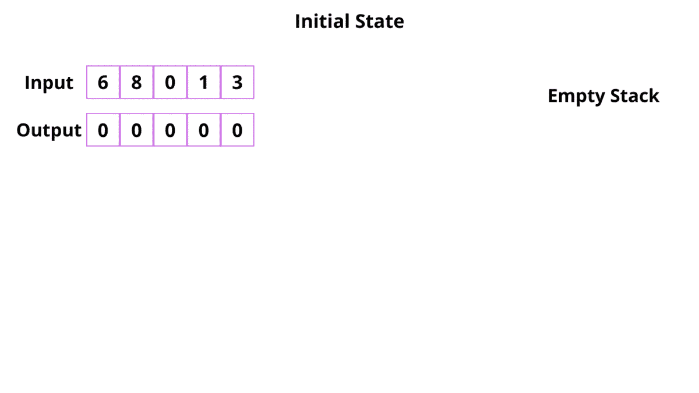

# 堆叠模式

> 原文：<https://blog.devgenius.io/stack-patterns-99d7e4953f62?source=collection_archive---------0----------------------->

在处理算法问题时，我们应该更多地关注问题之间的相似性。如果我们能找到这些相似之处，那么解决那类问题就变得非常容易了。今天我们将讨论堆栈中的模式。

有了这个模式，我们可以解决很多基于栈的问题。我们甚至可以解决流行的 [**股票跨度**](https://www.geeksforgeeks.org/the-stock-span-problem/) 和 [**直方图最大面积**](https://leetcode.com/problems/largest-rectangle-in-histogram/) 的问题。

# **接近**

让我们来看看**下一个更大的元素**问题。这里我们必须找到数组中每个数字的下一个更大的元素。我们将使用堆栈来存储更大的元素。我们将向后遍历数组。

算法:

1.  将数组的最后一个元素压入堆栈
2.  对于所有其他元素，重复以下过程

—检查堆栈是否为空，如果是，则在该索引处放-1。即。该数字没有比其右侧更大的元素。
—如果堆栈的 peek 大于当前元素，则堆栈 peek 是下一个更大的元素。

—如果没有，继续弹出堆栈的顶部，直到找到一个大于当前元素的元素

—如果现在堆栈为空，则将-1 放在该索引处(没有更大的元素)

—否则堆栈的 peek 是更大的元素

—推入堆栈中的当前元素

算法在这里可以理解。

下一个更大元素的算法的预演

现在你已经理解了如何解决这个问题，你可以自己想象其他相关的问题了。

如果我们遵循这种方法，只需稍加修改，就可以轻松解决**下一个较小元素**、**上一个较大元素**和**上一个较小元素**的问题。

下面给出了所有四个问题和 java 代码。

**下一个更大的元素**

**下一个更小的元素**

**先前更大的元素**

**先前较小的元素**

自己尝试这些问题。

1.  [前一个最小元素](https://www.interviewbit.com/problems/nearest-smaller-element/)
2.  [先前较大的元素变化](https://leetcode.com/problems/132-pattern/)
3.  [数组左边最小的](https://www.geeksforgeeks.org/find-the-nearest-smaller-numbers-on-left-side-in-an-array/)

4.[下一个更大的元素](https://www.geeksforgeeks.org/next-greater-element/)

5.[下一个更小的元素](https://www.geeksforgeeks.org/next-smaller-element/)

6.[先前更大的元素](https://www.geeksforgeeks.org/previous-greater-element/)

在我们以后的教程中，我们会尝试扩展这个问题，用这个模式解决更多的问题。你可以自己尝试以下问题。

1.  [库存跨度问题](https://www.geeksforgeeks.org/the-stock-span-problem/)
2.  [最大面积直方图](https://leetcode.com/problems/largest-rectangle-in-histogram/)
3.  [2D 直方图的最大面积](https://www.geeksforgeeks.org/maximum-size-rectangle-binary-sub-matrix-1s/)

代码可以在这里找到

 [## sksaikia/LeetCode

### 在 GitHub 上创建一个帐户，为 sksaikia/LeetCode 开发做贡献。

github.com](https://github.com/sksaikia/LeetCode/tree/main/src/patterns/stack)