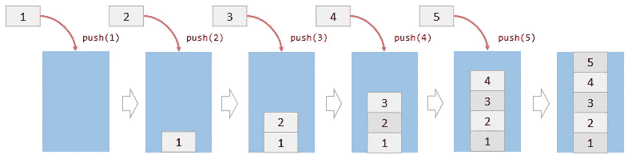
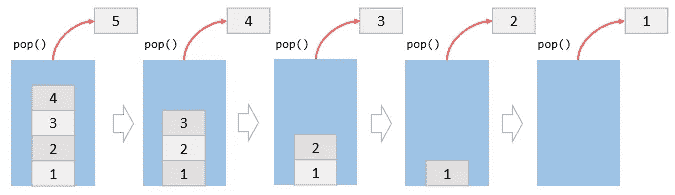

# Javascript 中的堆栈

> 原文：<https://blog.devgenius.io/stacks-in-javascript-13bfdf65fa71?source=collection_archive---------6----------------------->


数据结构介绍文章。应用于 Javascript 语言的栈概念和例子。

# 介绍

数据结构是有效处理大量数据的一种手段，了解它的结构和组成可以给我们提供更有效的工具来设计与某些问题相关的产品。在这种情况下，我们将执行堆栈的介绍，回顾其特点和用途。

# 堆栈概念

堆栈是一种动态数据结构，允许基于结构 **LIFO** (后进先出)存储和检索元素。该名称来源于一组堆叠在彼此顶部的物理项目的类比，使得从堆栈顶部抓取项目变得容易。


# Javascript 中的堆栈实现

为了在 Javascript 中实现堆栈，我们将依赖于存储库[**https://github . com/trek Hleb/Javascript-algorithms/blob/master/src/data-structures/stack/stack . js**](https://github.com/trekhleb/javascript-algorithms/blob/master/src/data-structures/stack/Stack.js)

该库包含一个使用 [**LinkedList**](https://medium.com/@dcortes.net/linked-list-in-javascript-795595742087) 的优秀实现，但是我们将简化一些方法和结构以便能够理解它的操作。我们会支持面向对象编程的所有人。

## 堆栈类

表示堆栈的类，这个类将具有属性`items`,表示要存储的一组元素(在本例中，我们将使用元素数组，但它可以是任何其他类型，例如对象或集合。最重要的是封装行为)。在启动时，`items`属性将没有任何元素。

```
class Stack {
  constructor() {
    this.items = [];
  }
}
```

接下来的步骤将是向`Stack`类添加方法，这将帮助我们执行堆栈中元素的操作。

## 方法来插入元素

为了将项目插入堆栈，我们将创建一个称为 push 的通用方法。这个方法堆叠元素。

**push()**

```
push(element) {
  this.items.push(element);
}
```



## 元素移除方法

为了从堆栈中移除项目，我们将创建一个名为 pop 的公共方法。此方法拆分元素。

**pop()**

```
pop() {
  return this.items.pop();
}
```



## 元素显示方法

栈的另一个最常见的操作是将要离开的元素的可视化。那是在顶部的元素。这种方法被称为 peek。

**peek()**

```
peek() {
  return this.items[this.items.length - 1];
}
```

# 完整代码

# 结局

在本文中，我们简单地看一下堆栈，然而，这些方法应该足以涵盖基本的用例。当然，有许多方法可以扩展和改进我们的例子。我建议继续探索实现，并使它们适应您的需要。

感谢你远道而来，如果你觉得这很有用，别忘了鼓掌👏。订阅以接收更多内容🔔。

如果你需要额外的帮助，请联系我🤠。

*   ✉️ [**给我发邮件**](mailto:dcortes.net@gmail.com)
*   🤝 [**在 LinkedIn 上联系我**](https://www.linkedin.com/in/dcortesnet/)
*   📮 [**在推特上联系我**](https://twitter.com/dcortes_net)

非常感谢您的阅读，我感谢您的时间。