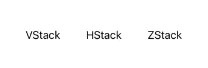

# SwiftUI 中的堆栈

> 原文：<https://blog.devgenius.io/stacks-in-swiftui-de8951c3011b?source=collection_archive---------1----------------------->

## HStack，VStack，ZStack

在 SwiftUI 中使用堆栈允许您将多个视图安排到一个具有特定属性的有组织的视图中。SwiftUI 可以使用 3 种堆栈:

1.  垂直堆栈，以从上到下的列表显示视图
2.  **HStack** ，一个水平堆栈，以从左到右的列表显示视图
3.  **ZStack** ，一个基于深度的堆栈，以从后到前的列表显示视图

您可以组合这些堆栈来更轻松地构建复杂的布局。这是一个图像表示

## VStack:

*   允许以垂直线排列其子视图，即从上到下的列表。
*   VStack 的两个属性: ***对齐*** 和 ***间距*** 。
*   这两个属性都是可选的。

— **校准:**

*   *。***—向左对齐视图(LTR)**
*   *。 ***居中*** —居中对齐(默认)*
*   *。 ***尾随*** —视图向右对齐(LTR)*

> ****间距*** 参数决定堆栈中子视图之间的间距或“边距”，以磅为单位。该值的类型是 Double，但您也可以提供整数值。*

***例如:***

**

## *HStack:*

*   *允许以水平线排列其子视图，即从左到右排列。*
*   *HStack 的两个属性: ***对齐*** 和 ***间距*** 。*
*   *这两个属性都是**可选的**。*

*— **校准:***

*   *。 ***顶部***–“粘贴”视图到堆栈顶部*
*   *。 ***底部***–将它们贴在堆叠的底部*
*   *。 ***居中***–在中间对齐子视图(默认)*
*   *。***first text baseline***和。**最后文本基线***

> ****间距*** 参数以磅为单位确定堆栈中子视图之间的间距或“边距”。该值的类型是 Double，但您也可以提供整数值。*

***举例:***

**

## *ZStack:*

*   *允许在彼此之上重叠其子视图。即以从后向前的列表显示视图。*
*   *ZStack 的属性: ***对齐。****
*   *对齐属性是**可选的。***

*— **校准:***

*   *组合水平/垂直: ***。领先/。尾随*** + ***。底部/。顶级****
*   *将它们合二为一作为 ***。顶端领先，。顶，。topTrailing，。领先，。居中，。尾随，。底端领先，。底部，。底部拖尾****

***示例:***

**

## *组合堆栈*

*SwiftUI 中栈的真正用途在于组合它们。您可以通过组合 **VStack** 、 **HStack** 和 **ZStack** 快速构建复杂的视图。*

*这里有一个例子，*

**

*如果您有任何建议或改进，请在 [**推特**](https://twitter.com/Sridharan_tsd) 上告诉我。我很想收到你的来信！*

* [## Sridharan T -软件工程师- Ivy Mobility | LinkedIn

www.linkedin.com](https://www.linkedin.com/in/sridharan-t-6b51b2143/)*