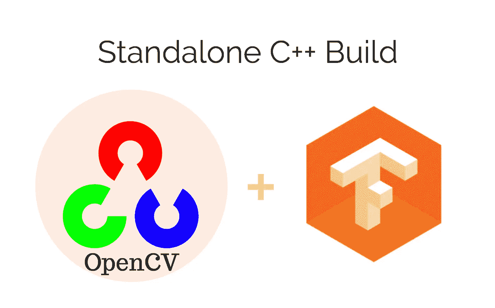

# 独立 C++版本— TF + OpenCV

> 原文：<https://blog.devgenius.io/standalone-c-build-tensorflow-opencv-6dc9d8a1412d?source=collection_archive---------1----------------------->



本教程是关于为 C++实现设置本地 Tensorflow 和 OpenCV 独立版本。本教程在以下版本中进行了测试，但应该适用于所有版本，除了库中有一些剧烈的变化。如果发生这种情况，请让我知道你的发现。

1.  Ubuntu 16.4
2.  张量流:1.8.0 版
3.  OpenCV 3 . 4 . 1
4.  巴泽尔:0.10.0

> Github Repo for，tensor flow Lite Standalone c++ build for Linux and MAC OS[此处](https://github.com/milinddeore/TfLite-Standalone-build-Linux-MacOS)。

# 1.安装依赖项

```
sudo apt-get -y update && apt-get -y upgrade
```

接下来，安装一些我们需要的基础依赖项和工具。

对巴泽尔来说:

在 [bazel build](https://docs.bazel.build/versions/master/install-ubuntu.html) 页面上给出的选项很少，但是我更喜欢二进制。确保你安装了 tensorflow [兼容的](https://www.tensorflow.org/install/source#tested_build_configurations)版本，否则无法构建。

对于建筑工具:

```
sudo apt-get -y install pkg-config zlib1g-dev default-jdk autoconf automake libtool wget unzip build-essential checkinstall yasm gfortran cmake git libjpeg8-dev
```

仅适用于厘斯:

```
yum install -y patch make cmake 
```

对于 OpenCV:

```
sudo apt-get -y install libavcodec-dev libavformat-dev libswscale-dev libdc1394-22-dev libxine2-dev libv4l-dev libatlas-base-dev                 libfaac-dev libmp3lame-dev libtheora-dev libvorbis-dev libxvidcore-dev libopencore-amrnb-dev libopencore-amrwb-dev x264 v4l-utils libsm6 libxext6
```

我们将从源代码构建 OpenCV，因此下面的步骤:

```
git clone [https://github.com/opencv/opencv.git](https://github.com/opencv/opencv.git)cd opencvgit checkout 3.4.1cd ..mkdir buildcd buildcmake -D CMAKE_BUILD_TYPE=RELEASE -DBUILD_SHARED_LIBS=OFF -D BUILD_opencv_objdetect=OFF -D BUILD_opencv_video=OFF -D BUILD_opencv_videoio=OFF -D BUILD_opencv_features2d=OFF -D BUILD_opencv_flann=OFF -D BUILD_opencv_highgui=OFF -D BUILD_opencv_ml=OFF -D BUILD_opencv_photo=OFF -D BUILD_opencv_python=OFF -D BUILD_opencv_shape=OFF -D BUILD_opencv_stitching=OFF -D BUILD_opencv_superres=OFF -D BUILD_opencv_ts=OFF -D BUILD_opencv_videostab=OFF ..
```

正如你所看到的，我的 cmake 正在构建 OpenCV 的一个特定模块，而不是完整的构建，请根据你的要求随意更改它们。

根据您的要求随意更改`cmake`选项。

```
make -j $nproc
make install 
```

对于张量流:

```
# For Python 2.7
sudo apt-get install python-pip python-numpy swig python-dev
sudo pip install wheel# For Python 3.3+
sudo apt-get install python3-pip python3-numpy swig python3-dev
sudo pip3 install wheel
```

# 2.张量流

我们将从源代码及其依赖项(如 protobuf 和 eigen 库)构建 tensorflow。所以让克隆张量流:

首先让我们配置构建:

```
git clone [https://github.com/tensorflow/tensorflow.git](https://github.com/tensorflow/tensorflow.git) cd tensorflowgit checkout v1.8.0./configureYou have bazel 0.5.1- installed.
Please specify the location of python. [Default is /usr/bin/python]: /usr/bin/python
Do you wish to build TensorFlow with MKL support? [y/N] N
No MKL support will be enabled for TensorFlow
Please specify optimization flags to use during compilation when bazel option "--config=opt" is specified [Default is -march=native]:
Do you wish to use jemalloc as the malloc implementation? [Y/n] Y
jemalloc enabled
Do you wish to build TensorFlow with Google Cloud Platform support? [y/N] N
No Google Cloud Platform support will be enabled for TensorFlow
Do you wish to build TensorFlow with Hadoop File System support? [y/N] N
No Hadoop File System support will be enabled for TensorFlow
Do you wish to build TensorFlow with the XLA just-in-time compiler (experimental)? [y/N] N
No XLA support will be enabled for TensorFlow
Do you wish to build TensorFlow with VERBS support? [y/N] N
No VERBS support will be enabled for TensorFlow
Do you wish to build TensorFlow with OpenCL support? [y/N] N
No OpenCL support will be enabled for TensorFlow
Do you wish to build TensorFlow with CUDA support? [y/N] N
No CUDA support will be enabled for TensorFlow
Do you wish to build TensorFlow with MPI support? [y/N] N
MPI support will not be enabled for TensorFlow
Configuration finished
```

*注意:确保您在系统上指定了正确的 python 路径。*

对于 [ProtoBuf](https://developers.google.com/protocol-buffers/) :

```
mkdir /tmp/protobuf
tensorflow/contrib/makefile/download_dependencies.sh
cd tensorflow/contrib/makefile/downloads/protobuf/
./autogen.sh
./configure --prefix=/tmp/protobuf/
make
make install
```

对于[本征](http://eigen.tuxfamily.org/index.php?title=Main_Page):

```
mkdir /tmp/eigen
cd ../eigen
mkdir build_dir
cd build_dir
cmake -DCMAKE_INSTALL_PREFIX=/tmp/eigen/ ../
make install
cd ../../../../../..
```

TensorFlow 针对 C 和 C++有不同的共享对象，以下是分别针对它们的命令:

对于 C++:

```
bazel build -c opt --config=monolithic //tensorflow:libtensorflow_cc.so
```

Bazel 可以启动多个线程并消耗大量内存，如果您在受约束的系统上，请使用以下命令来控制资源，并声明**编译可能需要很长时间:**

```
bazel build -c opt --config=monolithic --jobs 1 --local_resources 2048,0.5,1.0 --verbose_failures //tensorflow:libtensorflow_cc.so
```

对于 C:

```
bazel build -c opt //tensorflow:libtensorflow.so
```

# 3.创建项目

创建演示项目，我们将在其中链接这些生成的库:

```
mkdir my_proj
cd my_proj
vim my_test.cpp                // Chose editor of your choice 
```

并将[这段代码](https://www.tensorflow.org/api_guides/cc/guide)复制到`my_test.cpp`，我在这段代码中做了一些编辑。

```
#include "tensorflow/cc/client/client_session.h"
#include "tensorflow/cc/ops/standard_ops.h"
#include "tensorflow/core/framework/tensor.h"
#include <opencv2/opencv.hpp>using namespace cv;
using namespace std;int main() {

  cout << "OpenCV version : " << CV_VERSION << endl;

  using namespace tensorflow;
  using namespace tensorflow::ops;
  Scope root = Scope::NewRootScope();
  // Matrix A = [3 2; -1 0]
  auto A = Const(root, { {3.f, 2.f}, {-1.f, 0.f}});
  // Vector b = [3 5]
  auto b = Const(root, { {3.f, 5.f}});
  // v = Ab^T
  auto v = MatMul(root.WithOpName("v"), A, b, MatMul::TransposeB(true));
  std::vector<Tensor> outputs;
  ClientSession session(root);
  // Run and fetch v
  TF_CHECK_OK(session.Run({v}, &outputs));
  // Expect outputs[0] == [19; -3]
  LOG(INFO) << outputs[0].matrix<float>();
  return 0;
}
```

现在将生成的库复制到`my_proj`项目目录下:

```
mkdir ../my_proj/lib
cp bazel-bin/tensorflow/libtensorflow_cc.so ../my_proj/lib/
cp bazel-bin/tensorflow/libtensorflow_framework.so ../my_proj/lib/
cp /tmp/protobuf/lib/libprotobuf.a ../my_proj/lib/
```

然后包括文件:

```
mkdir -p ../my_proj/include/tensorflow
cp -r bazel-genfiles/* ../my_proj/include/
cp -r tensorflow/cc ../my_proj/include/tensorflow
cp -r tensorflow/core ../my_proj/include/tensorflow
cp -r third_party ../my_proj/include
cp -r /tmp/protobuf/include/* ../my_proj/include
cp -r /tmp/eigen/include/eigen3/* ../my_proj/include
```

最后，我们需要编译`my_test.cpp`

# 4.编译测试项目

创建生成文件:

```
vim Makefile
```

将以下文本复制到`Makefile`:

```
CC = g++
CPPFLAGS = -c -gSOURCES = my_test.cpp
CPPFLAGS += -fPIC -Iinclude -I/usr/lib/jvm/java-8-openjdk-amd64/include/linux/ -I/usr/lib/jvm/java-8-openjdk-amd64/include/ `pkg-config --cflags opencv`
LDFLAGS +=  '-Wl,-rpath,$$ORIGIN/lib' -Llib -ltensorflow_cc -ltensorflow_framework -lopencv_core -lopencv_imgproc -lopencv_ml -lopencv_highgui -lopencv_imgcodecs `pkg-config --libs opencv`OBJ = $(SOURCES:.cpp=.o)%.o : %.cpp
        $(CC) -std=gnu++11  -c -o $@ $< $(CPPFLAGS)my_test: $(OBJ)
        $(CC) -std=gnu++11  -o $@ $^ $(LDFLAGS)clean:
        rm -rf *.o my_test
```

或者从 CLI 运行以下命令:

```
g++ -std=gnu++11 -Wl,-rpath='$ORIGIN/lib' -Iinclude -Llib my_test.cpp -ltensorflow_cc -ltensorflow_framework -lopencv_core -lopencv_imgproc -lopencv_highgui -o my_test
```

现在，您可以使用以下命令执行您的程序:

```
./my_test
```

Github Repo for，tensor flow Lite Standalone c++ build for Linux and MAC OS[此处](https://github.com/milinddeore/TfLite-Standalone-build-Linux-MacOS)。

**可以在|**[**LinkedIn**](https://www.linkedin.com/in/mdeore/)**|**[**网站**](https://tomdeore.wixsite.com/epoch)**|**[**Github**](https://github.com/milinddeore)**|**