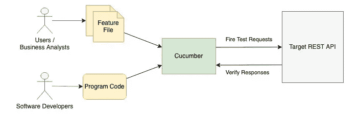
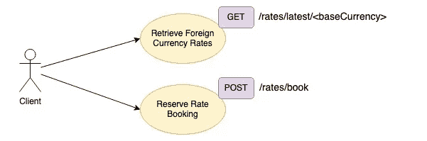
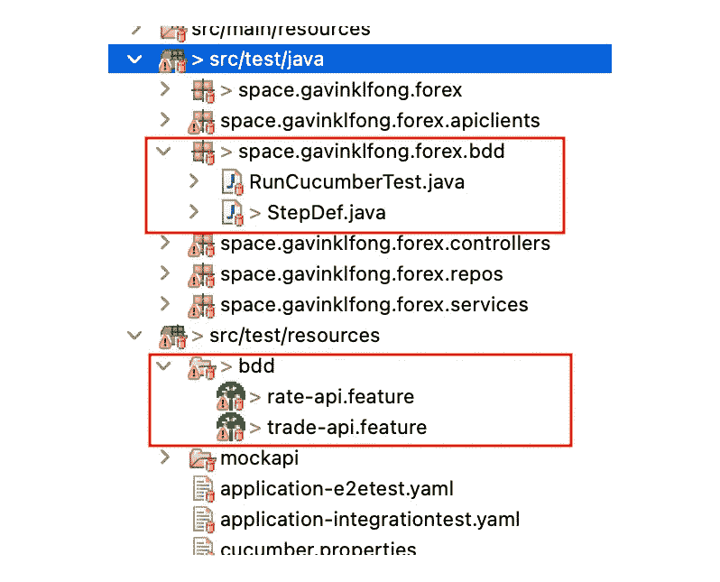
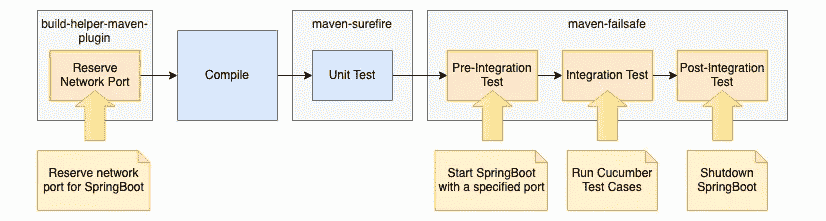
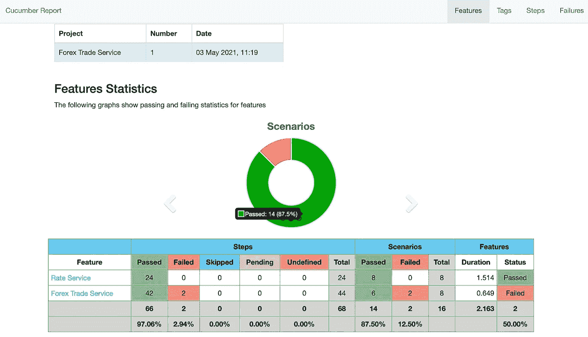
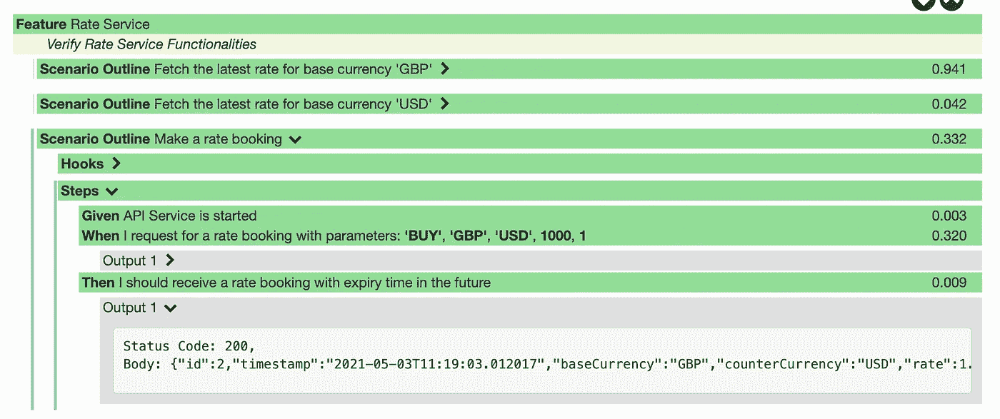
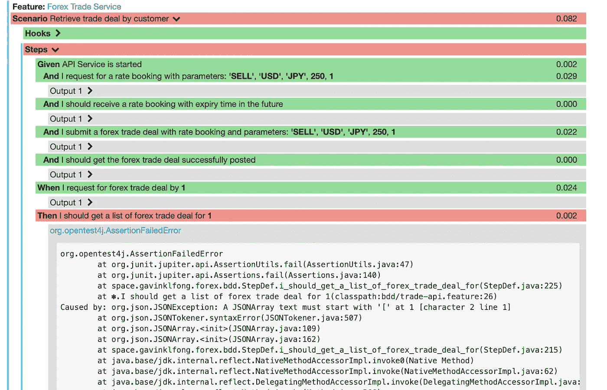

# 使用 Cucumber 开始 Java SpringBoot REST API 的行为驱动开发(BDD)

> 原文：<https://blog.devgenius.io/start-behavior-driven-development-bdd-for-java-springboot-rest-api-using-cucumber-f6b1754d93b1?source=collection_archive---------0----------------------->

## 为自动化的端到端测试创建人类可读的测试用例


Alexander Duncan 在 [Unsplash](https://unsplash.com/s/photos/cucumber?utm_source=unsplash&utm_medium=referral&utm_content=creditCopyText) 上拍摄的照片

测试自动化是一个迷人的想法，因为您可以让计算机程序为您运行测试用例，节省您手动执行琐碎和平凡测试步骤的时间和精力。由于测试用例是使用程序代码实现的，最终用户很难理解，更不用说他们自己调整测试用例的机会了。

事实上，在将用户故事转化为技术实现时，业务领域和技术领域之间存在差距，导致误解和遗漏用户需求。

随着行为驱动开发(BDD)的出现，这种情况得到了极大的改善，因为它允许用户故事作为验证系统行为的测试用例。

在本文中，您将找到通过使用 Cucumber 实现 BDD 来提高 SpringBoot REST API 开发的生产率和质量的方法。

# 什么是 BDD？

BDD 的概念是基于以用户故事格式编写的系统特性来构建自动化测试用例。开发完成得越多，通过的测试用例就越多，最终所有的测试用例都会在开发完成时通过。

关键元素是由用户和业务分析师创建的特征文件，它用自然的人类语言描述系统特征。然后，开发人员在程序代码中构建测试逻辑，并映射到特性文件中的每个语句，以形成自动化测试用例。

为了执行测试用例，我们可以利用 Cucumber，这是一个流行的 BDD 测试框架，将特征文件和程序代码绑定在一起并运行测试用例。



黄瓜测试自动化

## 特征定义

特征文件中的系统需求采用**的模式**。该模式基于名为[小黄瓜](https://cucumber.io/docs/gherkin/)的语法，它定义了给定语句的**中的前提条件，当**语句时在**中采取的动作，以及在**然后**语句中的预期系统行为。**

这里有一个简单的例子来说明谷歌搜索功能的行为。这种格式用自然的人类可读语言清楚地描述了系统特征。

示例特征定义

如果您想提供更多示例数据，那么您可以将它们放在**示例**部分。Cucumber 然后将为**示例**部分下的每个记录行运行测试用例(除了第一个标题行)。下面的例子将对**示例**部分中的每一行运行测试用例三次。

带有示例数据的示例特征定义

使用 **Given-When-Then** 模式有利于开发过程，因为它使所有用户需求保持一致的格式，并使需求易于理解。

一旦特性文件准备好了，开发人员就可以开始为需求中的每一步构建技术实现。例如，开发人员可能会编写代码，指示 Chrome 浏览器根据给定的和 **When** 子句使用 Selenium 执行步骤，然后按照 **Then** 子句中指定的方式验证搜索结果。

在接下来的几节中，让我们详细看看如何为 Java SpringBoot REST API 实现 BDD。

# 用例

示例应用程序是一个 REST API，它提供了两个端点:

*   获取特定基础货币的最新货币汇率。
*   为货币对保留汇率。这是外币交易过账之前的一个步骤。



示例应用程序的 REST API

有黄瓜测试案例的 SpringBoot API 可以参考这个 [GitHub 项目](https://github.com/gavinklfong/reactive-spring-forex-trade)。

# Maven 依赖性

我们需要 Cucumber 测试框架的以下 Maven 依赖项

黄瓜 Maven 依赖

# 特征定义

对于两个 API 端点，我们有一个小黄瓜文件***rate-API . feature***用于系统特性的定义。

## 获取最新的外汇汇率

前提条件是 API 已经准备好服务。当调用 API 获取基础货币的最新汇率时。然后，预计 API 应该返回一个货币汇率列表。在**示例**部分提供了样本基础货币(英镑、美元),以便可以针对不同的基础货币执行相同的测试案例。

汇率检索 API 的功能定义

## 进行价格预订

当子句包含请求提交的参数时，汇率预订请求由 5 个数据字段组成，如**中的声明。您可以看到**示例**部分中的数据包含许多示例请求。那么，预期结果应该是具有将来到期时间的费率预订。**

汇率登记 API 的功能定义

# 测试步骤实现

特征文件中的每个语句都有一个到程序代码实现的映射，用于自动测试。程序代码可以是 Java、Node JS、Python 等不同的语言。这里的例子使用 Java 来实现自动化测试的逻辑。要创建到特征文件中语句的映射，可以在 Java 方法中添加注释***@给定*** 、***@当*** 和***@然后*** 来建立联动。

首先我们创建一个 Java 类，定义跨步骤数据共享的类变量，SpringBoot 的 URL 和报表的场景对象。这个 Java 类将包含用于步骤实现的 Java 方法。

## “给定”语句的分步实现

**给定的**语句是前提条件。例如，在特定网站打开浏览器，用户登录。对于 REST API，前提条件只是准备好 API 服务。

```
**Given** API Service is started
```

该语句绑定到下面的 Java 方法签名

```
***@Given***("^API Service is started$")
public void api_service_is_started()
```

注释“ **@ *给定*** ”将 Java 方法映射到特征文件中与文本匹配的语句。

## “When”语句的分步实现

**当**报表提交后外汇汇率预约请求

```
**When** I request for a rate booking with parameters: '<tradeAction>', '<baseCurrency>', '<counterCurrency>', <baseCurrencyAmount>, <customerId>
```

该语句绑定到下面的 Java 方法签名

```
**@When**("I request for a rate booking with parameters: {string}, {string}, {string}, {long}, {long}")public void i_request_for_a_rate_booking_with_parameters(String tradeAction, String base, String counter, Long amount, Long customerId)
```

注释“ **@When** ”将 Java 方法映射到特征文件中与文本匹配的语句。

您可以看到语句中有两种类型的参数——String 和 Long。特征文件中用单引号括起来的参数是字符串数据类型，而用单引号括起来的其他参数是长数据类型。

一旦有了参数输入，开发就很简单了，因为要构造请求数据并将请求提交给 REST API。由于响应数据将在下一步的 **Then** 语句中得到验证，因此这一步将 HTTP response 和其他参数设置为类变量，以便下一步可以获得值以进行进一步处理。

## “Then”语句的分步实现

然后，是时候验证速率预留的响应了。 **@Then** 注释有助于建立到 Java 方法的映射。由于 **Then** 语句中没有参数，所以 Java 方法不接受任何参数。

```
**Then** I should receive a rate booking with expiry time in the future
```

该语句绑定到下面的 Java 方法签名

```
**@Then**("I should receive a rate booking with expiry time in the future")public void i_should_receive_a_valid_rate_booking()
```

注释“ **@Then** ”将 Java 方法映射到特征文件中与文本匹配的语句。

该方法从类变量获取 HTTP 响应，并验证字段值。

# 黄瓜测试配置

最后，您需要通知 Cucumber 特性文件的位置和绑定设置的步骤实现逻辑。另外，cucumber 的自动化测试用例需要配置才能被 JUnit 触发。

因此，我们用以下注释定义了一个空的 Java 类:

*   ***@ run with(cuc mber . class)***—是将黄瓜注册为 JUnit 测试用例。
*   ***@ cucumber options***—指定特征文件的位置、步骤执行和测试结果数据文件输出。

除了使用 ***@RunWith*** 和***@Cucumber options***之外，JUnit5 还有一个新的注释@ Cucumber，它具有自动发现特征文件和步骤实现的能力，如果您对该注释感兴趣，可以了解更多。

***@ CucmberOptions*—plugin**中指定的位置是测试结果输出。该文件可用于生成报告。可以参考后面一节的详细内容。

IDE 工作区的屏幕截图显示了相应的文件位置



工作区中的黄瓜文件

# 测试用例执行的设置

有不同的方式来运行测试用例，例如，使用测试启动器作为一个单独的进程，并通过 maven 插件(如 maven-surefile 和 maven-failsafe)来运行测试。这个例子将展示如何配置 Maven 来运行 Cucumber 测试，作为 maven-failsafe 集成测试的一部分。

为了避免与同一台机器上的其他应用程序发生冲突，第一步是为 SpringBoot 预留一个随机的网络端口。然后，在测试预集成测试阶段使用保留的端口启动 SpringBoot，然后执行 cucumber 测试。集成测试完成后，在集成后测试阶段关闭 SpringBoot。

将测试执行作为 Maven 生命周期的一部分嵌入是一种方便的方法，因为开发人员只需一个 Maven 命令就可以编译、执行单元测试和 cucumber 端到端测试。此外，在 CI/CD 管道中实现该过程也很容易。



Maven 集成测试执行的生命周期

上面的执行流程可以通过下面的 Maven 配置来实现

# 测试结果报告

在测试执行的最后，我们将得到一个 HTML 格式的报告。该报告提供了测试执行的总体统计数据，以及每个步骤的输出细节。

## **概述**



黄瓜测试结果概述

## 报告详细信息—成功案例



## 报告详细信息—失败的案例



报告的生成依赖于 maven 插件 net . master think/maven-cucumber-reporting。只需在 pom.xml 中添加这个配置，就可以生成报告

因为这个插件从 cucumber 获取测试结果作为报告生成的输入，所以请确保插件被正确配置，以便它指向从 CucumberTestRunner 输出的测试结果文件的位置

# 最后的想法

BDD 有助于用户需求过程，因为 Gherkin 语法接近自然语言，并且 **Given-When-Then** 模式易于理解，以一致的格式创建用户需求。此外，Cucumber 测试框架支持基于用户需求验证系统行为的测试自动化。

此外，BDD 为用户验收测试的自动化铺平了道路。随着 step 实现和自动化管道的准备就绪，用户可以在没有技术团队支持的情况下，立即调整特征文件中的示例数据并运行自动化测试用例。