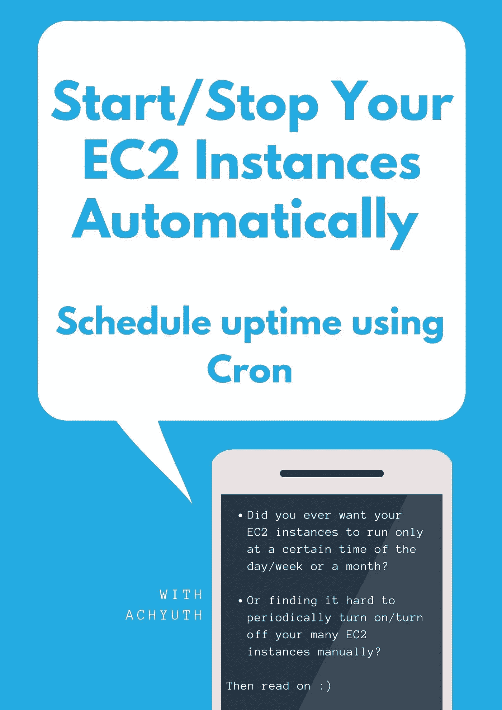

# 按计划启动/停止 AWS 实例

> 原文：<https://blog.devgenius.io/start-stop-your-aws-instances-on-schedule-e27f364c04a3?source=collection_archive---------0----------------------->

您是否曾经希望 EC2 实例只在一天/一周或一个月的特定时间运行，或者发现很难定期手动打开/关闭许多 EC2 实例？接着往下读:)



在许多情况下，您会真心希望有一个系统，能够以很少的投资自动管理实例的正常运行时间。这里有几个

*   通常，您公司的开发和测试云环境在周末或假日会闲置，但它最终会为这段时间的资源付费，因为 AWS 会按实例运行的小时数收费。
*   充分了解员工心理健康和福利的重要性后，您希望通过管理虚拟机的正常运行时间来严格控制工作时间。
*   你有几个个人项目正在运行，并且不想为你没有使用资源的所有时间付费。

在本文中，让我们探索一种方法，允许我们使用无服务器计算服务( [AWS Lambda](https://aws.amazon.com/lambda/) )结合[亚马逊](https://aws.amazon.com/eventbridge/) [CloudWatch](https://aws.amazon.com/eventbridge/) 来按计划启动和停止各种 AWS 实例。

## 步骤 1:创建 IAM 权限策略


转到 IAM ->策略->单击创建策略


选择 JSON


粘贴以下 JSON

```
{
    "Version": "2012-10-17",
    "Statement": [
        {
            "Effect": "Allow",
            "Action": [
                "logs:CreateLogGroup",
                "logs:CreateLogStream",
                "logs:PutLogEvents"
            ],
            "Resource": "arn:aws:logs:*:*:*"
        },
        {
            "Effect": "Allow",
            "Action": [
                "ec2:Start*",
                "ec2:Stop*"
            ],
            "Resource": "*"
        }
    ]
}
```

这里我们创建了一个权限策略，它必须对 EC2 实例(仅限于开始/停止)和 [Amazon CloudWatch](https://aws.amazon.com/eventbridge/) 进行写访问。

## 步骤 2:创建一个角色并附加上述策略


创建角色


选择λ


搜索您创建的策略并选择


审核角色并创建

## 步骤 3:为启动/停止创建 Lambda 函数。


搜索λ


创建功能


给出适当的信息并选择创建函数。

在此过程中，我们可以为此功能分配一个执行角色。通过选择我们刚刚创建的角色，我们为我们的函数提供了启动/停止实例和向 Amazon CloudWatch 写入日志的权限。


从下面复制代码

启动实例

```
import boto3# example: ap-south-1, us-east-1, ap-northeast-3
region = 'region-name'# provide IDs of your instances in a comma separated fashion.
instances = ['i-03cec7ac7e4as32', 'i-03ccec42127e4a']ec2 = boto3.client('ec2', region_name=region)def lambda_handler(event, context):
    ec2.start_instances(InstanceIds=instances)
    print('started your instances: ' + str(instances))
```

类似地，创建另一个停止实例的函数。


从下面复制代码

停止实例

```
import boto3# region-name can be ap-south-1
region = 'region-name'# provide IDs of your instances in a comma separated fashion.
instances = ['i-03cec7ac7e4as32', 'i-03ccec42127e4a']ec2 = boto3.client('ec2', region_name=region)def lambda_handler(event, context):
    ec2.stop_instances(InstanceIds=instances)
    print('stopped your instances: ' + str(instances))
```

## 步骤 4:计划启动/停止 Lambda 函数的执行


前往云观察并创建一个规则


输入您的 Cron 表达式

样本 Cron 表达式[此处](https://docs.aws.amazon.com/AmazonCloudWatch/latest/events/ScheduledEvents.html#CronExpressions)。如果您的表达式正确，您应该会看到接下来的 10 个触发日期。


附加 lambda 函数开始实例。

**类似地创建另一个规则并附加 stop 实例 lambda 函数。**

# 日志


访问 CloudWatch 下的日志组，查看自己的日志。

# 摘要

总之，我们创建了启动/停止实例的 lambda 函数、以预定方式触发这些函数的 CloudWatch 规则、允许这些函数代表我们管理 AWS 资源的 IAM 策略和角色。

在我的例子中，我有几个脚本在一周的某一天运行，我注意到让机器一直运行是非常昂贵和浪费的。这让我做了一些研究，并提出了这个解决方案。如果你是一个小开发人员，你可以使用这种方法来控制 EC2 实例的正常运行时间，对于企业和其他人来说，AWS 实例调度器似乎是最好的选择，尽管这是有代价的。