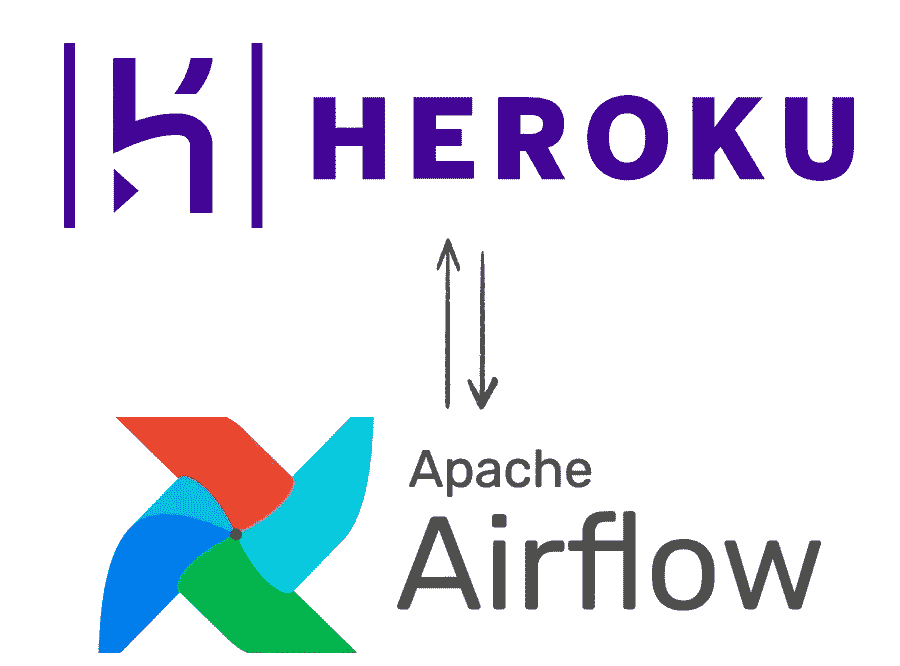

# 开始在 Heroku 上使用气流(第一部分)

> 原文：<https://blog.devgenius.io/start-using-airflow-on-heroku-first-step-cc4d8fe3c921?source=collection_archive---------4----------------------->



每当我们开始在数据工程领域开发新的东西时，我们都希望将我们的项目放在一个重现生产环境的环境中，从而能够理解我们架构的所有界限。

因此，我将在三篇系列文章中介绍如何创建一个`airflow` 项目，将您的项目上传到 [Heroku](https://www.heroku.com/) ，最后教您如何创建`dags`并运行一些示例操作符。

# 从环境开始

让我们从为开发做好准备的位置和 Heroku 环境开始。为此，我们需要一些要求，即:

*   Heroku CLI
*   虚拟
*   Python 3

*注:在本项目中，我们将使用气流 2.2.0*

# Heroku CLI

下载和安装

*   马科斯

```
brew tap heroku/brew && brew install heroku
```

*   Ubuntu 16+

```
sudo snap install --classic heroku
```

*   Windows 操作系统

[64 位安装程序](https://cli-assets.heroku.com/heroku-x64.exe)

[32 位安装程序](https://cli-assets.heroku.com/heroku-x86.exe)

# 虚拟

下载和安装

*   马科斯

```
pip install virtualenv
cd airflow-on-heroku/
virtualenv -p python3 env
```

*   Ubuntu 16+

```
sudo pip3 install virtualenv
cd airflow-on-heroku/
virtualenv -p python3 env
```

*   Windows 操作系统

```
c:\\Python37\\Scripts\\pip.exe install virtualenv
C:\\Users\\User>mkdir virtualenv
C:\\Users\\User>c:\\Python37\\Scripts\\virtualenv.exe virtualenv\\virtual_1
```

现在我们已经准备好了开始的基本要求，让我们继续最好的部分。

首先，让我们创建一个虚拟环境来安装所有必需的依赖项:

```
mkdir airflow-on-heroku
cd airflow-on-heroku
virtualenv -p python3 env
```

下一步将是安装依赖项，并将它们保存在`requirements.txt`文件中，以便可以在 Heroku 中复制:

```
source env/bin/activate
pip install "apache-airflow[postgres, password]"
pip freeze >> requirements.txt
```

现在我们已经开始了我们的项目，并安装了必要的库来开始开发我们的数据编排器。让我们使用`airflow db init`命令来创建允许我们在本地运行环境的必要文件。我们需要导出`AIRFLOW_HOME`变量，然后运行`airflow db init`命令。

```
export AIRFLOW_HOME=$PWD
airflow db init
```

运行此命令后，airflow 将创建一些文件和文件夹，如下所示:

```
.
├── airflow.cfg
├── airflow.db
├── logs
└── unittests.cfg
```

此时，可以在本地运行气流，只需运行以下命令:

```
airflow standalone
```

在您的终端上，您将看到如下消息，其中包含为访问 airflow 图形界面而创建的用户名和密码:


这是气流的图形界面:


在您的终端上输入 airflow 提供的登录名和密码后，您将能够访问 airflow 预先加载的一些示例`dags`:


借此机会了解更多关于气流图形界面的信息，并看看一些示例`dags`是如何工作的。

现在，让我们准备我们的项目存储库，并包括我们不想版本化的文件:

```
git init
cat <<EOF >> .gitignore
*.pyc
*.db
.env/
logs/
EOF
```

在第一篇文章中，我们介绍了如何配置 airflow，如何在本地运行，以及如何首次接触这个数据编排器，在下一篇文章中，我们将看到如何在 Heroku 中将您的项目放到网上。我希望你喜欢它，很快第二部分就会准备好。

链接到[库](https://github.com/lucasfonmiranda/run-airflow-on-heroku)，别忘了给那个小星星。

*更多内容尽在*[*blog . dev genius . io*](http://blog.devgenius.io)*。*