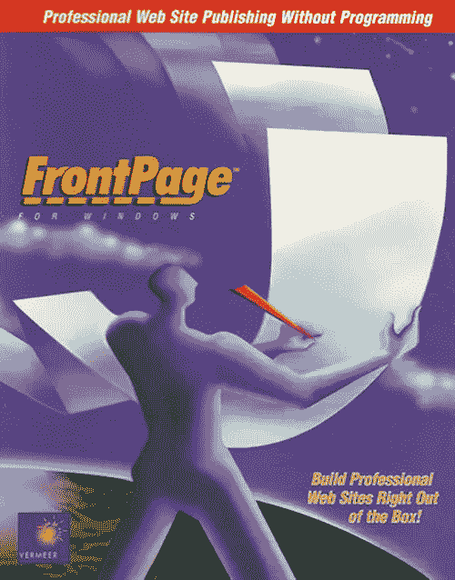
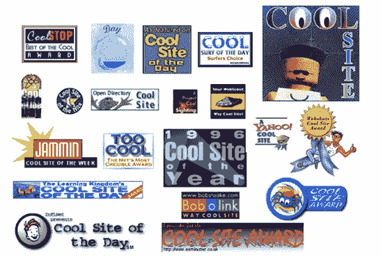
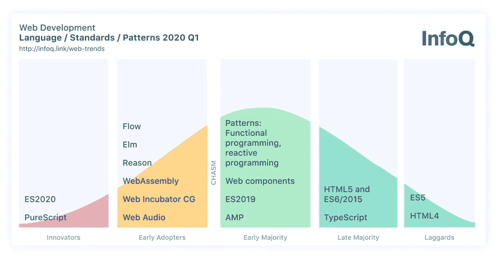
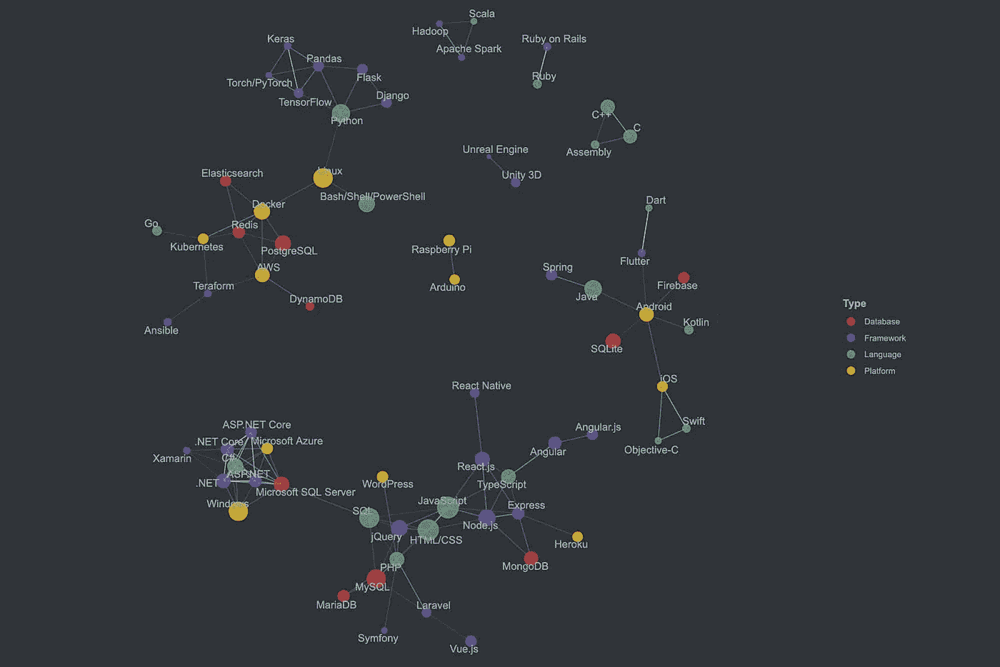

# 从 HTML 开始

> 原文：<https://blog.devgenius.io/start-with-html-d51208adacf4?source=collection_archive---------5----------------------->

# 简介—我的互联网之旅

由 [Unsplash](https://unsplash.com?utm_source=medium&utm_medium=referral) 上 [Mukuko 工作室](https://unsplash.com/@mukukostudio?utm_source=medium&utm_medium=referral)拍摄的照片

# "你能用这个建立一个网站吗？"

映入我眼帘的是桌上的[微软 Frontpage](https://en.wikipedia.org/wiki/Microsoft_FrontPage) 手册。在接到学校打来的意外电话后，我参加了一个工作面试。那是 1997 年的某个时候。我是纽约市一所大学的大三学生，我的第一门 HTML 课程刚刚学了一半。

FrontPage 的初始版本。(via**)**

*我的职业生涯就是这样开始的，我当时并不知道，也不知道 90 年代末的互联网热潮。*

*作为 X 一代，我的生活自然与现代技术的历史交织在一起:1971 年——第一个英特尔微芯片被发明的那一年——是我出生的那一年；1994 年，我从南韩搬到了美国，从统计学专业转到了计算机艺术专业，这一年，蒂姆·伯纳斯·李爵士也从欧洲粒子物理研究所搬到了麻省理工学院，成立了万维网联盟。*

*我仍然记得网景的标志，我同学身后屏幕上绿色地平线上的“N”。当我问他在做什么时，“我可以在这里看视频和阅读免费的东西。”那时的视频像火柴盒一样小，然而当我们为了最后的项目周在计算机实验室通宵达旦地死记硬背时，我们经常喜欢集体观看视频或有趣的网站。*

*我们沉浸在 256 种颜色和像素化的图像中，对着拨号调制解调器的乒乒乓乓的声音傻笑。甚至美国在线的《你有邮件》也被拍成了电影。接下来是 XHTML、Flash 和 ActionScripts、LAMP stack、Dreamweaver、Napster、智能手机的崛起、WordPress、脸书战胜 MySpace、应用热潮……等等。*

**

*“酷”奖图标示例，1994–1996 年[https://www . thealantic . com/technology/archive/2014/07/how-coolness-defined-the-world-wide-web-of-the-90/374443/](https://www.theatlantic.com/technology/archive/2014/07/how-coolness-defined-the-world-wide-web-of-the-1990s/374443/)*

*回顾过去，这是一段没有沉闷时刻的旅程。就我个人而言，尤其是作为一名女性开发人员/经常作为团队领导，我很高兴有机会与世界各地的这些有才华的人合作，参与众多项目和各种客户，包括一些财富 500 强公司。*

*观察目前的趋势，我看到大量的流行语，框架，API，微服务，云计算，CI/CD，每天都有一百万种不同的网站建设方式涌出来——显然不像我们过去处理的那样简单。这很令人兴奋，但我不否认有时会让人精疲力尽。有一点是明确的，那就是如今可能没有一种灵丹妙药。现在的目标似乎是寻求最有效的方式来“在此刻”处理事情——在我看来，架构、构建计划和理解其局限性的能力可以是一盏有用的指路明灯。*

**

*[https://www . infoq . com/articles/JavaScript-we b-development-trends-2020/](https://www.infoq.com/articles/javascript-web-development-trends-2020/)*

**

*堆栈溢出开发者调查 2020*

*不仅是发展，设计领域也经历了许多演变。你可以说我有偏见，但是面对这个要求屏幕设计更加高效和灵活的时代，直观的在线 UI 工具([图玛](https://www.figma.com/)和[成帧器](https://www.framer.com/))似乎超过了基于桌面的应用。*

**

*照片由 [Unsplash](https://unsplash.com?utm_source=medium&utm_medium=referral) 上的 [Tirza van Dijk](https://unsplash.com/@tirzavandijk?utm_source=medium&utm_medium=referral) 拍摄*

*现在，这个回顾归结起来是什么？*

# *在过去的 20 年里，许多工具来了又去。每天都有新技术推出，现有技术也在不断改进。然而，一直坚守阵地的是宽容的 HTML。*

*HTML 就像浩瀚的海洋欢迎各种类型的水。经历了固执己见的 ie 的多次迭代(现在快进到 2020 年，[微软发誓开源](https://www.theverge.com/2020/5/18/21262103/microsoft-open-source-linux-history-wrong-statement))，Flash 与苹果的战争，以及闪亮响亮的社交媒体时代， **HTML 一直在那里，就像你的老朋友一样，观察着所有这些兴衰，但不要忘记一件事——它的作用是保持网络公平，人人可用。***

*不可否认，互联网的诞生引发了前所未有的全球创造、合作和创新浪潮，而且这一浪潮似乎不会很快停止。虽然所有闪亮的新工具和语言每天都在出现，但我觉得有必要了解 HTML，超文本标记语言，这种“互联网的主干”，比以往任何时候都更重要——如果你是一名 web 或 web 应用程序开发人员。我想写一篇关于这一点的笔记，因为许多 web 开发新手往往倾向于在没有掌握 HTML/CSS 基础知识的情况下，首先跳到市场上的“热门话题”。我遇到过一个开发者，他分不清哪个部分是 React，哪个部分是 HTML，比如。(他以为这一切都是反应。)如果没有对 web 可访问性和语义代码架构的牢固理解，很难构建一个有意义的 web 产品。*

*한입！1분정보씨리즈| 1 分钟 HTML*

*因此，下面是支持我关于为什么在 2021 年“从 HTML 开始”的漫无边际的分析:*

*   *从 HTML 开始— [第 1 部分: **HTML，家甜家**](https://openhub.medium.com/html-the-home-sweet-home-970696b6df21)*
*   *从 HTML 开始—第二部分:**外柔内刚***
*   *从 HTML 开始——第 3 部分:**浏览器功能和渐进式网络应用的崛起***

*注:
**《关于韩 network(하늘네트》)**
在 2020 年史无前例的疫情期间，我有机会与留在南韩的东西重新联系起来。“韩流 Network(하늘네트”是与亲密朋友合作成立的，希望在韩国培育开源文化和更容易获得和负担得起的技术教育机会，尤其是为子孙后代。*

*hanl(하늘；阿哈-nul)在韩语中的意思是“天空”。目前，作为一个开端，重点是提供高质量的开源信息。我们计划在不久的将来进一步扩展业务。敬请期待！*

*[> > 한글판](https://openhub.medium.com/html%EB%B6%80%ED%84%B0-%EC%8B%9C%EC%9E%91%ED%95%98%EB%9D%BC-97830eadb420)*