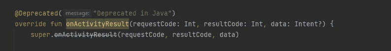

# 不推荐使用 startActivityForResult()和 onActivityResult()方法，替代方法是什么？(科特林)

> 原文：<https://blog.devgenius.io/startactivityforresult-and-onactivityresult-methods-are-deprecated-what-is-the-alternative-bb9da3dbe59d?source=collection_archive---------1----------------------->



# AndroidX `ActivityResult`库提供了一种更加灵活和强大的方式来启动活动并在您的 Android 应用程序中接收结果。它取代了不推荐使用的`startActivityForResult()`和`onActivityResult()`方法，这两个方法以前用于启动一个新的活动，并在活动结束时从该活动接收结果。

要使用 Kotlin 中的`ActivityResult`库，您需要将它添加到 build.gradle 文件中的应用程序依赖项中:

```
dependencies {
  // ...
  implementation 'androidx.activity:activity:1.2.0-alpha01'
  // ...
}
```

接下来，您可以使用`registerForActivityResult()`方法注册一个回调来接收已启动活动的结果。这个方法有两个参数:一个`contract`和一个`callback`。`contract`指定您想要接收的结果的类型，而`callback`是一个 lambda 函数，当结果返回时将调用它。

例如，要开始一个活动并使用`StartActivityForResult`契约接收结果，您可以使用下面的代码:

```
val launcher = registerForActivityResult(ActivityResultContracts.StartActivityForResult()) { result ->
    // Handle the result here
}
```

要启动活动，您可以在`ActivityResultLauncher`对象上使用`launch()`方法，为您想要启动的活动传入`Intent`:

```
val intent = Intent(this, SecondActivity::class.java)
launcher.launch(intent)
```

当第二个活动完成时，结果将被传递到您用`registerForActivityResult()`注册的回调函数。传递给回调函数的`ActivityResult`对象包含请求代码、结果代码和第二个活动返回的数据。

在`ActivityResult`库中还有许多其他类型的契约可用，包括用定制数据启动活动并接收结果的契约、用片段启动结果的活动，以及用定制选项启动活动。你可以在 [AndroidX 活动文档](https://developer.android.com/jetpack/androidx/releases/activity)中找到更多关于`ActivityResult`库的信息。

谢谢你。