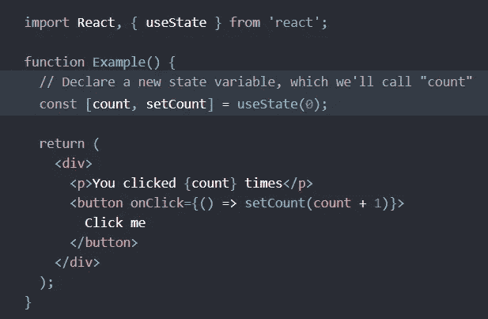
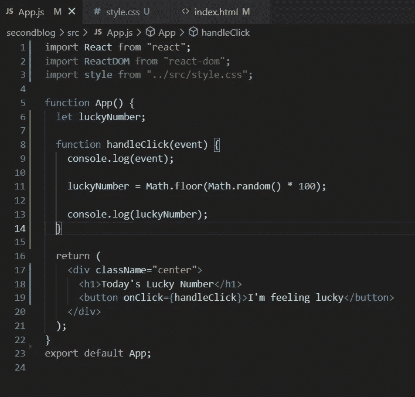
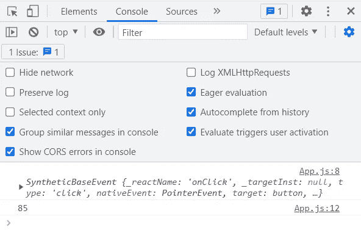
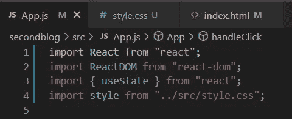
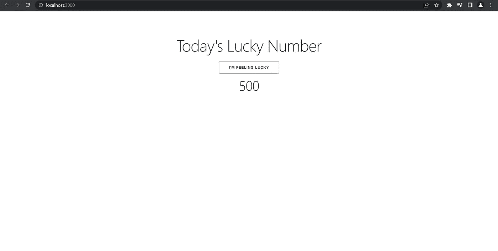
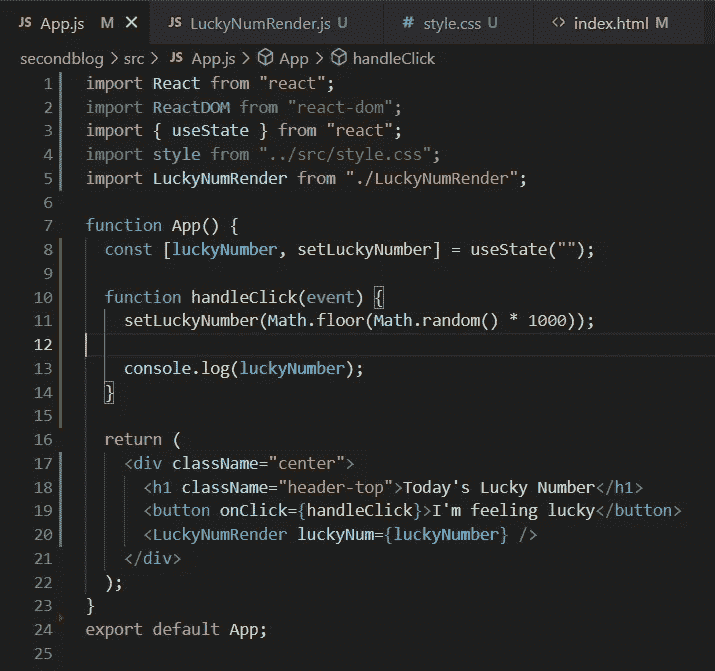
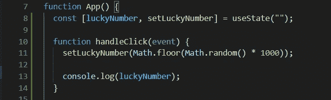

# React 中 useState()的入门指南

> 原文：<https://blog.devgenius.io/starting-guide-to-usestate-in-react-fc68e09590b7?source=collection_archive---------5----------------------->

# **什么是 useState()**

useState 是一个 React 钩子， ***允许你在 useState*** 的功能组件中有变量。您将初始值传递给这个**函数**，它将返回一个带有当前状态值的变量以及一个更新其值的**函数**。没有它，组件不会重新渲染。

没有使用状态()

# **无使用状态()**

让我们来看一个在我们的 **create-react-app** 代码中将**事件监听器**附加到按钮元素的例子。如果我们检查事件的 console.log，我们可以看到我们得到了一个不同类型的事件，称为 ***合成基础事件*** 。React 合成事件与本地事件非常相似，然而，对于合成事件， **React** 使其变得更容易，因此事件在所有浏览器中都是一样的。没有它，组件将不会重新渲染 onClick 。

react synthetic base event console . log

# **使用 useState()**

> 为了在我们的代码中实现 **useState()** ，我们首先必须将其导入到我们的组件中。之后，你需要做的就是写
> 
> 从“反应”导入 **{使用状态}**

之后，我们就可以在我们的应用程序中自由地实现 ***useState()*** 。让我们看一个在 web 应用程序中包含 ***useState()*** 的基本例子。

# **幸运数字发生器示例**

使用 useState()的幸运数字生成器

> 在这个例子中，我们通过编写来实现 ***useState()***
> 
> const [luckyNumber，setLuckyNumber] = useState(" ")
> 
> 然后我们将一个 **onClick** 事件附加到我们的按钮上(注意**驼峰式**样式与 **Javascript** 中的本地事件相反)。

# 使用 useState()处理事件

> 注意我们的
> 
> const [luckyNumber，setLuckyNumber] = useState(" ")
> 
> 我们在 **Javascript** 中做一个叫做**数组析构**的事情。

# **使用状态()中的初始值**

在这个例子中， *luckyNumber* 是我们的开始变量，而 *setLuckyNumber* 是**函数**，它用于在事件触发时设置新值，在这个例子中，是触发 **onClick** 。请记住， ***useState()*** 中的内容就是我们的初始值( *luckyNumber* )，直到它被我们的 *setLuckyNumber* **函数**改变。

# **setLuckyNumber 辅助函数**

我们的 *setLuckyNumber* **函数**根据我们放在 ***useState()*** 括号内的内容设置 *luckyNumber* 的新值。我们可以设置 0，并创建一个 *setCounter* 函数，该函数将 *luckyNumber* 或任何有意义的变量( *counter* )作为参数，并添加来自 **useState** 的初始值，并递增 1。

***useState()*** 非常适合于任何时候你需要一个事件来触发你的**功能组件**的变化。它可以以许多不同的方式使用，使用它最重要的好处之一是，如果状态改变，它**会重新呈现**组件。