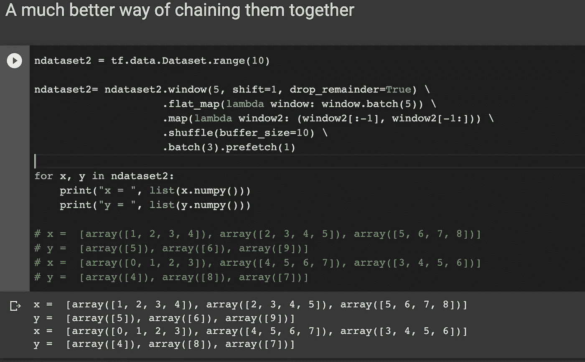
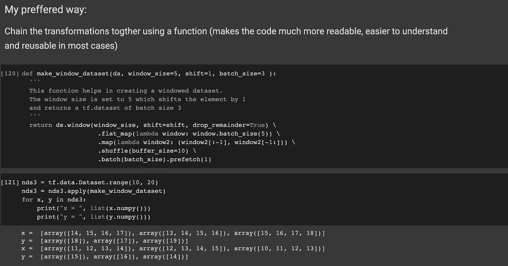

# 从张量流数据集开始-第 1 部分；tf.datasets API 简介，开始为您的机器和深度学习实验构建复杂的数据管道。

> 原文：<https://blog.devgenius.io/starting-with-tensorflow-datasets-part-1-an-intro-to-tf-datasets-9a26e2db4995?source=collection_archive---------2----------------------->


TensorFlow 是机器学习和深度学习的惊人生态系统，它附带了许多强大的库和工具，使工程师/研究人员能够无缝地工作，从预处理数据、创建模型等，直到将它们部署到生产中。我在工作中遇到的一个有趣的库是 [TensorFlow 数据集](https://www.tensorflow.org/datasets/overview) (tfds)库。TensorFlow 数据集库附带了大量研究人员想要试验的数据集。这个库最棒的地方在于它以 [tf.data](https://www.tensorflow.org/guide/data) 的形式返回数据集。tf.data 附带的 API 支持构建复杂且可重用的管道。管线被优化并且

在这个多部分教程系列中，我想向您介绍 tf.data.Dataset 及其最有趣和最重要的构建管道的方法，然后讨论 tfds 库，并以图像分类、自然语言处理为例。(在第 2 部分中)。在开始介绍 TensorFlow 数据集之前，我想先介绍一下 tf.data api，同时也想展示一下它所具有的强大的数据转换 api。

data 是一个强大的 ETL 工具，它将使数据管道构建阶段变得整洁、干净和可重用。它可以与 CPU、GPU 和 TPU 一起工作，并且经过了高度优化。(啊！我还发现这让这个阶段变得轻松有趣。)

# 目录

1.  使用 tf.data 的动机。
2.  tf.data.Dataset 的简要概述。
3.  如何创建张量流数据集？
4.  最重要的张量流数据集方法。
5.  构建数据管道的方法链。

# 1.使用 tf.data 的动机:-

1.  可以用**的 CPU，GPU，和 TPU 的。**(您可以在您简陋的笔记本电脑上构建一个原型管道，并将其运送到强大的机器/云上)
2.  **链接方法:**各种数据转换可以表示为方法，也可以组合。
3.  **Keras:** tf.data 与 **Keras** 配合得非常好，这也是将您的数据传递给 **Keras** 模型的推荐方式。
4.  优化您机器的性能。更多信息请访问[数据性能](https://www.tensorflow.org/guide/data_performance)，它详细解释了 tf.datasets 是如何固定事物的。
5.  使数据构建管道过程更加顺畅，代码更具可读性、可再现性和可重用性。

# 2.tf.data.Dataset 的简要概述:

下面是来自官方[文件](https://www.tensorflow.org/api_docs/python/tf/data/Dataset)的 tf.datasets 的快速浏览:

> `[tf.data.Dataset](https://www.tensorflow.org/api_docs/python/tf/data/Dataset)` API 支持编写描述性的高效输入管道。`Dataset`用法遵循一种常见模式:
> 
> 1.根据输入数据创建源数据集。
> 
> 2.应用数据集转换来预处理数据。
> 
> 3.迭代数据集并处理元素。
> 
> 迭代以流的方式发生，因此整个数据集不需要适合内存。

# 3.如何创建张量流数据集:

开始和理解如何创建 tf.data.Dataset 的最简单方法是从创建 tensorflow 数据集开始，最好的起点是**TF . data . dataset . from _ tensor _ slices()**方法。该方法接受 numpy 数组/ python 列表/等，并将其转换为张量数据集。

一旦使用这种方法创建了 TensorFlow 数据集，就可以使用它的 **element_spec** 属性来检查所创建数据集的元素规范。让我们现在就动手吧。

```
import tensorflow as tf
import numpy as np#Creating a tensorflow dataset using a listlist_data = tf.data.Dataset.from_tensor_slices([1, 2, 3],)#Creating a tensorflow dataset using a numpy array
np_data = tf.data.Dataset.from_tensor_slices(np.array([[1, 2, 3]
                                                       [4, 5, 6,],
                                                       [7, 8, 9], ] ))#Use the element_spec attribute to look at your datalist_data.element_spec# TensorSpec(shape=(), dtype=tf.int32, name=None)np_data.element_spec# TensorSpec(shape=(3,), dtype=tf.int64, name=None)
```

接下来，让我们看一个更现实的例子来创建一个张量流数据集，我们将使用 mnist 数据集。在下面的代码片段中，我们加载 mnist 数据集，并从返回的 numpy 数组创建 TensorFlow 数据集。最后，我们使用 **as_numpy_iterator()** 方法从 TensorFlow 数据集加载数据，该方法允许我们通过将张量转换为 numpy 数组来访问数据。在我们的例子中，它将让我们检查数据集。

**注意**:你可以传递一个以上的 NumPy 数组给 **from_tensor_slices** 方法。

```
# Load data the mnist data
train, test = tf.keras.datasets.mnist.load_data()# Read the images array's and the lables
images, lables = train# Quick preprocess
images = images/255.0# Create your dataset
mnist_dataset = tf.data.Dataset.from_tensor_slices((images, lables))# Element inspection
mnist_dataset.element_spec# Returns the created tensors and following is the output
# (TensorSpec(shape=(28, 28), dtype=tf.float64, name=None),
# TensorSpec(shape=(), dtype=tf.uint8, name=None)) # X is the first input array and y is the corresponding lablefor X,y in mnist_dataset.as_numpy_iterator():
    print("Shape of X, y")
    print(X.shape, y.shape)
    print(type(X), ", This number is -->", y)
    break # to avoid iterating over all the training examples# Output is as follows:
# Shape of X, y
# (28, 28) ()
# <class 'numpy.ndarray'> , This number is --> 5
```

创建 TensorFlow 数据集的其他方法(使用 python 生成器、TFRecords、CSV、图像和文件集)将在接下来的部分中展开。如果你现在很好奇，你可以看看这些文件。

# 4.可用的最重要的张量流数据集方法:

tf.data.Dataset 有 25 种以上的可用方法，但这里我想涵盖您需要使用 TensorFlow 数据集的最常见方法，以及您将在文档和其他作品中看到的最常见方法。

1.  **范围:**创建一个以步长分隔的值范围的数据集。签名开始，停止步骤。下面演示了这种方法

```
range_dataset = tf.data.Dataset.range(5)
print(list(range_dataset.as_numpy_iterator()))
# [0, 1, 2, 3, 4]range_stepped_dataset = tf.data.Dataset.range(1, 10, 3, output_type=tf.float32)print(list(range_stepped_dataset.as_numpy_iterator()))
# [1.0, 4.0, 7.0]
```

**2。地图** : `map(map_func, )`

这可以让你对传递给张量的每个元素应用“ **map_func** ”函数。下面是此方法的示例，其中我们将上面定义的 range_dataset 中的每个元素除以 4。

```
def div_by_4(x):
'''A function that will help you divide each tensor element by 4
'''
  return x/4range_divided = range_dataset.map(div_by_4)print(list(range_divided.as_numpy_iterator()))
#[0.0, 0.25, 0.5, 0.75, 1.0]
```

**3 .as_numpy_iterator:** 如上所述，此方法返回一个将数据集的所有元素转换为 numpy 的迭代器。

**4 .take:** `take( count, name=None)` 它创建一个新的数据集，并向其传递最大计数。下面是 take 方法如何工作的快速演示。它还可以处理批处理数据集，并将使用**批处理**方法演示其行为。

在这里，我们从我们创建的 **mnist_dataset** 中获取前几个 6 个图像。

```
fist_six_images_taken = mnist_dataset.take(6)
print('Lenght of the dataset',len(fist_six_images_taken))
# Lenght of the dataset 6print(fist_six_images_taken.element_spec)
# (TensorSpec(shape=(28, 28), dtype=tf.float64, name=None), #TensorSpec(shape=(), dtype=tf.uint8, name=None))for X,y in fist_six_images_taken.as_numpy_iterator():
   print(X.shape, y)# (28, 28) 5
# (28, 28) 0
# (28, 28) 4
# (28, 28) 1
# (28, 28) 9
# (28, 28) 2
```

**5 .跳过:** `skip( count, name=None)`它创建一个数据集，从该数据集中跳过计数元素。让我们看看这个方法是如何工作的，在下面的例子中，让我们跳过 **mnist_dataset** 中的前 3 个元素，取下一个 3。如果在教程中一直跟随，我们应该依次看到标签/图像 1、9 和 2

```
for X,y in mnist_dataset.skip(3).take(3).as_numpy_iterator():
   print(X.shape, y)# (28, 28) 1
# (28, 28) 9
# (28, 28) 2
```

**6 .重复:** `repeat( count=None, name=None)`
此方法按顺序重复数据集值

```
dataset2 = tf.data.Dataset.range(3)
repeated_dataset = dataset2.repeat(3)
print(repeated_dataset.element_spec)
print(list(repeated_dataset.as_numpy_iterator()))# TensorSpec(shape=(), dtype=tf.int64, name=None)
# [0, 1, 2, 0, 1, 2, 0, 1, 2]
```

**7 .洗牌:** `shuffle( buffer_size, seed=None, reshuffle_each_iteration=None, name=None)`
跟随洗牌的工作取自单据 TensorFlow 单据

> 随机打乱此数据集的元素。
> 
> 此数据集用 buffer_size 元素填充缓冲区，然后从此缓冲区中随机采样元素，用新元素替换所选元素。为了实现完美的混洗，需要大于或等于数据集完整大小的缓冲区大小。
> 
> 例如，如果数据集包含 10，000 个元素，但`buffer_size`设置为 1，000，则`shuffle`将最初仅从缓冲区中的前 1，000 个元素中选择一个随机元素。一旦选择了一个元素，它在缓冲区中的空间就被下一个(即 1，001-st)元素替换，保持 1，000 个元素的缓冲区。

```
dataset3 = tf.data.Dataset.range(3)
print(list(dataset3.as_numpy_iterator()))
print(list(dataset3.shuffle(3).as_numpy_iterator()))# [0, 1, 2]
# [1, 2, 0]
```

注意:这种方法可用于对抗序列偏差。

**8 .此方法通过将给定数据集压缩在一起来创建数据集。**

```
np_array = np.array([[1, 2, 3],
                    [4, 5, 6],
                    [7, 8, 9]])
labels = np.array([0, 0, 1])
d_ds = tf.data.Dataset.from_tensor_slices(np_array)
lab_tf = tf.data.Dataset.from_tensor_slices(labels)# Zipping 2 tf datasets
zipped_dataset = tf.data.Dataset.zip((d_ds, lab_tf))print('Array   , Label')
for x,y in zipped_dataset.as_numpy_iterator():
    print(x, ',' ,y)# Array   , Label
# [1 2 3] , 0
# [4 5 6] , 0
# [7 8 9] , 1
```

**9。batch:** `batch( batch_size, drop_remainder=False, num_parallel_calls=None, deterministic=None,name=None)`
该函数用于根据指定的 batch_size 将数据集的连续元素组合成批次。
**【drop _ remainder】，**参数如果设置为 True，将删除不符合指定批量的剩余元素。让我们来看一个例子，我们将它设置为默认值，然后将它设置为 true

```
# drop_remainder = False
batched_ds = zipped_dataset.batch(2)print('batched dataset, lables')
for i in batched_ds:
  print(i[0].shape, '        ,  ',i[1].shape)
print()print('Elements of the batched dataset')
for X,y in batched_ds.as_numpy_iterator():
  print('X= ', X)
  print('y= ',y)# batched dataset, lables
# (2, 3)         ,   (2,)
# (1, 3)         ,   (1,)# Elements of the batched dataset
# X=  [[1 2 3]
#     [4 5 6]]# y=  [0 0]# X=  [[7 8 9]]
# y=  [1]
```

drop_remainder 设置为 True

```
# drop_remainder=True
batched_ds = zipped_dataset.batch(2, drop_remainder=True)print('batched dataset, lables')
for i in batched_ds:
  print(i[0].shape, i[1].shape)
print()print('Elements of the batched dataset')
for X,y in batched_ds.as_numpy_iterator():
  print('X= ', X)
  print('y= ',y)
# batched dataset, lables
# (2, 3) (2,)# Elements of the batched dataset
# X=  [[1 2 3]
#     [4 5 6]]
# y=  [0 0]
```

**10。window:** `window( size, shift=None, stride=1, drop_remainder=False, name=None)`
返回一个“windows”的数据集。
每个“窗口”是包含输入数据集元素子集的数据集。这些数据集的大小是有限的(如果没有足够的输入元素来填充窗口，并且 drop_remainder 的计算结果为 False，则可能更少)。

> **注:**处理时序数据时有用

```
data = tf.data.Dataset.range(10)
print('Orginal data', list(data.as_numpy_iterator()))
#  [0, 1, 2, 3, 4, 5, 6, 7, 8, 9]windowed_data = data.window(5, shift=1, drop_remainder=True)
for window_data in windowed_data:
    for val in window_data:
        print(val.numpy(), end=" ")
    print()# Orginal data [0, 1, 2, 3, 4, 5, 6, 7, 8, 9]
# 0 1 2 3 4 
# 1 2 3 4 5 
# 2 3 4 5 6 
# 3 4 5 6 7 
# 4 5 6 7 8 
# 5 6 7 8 9
```

以下是设置 **shift=2** 的示例

```
# with shift = 2
windowed_data = data.window(5, shift=2, drop_remainder=True)
for window_data in windowed_data:
    for val in window_data:
        print(val.numpy(), end=" ")
    print()# 0 1 2 3 4 
# 2 3 4 5 6 
# 4 5 6 7 8
```

11。预取: `prefetch( buffer_size, name=None)`
创建一个数据集，从这个数据集中预取元素。

来自 TensorFlow 文档:

> 大多数数据集输入管道应该以调用预取结束。这允许在处理当前元素的同时准备后面的元素。这通常会改善延迟和吞吐量，但代价是使用额外的内存来存储预取的元素。

12。cache:
缓存这个数据集中的元素。第一次迭代数据集时，它的元素将被缓存在指定的文件或内存中。后续迭代将使用缓存的数据。

13。flat_map : `flat_map( map_func, name=None)`
将`map_func`映射到整个数据集，并将结果展平。

14。apply: `apply( transformation_func)` 该函数对数据集应用一个变换函数，并返回变换后的数据集。

# 5.与 TensorFlow 数据集的方法链接:

让我们把到目前为止我们在本教程中学到的所有东西放在一起，并链接多个 TensorFlow 方法来构建一个数据管道。

让我们举一个简单的例子来演示如何在 TensorFlow 中链接方法来构建转换管道。这里我拿一个玩具的例子来演示。(真实生活中的复杂例子将在随后的部分中出现，我们将在真实数据集上使用这些方法。)

**我们的任务**很简单，就是创建一个数据集，用于预测序列中的下一个数字。更具体地说，假设我们有一个从 1 到 10 的序列，任务是读取前 4 个数字(输入)并预测第 5 个数字。此任务所需的数据集可能如下所示:

X= 1，2，3，4 然后 y = 5
X = 2，3，4，5 然后 y = 6
X = 3，4，5，6 然后 y = 7 等等

在这里，我们可以通过以下方式使用 TensorFlow 来完成这项任务。
我们使用大小为 5 的窗口，前 4 个是 X，最后一个是 y。
我们还打开了随机播放以避免偏差。我们使用的批量大小为 3。

```
ndataset = tf.data.Dataset.range(10)
ndataset = ndataset.window(5, shift=1, drop_remainder=True)
ndataset = ndataset.flat_map(lambda window: window.batch(5))
ndataset = ndataset.map(lambda window: (window[:-1], window[-1:]))
ndataset = ndataset.shuffle(buffer_size=10)
ndataset = ndataset.batch(3).prefetch(1)for x, y in ndataset:
    print("x = ", list(x.numpy()))
    print("y = ", list(y.numpy()))# x =  [array([4, 5, 6, 7]), array([5, 6, 7, 8]), array([3, 4, 5, 6])]
# y =  [array([8]), array([9]), array([7])]
# x =  [array([0, 1, 2, 3]), array([2, 3, 4, 5]), array([1, 2, 3, 4])]
# y =  [array([4]), array([6]), array([5])]
```

相同代码的更好、更易读的版本:



我更喜欢将它们链接在一起的方式是将转换写在一个函数中，并使用 apply 方法。这使得代码可重用，可读性很强，并且函数可以附带文档字符串来帮助其他人理解转换的目的。



这就是这个教程，我们在这里经历了相当多的细节。在下一篇文章中，我想介绍 TensorFlow 数据集以及如何使用它，然后浏览几个流行的数据集(图像、文本、表格)，还将了解如何使用 tf.dataset 和 **KERAS 构建预测模型。**

下面是本文中使用的代码的链接

1.  github:-[https://github.com/Virajdatt/tensorflow_dataset_intro](https://github.com/Virajdatt/tensorflow_dataset_intro)

2.Google Colab:-[https://Colab . research . Google . com/drive/1 lyv _ jisxtqcxwvtedf 8 ikgzae 8 hhbh 1 # scroll to = W _ 592 W 27 ppjy](https://colab.research.google.com/drive/1LYv_JIsXTQCxxwvtedF8IKgzAE8hhBh1#scrollTo=W_592w27pPjY)

# **— — — — —敬请关注** — — — —

我希望你在阅读和学习这篇文章的过程中有一段愉快的时光，就像我在写这篇文章的时候一样。如果内容对你有帮助，请鼓掌。如果你有任何问题或者(在下面的评论中提到你的问题),你可以在下面的平台上联系我并和我交谈。

LinkedIn:-[https://www.linkedin.com/in/virajdatt-kohir/](https://www.linkedin.com/in/virajdatt-kohir/)
推特:-[https://twitter.com/kvirajdatt](https://twitter.com/kvirajdatt)
GitHub:-[https://github.com/Virajdatt](https://github.com/Virajdatt)
GoodReads:-[https://www . GoodReads . com/user/show/114768501-virajdatt-kohir](https://www.goodreads.com/user/show/114768501-virajdatt-kohir)