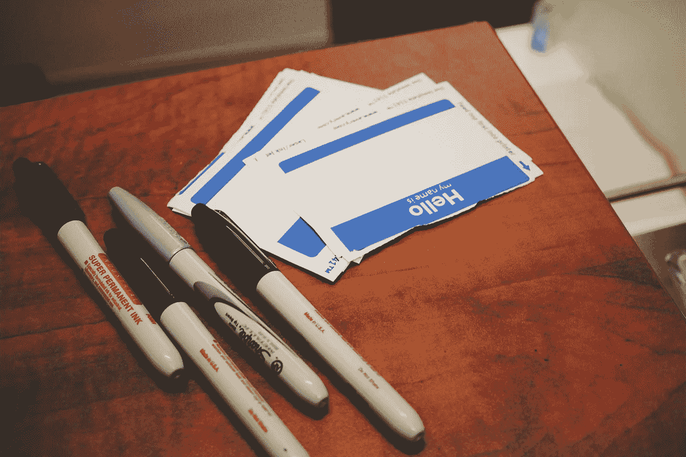

# 一步一步创办自己的公司

> 原文：<https://blog.devgenius.io/starting-your-own-company-step-by-step-c49015161f98?source=collection_archive---------26----------------------->

## 创办编程公司(和其他公司)的超级教程

首先，4 号快乐！

卡尔·海尔达尔在 [Unsplash](https://unsplash.com/s/photos/business?utm_source=unsplash&utm_medium=referral&utm_content=creditCopyText) 上拍摄的照片

最近我看到了很多关于“我如何在一年内赚到如此多的钱”的帖子。是的-我们都见过。似乎每天都有几个新的。我在这里不是要吹嘘钱是怎么赚到的，而是要一步一步地告诉你如何赚到钱。这将是很少或没有钱。我会列出所有的步骤，并告诉你如何采取行动的步骤和我做什么。您可以用任何基于服务的产品替换本教程中服务的编程方面。这对你我都将是一次激动人心的旅程，我希望你们都能发现它的价值。

我在副标题里说“超级教程”不是开玩笑。我将撰写各种各样的文章，从规划布局(本文涵盖的内容)到构建网站的深入教程，到采取营销行动，再到为企业管理社交媒体。我将倾其所有，尽可能为读者提供更多信息。

**服务:**

约翰·施诺布里奇在 [Unsplash](https://unsplash.com/s/photos/services?utm_source=unsplash&utm_medium=referral&utm_content=creditCopyText) 上拍摄的照片

首先，我们要展示我们想为客户提供的服务。因为大多数阅读这篇文章的人都是程序员，所以显而易见的选择是网站开发、web 应用程序开发、自动化以及任何你能想到的基于开发的服务。就我而言，我对信息技术、信息安全和营销有相当程度的了解，所以我计划在未来推出这些服务。我们的目标是从小处着手，扎根于大地，并随着我们的成长而扩展。

**名称:**

乔恩·泰森在 [Unsplash](https://unsplash.com/s/photos/name?utm_source=unsplash&utm_medium=referral&utm_content=creditCopyText) 上的照片

这是我特别纠结的一部分，我从来不满足于我所选择的。我的建议是挑自己喜欢的，不要过多的去读 SEO(搜索引擎优化)。我们可以随时更改名称，记住，我们希望开始时尽可能少花钱。拥有一个搜索引擎优化的名字会让你为一个域名支付更多的钱。我发现了这一点，为我的域名选择了一个优化的名称，然后看到了与我挑选的另一个名称相比的价格，我感到震惊。

几年前，当我考虑开始一项名为“Innoviuz”的业务时，我选了一个名字。我查了几个小时才想出这个名字。我认为这很难理解，所以这次旅行我将把公司命名为“TAK 团队”。TAK 实际上只是我的三只狗的第一个字母；西奥，雅典娜，凯恩。你看，它可以像你做的那样简单，:D

从自由职业者做起:

在阅读了很多关于企业类型的资料后，我认为这是最简单、最实惠的自由职业者创业路线。大多数小企业将从有限责任公司开始。这是要花钱的，在德克萨斯州，我相信是 300 美元。这确实带来了税收优惠，但由于我们刚刚开始作为一个单独的开发者，没有理由不申报业务作为一个简单的自由职业者。一旦业务增长，我们想增加一些人，我们将改变为有限责任公司。在美国，作为一名自由职业者，我们被要求将所有收入作为个人收入上报。如果你对此事有任何疑问，我建议阅读注册会计师的文章或亲自咨询。

**你的任务:**

“你的任务”是另一个你可以全神贯注思考的领域。然而，这应该是简单、简短和甜蜜的。这是你前进的动力，是你创业的动力(除了钱)。我为此选择的使命是**通过提供最高效的客户驱动服务**为公司省钱。当我们进入网站的开发并花一些时间写下网站的内容时，你就会明白我的意思了。

稍后我会开始推荐一些我读过的商业和营销书籍。这将巩固我在教程中所教授的内容，以及我从一些书中获得的想法和知识。我希望这将有所帮助。

接下来是什么？

接下来，在这个超级教程中，我们将为企业开发网站。我将建立两个网站。一个将是一个完全免费的(不包括域名和 VPS 托管网站)网站。这个网站将基于烧瓶和一个免费的前端模板，我们将编辑我们喜欢的。

第二个是一个付费 Vue JS 前端的网站，功能丰富，售价 60 美元。这也将使用 flask 来托管它的 API。

如果你觉得这篇文章很有趣，并想了解新的消息，请随时关注我。但是如果你想了解我的最新文章并获得一些其他真正伟大的读物，请关注 DevGenius。