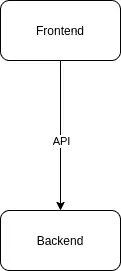

# 启动产品开发-从零开始构建软件产品的思考。

> 原文：<https://blog.devgenius.io/startup-product-development-musings-of-building-software-from-scratch-b63f733a14bc?source=collection_archive---------14----------------------->

照片由[维达尔·诺德里-马西森](https://unsplash.com/@vidarnm?utm_source=medium&utm_medium=referral)在 [Unsplash](https://unsplash.com?utm_source=medium&utm_medium=referral) 拍摄

首先，我先坦白，从零开始是不存在的。开源的美丽世界让我们站在巨人的肩膀上，取得孤立状态下不可能取得的成就。非常感谢社区。

我想向你们介绍我在 2020 年 1 月一个晴朗的早晨偶然遇到的挑战。从一个简短的电话开始，几天后，我发现自己被委以重任，为一家初创公司开发软件产品。我收到的简报正是如此，极其简短！“构建一个具有流程、用户、知识和报告功能的企业 web 应用程序。在大约 6 个月内设计、构建和发布”。

> **罗马不是一日之功——罗马不是一天建成的**

那么从哪里开始呢？我决定先选择语言。

假设这个图是第 0 天的架构是相当安全的。我同意这不是很有见地，但足以让我开始思考语言的选择。首先从后端开始，我开始查看常用选项。

# 为什么不是 Java？

我在 21 世纪初接触了 Java。来自 C++的土地，感觉就像泡泡糖。它当然席卷了编程界。可重用库对年轻的开发人员来说是一个巨大的激励，但遗憾的是它掩盖了 JVM 概念的一些核心低效之处。此外，内存变得越来越便宜，Java 的传值“特性”意味着内存管理不再是编码人员的责任。就变成了[九月](https://en.wikipedia.org/wiki/Somebody_else%27s_problem)。我花了无数个夜晚试图和垃圾清洁工抗争。false 最近它已经有了很大的改进。然而，现代开发人员需要并且应该得到更多。特别

*   简化的依赖性管理
*   更加负责和节约的内存管理
*   编译时间更快
*   更快的启动时间
*   简单、直观的并发支持
*   占地面积更小
*   ….这样的例子不胜枚举

***Java 的时代已经过去了。***

# 为什么不是 Python？

我想一切皆有可能。我最近用 Python 做了很多原型，尤其是机器学习。然而，这里的要求是不同的。我想构建有史以来最具弹性、响应最快、容错能力最强的分布式 API 后端！。我也不想度过不眠之夜，担心我的 Python 代码什么时候会因为类型在运行时的值而误解它。我甚至觉得没有必要评估其他问题，比如本地并发支持和执行速度。

***巨蟒硬是不肯砍它***

# 该奖项授予…

GoLang！我确实评估了一些其他选项，比如 Rust、Scala，甚至 C++。但是我就是过不了 GoLang。它真的是一种美丽的语言。简单，强大，简洁。因为 GoLang，我重新找回了对编码的热爱。几个月后，我可以确认我做了正确的选择。我们的开发速度和编码质量在很大程度上归功于 GoLang。

不过，Rust 值得一提。它看起来是一种精心制作的语言。也许有一天我会有时间进一步探索它。

# 前端呢？

前端的语言选择没有那么麻烦。虽然我确实在 [WASM](https://en.wikipedia.org/wiki/WebAssembly) 的世界里迷失了几天。尤其是在 Go 中编写前端代码并将其交叉编译到 WASM 的诱惑。我对 Maxence Charriere 通过这个[项目](https://github.com/maxence-charriere/go-app)所取得的成就感到敬畏。然而，当您需要操作 DOM 时，没有转义 Javascript。此外，我不确定在没有先编写一些相关原型的情况下，是否值得进行这项工作。所以为了节省时间，我决定用 React。有类似 Angular 和 Vue 的竞争选项。我发现 React 在社区支持和可重用 UI 元素方面是市场上最有吸引力的。

关于 WASM，我将密切关注它在无服务器系统开发中的作用。Cloudfare 现在支持在 V8 引擎上为他们的[无服务器工人](https://blog.cloudflare.com/webassembly-on-cloudflare-workers/)使用 WASM。这是基于 docker/vm 的无服务器范例的一个非常真实的替代方案。

# 故事继续…

在下一版中，我将带您完成旅程的下一部分——为我们的 API 服务器组装构件。