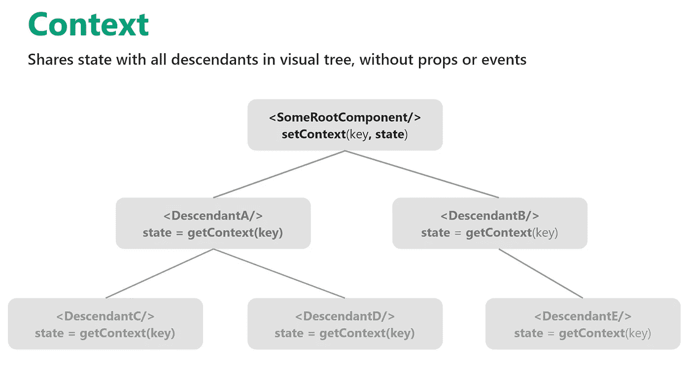
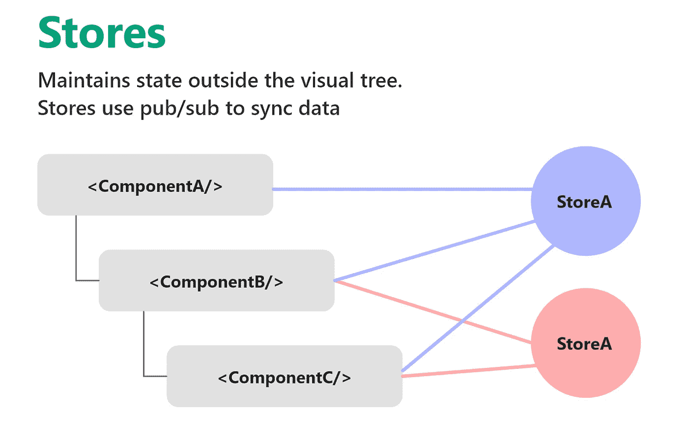

# 苗条的国家管理

> 原文：<https://blog.devgenius.io/state-management-in-svelte-b045213c9138?source=collection_archive---------2----------------------->

## 组件通信的状态管理变得简单

2020 年，web 开发不仅基于**组件驱动的方法**，还基于**状态管理解决方案**的使用。

在像 [Angular](https://angular.io/) 这样的早期 JavaScript 框架中，应用程序的状态通常嵌入在**路由**、**服务**、**控制器**、**本地存储**和**会话存储**中。

即使有这么多不同的数据存储解决方案看起来很有用，但当你有一个大型应用程序时，很难跟踪存储了什么以及存储在哪里，这就会成为一个问题。

随着时间的推移，**第三方解决方案**诞生，以解决这种缺乏，如 [Redux](https://redux.js.org/) 和 [Vuex](https://vuex.vuejs.org/) 。

> Svelte 有一个更简单的状态管理方法，它消除了安装库的需要，并提供了在框架内管理状态的存储。

在本文中，我们将看到 Svelte 如何管理和处理组件之间共享数据的**状态。**

# 上下文 API

> 细长的上下文 API 非常适合跨组件通信，而不必通过传递道具来使代码库变得复杂

**上下文 API** 由`svelte`包`getContext`和`setContext`提供的 **2 个函数**提供。

您可以通过在上下文中设置对象或值**并将其与一个键相关联，使其在应用程序内的任何位置**可用:

要使`someKey`在应用程序的不同组件中可用，只需使用`getContext`功能导入它:

请注意，`getContext`只能用于检索使用了`setContext`的组件或同一组件树中的组件的键。

为了在不同树中的两个组件之间传递属性和值，Svelte 使用了[存储](https://svelte.dev/docs#svelte_store)。

# 使用苗条的商店

> 当组件需要相互交流而不需要传递太多的道具，并且你有一些属性需要被不同的组件访问时，苗条商店是处理你的应用程序状态的一个很好的工具。

Svelte 通过 **stores** 处理这种类型的属性，store 是一个保存一个值的对象，当值发生变化时，它会通知你**。**

*想象一个有登录用户的 app。
把* `*user=*` *道具传递给每个组件会很繁琐。
许多组件将不得不接受* `*user=*` *道具，只是为了传递它，因为孙儿或曾孙需要它。*

Svelte 在应用程序中有两种处理状态的存储:`writable`和`readable`存储。

## 可写商店

> [可写存储](https://svelte.dev/docs#writable)是包含可由不同组件访问的值或属性的对象。

> 让我们使用可写存储来保存一个值，然后我们可以在我们的应用程序中修改或传递这个值。

要访问这个值，您可以从存储中导出它，并将其保存为一个 **JavaScript** 文件:

然后将其导入任何其他组件:

可写存储器中的值可以改变。

如果您需要在导入的任何组件中更改`city`的值，您可以使用`set()`方法:

或者您可以使用`update()`方法运行回调，将当前值作为参数传递:

另一种方法是使用 Svelte 的`subscribe()`方法，让组件监视您在商店中设置的值的变化:

## 可读存储

> [可读存储](https://svelte.dev/docs#readable)顾名思义就是只读存储。
> 
> 如果存储中管理的数据不应由用户操作，则可以使用它。

可读存储是特殊的，因为**它们不能从外部**更新，没有`set()`或`update()`方法。

当使用一个可读存储器时，**你必须在创建它的时候设置它的值**。

> 可读存储主要用于处理需要不可变的数据。

让我们看一个例子，并使用可读存储制作一个计数器:

上面的计数器可以导入到另一个组件中:

# 结论

谈到状态管理，Svelte 并不是在重新发明轮子:
我们已经熟悉了通过来自 **React** 、 **Angular** 和 **Vue** 的商店来实现状态管理的想法。

Svelte 的适应性使它成为构建小规模应用程序的绝佳选择，这些应用程序可能需要你在一定程度上处理状态。

创建定制存储的可能性节省了大量的样板代码(这些代码[可以被库](https://blog.codecentric.de/en/2020/02/simplifying-redux-with-the-redux-toolkit/)所取代)，并且允许你用特定领域的逻辑来实现存储。

当然，随着 GitHub 上[苗条报告](https://github.com/sveltejs/svelte)的更多贡献者，我们应该会看到更多有前途的功能和改变。

感谢阅读！