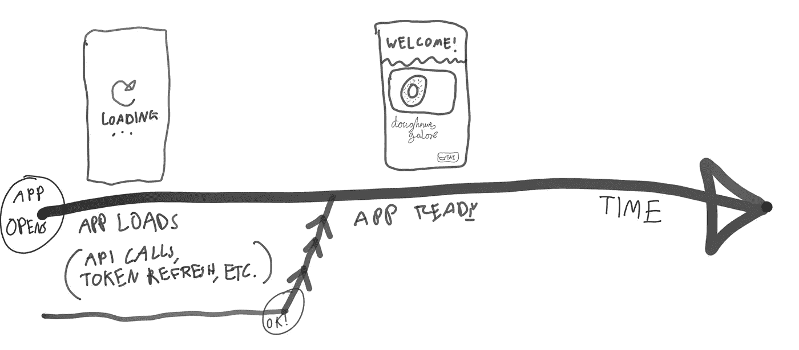
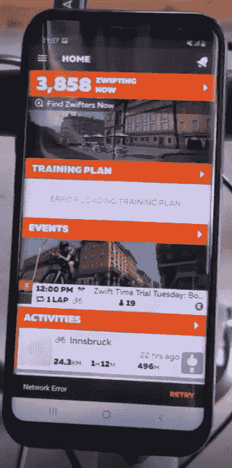
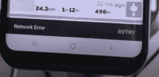

# 国家管理的重要经验

> 原文：<https://blog.devgenius.io/state-management-issues-you-need-to-avoid-7a0dec1c92c8?source=collection_archive---------3----------------------->

## 你的应用程序没有的两个常见问题

查尔斯·德鲁维奥在 [Unsplash](https://unsplash.com?utm_source=medium&utm_medium=referral) 上拍摄的照片

我们生活在这样一个时代，每个新的科技公司几乎都*保证会开发出自己的应用程序。也许在你自己的创业公司里，你被要求开发一个应用程序供客户使用。一个高质量的应用程序最重要的组成部分之一是拥有高质量的状态管理。*

几年前，如果你对我说“国家管理”这个词，我根本不知道它是什么。不知何故，我在制作应用程序、网站和软件，而对我的应用程序在任何给定时间点的“状态”一无所知。每次我做一些事情来修改我的应用程序的状态，无论是有一个仍然在进行中的请求(例如，显示一个加载指示器)，还是优雅地处理错误，我都没有注意到我正在做的事情在任何给定的时间如何影响我的应用程序的状态。

原因很简单。在更简单的时代，我开始用 Visual Basic 6 这样的语言制作桌面应用程序。桌面应用本来就是有状态的，*如果你改变一个文本框或标签，它会一直存在，直到用户退出应用。另一方面，网络应用是无状态的。想想看——当你去[www.google.com，](http://www.google.com,)你的电脑下载了网页显示所需的 HTML、Javascript 和 CSS，但除此之外并不保持与谷歌服务器的连接。任何改变你之后在页面上看到的东西，主要是通过 Javascript 来实现的，要么修改页面(要么从服务器请求新的资产来显示)。在文本框中键入一些文本，刷新，文本就消失了(它不会保持它的状态)。*

## 国家到底是什么？

如果你现在打开手机上的任何应用程序，它可能会打开一个你看起来很熟悉的页面(从技术上讲，它也可能会直接崩溃，但我们希望不会😂).无论那个屏幕是什么，无论是登录屏幕，还是你附近在*晚上这个时候还在送甜甜圈的餐馆列表，*等等*，*都与应用程序的当前状态有关。在甜甜圈的例子中，当你的手机向一个 API 发出网络请求时，你可能会看到一个加载屏幕，这个 API 会检索你附近最喜欢的送货地点。这个请求完成后，它产生了一个*新的*状态，其中有餐馆列表，可能还有你的名字，这样它就可以问候你了。您作为用户创建的事件最终会映射到应用程序中的状态。像这样。

我在一个购物中心的平板电脑上画了这张图，所以请给我一点怜悯。

开始这段应用程序代码之旅的是您发起的一个事件——打开应用程序。事件由用户发生，如点击按钮或拖动屏幕进行刷新，但它们也可以由应用程序本身触发(例如，如果应用程序每分钟都在轮询你附近的新餐馆，它会每分钟发送事件以获取这些餐馆，然后将结果返回给你)。

最伟大的国家管理是你根本不会注意到的。想想你会努力完善你的应用程序的流程，最终目标是让你的应用程序使用起来非常流畅，以至于人们从来不会考虑他们应用程序的当前状态，这是很奇怪的。而当国家管理失败的时候，*是最糟糕的*。想一想——你用过无限加载屏幕的 app 吗？有没有盯着屏幕上一个旋转的图标，几秒钟后，想知道它到底在做什么？我敢断言，你感受到的最大愤怒来自国家管理层。如果你正在使用的应用程序失败或出现错误，这可能没关系，没有人是完美的，也没有应用程序是完美的。重要且可行的事情是，负责任地以明确的方式向最终用户披露这一点，这样即使你的应用程序运行不正常，他们也能有很好的体验。考虑到这一点，让我们来看看双态管理的失礼之处，我们可以很容易地避免，而且不应该真的出现在任何应用程序中。

> 最伟大的国家管理是你根本不会注意到的。

# 请不要再告诉我网络错误了

我们的第一个条目来自 Zwift Companion 应用程序。这是一个很棒的应用程序，它让我在整个禁闭期间保持动力，所以我不会像赫特人贾巴一样出来。但它有一个国家管理问题。你能发现它吗？

没什么不寻常的…

让我们稍微关注一下。

答对了。

我的手机刚刚失去了互联网连接，无法与 Zwift 服务器通话。这是一个有点特殊的情况——我通常住在一个小屋里，这个小屋对 Wi-Fi 信号来说有点像法拉第笼，有时它可能有点不连贯。配套应用程序显然对上游服务器有某种心跳，当它再也看不到它们时，它会抛出“网络错误”消息。在你自己的时间里，你可以按下“重试”按钮，尝试重新上线。这是纯粹的、彻头彻尾的、脱裤子的精神错乱，应该被驱逐到银河系的最遥远的地方。

为什么这么问？好吧，让我们回顾一下。我在线上，查看我在这个虚拟世界中骑行的地图，像对待无名小卒一样传递 Ride On 的业务，然后突然，我的手机应用程序掉线了，而我电脑上的 Zwift 应用程序仍在愉快地前进。是什么导致我的会话停止？是我的行为，我关闭了 Zwift 应用程序还是以某种方式表明我已经骑完了？绝对不行。那么，允许一个应用程序断开连接，然后*立即*放弃，并让用户点击“重试”按钮的逻辑是什么呢？

除此之外，骑上智能自行车训练器也是一项热门工作。人们在这些东西上会出汗。我知道，你不想想象一个汗流浃背的软件开发人员一边努力避免肥胖，一边对着手机上的一个应用程序莫名其妙地激动，我明白这一点，但你必须明白，这是最不应该抛弃“我们的联系很糟糕，你能帮帮我们吗？”关于用户的消息。

## 那么该怎么办呢？

我们生活在这个不可思议的世界里，在这个世界里，摆在我们面前的选择范围非常广泛，而且存在异步编程。我们可以在`Future<T>`和`Subscription<T>`(或者`Task<T>`或者`Promise`，你懂的)的桌子上用餐。因此，我们真的没有理由说“用户的互联网连接是断断续续的，我们将退出，只是让它直到他们告诉我们他们真的需要它”。

不，相反，**你订阅了产生信息流的东西，当信息流说你重新上线时，*会自动*重新连接用户**。如果我必须为此绘制一个流程图，这将非常简单，只需轮询与上游服务器或谷歌的连接，或者如果真的到了那一步，pinging】并将其与设备连接的结果相结合(甚至是在 WiFi 或移动互联网上吗？).当上游连接恢复时，您只需自动重新连接，就可以上路了。人们在 Zwift 中锻炼他们的身体，而不是他们的手指，所以他们*真的*不需要按下“重试”按钮，直到事情发生。向用户显示互联网连接暂时丢失并给他们取消重新连接尝试的选项是可以的，但强迫他们干预大多数情况下合乎逻辑的选择是不可以的。

# 即使是大公司也会犯错

最近投资了一个 Galaxy Tab S7+。我想要一个性能良好的设备，有一个奇妙的屏幕，我可以真正展示一个应用程序对潜在客户来说有多好。该设备在世界各地都有很好的评论，但令人惊讶的是，这个合理的可怕的国家问题仍然困扰着该设备。

当设备在主屏幕上时，它首先在键盘盖上键入字母。在这种情况下，我输入“谷歌”。你可以看到下面发生了什么。

你能发现哪里出了问题吗？

如果你直接在主屏幕上写文字，你的意图是什么？你可能在寻找什么。Samsung 得到了这个，它会弹出一个搜索窗口，显示你输入的任何内容。干得好三星。然后，他们会通过*把你在搜索框*中输入的内容搞得一团糟，从而立刻丢掉任何良好状态管理的表象。无论你在主屏幕上多少次点击“谷歌”，你只会在第一次尝试时得到“谷歌”。像这样:

对于搜索引擎来说，这不是一个好名字。

这里到底发生了什么事？看起来有点像这样:

1.  用户在主屏幕上键入一个搜索词
2.  搜索屏幕开始打开，*刚刚*捕捉到第一次击键
3.  搜索屏幕的初始化逻辑运行得非常快！但还不够快来捕捉第一次按键
4.  作为该屏幕初始化的一部分，光标索引被设置回零。此时，用户已经在屏幕上输入了一个字符。
5.  在此之后写入的任何内容都将被添加到最初键入的单词的首字符上。

当然，因为这个问题的存在，你总是忘记它。这就像如果使用 Windows 搜索选项做到了这一点，你只会在每次开始输入的时候记住它。这很复杂，因为触发这个搜索屏幕的唯一方式是在主屏幕上输入。所以每次，你必须输入一些垃圾，用`CTRL+A`选择所有垃圾，删除它们，然后输入你的*实际的*搜索词。

## 那么该怎么办呢？

如果您的页面还没有准备好接受输入，那也没关系。可以将目前的输入保存在输入缓冲区中，并在底层的 textbox 或其他地方准备好接受文本时播放。我的意思是，老实说，以一种可靠的方式在文本字段中键入文本是人类已经做了几十年的事情。当你知道你输入了“谷歌”，却得到了“谷歌”，这让你怀疑你是否可以依赖你输入到你的设备中的内容。如果你不能依靠你输入到你的设备中的东西，那么这是一个相当大的障碍。

# 外卖食品

没有人愿意花时间来绘制用户通过应用程序的流程，这是有意义的，因为这可能会变得非常无聊。编写让用户做更多事情的代码也非常容易(比如点击按钮重试)。但是你的应用程序的质量只能和你的状态管理质量一样好。不管你的应用程序是不是最炫、最亮、最酷的东西，如果你的用户群最终会看到一个无限旋转的加载圈或其他东西，那么这将会扼杀用户参与度。

在更现代的框架中，它也打开了让你的应用程序更容易测试的可能性。想想看，如果用户生成事件，而你的应用程序通过逐渐产生新的状态来响应这些事件，那么编写将这些事件发送到管道并断言结果状态的测试将比比较截图或等效物更容易。

高质量的状态管理导致高质量的应用程序，并且有太多关于状态管理的坏例子，作为开发者，我们需要避免给我们的用户带来麻烦。做到这一点的最好方法是通过例子来学习，所以我期待着在未来带给你更多糟糕的国家管理的例子，以及可以做些什么来使它们变得更好。在那之前，考虑一下你可以做些什么来改善你的应用程序的状态管理总是好的，并且希望这篇文章已经激励你去思考你如何在你的应用程序中管理状态。