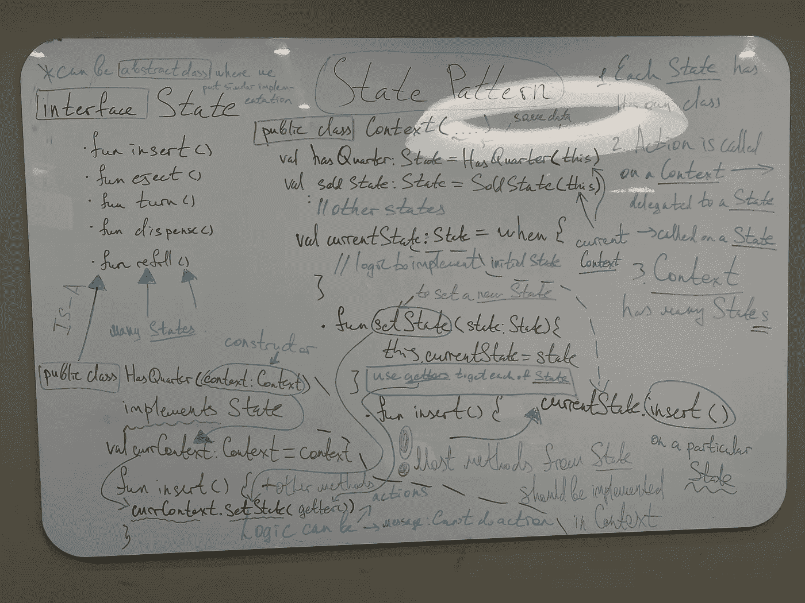

# 改变内部流程的状态模式

> 原文：<https://blog.devgenius.io/state-pattern-for-changing-internal-processes-kotlin-72bd4ef92b2e?source=collection_archive---------5----------------------->

亲爱的模式学习者，很高兴再次见到你👨‍💻。这是“设计模式”系列的下一篇文章，我开始传播它们的乐趣。一定要看看我以前的所有文章，我在这些文章中分解了许多关于面向对象设计的有用的东西📝：

*   策略模式:[https://medium . com/toward sdev/strategy-pattern-for-independent-algorithms-kot Lin-70 ed 24 c 7 BD 8 b](/towardsdev/strategy-pattern-for-independent-algorithms-kotlin-70ed24c7bd8b)
*   观察者模式:[https://medium . com/toward sdev/observer-pattern-for-loose-coupling-kot Lin-f5ab 804609 bb](/towardsdev/observer-pattern-for-loose-coupling-kotlin-f5ab804609bb)
*   装饰模式:[https://medium . com/toward sdev/decorator-decorator-pattern-for-object-composition-kot Lin-7 CEC 92 cbaf 7b](/towardsdev/decorator-decorator-pattern-for-object-composition-kotlin-7cec92cbaf7b)
*   工厂模式:[https://medium . com/dev-genius/factory-patternS-to-hide-instantiation-kot Lin-D5 f 01 cf 01921](/dev-genius/factory-patterns-to-hide-instantiation-kotlin-d5f01cf01921)
*   单例模式:[https://medium . com/dev-genius/singleton-pattern-for-one-of-a-class-objects-Java-a63c 774 d9d 4](/dev-genius/singleton-pattern-for-one-of-a-kind-objects-java-a63c774d9d4)
*   命令模式:[https://medium . com/dev-genius/command-pattern-for-encapsulated-invocation-kot Lin-4338 EB 23 D2 ca](/dev-genius/command-pattern-for-encapsulated-invocation-kotlin-4338eb23d2ca)
*   适配器和外观模式:[https://medium . com/dev-genius/adapter-Facade-pattern-for-perfect-adapting-kot Lin-ccbc 8 f 8 cfcd 6](/dev-genius/adapter-facade-pattern-for-perfect-adapting-kotlin-ccbc8f8cfcd6)
*   模板模式:[https://medium . com/dev-genius/template-pattern-for-encapsulating-algorithms-kot Lin-3d ed 81377 fc 5](/dev-genius/template-pattern-for-encapsulating-algorithms-kotlin-3ded81377fc5)
*   迭代器和复合模式:[https://medium . com/dev-genius/iterator-Composite-patterns-for-managing-collection-kot Lin-FDA 036 ffda 9 f](https://medium.com/dev-genius/iterator-composite-patterns-for-managing-collection-kotlin-fda036ffda9f)

像往常一样，我提到[奥莱利媒体](https://medium.com/u/fbfa235a954c?source=post_page-----72bd4ef92b2e--------------------------------)，因为他们的宏伟的书给了我很大的帮助:[https://www . oreilly . com/library/view/head-first-design/9781492077992/](https://www.oreilly.com/library/view/head-first-design/9781492077992/)

结构:

*   介绍
*   问题
*   `null`本文遵循的设计原则
*   最终解决方案代码
*   额外部分
*   图画

# 状态模式

## 介绍

开始这篇新文章时，我想指出一个事实:一些模式在描述上非常相似，甚至可能解决相关类型的问题，但是它们选择的方法却大相径庭🎭

为什么我要提到这些信息？实际上，**策略模式**，在本系列的第一篇文章中已经介绍过了(是的，通读一遍😬:[https://medium . com/towardsdev/strategy-pattern-for-independent-algorithms-kot Lin-70 ed 24 c 7 BD 8 b](/towardsdev/strategy-pattern-for-independent-algorithms-kotlin-70ed24c7bd8b))和本文中的**状态模式**可能看起来很相似，大家可能会猜测有什么用途等等。被激起了兴趣？让我们进入问题部分，稍后我会回到这个 discussion🪃.

## 问题

直截了当地说:这个**模式**用于改变系统的内部状态。

例如，我们需要创建一个系统，它将从 user🥷获取输入，然后根据条件执行它。假设您对此模式一无所知，并以普通的完全没有模式的方式应用概念解决方案。

系统的设计💭：

*开始状态:*

*   **无季度**是开始状态
*   **有四分之一**是你装球的时候
*   **售出的口香糖球**是当你转动曲柄时，球被加工
*   **当**售出的口香糖**发现机器没有剩余的口香糖时**到达口香糖用尽

*下一步行动:*

*   **插入四分之一**——当我们装入球时
*   **弹出四分之一** —移除球并回到先前状态
*   **转动曲柄** —加工球
*   **分配球** —在下一个状态之前重新充电的内部动作

```
**No Quarter** <- (insert quarter || eject quarter) -> **Has Quarter** - (turn crank) -> (see next line)**Gumball Sold** - (dispense gumball & gumball > 0) -> **No Quarter**
     |

   (dispense gumball & gumball = 0)
     |
   **Out Of Gumballs**  
     |
   (use refill() to load new gumballs & enter **NoQuarter)**
```

嗯，你可以考虑一下，记下下面的解决方法:

分析 it🧠:

*   你有描述**状态**的变量
*   你有**当前状态**
*   你有**个口香糖球**

您将通过实例化这个类来触发动作&逐个调用方法。

你可能会想，听起来不错。为什么我们需要你的模式？🤨

变化有 come…🛠，你需要调整你的设计。

*   添加新的**状态**
*   返工大多数**方法**

这意味着:

*   违反**开闭原则**:阅读**装饰模式**，其中解释了该原则[https://towardsdev . com/Decorator-Decorator-Pattern-for-object-composition-kot Lin-7 CEC 92 cbaf 7b](https://towardsdev.com/decorator-decorator-pattern-for-object-composition-kotlin-7cec92cbaf7b)
*   否 **OOP**
*   转换在那些方法中**，这使得很难找到它们**
*   进一步的变化会产生**bug**🪲

现在让我们来处理更改代码的步骤:

*   封装变化:**状态**
*   使用**构图**
*   **开闭原理**:每种状态都是关闭修改，但机器是开放扩展的

全新改造的 solution✨:

*   定义所有**状态**方法的状态`interface`
*   为每个**状态**单独分类
*   代码中没有**条件**:变化将发生在一个**主类**中
*   依赖**抽象**:机器依赖于`interface` &所有**状态**也依赖于它。阅读关于**工厂模式**的文章，在那里我更彻底地讨论了它[https://medium . com/dev-genius/Factory-Patterns-to-hide-instantiation-kot Lin-D5 f 01 cf 01921](https://medium.com/dev-genius/factory-patterns-to-hide-instantiation-kotlin-d5f01cf01921)

```
 interface State
                  /       |        |             \
           SoldState SoldOutState NoQuarterState HasQuarterStateGumballMachine - through composition has access to all States+ other new States will be possible
```

在大多数情况下，**机器**中的方法会在**状态**中被复制，即当用户在**机器**上执行某个动作时——它会被传输到特定的**状态**(取决于机器的当前状态)||或者根本不被传输，如果这个**状态**是 impossible🦾.的话

*   代码的更多细微差别将在**最终解决方案代码**部分`=>`中观察和解释，如果您对实现的理解模糊不清，请不要担心😥。

## 最终解决方案代码

让我们深入代码演练，我将仔细阅读代码，使您全面了解 clearer✌🏽。

[](https://github.com/SleeplessChallenger/KotlinDesignPatterns/tree/main/src/main/kotlin/StatePattern) [## KotlinDesignPatterns/src/main/kotlin/state pattern at main…

### Kotlin + Medium 文章中的设计模式。通过以下方式为 sleep less challenger/KotlinDesignPatterns 开发做出贡献…

github.com](https://github.com/SleeplessChallenger/KotlinDesignPatterns/tree/main/src/main/kotlin/StatePattern) 

1.  是我们的机器。为什么**语境**？- >在传统图中，这意味着类本身包含所有其他**状态**。
2.  `State.kt`是我们的`interface`，它是所有现有&未来**状态**的*抽象*。
3.  `NoQuarterState.kt` &串其他**状态**—**状态**的实现
4.  `main.kt`是描述用户与系统交互的文件。

现在，按照承诺，让我们一步一步地解决问题。

1.  我们用一些 balls🪀.实例化了机器**和**最初，如果您装载超过 0 个**球，它从`noQuarterState`开始。**
2.  `insertQuarter()`装球:`NoQuarterState`合格
3.  `turnCrank()`加工球:在`HasQuarterState`中合格
4.  `ejectQuarter()`回球:在`HasQuarterState`中合格
5.  **机**达到**售完**状态后`dispense()`会自动触发(使用`turnCrank()`后)
6.  `refill()`允许用户装载新球

因此，当用户应用**动作**时，有两种结果:

*   *成功*:表示**机**将对其进行加工
*   *不成功*:表示**机**会打印错误

**机**如何处理这种变化？每个动作都与方法相关，该方法利用**当前状态**变量。在**状态** - >下调用特定方法，我们输入所需的*类*。接下来，*成功* `||` *不成功*结果。

*   每个**状态**都有**当前机器**的实例(查看`Context.kt`类)

Soo…，我们如何设法改变状态呢？🤷🏽‍♂️很容易使用 **getters** (就当它是一个返回期望的**状态**的方法):

*   `getSoldState()`、`getHasQuarterState()` 等。它们将返回应该是下一个状态。
*   `setState()`在`getter`之后被杠杆化，以将**下一个状态**置于`Context.kt`的**当前状态变量**中。

同样，如前所述，我们可以很容易地设置新的状态:看看`WinnerState.kt`中的逻辑

因此，我建议您逐步阅读代码，以便更好地理解解决方案。如果有东西没有点击— *在评论中删除一条消息*👇🏼

## 额外部分

正如我在开始时发誓的那样，我将明确区分**策略** & **状态**模式。

1.  **状态**用来替代`if/else`条件句。通过将行为封装在**状态对象**中，我们可以从机器/上下文中改变当前状态。
    *客户端对内部情况知之甚少，因为机器/上下文已经配置
2.  **策略**是子类化的另一种选择:*组合*允许你交换组合的对象进行灵活的设计，因此不会被继承所束缚。
    *客户端手动更改合成对象以指定所需的行为

附言（同 postscript）；警官（police sergeant）👋🏻:在模式的这个实现中，**状态**决定下一步做什么。还有第二种实现:**机器**决定切换到哪个状态。为什么？在我们的例子中，**状态**是动态的，因此它们能够选择下一步做什么(但是，当然，这增加了模式中的依赖性)。当状态变得不那么动态时，一切都是反过来的 ➿.

## 图画🗺



像以前一样，我潦草地让图案以肉体出现👁。分析图片&研究上面提到的**上下文** & **状态**之间的关系。

## 结尾部分🙌

> **状态模式**的学术定义:允许对象根据内部状态的变化改变其行为。该对象看起来会改变它的类。

PS:相对于**机床**来说*改变其等级*意味着什么？当**状态**发生变化时，从外面看像是另一个物体介入，而实际上——**机**通过*构图*杠杆作用于另一个**状态**。

哇，信息量真大👓。阅读和观看代码，汲取 pattern🧠

你可以找到我:

*   领英:[www.linkedin.com/in/sleeplesschallenger](http://www.linkedin.com/in/sleeplesschallenger)
*   GitHub:[https://github.com/SleeplessChallenger](https://github.com/SleeplessChallenger)
*   leet code:【https://leetcode.com/SleeplessChallenger/】T2
*   电报:@无眠挑战者