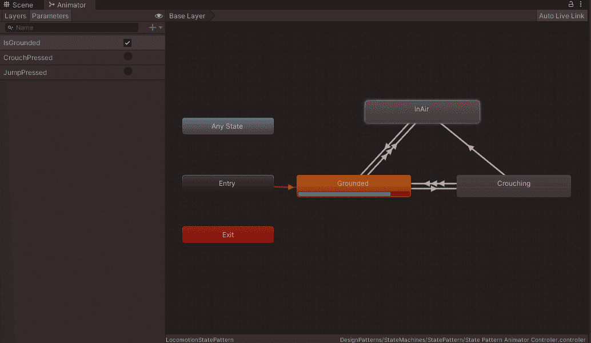
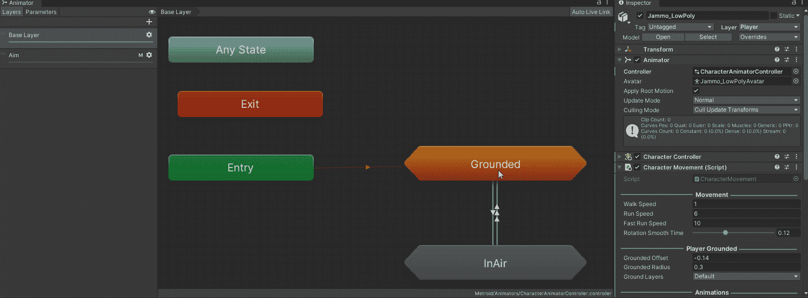
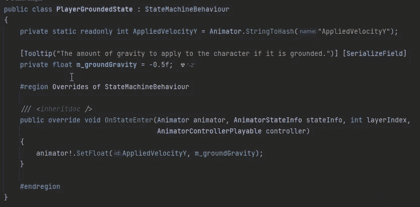

# 统一状态模式

> 原文：<https://blog.devgenius.io/state-pattern-in-unity-cd180f98c45?source=collection_archive---------5----------------------->

## 动画师控制器 FSM 和状态机行为

状态设计模式

状态模式接近于一个[有限状态机](https://ktmarine1999.medium.com/finite-state-machines-in-unity-950b912ce844)。状态模式通过使 FSM 更加面向对象和更加易读来改进它。上下文就是状态机本身，然后你就有了我们可能处于的状态，每个状态都是它自己的类。

在他们的书*中，设计模式:可重用面向对象软件*的元素，Erich Gamma，Richard Helm，Ralph Johnson 和 John Vlissides——*四人组*将状态模式的*意图*定义如下:

> "允许对象在其内部状态改变时改变其行为。该对象将显示为改变其类别。

## 定义

*   上下文-将具体状态的实例作为当前状态进行维护。这就是状态机本身。
*   抽象状态(State) —定义一个封装所有特定于状态的行为的接口。通常是接口，但也可以是抽象类或基类。
*   具体状态—实施特定于特定上下文状态的行为。抽象状态的子类。

# 履行

我要看一看运动状态，这和我在 FSM 文章中使用的是同一个状态。

## 纯代码。

我要实现的第一件事是上下文。我将使用一个接口，这样在创建状态时就不会有循环引用。我是说，移动上下文必须有一个名为 Set State 的方法，它接收状态接口的参数。

运动情境界面

接下来，我创建运动抽象状态，我将再次为此使用一个接口。通常状态有一个入口、一个出口和更新逻辑方法。你可以在这里添加任何你想让所有状态共有的方法，比如更新物理。

现在我可以完成上下文的实现了。这包含了我们当前所处的状态。当将状态设置为不同的状态时，我退出当前状态，将当前状态设置为新状态，我调用进入状态。在更新方法中，我调用了当前状态更新方法。

运动环境

现在，我可以创建任何我希望能够更改的状态，并将逻辑放入状态本身。

接地状态

蹲伏状态

在空气状态下

这比简单的 FSM 干净多了。如果我想添加一个新的状态，比方说游泳状态，我需要做的就是创建该状态，为游泳设置更新逻辑，我需要修改的唯一状态是我想转换到游泳状态的状态，我可以很容易地找到这些状态并添加新的逻辑。

## 使用动画组件。

通过使用 Unity 内置的 Animator 组件作为上下文和状态机行为(Unity 使用英式拼写行为)作为抽象状态，这可以进一步简化。

 [## 动画系统概述

### Unity 有一个丰富而复杂的动画系统(有时被称为“Mecanim”)。它提供:简单的工作流程…

docs.unity3d.com](https://docs.unity3d.com/Manual/AnimationOverview.html)  [## 状态机行为

### unity engine/Inherits from:ScriptableObject/建议更改感谢您帮助我们提高质量…

docs.unity3d.com](https://docs.unity3d.com/ScriptReference/StateMachineBehaviour.html) 

结合使用这些方法，我不必确保在状态上调用 Enter、Exit 或 Update 方法。单位为我处理所有这些。它还处理其他一些对您可能有用的消息。

第一步是设置动画控制器作为我的 FSM

然后，我向状态添加一个行为，我可以添加一个我已经创建的行为，也可以添加一个我已经创建的行为。我也可以有一个没有行为的状态。在这个例子中，我将为我所有的状态设置一个行为。

现在我要做的就是为我的状态创建具体的状态(状态机行为)。然后我重写了输入和更新方法。进入、退出和更新有多种选择，请根据需要选择。需要注意的一点是 OnStateMachine(进入/退出)和 OnState(进入/退出)之间的区别。当然你也有 Ik 和 Move 方法。

*   状态机进入时—转换到状态机时，在第一个更新帧时调用。当转换到状态机子状态时，不会调用这个函数。
*   状态机退出时—从状态机转换出来时，在第一个更新帧时调用。当转换到状态机子状态时，不会调用这个函数。
*   状态进入时—当状态机评估此状态时，在第一个更新帧上调用。
*   状态退出时—当状态机评估此状态时，在最后一个更新帧上调用。

创造接地行为

蛰伏状态行为。

空气状态下的行为

因为我的固定状态和蹲下状态是完全相同的代码，所以我可以对两者都使用固定行为。区别在于它们何时转换状态，这是由动画师控制器控制的。

你也可以为每个状态添加多个行为，例如，我有一个基于速度变量改变状态的运动状态，而不是固定状态，我可以将固定行为放在运动状态和蹲下状态上，因为这两种状态只有在角色固定时才会发生。然后放置一个移动行为。

## 真实世界的例子。

我的游戏中有一个角色有一个动画控制器和一个角色运动脚本。

我游戏里的一个角色。

动画师控制器由两个状态机组成，一个接地，一个在空中。地面状态机有一个附加的行为，跳转状态有一个附加的行为。

动画控制器

当“固定”行为进入状态时，会将 y 速度设定为设定值。

玩家接地行为

“跳跃状态”行为控制角色使用的跳跃、跳跃的高度以及在 y 轴上移动的方向。如果它进入状态，当它退出状态时，它会重置所有东西。

玩家跳跃状态行为

角色的移动基于给定的输入，它从 animator 状态机获得 Y 速度，并通过设置 is grounded boolean 告诉状态机角色是否被固定。

角色移动脚本工作正在进行中。

# 结论

状态模式使得实现复杂的状态机变得容易，这些状态机可以很容易地添加新的状态。

正确实施这也遵循所有坚实的原则。在示例代码中，我确实在技术上打破了接口隔离原则，在我的状态没有实际使用它们时，在接口中使用了 On Exit 和 On Enter 方法，如果我在游戏中完全实现它们，它们可能会有一些设置和清理代码，这样下次状态运行时就会有正确的本地值。单个状态(接地、空中、蹲下)可能会打破开闭原则，因为添加新的状态时，您可能需要修改这些类，以确保添加新的过渡，有几种方法可以解决这一问题，其中最简单的方法是使用 Unity 内置的动画系统。

内置的 Animator 控制器实际上使用了状态机模式。动画控制器是上下文，添加到其中的状态是使用抽象状态的具体状态，有 3 种不同类型的状态和添加到状态机的子状态机。控制器所处的不同状态可以通过使用状态机行为来进一步扩展。您可以在游戏中有多种类型的角色使用同一个 Animator 控制器，即使角色上的动画有很大不同(使用覆盖控制器)。

这个项目的代码可以在我的 Git Hub 页面上找到。

[https://github . com/JamesLaFritz/Design-Patterns-For-Unity/tree/release-state machines](https://github.com/JamesLaFritz/Design-Patterns-For-Unity/tree/release-StateMachines)