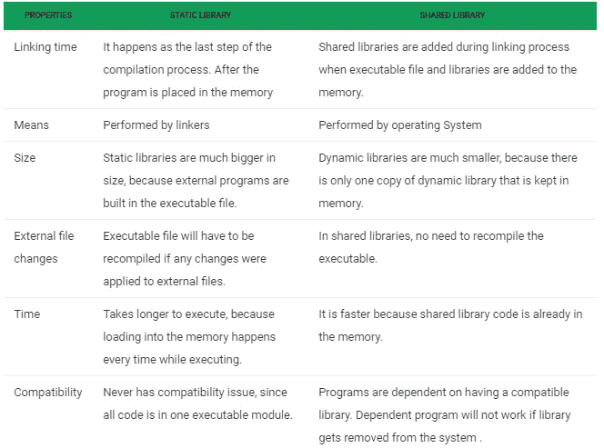

# 静态和动态库。它是什么，它们是如何制造的？

> 原文：<https://blog.devgenius.io/static-and-dynamic-libraries-what-is-it-and-how-they-are-made-d28e76520d20?source=collection_archive---------6----------------------->

库是一组可重用的函数。在编程中，重用资源是一种常见的做法，而库是其中必不可少的部分。

有静态库和动态库。静态库会将目标代码与您的主代码合并，这样会更快，因为它包含了函数的目标代码的完整副本，因此会使用更多的内存，并且在编译后无法更改。而动态库则是指其函数代码的内存位置，所以速度较慢，因为它搜索的是库文件路径。然而，它可以在执行前被容易地修改，并且不需要用你的主代码重新编译。

## 动态库创建(仅限 Linux)

1.  **gcc *。c-c-fpic
    来源**。应该为在动态库中使用准备好 c** 文件。因为几个程序可以使用一个动态库的实例，所以该库不能在固定地址存储数据。这是因为库在内存中的位置因程序而异。这是使用编译器标志 **-fpic** 完成的。由于我们需要在编译过程生成目标代码后应用这个步骤，所以必须指示编译器停止并返回一个对象(。o)每个源文件的文件。这是通过使用 **-c** 标志完成的。**
2.  **gcc * 0 -shared -o liball.so** 这是通过编译所有。o 文件使用-shared 标志。后来，当编译程序文件时，编译器通过查找以“lib”开头并以库扩展名(.所以对于动态来说，。a 表示静态)。因此，相应地命名库是很重要的。
3.  **导出 LD_LIBRARY_PATH = $ PWD:$ LD _ LIBRARY _ PATH**
    因为一个程序需要知道在哪里寻找库文件，我们必须将那个位置添加到 LD _ LIBRARY _ PATH 环境变量中。

## 创建静态库(仅限 Linux)

创建静态库要容易得多。首先，以与上面步骤 1 相同的方式创建目标文件。然后使用'**ar RCS liball . a***** . 0**'对库进行归档。你的程序应该包括你的库中存在的每个函数的原型。如果你为这些原型使用一个头文件，确保使用#include " <头文件>"在你的其他文件中包含这个文件的名字。

## 编译程序

**gcc-l .-Lall-o my _ program main . c**
在编译程序文件的时候，我们要告诉编译器使用库中的文件，在哪里可以找到这些文件。l '告诉它我们想要包含库文件。“all”告诉它寻找 liball.so 库。重要的是要留下' **lib** '和'**。因为编译器已经用这种方式识别了库文件。'告诉编译器它可以在当前目录中找到库文件。**

# 静态库和共享库的区别

来源:[https://www . geeks forgeeks . org/difference-between-static-and-shared-libraries/](https://www.geeksforgeeks.org/difference-between-static-and-shared-libraries/)

问题、评论或关注，欢迎在下方评论，关注我或在 Twitter @jcamilovillah 找到我。