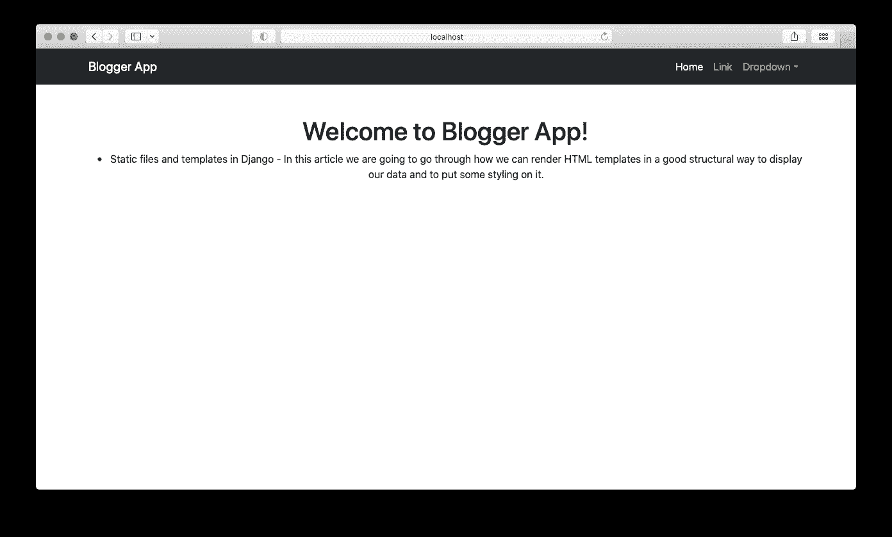

# Django 中的静态文件和模板

> 原文：<https://blog.devgenius.io/static-files-and-templates-in-django-aa4e08ad827?source=collection_archive---------1----------------------->


在这篇文章中，我们将介绍如何以一种良好的结构化方式呈现 HTML 模板，以显示我们的数据，并在其上添加一些样式。

通常我不使用 Django 来做这件事，但是当我们只是为了简单的目的想要快速创建一个网页的时候，可能会有方便的情况。我通常使用 Django 作为 RESTful 服务，然后在堆栈中添加 Angular 或 React，但这是在我们要构建更大的应用程序的情况下。我可能会在教程中讲解如何设置它，如果你想学习 Django REST 框架，请留下评论。

所以本教程将建立在我写的最新 Django 教程的基础上，所以如果你还没有克隆这个库的话，一定要克隆它:[https://github.com/mjovanc/medium-django](https://github.com/mjovanc/medium-django)

所以我们将使用名为**静态文件模板**的新分支，它是从**关系**分支创建的。

# 使用模板

让我们从 **settings.py** 中模板的当前设置开始:

```
TEMPLATES = [
    {
        'BACKEND': 'django.template.backends.django.DjangoTemplates',
        'DIRS': [**os.path.join(BASE_DIR, 'templates')**],
        'APP_DIRS': True,
        'OPTIONS': {
            'context_processors': [
                'django.template.context_processors.debug',
                'django.template.context_processors.request',
                'django.contrib.auth.context_processors.auth',
                'django.contrib.messages.context_processors.messages',
            ],
        },
    },
]
```

因此，我们在这里定义了如何处理模板的所有设置。在默认的 Django 安装中， **DIRS** 列表是空的，但是我们在这里设置我们想要从博客应用程序的根目录下加载模板，BASE_DIR 如下所示:

```
BASE_DIR = Path(__file__).resolve().parent.parent
```

这是我们目前的结构:

```
- blog
    - blog
        - __init__.py
        - asgi.py
        - settings.py 
        - urls.py
        - wsgi.py
    - main
        - migrations 
        - __init__.py
        - admin.py
        - apps.py
        - models.py
        - tests.py
        - views.py
    - templates
        - index.html
    - manage.py
    - db.sqlite3
```

因此，我们有一个名为 templates 的目录，我们将当前由我们的视图加载的**index.html**放在主应用程序目录中，该目录名为 **IndexView** ，位于基于类的视图的 **views.py** 中。

因此，如果我们愿意，我们可以添加更多的视图，指向目录中的另一个模板，或者我们也可以将这些模板放在应用程序中，就像这样，这样就可以工作了，因为我们已经将 **APP_DIRS** 设置为 true:

```
- blog
    - blog
        - __init__.py
        - asgi.py
        - settings.py 
        - urls.py
        - wsgi.py
    - main
        - migrations         
        - **templates**
            - **index.html**
        - __init__.py
        - admin.py
        - apps.py
        - models.py
        - tests.py
        - views.py
    - manage.py
    - db.sqlite3
```

所以我们不需要在根目录下的模板目录，但是通常你会在那里存储不属于特定应用程序的模板。对于这个例子，我们将使用模板的应用程序目录结构和根模板目录。

# 使用 Django 模板语言创建模板

现在我们有了一个非常基本的设置，我们将使用 Django 模板语言创建一个新的模板，这样我们可以节省时间并更容易地管理许多不同的模板文件。

首先在根目录下的模板目录中创建一个名为**base.html**的新文件，并将以下内容放入其中:

```


<!DOCTYPE html>
<html lang="en">
    <head>
        <meta charset="utf-8" />
        <meta name="viewport" content="width=device-width, initial-scale=1, shrink-to-fit=no" />
        <meta name="description" content="" />
        <meta name="author" content="" />
        <title>{{ SITE_TITLE }}</title>
        <link rel="icon" type="image/x-icon" href="" />
        <link href="https://cdn.jsdelivr.net/npm/bootstrap@5.1.3/dist/css/bootstrap.min.css" rel="stylesheet" integrity="sha384-1BmE4kWBq78iYhFldvKuhfTAU6auU8tT94WrHftjDbrCEXSU1oBoqyl2QvZ6jIW3" crossorigin="anonymous">
    </head>

    <body>
        <!-- Responsive navbar-->
        <nav class="navbar navbar-expand-lg navbar-dark bg-dark">
            <div class="container">
                <a class="navbar-brand" href="#">{{ SITE_TITLE }}</a>
                <button class="navbar-toggler" type="button" data-bs-toggle="collapse" data-bs-target="#navbarSupportedContent" aria-controls="navbarSupportedContent" aria-expanded="false" aria-label="Toggle navigation"><span class="navbar-toggler-icon"></span></button>
                <div class="collapse navbar-collapse" id="navbarSupportedContent">
                    <ul class="navbar-nav ms-auto mb-2 mb-lg-0">
                        <li class="nav-item"><a class="nav-link active" aria-current="page" href="#">Home</a></li>
                        <li class="nav-item"><a class="nav-link" href="#">Link</a></li>
                        <li class="nav-item dropdown">
                            <a class="nav-link dropdown-toggle" id="navbarDropdown" href="#" role="button" data-bs-toggle="dropdown" aria-expanded="false">Dropdown</a>
                            <ul class="dropdown-menu dropdown-menu-end" aria-labelledby="navbarDropdown">
                                <li><a class="dropdown-item" href="#">Action</a></li>
                                <li><a class="dropdown-item" href="#">Another action</a></li>
                                <li><hr class="dropdown-divider" /></li>
                                <li><a class="dropdown-item" href="#">Something else here</a></li>
                            </ul>
                        </li>
                    </ul>
                </div>
            </div>
        </nav>

        <!-- Page content-->
        <div class="container">
            <div class="text-center mt-5">
                <h1></h1>

                
            </div>
        </div>

        <!-- Bootstrap core JS-->
        <script src="https://cdn.jsdelivr.net/npm/bootstrap@5.1.3/dist/js/bootstrap.bundle.min.js" integrity="sha384-ka7Sk0Gln4gmtz2MlQnikT1wXgYsOg+OMhuP+IlRH9sENBO0LRn5q+8nbTov4+1p" crossorigin="anonymous"></script>
    </body>
</html>
```

我们这里有一堆东西要打开。我们稍微分解一下，把所有不是纯 HTML5 的东西都过一遍。

```

```

为了让我们使用一些额外的 Django 模板功能，如静态文件和国际化，这一行是必需的。我们稍后将讨论如何使用静态文件，但是现在导入它。

```
<head>
    <meta charset="utf-8" />
    <meta name="viewport" content="width=device-width, initial-scale=1, shrink-to-fit=no" />
    <meta name="description" content="" />
    <meta name="author" content="" />
    <title>{{ SITE_TITLE }}</title>
    <link rel="icon" type="image/x-icon" href="" />
    <link href="https://cdn.jsdelivr.net/npm/bootstrap@5.1.3/dist/css/bootstrap.min.css" rel="stylesheet" integrity="sha384-1BmE4kWBq78iYhFldvKuhfTAU6auU8tT94WrHftjDbrCEXSU1oBoqyl2QvZ6jIW3" crossorigin="anonymous">
</head>
```

在 header 标签中，我们在两个花括号内添加了 **SITE_TITLE** ,这样我们就可以呈现出下一步将在自定义上下文处理器中定义的值。然后我们定义一个叫做 **site_title_page** 的块，这样如果我们在另一个页面上，我们就可以在里面添加东西。在这种情况下，我们将添加我们当前所在的页面，这样我们可以更容易地在浏览器中看到它，而不仅仅是每个页面上的网站名称。

我们也有一个使用 Django 模板语言的文件静态导入，但是我们将在后面介绍。

然后在 navbar 中，我们也再次定义来呈现 SITE_TITLE:

```
<a class="navbar-brand" href="#">{{ SITE_TITLE }}</a>
```

在容器中，我们添加了以下内容:

```
<div class="container">
    <div class="text-center mt-5">
        <h1></h1>

        
    </div>
</div>
```

我们又添加了一个新的块，叫做 **page_content_title** ，这样我们就可以根据我们将在哪个页面上放置一个值。此外，我们还添加了一个名为 **page_content** 的块，我们将在其中放置页面的实际内容。

所以 base.html 的档案现在完成了。让我们转到自定义页面 index.html，并将其更改为以下内容:

```



Welcome to {{ SITE_TITLE }}!


<ul>
    
        <li>{{ bp.title }} - {{ bp.text }}</li>
    
</ul>

```

这里我们扩展了 base.html 文件，从该文件中获取所有内容，然后通过设置一个空的 site_title_page 来修改它，因为这是在索引页面上，所以我们不需要附加页面名称。然后，我们添加一个 page_content_title，并再次使用 SITE_TITLE 显示一条欢迎消息，其中包含我们的应用程序名称。

然后，我们向 page_content 块添加内容，这是上一个教程中的代码，我们只需遍历博客文章，并显示标题和文本。

太好了。我们已经完成了索引。让我们在 views.py 中创建一个名为 AboutPage 的新视图:

```
class AboutView(TemplateView):
    template_name = 'about.html'
```

这里我们不需要任何上下文数据。此时我们不需要从数据库中查询一些数据。现在复制文件 index.html，将其命名为 about.html，并将其放在与 index.html 相同的目录中。然后将视图添加到 urls.py:

```
from django.contrib import admin
from django.urls import path
from main.views import AboutView, IndexView

urlpatterns = [
    path('admin/', admin.site.urls),
    path('', IndexView.as_view(), name='index'),
    path('about/', AboutView.as_view(), name='about'),
]
```

现在我们有了一条使用 about 视图的新路径。我们将稍微修改一下 about.html，这样它就不会与 index.html 完全相同:

```


 - About Us
About Us


<p>Lorem ipsum dolor sit amet, consectetur adipiscing elit, sed do eiusmod tempor incididunt
    ut labore et dolore magna aliqua. Ut enim ad minim veniam, quis nostrud exercitation
    ullamco laboris nisi ut aliquip ex ea commodo consequat. Duis aute irure dolor in
    reprehenderit in voluptate velit esse cillum dolore eu fugiat nulla pariatur.
    Excepteur sint occaecat cupidatat non proident, sunt in culpa qui officia deserunt
    mollit anim id est laborum.
</p>

```

现在我们应该能够看到这些页面:


索引页


关于页面

我们还不能在标题中看到网站标题，因为我们还没有创建我们的上下文处理器，所以我们现在将开始讨论如何做。

# 上下文处理器

来自 Django 文档:

> `**context_processors**`选项是一个可调用列表——称为**上下文处理器**——它将一个请求对象作为参数，并返回一个要合并到上下文中的条目字典。

我们将添加一个自定义的上下文处理器，它将把网站的名称返回给我们所有的模板，这样我们就可以访问变量，并在需要的地方呈现它。那么我们如何创建一个定制的上下文处理器呢？我们首先在主应用程序中创建一个名为 **context_processors.py** 的新文件，并放入以下代码:

```
from django.conf import settings

def site_title(request):
    return {'SITE_TITLE': settings.SITE_TITLE}
```

非常简单的代码，但这只是从我们现在也需要定义的 **settings.py** 中返回了 **SITE_TITLE** 。转到 **settings.py** 并在某处添加:

```
SITE_TITLE = 'Blogger App'
```

现在我们还需要将自定义上下文处理器功能添加到我们的**模板**设置中:

```
TEMPLATES = [
    {
        'BACKEND': 'django.template.backends.django.DjangoTemplates',
        'DIRS': [os.path.join(BASE_DIR, 'templates')],
        'APP_DIRS': True,
        'OPTIONS': {
            'context_processors': [
                'django.template.context_processors.debug',
                'django.template.context_processors.request',
                'django.contrib.auth.context_processors.auth',
                'django.contrib.messages.context_processors.messages',
                **'main.context_processors.site_title'**,
            ],
        },
    },
]
```

现在我们重启服务器，因为我们想从 **settings.py** 加载新变量。我们试着打开我们的页面，看看它是否有效:



索引页


关于页面

太好了。有用！我们可以在两页的标题中看到标题，也可以在索引页的标题中看到标题！

# 添加链接

现在，我们将在 base.html 文件中添加链接到 URL/Views。这很容易做到。转到导航栏区域，将其更改为:

```
<nav class="navbar navbar-expand-lg navbar-dark bg-dark">
    <div class="container">
        <a class="navbar-brand" href="#">{{ SITE_TITLE }}</a>
        <button class="navbar-toggler" type="button" data-bs-toggle="collapse" data-bs-target="#navbarSupportedContent" aria-controls="navbarSupportedContent" aria-expanded="false" aria-label="Toggle navigation"><span class="navbar-toggler-icon"></span></button>
        <div class="collapse navbar-collapse" id="navbarSupportedContent">
            <ul class="navbar-nav ms-auto mb-2 mb-lg-0">
                <li class="nav-item"><a class="nav-link" href="">Home</a></li>
                <li class="nav-item"><a class="nav-link" href="">Link</a></li>
            </ul>
        </div>
    </div>
</nav>
```

我们在这里看到的是定义名为 index 的视图的 url 的模板语法:

```
<a class="nav-link" href="">Home</a>
```

此名称由 name 参数在 **urls.py** 中确定:

```
path('', IndexView.as_view(), name='index'),
```

因此，如果我们想改变路径或其他东西，我们不需要重写模板文件中的 url 链接。非常有用！

所以现在我们在头中有两个链接。


# 添加静态文件

静态文件可以像我们添加模板一样添加。或者在名为 static 的应用程序目录中，或者在名为 static 的根目录中。在本例中，我们将使用两者，因为有些文件是项目特定的，而不是应用程序特定的。

因此，让我们在主博客应用程序和应用程序的根目录中创建两个名为 **static** 的目录。然后在根目录下创建一个名为 **img** 和 **css** 的目录。我们不会在这里讨论 JavaScript 文件，但是处理这类文件的方式是一样的，所以没有必要。

现在下载这个文件或者你想要的任何东西，并把它放在静态/img 下的博客应用程序目录中:[https://ibb.co/1bgjDKW](https://ibb.co/1bgjDKW)

然后，在我们的**about.html**文件中，我们将在**页面 _ 内容**块中添加以下内容:

```

```

此外，在**about.html**的扩展下添加，以便我们加载能够加载静态文件的功能:

```

```

然后，我们还需要在我们的 **settings.py** 中添加一些额外的设置，以便它可以从应用程序目录中加载:

```
STATICFILES_DIRS = [
    os.path.join(BASE_DIR, 'static/'),
    os.path.join(BASE_DIR, 'main/static/'),
]
```

现在我们可以看到，当我们访问 about 页面时，我们可以提供静态文件:


关于页面

太好了！现在，我们将添加我们的自定义 CSS 以及特定的应用程序和项目。在根静态目录 **static/css/style.css** 中添加一个新文件，并将代码放入其中:

```
body {
    font-family: Verdana, Arial, Tahoma, Serif;
    font-size: 1em;
    color: #3C3C3C;
}
```

然后进入 base.html 的标题部分，添加:

```
<link rel="stylesheet" href="">

```

现在我们有一个名为 styles 的块，这样我们就可以根据我们所在的页面向样式表添加自定义链接，并且我们有一个默认的 style.css 文件，该文件在整个项目中总是被加载。

然后在 **main/static/css/main.css** 中创建一个新文件，并将它放入其中:

```
.about-img {
    border-radius: 10px;
}
```

在 about.html 的**内放置以下标签:**

```

    <link rel="stylesheet" href="">

```

现在，我们只需看一下页面就可以发现，它看起来有所不同:


索引页


关于页面

如果我们检查，我们还会看到它已经加载到文件 styles.css 和 main.css 以及其他文件:


检查“关于”页面

# 摘要

现在，您可能对如何使用 Django 处理静态文件和模板有了一些基本的了解。当然，你还可以做更多的事情，我建议你仔细阅读他们的文档，因为这是很好的解释和展示如何实现的例子。Django 周围也有一个巨大的社区，因此 Stackoverflow 有许多关于常见问题的答案，但是要注意许多答案都是旧的，并且总是先检查文档。

感谢您的阅读，别忘了在 LinkedIn 上关注我即将发布的文章和更多内容:[https://www.linkedin.com/in/marcuscvjeticanin/](https://www.linkedin.com/in/marcuscvjeticanin/)

# 参考

*   [https://docs . django project . com/en/4.0/ref/templates/language/](https://docs.djangoproject.com/en/4.0/ref/templates/language/)
*   [https://docs.djangoproject.com/en/4.0/ref/templates/api/](https://docs.djangoproject.com/en/4.0/ref/templates/api/)