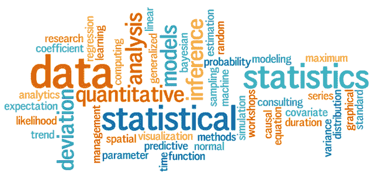

# 数据科学统计学

> 原文：<https://blog.devgenius.io/statistics-for-data-science-ddbc284d4016?source=collection_archive---------7----------------------->

## 为什么统计很重要？

在数据科学中，统计学是构建其他概念的核心基础。这是一种基于数学的方法，可以从大量复杂的数据中获得洞察力和知识。作为一名即将到来的商业智能分析师/数据分析师/数据科学家，你将处理和搅动大量的数字和数据，以产生组织所需的相关见解。数据科学领域的专业人士建议，拥有概率和统计学的基本知识对于从模型中得出结论是必不可少的。

photo credit:elitedata science . com

**我该如何学习统计学？**

在五月，我开始在 [Udacity](https://www.udacity.com/course/statistics--st095) 学习统计学:这门由圣何塞大学组织的课程对于那些想学习更多推断和描述统计学的人来说是一个很好的资源。本课程也将有助于区分使用总体或样本观察进行分析。它涵盖了以下基本内容:

*   使用均值、众数和中位数等集中趋势表示值(这是理解您正在处理的数据类型(无论是总体观察还是样本观察)所需的第一步)
*   使用谷歌电子表格进行分析
*   异常值对平均值、众数和中位数的影响以及如何处理异常值。
*   概率、假设检验、t 检验和 p 值
*   不同类型的分布，如均匀分布、正态分布、正态分布和负态分布
*   理解结构以及如何将结构转化为可测量的变量

如果您想过渡到机器学习，我强烈建议您尝试使用统计模型(至少了解线性回归、P 值、假设检验、相关性和不同类型的分布等基础知识)

除了学习它，还要了解它是如何工作的。当我开始学习线性回归时，我有几个问题需要澄清:

*   我在哪里应用线性回归？
*   线性回归适合什么样的问题？
*   它能解决什么？
*   它的局限性是什么？
*   它的利弊是什么？

**为什么要学统计学当数据科学家？**

*   有助于使用集中趋势(如平均值、众数、中位数)来表示值
*   分析数据分布的形状(如正态、正态、负态)
*   有利于可视化数据以了解趋势、模式和异常值(例如图形、地图、图表)
*   对于解释值的显著性非常重要(例如，p 值=< 0.05 具有统计显著性)
*   对执行预测分析(如线性回归)至关重要
*   显示数值(非分类)变量之间的关系(例如，散点图显示变量之间的相关性)
*   解释变量关系(例如*正相关/方向*:斜率向上，即 x 增加，y 增加，而*负相关/方向*:斜率向下，即 x 增加，y 减少)
*   形成了大多数机器学习算法的基础(例如，最小化梯度下降中使用的残差平方和)

虽然统计学是进入数据科学领域所需技能的一个子集，但在该领域取得成功还需要其他概念，例如:

*   领域知识
*   编程语言(R/Python)
*   研究
*   数据提取、争论和可视化

我希望这篇文章对你作为数据科学家的旅程中统计学的重要性有所帮助。虽然可能需要一段时间来学习和磨练这一技能，但将它作为您的数据科学武库中的一件武器是很棒的。