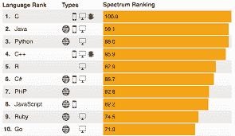
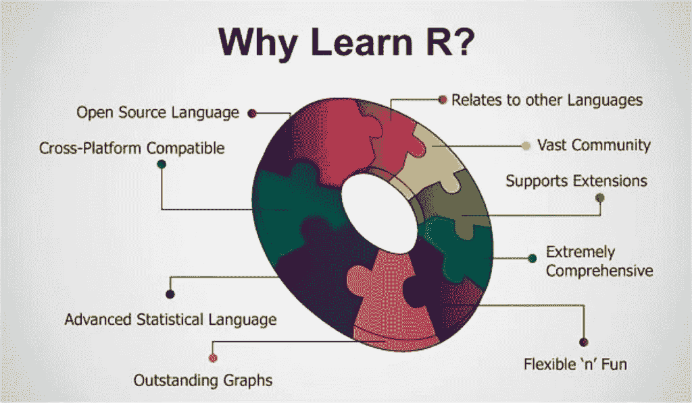

# Tech-R 语言中的统计学

> 原文：<https://blog.devgenius.io/statistics-in-tech-r-language-84b293f1efe9?source=collection_archive---------7----------------------->


## 介绍

R 可能是应用数学计算 R 基金会支持的应用数学计算和图形学的编程语言和免费软件包氛围。R 语言被统计学家和知识挖掘者广泛用于开发应用数学软件和知识分析。民意测验、数据处理调查和对知识文献数据库的研究显示，受欢迎程度将大幅提高；截至 2020 年 2 月，R 在 TIOBE 指数中排名第 13 位，这是对编程的认可。



官方的 R 软件系统 atmosphere 是一个角马包，主要是用 C、Fortran 和 R 本身编写的(因此，它是部分自托管的),在角马通用公共许可证下在市场上免费提供。为许多操作系统提供预编译的可执行文件。虽然 R 以命令界面为特色，但也有很多第三方图形用户界面，像 **R Studio** ，护理集成开发氛围中的 Associate，笔记本界面 Jupyter。



## 历史

r 是 S 编程语言结合词法作用域语言学的实现，被主题打动。s 是由约翰·钱伯斯在 1976 年创造的，而在贝尔实验室。他们的平方衡量一些必要的变化，然而许多为 S 编写的代码未经编辑就运行。

R 由新西兰城市中心大学的 **Ross Ihaka** 和议员先生创建，并由 R 开发核心团队开发(截至 2018 年 8 月，Chambers 是其中的一员)。该项目于 1992 年形成，1995 年发布了初始版本，2000 年第 29 个公历月发布了稳定的 beta 版本(1.0 版)。

## 统计学中的 r

r 及其库实现了大量的应用数学和图形技术，以及线性和非线性建模、经典应用数学测试、时序分析、分类、聚类等。通过函数和扩展，R 肯定是可扩展的，因此 R 社区以其在软件包方面的积极贡献而闻名。R 的几个常用函数是用 R 本身编写的单元，这使得用户可以直接遵循创建的递归决策。


对于计算密集型任务，C、C++和代数语言代码将在运行时被连接并称为。高级用户会写 C，C++，Java，。NET 或 Python 代码来直接管理 R 对象。通过利用用户提交的用于特定功能或特定研究领域的包，r 是非常可扩展的。由于它的 S 传统，R 比大多数应用数学计算语言具有更强的面向对象编程能力。扩展 R 还因其词法范围规则而减轻了负担。


**编程特性**

r 是一种解释语言，用户通常通过命令行解释程序来访问它。如果用户在 R 命令提示符下键入 2+2 并按 enter 键，计算机将回复 4，如下所示:

```
> 2 + 2
[1] 4
```

进行这种计算是因为将 2 个单元素向量相加，得到一个单元素向量。前缀表示在等价行上跟在它后面的组件列表从向量的主要部分开始(这个特性在输出扩展到多行时很有用)。

与 APL 和 MATLAB 等类似语言一样，R 支持矩阵运算。r 的知识结构体现了向量、矩阵、数组、知识框架(类似于非常相关的数据库中的表)和列表。数组区域单元按列优先顺序排列。r 的可绘制对象系统包括(除其他外):回归模型、时间序列和地理空间坐标。标量知识排序从来不是 r 的信息结构，相反，标量被描述为长度为 1 的向量。


R 的很多选项都来源于主题。r 使用 S 表达式来表示每个知识和代码。功能区域单元非常奇妙，可以用与知识对象相同的方法进行操作，便于元编程，并允许多重调度。R 区域单元中的变量是按字典作用域和动态编写的。perform 参数 area unit lapsed worth 和 area unit lazy——也就是说，{它们 area unit | they 在使用后才进行计算，而不是在 perform 被命名后。

r 支持使用函数的过程化编程，对于一些函数，支持使用通用函数的面向对象编程。否则，泛型 perform 会对传递给它的参数类别下注。换句话说，通用 perform 分派特定于其对象类别的 perform(方法)。例如，R 包含一个通用打印执行程序，它可以用简单的打印(对象名)语法打印 R 中的几乎每一类对象。


尽管主要由需要应用数学计算和代码开发环境的统计学家和其他从业者使用，

r 也可以作为一个通用的矩阵计算工具——性能基准崇拜羚羊倍频程。

谢谢大家！！！