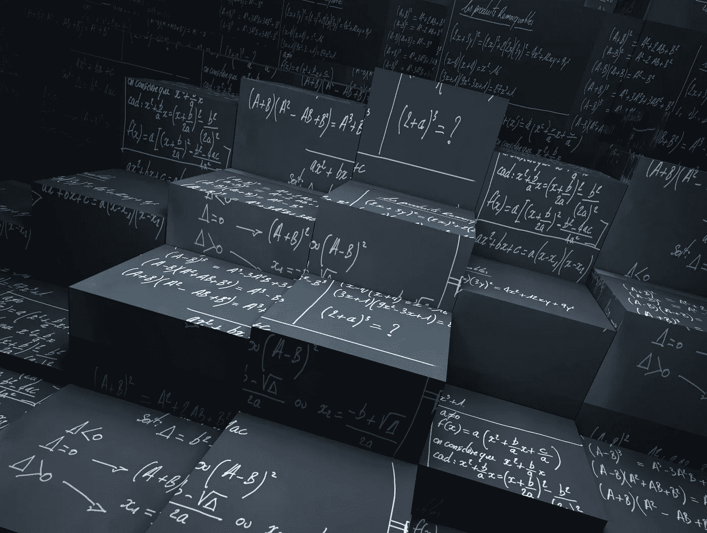
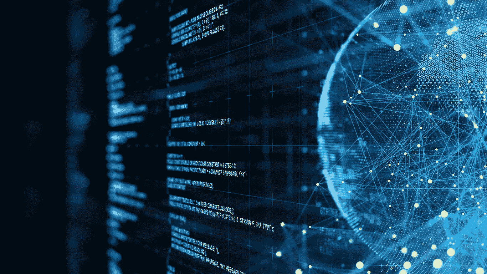

# 统计是有用的，原因如下

> 原文：<https://blog.devgenius.io/statistics-is-useful-and-here-are-the-reasons-c991c0977485?source=collection_archive---------4----------------------->

它甚至比想象的还要有用。

自从统计学的创立、形成和第一次数学证明以来，它已经成为一门至关重要的学科，从数据分析到构建现代技术，它被应用于各个方面。在这里，我们将概述统计有用的原因。

## 1-这是数据的语言

统计学的第一个定义是“数据的语言”当大量数据被用数学方法分析和解释时，这变得更加明显。但是你仍然通过观察数据来做出解释和决策。这就是它在分析中变得不同的地方，因为在数学分析中，当应用相同的方法时，结果具有相同的解释。

## 2-它让你成为所有事情的专家

这可能是陈词滥调。但是，当我们考虑到统计数据在每个职业领域都被使用的事实时，这几乎是真的。如果数据来源是经过验证的，并且是按照方法进行解释的，那么人们会受益匪浅。此外，你不必了解商业领域，也不必对研究中获得的数据做出所有的解释。

## 3-帮助你理解现代技术

区块链、大数据、人工智能，还有很多都榜上有名。但是它们都有一些共同点:它们都需要某种程度的统计学来理解。所有现代技术都需要一种概率来理解它们的概念。但是理解统计学可以让你成为所有技术的专家，或者如果你选择专注于其中一项，它可以让你对技术有很好的了解。但是，如果你的领域需要，你可能需要学习另一种技术。尽管如此，与这些领域的人们所说的相比，统计学知识让你更快地理解它们。

*你如何看待统计数据？你用过统计学吗？在下面的评论区分享你的想法和经历。*