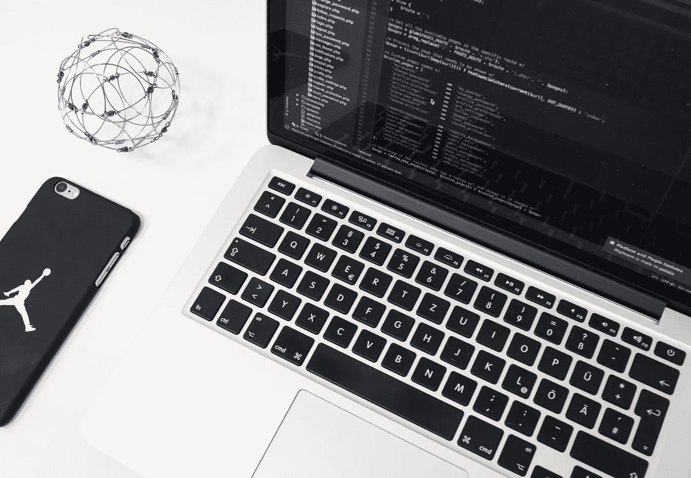
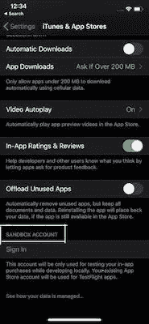
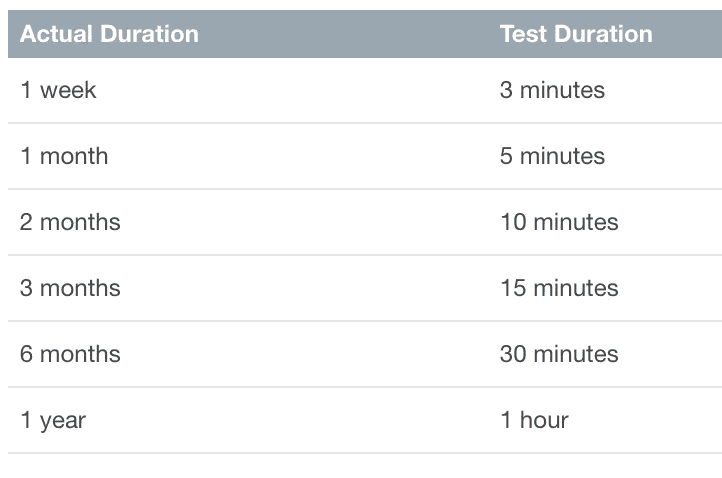

# iOS 订阅测试分步指南

> 原文：<https://blog.devgenius.io/step-by-step-guide-for-ios-subscription-testing-50851cea8953?source=collection_archive---------0----------------------->

[Unsplash](https://unsplash.com/s/photos/swift-programming?utm_source=unsplash&utm_medium=referral&utm_content=creditCopyText) 上 [AltumCode](https://unsplash.com/@altumcode?utm_source=unsplash&utm_medium=referral&utm_content=creditCopyText) 拍摄的照片

测试订阅和开发订阅一样具有挑战性。在本文中，我们将回顾订阅测试的完整过程。

首先，要进行任何类型的订阅测试，您需要创建一个沙盒测试帐户:

1.  登录到您的 [iTunes Connect 帐户- >用户并访问- >沙盒- >测试员](https://appstoreconnect.apple.com/access/testers)来创建新的测试员。
2.  在您的设备中，进入设置-> iTunes & App Store ->注销当前帐户，不要在此处登录沙盒测试器帐户

**注意**:不要使用您的测试用户帐户登录生产环境。如果您这样做，沙盒帐户将变得无效，并且不能再使用。

# 订阅测试的类型

# 1.沙盒测试

沙盒测试可以分为两种，一种是 ***开发者沙盒*** 另一种是 ***生产沙盒*** *。*如果你从 Xcode 运行你的应用，那么订阅测试在开发者沙箱上运行。然而，如果你已经通过 *testflight* 发布了你的应用，那么订阅测试将在生产沙箱上运行。

登录 iTunes & App Store 下的沙盒帐户，如下图所示:

登录沙盒帐户后，您就可以测试您的订阅了。

**沙盒测试内的订阅持续时间:**

订阅期限已缩短，以方便测试，允许开发人员测试多次购买、续订和到期。

自动续订套餐最多可自动续订 6 次，之后过期。

# 测试步骤:

**测试购买、自动续费和到期**:

假设您的订阅是 1 年期自动续订订阅:

1.  订阅您的应用内订阅。
2.  关闭应用程序并在 1 小时后打开它，以确保您的应用程序仍处于活动订阅状态。
3.  关闭应用程序并在大约 6 小时后再次打开，您的应用程序应重置为退订状态。发生这种情况是因为沙盒环境自动更新订阅多达 6 次。

**测试有效订阅的恢复购买:**

沙盒环境中的一个主要缺点是，在购买订阅之前，设备上没有收据文件，而在生产环境中，一旦应用程序安装在设备上，就会形成收据文件。

1.  订阅您的自动续费套餐。
2.  删除设备上的应用程序。
3.  重新安装 app，按下 ***恢复购买*** 按钮。
4.  如果在订阅测试持续时间内完成了所有这些步骤，那么应该恢复活动订阅，否则，应该向用户显示一条关于没有找到活动订阅的消息。

**在多个设备上测试恢复购买:**

1.  使用相同的沙盒帐户登录设备 A 和 B。
2.  在设备 a 上订阅您的订阅。
3.  在设备 b 上安装应用程序。
4.  启动设备 B 上的应用程序，并按下 ***恢复购买*** 按钮。

# 试飞测试

由 TestFlight 发布的应用程序将自动使用 ***生产沙箱*** 环境。所有测试步骤将与开发沙盒环境保持一致。

生产试验

对于一个尚未在 App Store 上发布的应用程序，获得该应用程序的早期版本是测试订阅的一个很好的方式。

# 投产前生产测试

1.  为此，你需要将该应用的测试版提交给苹果审查。不要忘记将*版本发布*设置为*手动发布。*
2.  从 iTunesConnect 生成应用程序的促销代码。
3.  使用促销代码，从 App Store 下载应用程序。
4.  订阅您的订阅。由于该应用程序得到了苹果公司的批准(尽管尚未发布)，它仍将与 live 应用程序一样运行。

# 沙盒可靠性

众所周知，开发者沙盒是不可靠的。出于某种原因，苹果从未修复它，或者它可能不知道不一致。无论哪种方式，如果不是一直有效，不要有压力。

# 重要提示

*   套餐最多可自动续订 6 次，到期后自动失效。用户无法更改此行为。
*   在进行购买之前，沙盒环境中没有可用的购买收据。
*   测试人员在开发或生产沙盒环境中完成的购买不会被收费

# 参考资料:

[测试订阅购买量](https://help.apple.com/app-store-connect/#/dev7e89e149d)

[使用 Xcode 和沙盒测试订阅](https://developer.apple.com/documentation/storekit/in-app_purchase/testing_at_all_stages_of_development_with_xcode_and_sandbox)