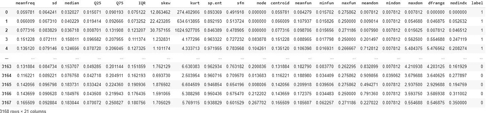
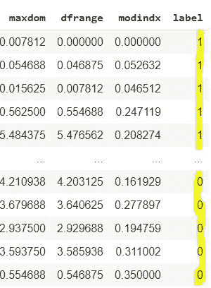
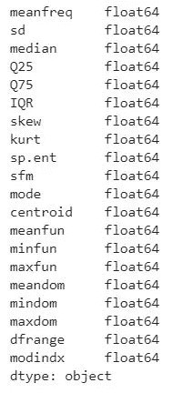
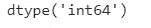
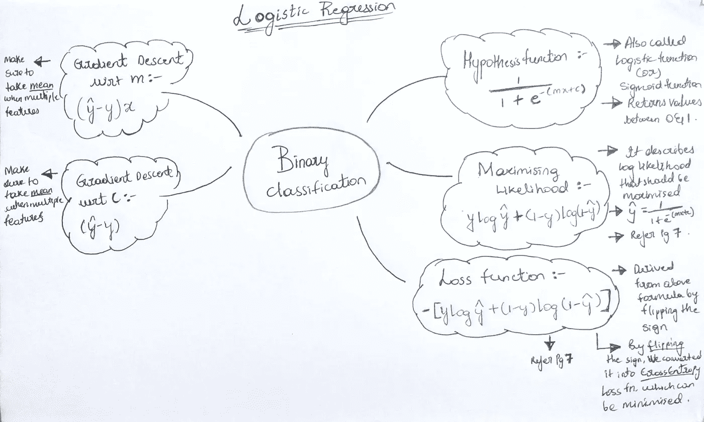
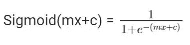
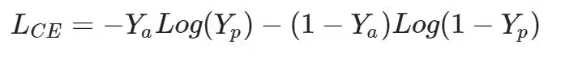
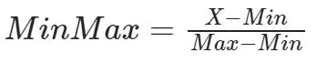
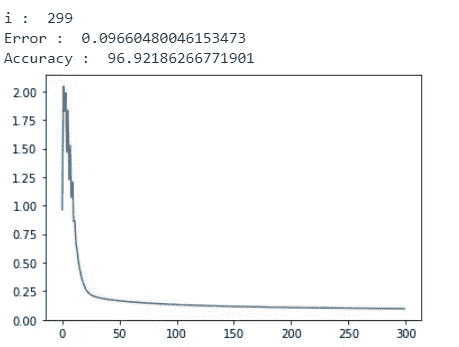
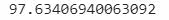

# 从零开始的逻辑回归

> 原文：<https://blog.devgenius.io/step-by-step-implementation-of-logistic-regression-on-gender-voice-classifcation-dataset-from-535671cb281c?source=collection_archive---------6----------------------->

> 使用 numpy 和 pandas 实现性别语音分类数据集。


在 [Unsplash](https://unsplash.com?utm_source=medium&utm_medium=referral) 上由 [Austin Distel](https://unsplash.com/@austindistel?utm_source=medium&utm_medium=referral) 拍摄的照片

> N 注:这篇文章没有解释逻辑回归是如何工作的，但是清楚地解释了它的从头实现。文章末尾提供了源代码。

> "在所有的不眠之夜和对大脑有害的上瘾中，我来写下我的第一篇文章."迪加拉·安。

## 内容:

1.  本教程的目标
2.  了解数据集
3.  准备数据集
4.  分割数据集
5.  定义函数
6.  标准化特征
7.  准备梯度下降
8.  检查测试数据集的准确性

> 在开始之前，我不希望你被写的大量代码或理论弄得不知所措。只是坐下来，放松，耐心地阅读。

# ***1。本教程的目标***

我们将根据一个人的声音对其性别进行分类。我们要用到的数据集可以从这里下载，[https://www.kaggle.com/primaryobjects/voicegender](https://www.kaggle.com/primaryobjects/voicegender)

# 2.了解数据测试

该数据集包括 3，168 个记录的声音样本，从男性和女性说话者那里收集。总共有 21 列，20 个特征和 1 个标记男性和女性的目标列。



具有 3168 行、21 列的数据集

> 我们现在不会详细讨论每个特性，那最终会让你更害怕。如果你想知道更多关于每个特性的信息，请点击上面的链接。

# 3.准备数据集

> 注意:这段代码是用 Google colab 写的。(建议查看者也这样做)
> 
> 我们现在正在经历预处理步骤，如果你已经知道如何做或者觉得无聊，就直接跳到实现。(即)D **定义功能**

我们将从**导入库**开始，

```
import numpy as npimport pandas as pdimport matplotlib.pyplot as pltimport random
```

**从**、[https://www.kaggle.com/primaryobjects/voicegender](https://www.kaggle.com/primaryobjects/voicegender)下载数据集

(确保您已登录您的 kaggle 帐户进行下载)

将下载一个 zip 文件，将您的 zip 文件上传到 colab。你可以分两步完成，

1)手动使用 colab 中的上传选项


colab 内部的上传选项

2)使用代码

```
from google.colab import filesup = files.upload()
```

现在，上传你的压缩文件。

上传后，使用命令解压文件，

```
!unzip voicegender.zip
```

现在我们用熊猫来读取数据集，

```
data = pd.read_csv('voice.csv')
```

## **编码**

现在我们将标签的列编码为 0(女性)和 1(男性)。

```
data['label'] = data['label'].replace(['male','female'],[1,0])
```

> 现在，只需输入代码 **print(data)** 来检查数据值是否已被编码
> 
> **注意**:该数据集中没有损坏或丢失的值。如果您还想检查，可以通过运行 **data.isnull()来完成。sum()**

## 洗牌

现在，当您可视化数据集时，您可以看到，在“标签”列中，所有值都按**降序排列**。(这在训练过程中不会产生太大影响，但我们很快就会分割我们的数据集，因此会产生问题)



未起泡的标签

因此，我们将使用 pandas dataframe 的 **sample** 函数**重排**我们的行。

```
data = data.sample(frac=1).reset_index(drop=True)
```

> 到目前为止，您已经成功准备了数据集。希望到目前为止还不算太无聊。你看到的任何疑惑或技术术语，都写在评论里，我会马上帮你。让我们继续前进吧！！！！

> 再坚持一会儿，我们将分两步开始真正的实现。非常重要的是，我们应该涵盖这些步骤，以保持我们的实现干净，没有任何错误。

# 4.分割数据集

现在我们要分割数据集，

*80%的数据用于训练*

*20%的数据用于测试*

> ！！！！！！！！！！！！！！！！！！！！！**术语预警**！！！！！！！！！！！！！！！！！！！！！
> 
> **为什么分裂？！**
> 
> 在建立任何模型之前，分割数据集是必要的，因为它为我们提供了关于我们的模型在它从未训练过的数据上表现如何的信息。
> 
> 例子:一名学生在准备他的数学考试。他在数学考试中的表现取决于他对数学考试的准备程度。这里的训练数据是他的准备，测试数据是他考试当天的试卷。

我们将使用下面的代码分割数据，

```
train_data = data.iloc[:2534]test_data = data.iloc[2534:]
```

> 为什么 **2534** ？！
> 
> 数据中共有 3168 行，
> 
> 我们已经决定，我们的训练集将采用 80%的数据，而测试集将采用 20%。所以 3168 乘以 80%的时候。(即) **3168 * (80/100) = 2534**

## **特性和目标**

现在我们将为训练集和测试集创建目标和特征变量。

```
x_train = train_data.drop(['label'],axis=1)
y_train = train_data['label']x_test = test_data.drop(['label'],axis=1)
y_test = test_data['label']
```

> 注意: **axis = 1** 掉列， **axis = 0** 掉行(相信我，一开始我对此很困惑)

现在让我们通过运行来检查 **x_train** 中每一列的 **dtypes** (数据类型),

```
x_train.dtypes
```



x_train.dtypes

你会看到所有的都是浮动的。现在我们将检查 **y_train，**的数据类型

```
y_train.dtypes
```



y_train 的数据类型

你会看到 **y_train** 是在**【int 64】**dtype 中，我们将把这个 dtype 转换成“ **float64** ”以避免将来出现任何错误。(最好所有列都是相同的数据类型)

```
y_train = y_train.astype('float64')
y_test= y_test.astype('float64')
```

**Numpy 数组**

让我们将我们的目标和特征变量转换成 numpy 数组，因为这将使我们更容易进行矩阵运算。

```
x_train = np.asarray(x_train)
y_train = np.asarray(y_train)x_test = np.asarray(x_test)
y_test = np.asarray(y_test)
```

> **好吧……..我们完了！！！！！**
> 
> 我们现在可以完全专注于实施。我真的很高兴你能坚持到这里。芝士蛋糕。！！！！！！！

# 5)定义功能



逻辑回归的简单思维导图|作者

> 注意:这里的权重和偏差用 **m 和 c** 表示，与大多数地方不同，这里用 **w 和 b** 表示

让我们从定义一个函数开始，

```
def line(m,x,c):
    return np.dot(m,x.T)+c
```

现在为 sigmoid 假设函数定义一个函数，



sigmoid 函数公式

```
def sigmoid(m,x,c):
    p = line(m,x,c)
    nr = 1
    dr = 1+np.exp(-(p)) return nr/dr
```

定义成本函数，



LCE 丹特交叉熵损失函数。Ya 是实际值，Yp 是预测值

```
def cost(m,x,c,y):
    p = sigmoid(m,x,c)
    d = 0.00999 return np.mean(-(y*np.log(p+d)+(1-y)*np.log(1-p+d)))
```

> 我们在上面的 log(p) 中添加了 **d，因为当预测值 p 为 **0** 时，那么 **log(0)** 往往会变成**未定义的**，所以为了避免这种情况，我们添加了一个小值 d(这样它永远不会变成 0)。**

定义关于 m 的梯度(导数),

```
def grad_m(m,x,c,y):
    p = sigmoid(m,x,c) return np.mean((p - y).T*x,axis=0)
```

> 如果你对检查 m 和 c 的导数是如何得到的感兴趣，你可以检查这个 pdf 并向下滚动到第 17 页，[https://web.stanford.edu/~jurafsky/slp3/5.pdf](https://web.stanford.edu/~jurafsky/slp3/5.pdf)

现在定义相对于 c 的梯度(导数)，

```
def grad_c(m,x,c,y):
    p = sigmoid(m,x,c) return np.mean(p - y)
```

> 好吧，我已经看到你昏昏欲睡，你的头在旋转，你的思想在偏离…你该休息一下了，以后再继续。或者如果你感觉良好，那么继续……

我们还会定义一个准确度函数来看看我们的预测有多准确，

```
def accuracy(m,x,c,y):
    y_pred=sigmoid(m,x,c)
    ### As y_pred in our case can be any value between 0 to 1
    ### We're equating them when y_pred >= 0.5 to '1' and y_pred < 0.5 to '0'
    y_pred[y_pred>=0.5]=1
    y_pred[y_pred<0.5]=0
    correct=len(y_pred[y_pred==y]) return (correct/len(y.T))*100
```

这个准确度函数是正确预测值与实际值总数的比率乘以 100，因此你会得到一个数值准确度的分数。

> 如果你不理解上面的函数，没关系，这只是为了发现你的预测有多准确。你可以用它来解决将来的分类问题。

# 6)归一化特征

归一化特征非常重要，因为这些值非常大，当您以**0–1**的间隔获得这些值时，训练将变得容易，离群值大多会被忽略。

归一化可以用多种方式进行，我们将使用，**最小-最大归一化，**



最小最大归一化公式

```
def dataset_minmax(dataset):
    minmax = list()
    for i in range(len(dataset[0])):
        col_values = [row[i] for row in dataset]
        value_min = min(col_values)
        value_max = max(col_values)
        minmax.append([value_min, value_max])
    return minmax# Rescale dataset columns to the range 0-1
def normalize_dataset(dataset, minmax):
    for row in dataset:
        for i in range(len(row)):
            row[i] = (row[i] - minmax[i][0]) / (minmax[i][1] - minmax[i][0])
```

> 资料来源:machinelearningmastery.com

上面的代码采用了两个函数，其中，**第一个函数返回每个特征列的最小值和最大值**，而**第二个函数对所有特征列应用最小最大归一化。**

> 完全没关系，如果你不理解上面的功能，它们真的不重要。如果你知道如何应用最小最大，那么你可以自己做，或者你可以直接使用上面的函数，如果你已经有了最小最大如何工作的直觉。

现在让我们对训练和测试特性都应用标准化，

```
# Applying normalization on training features
x_train_min_max = x_train.copy()
normalize_dataset(x_train_min_max,dataset_minmax(x_train_min_max))# Applying normalization on testing features
x_test_min_max = x_test.copy()
normalize_dataset(x_test_min_max,dataset_minmax(x_test_min_max))
```

# 7)准备梯度下降


启动梯度下降引擎的时间…..(嘟嘟嘟嘟……)

现在让我们用 **9 步进行梯度下降(LOL，这很简单)**，

1.  为记录所有错误的**初始化一个空数组**
2.  初始化**随机 m 和 c 值**
3.  初始化一个**学习率**值 5
4.  用 **300 个周期初始化一个循环**
5.  **用梯度(导数)减去 m 和 c 值，更新 m 和 c 值**
6.  **将**成本值追加到空的**错误数组**
7.  还算出了**的准确度**
8.  **将**误差值**和精度值**打印到控制台
9.  将误差图可视化

> 注意:上述所有步骤在下面的代码中都用数字注释掉了

```
from IPython.display import clear_output
# Run all the below code, without the above line, you'll see the difference it makes(Nothing important to explain about it)# 1)
error = []# 2)
m = np.random.randn(1,20)
c = random.random()# 3)
lr = 5# 4)
for i in range(300): # 5)
    m = m - lr*grad_m(m,x_train_min_max,c,y_train)
    c = c - lr*grad_c(m,x_train_min_max,c,y_train) # 6)
    error.append(cost(m,x_train_min_max,c,y_train)) clear_output(True) # 7)
    print("i : ",i) print("Error : ",cost(m,x_train_min_max,c,y_train)) # 8)
    print("Accuracy : ",accuracy(m,x_train_min_max,c,y_train)) # 9)
plt.plot(error)
plt.show()
```



错误图表|按作者

正如你在上面看到的,**成本降低了**,我们达到了 **96 的精确度。49661 . 68868688661**

好了，现在让我们检查一下我们的模型在它从未见过的数据(测试集)上的表现。

(搞笑结局 GIF 在此)

# 8)检查测试数据集的准确性

我们可以使用我们的精度函数在测试集上检查我们的模型的精度，

```
accuracy(m,x_test_min_max,c,y_test)
```



输出

你可以看到我们的模型在测试集上表现得非常好，这太棒了！！！！！！

总之，我们在训练集和测试集上都取得了 97%的准确率，

1.  一千个时代
2.  最小-最大归一化特征

> 太好了，你成功地走到了最后。


我在这里看到你感觉就像

好吧，这是我的第一篇文章，希望你喜欢，我会在未来的某个时候用 UI 制作一个实时**性别声音分类器。如果你跟着我，我会让你保持更新！**

如果你有任何疑问，请在下面的评论中告诉我。

**源代码**:[https://github . com/AdityaNikhil/Logistic-Regression/blob/master/Logistic _ Regression _ Gender _ voice _ class ification _ dataset . ipynb](https://github.com/AdityaNikhil/Logistic-Regression/blob/master/Logistic_Regression_Gender_voice_Classification_Dataset.ipynb)

> 谢谢大家！！！