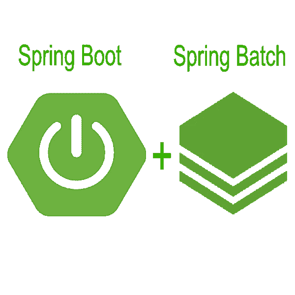
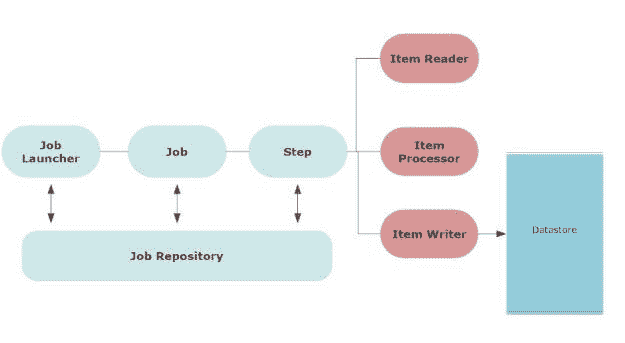
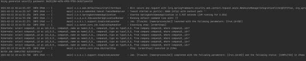
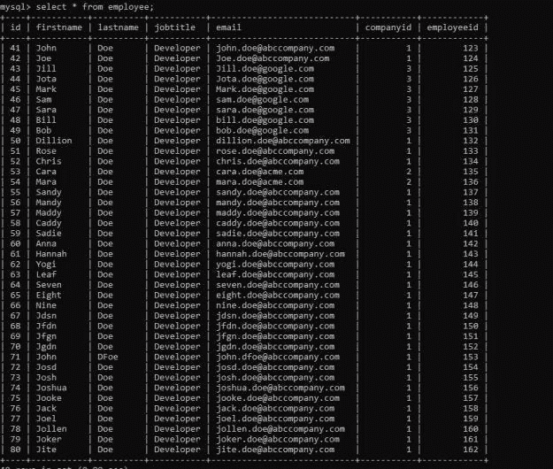

# 分步春批教程

> 原文：<https://blog.devgenius.io/step-by-step-spring-batch-tutorial-577dbb3d8641?source=collection_archive---------0----------------------->



在这篇文章中，我想展示如何使用 Spring Batch。这是一个循序渐进的春季批量教程。

在企业应用程序中，批处理很常见。但随着数据在互联网上变得越来越普遍，我们如何处理这些数据也变得很重要。有多种解决方案可供选择。Apache Storm 或 [Apache Spark](https://spark.apache.org/) 帮助处理和转换所需格式的数据。在本帖中，我们将更近距离地观察 Spring Batch。

# 什么是春批？

**Spring Batch 是一个轻量级框架，旨在方便批处理**。它允许开发人员创建批处理应用程序。反过来，这些批处理应用程序处理传入的数据，并对其进行转换以供将来使用。

使用 [Spring 批处理](https://spring.io/projects/spring-batch)的另一个很大的优势是它允许高性能地处理这些数据。对于严重依赖数据的应用程序，数据立即可用至关重要。

Spring Batch 允许开发人员使用基于 POJO 的方法。在这种方法中，开发人员可以将批处理的数据转换成数据模型，以便进一步用于应用程序业务逻辑。

在这篇文章中，我将介绍一个例子，在这个例子中，我们将为员工记录批处理一个数据密集型 CSV 文件，并转换、验证该数据以加载到我们的数据库中。

# 什么是批处理？

批处理是一种数据处理模式。它包括消费所有数据、处理数据、转换数据，然后将其发送到另一个数据源。通常，这是通过自动化作业完成的。触发系统或用户触发作业，该作业处理作业定义。作业定义将是关于从其来源消费数据。

批处理的主要优点是它可以处理大量的数据。然而，这个操作可以是异步的。大多数应用程序独立于实时用户交互执行批处理。

接下来，我们将了解 Spring Batch 框架及其组成。

# Spring 批处理框架

下面的架构展示了 Spring Batch 框架的组件。



首先，批处理涉及到一个作业。用户安排作业在特定时间或基于特定条件运行。这也可能涉及到作业触发器。

Spring 批处理框架还包括

*   记录和跟踪
*   事务管理
*   作业处理统计
*   作业重启
*   资源管理

通常，当您配置作业时，它将保存在作业存储库中。**作业库**保存所有作业的元数据信息。触发器在预定时间启动这些作业。

**作业启动器**是在作业的预定时间到达时启动作业或运行作业的界面。

**作业**由作业参数定义。当作业启动时，会为该作业运行一个作业实例。作业实例的每次执行都有作业执行，它跟踪作业的状态。一个作业可以有多个步骤。

**步骤**是作业的独立阶段。一个作业可以由多个步骤组成。与作业类似，每个步骤都有执行步骤并跟踪步骤状态的步骤执行。

每一步都有一个基本上读取输入数据的**项读取器**，一个处理并转换数据的**项处理器**，以及一个获取处理后的数据并将其输出的**项写入器**。

现在，让我们看看演示中的所有组件。

# 带示例的分步 Spring 批处理教程

作为演示的一部分，我们将通过 Spring Batch Framework 上传一个 csv 文件。因此，首先，创建 spring 项目并添加以下依赖项:

```
implementation 'org.springframework.boot:spring-boot-starter-batch'
```

这是我们项目的主要依赖。此外，我们的主要应用程序将如下所示:

```
package com.betterjavacode.springbatchdemo; import org.springframework.boot.SpringApplication; 
import org.springframework.boot.autoconfigure.SpringBootApplication;@SpringBootApplication 
public class SpringbatchdemoApplication 
{ 
   public static void main(String[] args) 
   { 
      SpringApplication.run(SpringbatchdemoApplication.class, args);
   } 
}
```

# 创建 DTO 对象

我将通过 CSV 文件上传员工数据，因此我将为员工创建如下 DTO 对象:

```
package com.betterjavacode.springbatchdemo.dtos; import com.betterjavacode.springbatchdemo.models.Company; 
import com.betterjavacode.springbatchdemo.models.Employee; 
import com.betterjavacode.springbatchdemo.repositories.CompanyRepository; import org.springframework.beans.factory.annotation.Autowired; 
import java.io.Serializable;public class EmployeeDto implements Serializable 
{ 
   private static final long serialVersionUID = 710566148641281929L; 

  @Autowired 
  public CompanyRepository companyRepository; 
  private int employeeId; 
  private int companyId; 
  private String firstName; 
  private String lastName; 
  private String email; 
  private String jobTitle; 
  public EmployeeDto() { }   public EmployeeDto(int employeeId, String firstName, String lastName, String email, String jobTitle, int companyId) 
  { 
    this.employeeId = employeeId; 
    this.firstName = firstName; 
    this.lastName = lastName; 
    this.email = email; 
    this.jobTitle = jobTitle; 
    this.companyId = companyId; 
  } 

  public Employee employeeDtoToEmployee() 
  { 
     Employee employee = new Employee(); 
     employee.setEmployeeId(this.employeeId); 
     employee.setFirstName(this.firstName); 
     employee.setLastName(this.lastName); 
     employee.setEmail(this.email); 
     Company company = companyRepository.findById(this.companyId).get(); 
    employee.setCompany(company); 
    employee.setJobTitle(this.jobTitle); 
    return employee; 
  } 

  public int getEmployeeId () 
  {
    return employeeId; 
  }   public void setEmployeeId (int employeeId) 
  { 
    this.employeeId = employeeId; 
  } public int getCompanyId () 
  { 
    return companyId; 
  }  public void setCompanyId (int companyId) 
  { 
    this.companyId = companyId; 
  } 

  public String getFirstName () 
  { 
    return firstName; 
  }   public void setFirstName (String firstName) 
  { 
    this.firstName = firstName; 
  }   public String getLastName () 
  { 
    return lastName; 
  }    public void setLastName (String lastName) 
   { 
     this.lastName = lastName; 
   }    public String getEmail () 
   { 
     return email; 
   }    public void setEmail (String email) 
   { 
     this.email = email; 
   }    public String getJobTitle () 
   { 
     return jobTitle; 
   } 

   public void setJobTitle (String jobTitle) 
   { 
     this.jobTitle = jobTitle; 
   } 
}
```

这个 DTO 类也使用一个存储库`CompanyRepository`来获取一个公司对象并将 DTO 转换成一个数据库对象。

# 设置弹簧批次配置

现在，我们将为我们的作业设置一个批处理配置，它将运行以将 CSV 文件上传到数据库中。我们的类`BatchConfig`包含一个注释`@EnableBatchProcessing`。这个注释启用了 Spring 批处理特性，并提供了一个基本配置来在一个`@Configuration`类中设置批处理作业。

```
@Configuration 
@EnableBatchProcessing 
public class BatchConfig 
{ }
```

该批处理配置将包括我们作业的定义、作业中涉及的步骤。它还将包括我们希望如何读取我们的文件数据并进一步处理它。

```
@Bean 
public Job processJob(Step step) 
{ 
  return jobBuilderFactory.get("processJob") 
    .incrementer(new RunIdIncrementer()) 
    .listener(listener()) 
    .flow(step)
    .end().build(); 
} @Bean 
public Step orderStep1(JdbcBatchItemWriter writer) 
{ 
   return stepBuilderFactory.get("orderStep1").<EmployeeDto, EmployeeDto> chunk(10) 
      .reader(flatFileItemReader())
      .processor(employeeItemProcessor()) 
      .writer(writer).build(); 
}
```

以上豆申报工作`processJob`。`incrementer`添加作业参数。`listener`会倾听工作并处理工作状态。`listener`的 bean 将处理作业完成或作业失败通知。正如 Spring Batch architecture 中所讨论的，每个作业都包含不止一个步骤。

`@Bean` for step 使用`stepBuilderFactory`创建一个步骤。该步骤处理大小为 10 的数据块。它有一个平面文件阅读器`flatFileItemReader()`。处理器`employeeItemReader`将处理平面文件项读取器读取的数据。

```
@Bean 
public FlatFileItemReader flatFileItemReader() 
{ 
   return new FlatFileItemReaderBuilder() 
    .name("flatFileItemReader") 
    .resource(new ClassPathResource("input/employeedata.csv")) 
    .delimited() 
    .names(format) 
    .linesToSkip(1) 
    .lineMapper(lineMapper()) 
    .fieldSetMapper(new BeanWrapperFieldSetMapper(){{ setTargetType(EmployeeDto.class); }}) 
    .build(); 
} @Bean 
public LineMapper lineMapper() 
{ 
   final DefaultLineMapper defaultLineMapper = new DefaultLineMapper<>(); 
   final DelimitedLineTokenizer delimitedLineTokenizer = new DelimitedLineTokenizer(); 
   delimitedLineTokenizer.setDelimiter(","); 
   delimitedLineTokenizer.setStrict(false); 
   delimitedLineTokenizer.setNames(format); 
   defaultLineMapper.setLineTokenizer(delimitedLineTokenizer); 
   defaultLineMapper.setFieldSetMapper(employeeDtoFieldSetMapper); 
   return defaultLineMapper; 
} @Bean 
public EmployeeItemProcessor employeeItemProcessor() 
{ 
   return new EmployeeItemProcessor(); 
} @Bean 
public JobExecutionListener listener() 
{ 
   return new JobCompletionListener(); 
} @Bean 
public JdbcBatchItemWriter writer(final DataSource dataSource) 
{ 
    return new JdbcBatchItemWriterBuilder() 
      .itemSqlParameterSourceProvider(new BeanPropertyItemSqlParameterSourceProvider<>()) 
      .sql("INSERT INTO employee(employeeId, firstName, lastName, jobTitle, email, " + "companyId) VALUES(:employeeId, :firstName, :lastName, :jobTitle, :email," + " " + ":companyId)") .dataSource(dataSource) 
      .build(); 
}
```

现在，我们将看一看每一个 beans。

`FlatFileItemReader`将从平面文件中读取数据。我们使用 FlatFileItemReaderBuilder 来创建类型为`EmployeeDto`的 FlatFileItemReader。

`resource`表示文件的位置。

`delimited` -这构建了一个分隔符号化器。

`names` -将显示文件中字段的顺序。

`lineMapper`是从文件到域对象映射行的接口。

`fieldSetMapper`将字段集中的数据映射到一个对象。

`lineMapper` bean 需要标记器和 fieldsetmapper。

`employeeDtoFieldSetMapper`是我们在这个类中自动连接的另一个 bean。

```
package com.betterjavacode.springbatchdemo.configurations.processor;import com.betterjavacode.springbatchdemo.dtos.EmployeeDto; 
import org.springframework.batch.item.file.mapping.FieldSetMapper; import org.springframework.batch.item.file.transform.FieldSet; import org.springframework.stereotype.Component; 
import org.springframework.validation.BindException;@Component 
public class EmployeeDtoFieldSetMapper implements FieldSetMapper 
{ 
    @Override 
    public EmployeeDto mapFieldSet (FieldSet fieldSet) throws BindException 
    { 
      int employeeId = fieldSet.readInt("employeeId"); 
      String firstName = fieldSet.readRawString("firstName"); 
      String lastName = fieldSet.readRawString("lastName"); 
      String jobTitle = fieldSet.readRawString("jobTitle"); 
      String email = fieldSet.readRawString("email"); 
      int companyId = fieldSet.readInt("companyId"); 
      return new EmployeeDto(employeeId, firstName, lastName, jobTitle, email, companyId); 
    } 
}
```

如您所见，这个 FieldSetMapper 将字段映射到单个对象，以创建一个`EmployeeDto`。

`EmployeeItemProcessor`实现接口`ItemProcessor`。基本上，在这个类中，我们验证`EmployeeDto`数据以验证雇员所属的公司是否存在。

`JobCompletionListener`检查作业完成状态。

```
@Override 
public void afterJob(JobExecution jobExecution) 
{ 
   if (jobExecution.getStatus() == BatchStatus.COMPLETED) 
   { // Log statement 
     System.out.println("BATCH JOB COMPLETED SUCCESSFULLY"); 
   } 
}
```

现在，我们来看看`ItemWriter`。这个豆基本用的是`JdbcBatchItemWriter`。`JdbcBatchItemWriter`使用 **INSERT** sql 语句将处理后的`EmployeeDto`数据插入到配置好的数据源中。

# 配置应用程序属性

在我们运行应用程序来处理文件之前，让我们看一下`application.properties`。

```
spring.datasource.url=jdbc:mysql://127.0.0.1/springbatchdemo?autoReconnect=true&useSSL=false 
spring.datasource.username = root spring.datasource.password=******* spring.datasource.driver-class-name=com.mysql.cj.jdbc.Driver spring.jpa.show-sql=true 
spring.jpa.properties.hibernate.dialect = org.hibernate.dialect.MySQL5Dialect spring.datasource.hikari.connection-test-query=SELECT 1 spring.batch.initialize-schema=ALWAYS
```

除了常规的数据源属性，我们还应该了解属性`spring.batch.initialize-schema=ALWAYS`。如果我们不使用这个属性并启动应用程序，应用程序将会抱怨`Table batch_job_instance doesn't exist`。

为了避免这个错误，我们基本上是告诉在启动时创建批处理作业相关的元数据。该属性将在您的数据库中创建额外的数据库表，如`batch_job_execution`、`batch_job_execution_context`、`batch_job_execution_params`、`batch_job_instance`等。

# 演示

现在，如果我执行我的 Spring Boot 应用程序，它将运行并执行作业。触发作业有不同的方式。在一个企业应用程序中，你将在某种存储位置(S3 或亚马逊 SNS-SQS)接收一个文件或数据，你将有一个监视这个位置的作业来触发文件加载 Spring 批处理作业。



您可以在执行中看到一条关于作业完成的消息—“批处理作业成功完成”。如果我们检查我们的数据库表，我们会看到加载的数据。



你可以从我的 [github 库](https://github.com/yogsma/springbatchdemo)下载这个演示的代码。

# 还有什么？

我这里覆盖了一个春批教程，但这还不是全部。Spring Batch 不仅仅是这个介绍性的部分。您可以有不同的输入数据源，也可以使用不同的数据处理规则从一个文件加载到另一个文件。

还有一些方法可以自动执行这些作业，并以高效的方式处理大量数据。

# 结论

在这篇文章中，我展示了一步一步的 Spring 批处理教程。有许多方法可以处理批处理作业，但是 Spring Batch 使这变得非常容易。

在其他新闻中，我最近发布了我的新书——简化 Spring 安全。如果你想了解春天的安全，你可以在这里购买《T4》一书。伴随这本书的还有这篇 [Spring Boot 面试问题](https://betterjavacode.com/spring-boot/top-21-spring-boot-interview-questions)的帖子，你将为你的下一次工作面试做好准备。

*原载于 2021 年 2 月 13 日 https://betterjavacode.com**的* [*。*](https://betterjavacode.com/spring-boot/step-by-step-spring-batch-tutorial)