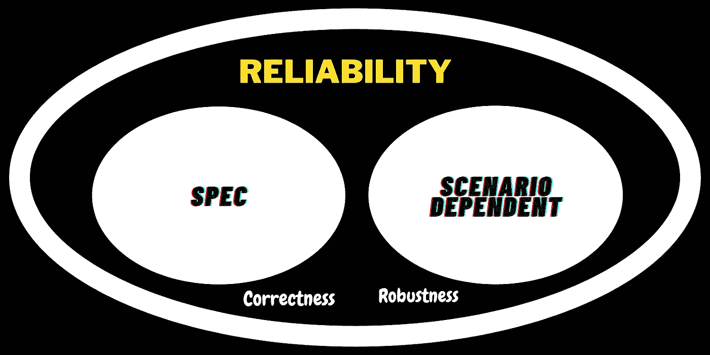
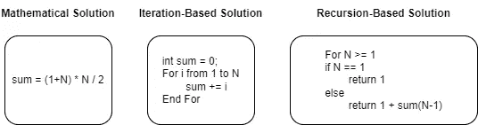
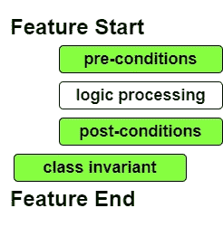

# 通过合同进行内部设计

> 原文：<https://blog.devgenius.io/step-inside-design-by-contract-a06a7a49271f?source=collection_archive---------3----------------------->

# 可靠性的本质

> **软件开发的最终目的是让一个程序无需任何维护就能运行。**

*这看起来神奇而不可实现，对吗？事实上，我们能够通过应用各种敏捷方法来帮助团队设计可验证的软件，从而接近目标。*

*在现实条件下，由于意外的异常，软件失败的代价是非常昂贵的，因此我们致力于寻求可靠的软件。试着想象你正在操纵一台自动取款机，并试图存入你的现金。如果你的余额没有像预期的那样增加或者操作中系统崩溃了怎么办？这将是引起用户抱怨的破坏性故障。*

*此外，软件本身是昂贵的建设过程中，所以我们希望它是可重复使用的。我敢打赌，没有人会接受他们购买的东西，比如一个应用程序或在线服务，非常不稳定，很容易崩溃。*

*契约式设计是一种标准化的综合方法，是构建可靠软件的保证。*

# *可靠软件的组件*

**

*可靠性范围*

*那么我们如何定义软件为**可靠**？在进入一个具体的定义之前，您可以花一些时间考虑一下可靠的软件应该具有什么样的属性。也许是低延迟、更好的吞吐量、可维护性或者长时间运行而不崩溃，等等。*

*我将属性分为两组:**正确性&健壮性**。*

*   ***正确性** : **输出总是由相应的输入产生。**简而言之，**软件的行为符合规范的要求。***

*举一个描述这个概念的例子，假设一个客户希望我们编写一个简单的加法器，对从 1 到 n 的数字求和，作为一名软件工程师，您能提供多少种解决方案来满足这个要求？*

**

*嗯，以上 3 种解决方案能够满足对数字求和的需要，因此据说它们基于预定义的规范提供了正确性。*

*然而，正确性并不能实现可靠的软件。如果我们考虑影响用户体验的其他因素，它仅仅达到了可靠性目标的一半。要使它完整，还需要一些其他的规则。*

*   *健壮性:软件以可接受的方式工作，这取决于场景。*

*从简单加法器的例子中，我们看到，即使一个规格得到满足，其性能也可能由于不同的场景而达不到客户的期望。因此，正确性软件需要其他标准来平衡客户和供应商之间的差距。重要的是如何定义稳健性。*

*如果客户希望简单的加法器快速，数学解决方案是他的最佳选择。*

*如果一个客户通常不需要求和得出一个大的数字，那么一个基于迭代的解决方案可以满足他的期望，而不需要支付更多的费用。*

*如果客户只想要一个便宜的解决方案，而不关心加法器的性能，基于递归的解决方案直接满足了他的需求。*

# *合同形式*

*合同表明客户和供应商都要遵守的一套规则，旨在确保服务的可靠性。在软件工程中， [Eiffel](https://en.wikipedia.org/wiki/Eiffel_(programming_language)) 编程语言中提出了**契约设计(DBC)** 的概念，以保证开发的软件具有内在的可靠性。*

*在深入了解 DBC 的含义之前，让我们先看一下合同视图，以指明一些重要的条款:*

*   ***前置条件***

***前置条件规定，在程序能够正确工作之前，一组规则必须为真**。*

*似乎很抽象，对吧？让我们举个例子来阐明它的含义。如果我们要设计一个具有如下几种功能的时钟:*

*这里我设计了一个函数 **setHour** 来配置时间。然而，如果一个客户应用一个错误参数来设置一个时钟的小时，比如 25，该怎么办呢？由于其后的无效参数，时钟可能表现不正确。为了防止这种情况发生，我们需要添加一些规则来确保客户端遵循预定义的共识，以便时钟功能可以执行其逻辑。*

*   ***后置条件***

***后置条件声明一组规则在执行后必须为真**。*

*让我们关注之前的时钟示例，一旦我们设置了前提条件，我们确定的是一个特性有足够的能力来执行它的逻辑。但这并不意味着处理结果可以满足我们的期望，我们需要做进一步的检查。在本例中，设置结果应该与提供的参数相同。因此，我们添加了一个进一步的检查规则来检查结果。*

*通过这种方式，我们可以确保逻辑被成功执行，并且得到预期的结果。*

*   ***类不变量***

***类不变量表示某些规则在所有关键时刻对于一个类的所有实例都必须为真**。*

*回头看看时钟的例子，虽然现在我们确定 setHour 函数在执行后必须正确工作，小时、分钟、秒的属性应该被限制在一个合理的范围内，这一点在任何时候都必须成立。为了保证这一点，进一步检查类不变量的完整性。*

*这个术语有点难以解释，因为有些人必须用先决条件来混淆它。两者相似，但在实践中有所不同。前者试图确保客户端行为正确，而后者确保对象状态在合理的范围内。*

*要描绘 DBC 的全貌，请参考下面的表格:*

**

# *合同——责任和利益*

*按照自然的想法，合同本身定义了客户和供应商双方应该遵守的责任和义务。如果一方不遵守起草的规则，合同应该做出相应的反应以应对例外情况。*

*实际上，一方承担的责任就是另一方获得的利益，反之亦然。我们可以再次以时钟为例来描述客户(购买时钟的用户)和供应商(开发时钟模块的工程师)之间的关系。*

# *蔻驰杂音*

*我知道许多工程师都在寻求软件的可靠性。但到目前为止，没有人告诉我什么是衡量可靠性水平的更好方法。契约式设计的概念为我们提供了一种工具，以一种实用的方式来确定我们工作的可靠性。*

*理论上，它是用 Eiffel 编程语言提出的，理想情况下，我应该用 Eiffel 编写代码，从本质上解释它是什么样子。但是 [Eiffel Studio](http://www.eiffel-ig.com) 是一个商业软件，我需要额外的预算来熟悉它。在下面的文章中，我将尝试其他语言中的概念，以展示它如何保证内置的可靠性，并从它的角度回顾面向对象的 basic。*

*—*

*如果你承认我与你分享的价值，请做如下:
1。**拍**条
2。**为我订阅**最新内容
3。**在其他平台关注**我了解更多信息
-IG:[@ ur _ Agile _ coach](https://www.instagram.com/ur_agile_coach/)
-播客(中文):[敏捷火箭](https://player.soundon.fm/p/7f7dc3df-d738-405c-8cf9-02157a92ec61)
- Youtube: [你的敏捷蔻驰](https://www.youtube.com/channel/UCzD0wQmD1n4MuTKk-JocACA)
- LinkedIn: [吴宗祥](https://www.linkedin.com/in/tsung-hsiang-wu-8542409b/)*

*如果您需要咨询或其他形式的合作，请发送邮件至:**urscrummaster@gmail.com***