# 逐步执行 PostgreSQL

> 原文：<https://blog.devgenius.io/stepping-through-postgresql-f40990685a56?source=collection_archive---------11----------------------->

Postgres 是世界上最受欢迎、最常用和最受欢迎的数据库之一，我们中的一些人想看看它是如何创造奇迹的，这是毫无疑问的。在寻找相同的东西时，我惊讶地发现，通过逐步完成 postgres 后端过程，浏览 Postgres 代码库是多么容易。本文可以作为快速探索 postgres 代码库的参考指南。

注意:我强烈建议您在阅读本文时设置一个测试机器(vm)并运行实时 Postgres 系统。

**GDB 快速指南**

1.  要附加到一个进程:*sudo GD b-p<PID>*
2.  附加断点:*中断<文件> : <行号>*
3.  运行到断点: *c*
4.  单步*进入*功能: *s*
5.  步骤*越过*功能: *n*
6.  打印一个值: *p <变量>或 *p * <变量>**
7.  调用函数:*调用<func>*
8.  打印 postgres 节点:*调用 pprint( < mem 地址> )*
9.  按下*回车*键重复上一条命令。

注意:在阅读本文时，您可能会迷路，在这种情况下，请完成当前的执行，在您应该在的函数上添加一个新的断点，执行查询并再次运行调试器。

# **设置**

让我们克隆最新的 postgres(在我的例子中是 16devel)并用调试符号构建它。在开始之前，确保你有合适的构建工具(gcc 通过 build-essentials 等)。

```
git clone [https://git.postgresql.org/git/postgresql.git](https://git.postgresql.org/git/postgresql.git)# I highly recommend checking out this commit so that
# functions/files which I mention here remains consistent
git checkout 5543677ec90a15c73dab5ed4f0902b3b920f0b87./configure   --enable-debug
make -j4
sudo make installsudo adduser postgres
sudo mkdir /usr/local/pgsql/data
chown postgres /usr/local/pgsql/data# start postgres with output to stdout (keep this terminal open)
/usr/local/pgsql/bin/postgres -D /usr/local/pgsql/data 
```

准备 psql 客户端:

```
sudo su postgres# create a dummy db
/usr/local/pgsql/bin/createdb test# open psql
/usr/local/pgsql/bin/psql test
```

创建一个虚拟表并插入一些值:

```
create table t(id int);insert into t values(1);
insert into t values(2);
insert into t values(10);
```

Postgres 主后端进程在 src/backend/tcop/postgres.c 中的 *PostgresMain* 处定义，后端进程的初始化发生在这里。让我们读一点代码。

```
InitPostgres(dbname, InvalidOid,   /* database to connect to */
username, InvalidOid,  /* role to connect as */
!am_walsender, /* honor session_preload_libraries? */
false,         /* don't ignore datallowconn */
NULL);         /* no out_dbname */
```

主循环:

```
for (;;)
{...
```

设置连接状态

*set _ PS _ display(" idle in transaction ")*或 *set_ps_display("idle")* 取决于*IsTransactionOrTransactionBlock()。*

诸如此类。

我们现在可以走了，让我们开始吧:

```
SELECT pg_backend_pid();
```

这将为我们提供 postgres 后端进程 id。我们将把它附在 gdb 上。

在新终端中，运行

```
sudo gdb -p <pid from above>
```

它应该正确加载调试符号:

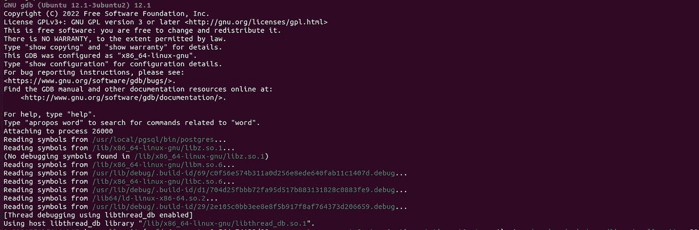

添加断点，例如*first char = read command(&input _ message)*其中位于 src/back end/tcop/postgres . c:4483

```
break src/backend/tcop/postgres.c:4483
```

在 psql 中，运行一些查询，比如:

```
select * from t where id > 1 and id < 10;
```

你可以选择*继续*到断点(按 c)或者观察事情如何从头开始(继续按 n)。

在后一种情况下，您会看到一些 WaitEvents 和网络 i/o 来接收输入包。

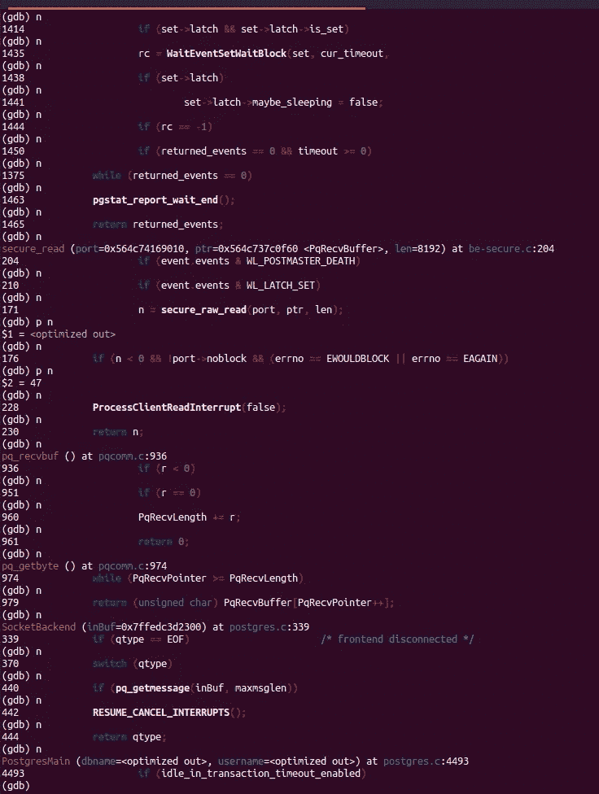

您可以继续按 n(或按 enter)并观察控制流。你会注意到很多*检查中断*()。

中断处理在 src/backend/tcop/postgres.c 中的 *ProcessInterrupts* 中定义。

不管怎样，继续吧。

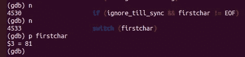

打印首字符

还记得*first char = read command(&input _ message)吗？*它读取我们的输入并转储*first char*(81)

十进制 81 是 ASCII 中的字符 Q。

```
switch (firstchar)
  {
   case 'Q':   /* simple query */
    {
     const char *query_string;/* Set statement_timestamp() */
     SetCurrentStatementStartTimestamp();query_string = pq_getmsgstring(&input_message);
     pq_getmsgend(&input_message);if (am_walsender)
     {
      if (!exec_replication_command(query_string))
       exec_simple_query(query_string);
     }
     else
      exec_simple_query(query_string);send_ready_for_query = true;
    }
    break;
```

在这里，我们要去的情况' Q '。我们可以在这里验证我们的查询字符串。

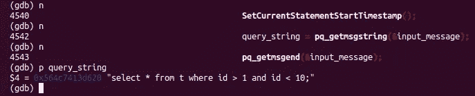

最后*exec _ simple _ query(query _ string)*被调用。我们需要介入此事(新闻界)

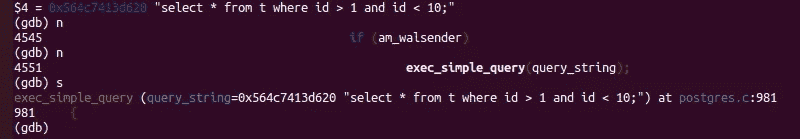

两步，你就会找到 pgstat _ report _ activity(STATE _ RUNNING，query_string)。pgstat_report_activity 在 src/back end/utils/activity/back end _ status . c 中定义。

后端状态被定义为枚举:

```
typedef enum BackendState
{
 STATE_UNDEFINED,
 STATE_IDLE,
 STATE_RUNNING,
 STATE_IDLEINTRANSACTION,
 STATE_FASTPATH,
 STATE_IDLEINTRANSACTION_ABORTED,
 STATE_DISABLED
} BackendState;
```

这可以方便地转换成在 src/back end/utils/ADT/pgstatfuncs . c 中定义的 pg_stat_get_activity()中的常用符号。

```
switch (beentry->st_state)
   {
    case STATE_IDLE:
     values[4] = CStringGetTextDatum("idle");
     break;
    case STATE_RUNNING:
     values[4] = CStringGetTextDatum("active");
     break;
    case STATE_IDLEINTRANSACTION:
     values[4] = CStringGetTextDatum("idle in transaction");
     break;
    case STATE_FASTPATH:
     values[4] = CStringGetTextDatum("fastpath function call");
     break;
    case STATE_IDLEINTRANSACTION_ABORTED:
     values[4] = CStringGetTextDatum("idle in transaction (aborted)");
     break;
    case STATE_DISABLED:
     values[4] = CStringGetTextDatum("disabled");
     break;
    case STATE_UNDEFINED:
     nulls[4] = true;
     break;
   }
```

好的，查询状态正在运行。

我们到达 *start_xact_command* (在 src/backend/tcop/postgres.c 中定义)

```
/*
 * Convenience routines for starting/committing a single command.
 */
static void
start_xact_command(void)
{
 if (!xact_started)
 {
  StartTransactionCommand();xact_started = true;
 }/*
  * Start statement timeout if necessary.  Note that this'll intentionally
  * not reset the clock on an already started timeout, to avoid the timing
  * overhead when start_xact_command() is invoked repeatedly, without an
  * interceding finish_xact_command() (e.g. parse/bind/execute).  If that's
  * not desired, the timeout has to be disabled explicitly.
  */
 enable_statement_timeout();/* Start timeout for checking if the client has gone away if necessary. */
 if (client_connection_check_interval > 0 &&
  IsUnderPostmaster &&
  MyProcPort &&
  !get_timeout_active(CLIENT_CONNECTION_CHECK_TIMEOUT))
  enable_timeout_after(CLIENT_CONNECTION_CHECK_TIMEOUT,
        client_connection_check_interval);
}
```

好吧，有道理。继续前进，我们遇到了 *memoryContext* ，它切换到了*未命名的预准备语句(*非常简洁)！继续前进，直到到达*parsetree _ list = pg _ parse _ query(query _ string)*

调用 n(而不是单步执行，因为我们不打算查看解析是如何工作的)和 *p parsetree_list* 来获取它的地址。现在让我们打印 parsetree。

*调用 pprint(<mem _ address>)*并查看 postgres 进程的输出。

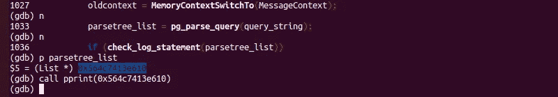

在 postgres 后端标准输出中:

```
(
   {RAWSTMT 
   :stmt 
      {SELECTSTMT 
      :distinctClause <> 
      :intoClause <> 
      :targetList (
         {RESTARGET 
         :name <> 
         :indirection <> 
         :val 
            {COLUMNREF 
            :fields (
               {A_STAR
               }
            )
            :location 7
            }
         :location 7
         }
      )
      :fromClause (
         {RANGEVAR 
         :schemaname <> 
         :relname t 
         :inh true 
         :relpersistence p 
         :alias <> 
         :location 14
         }
      )
      :whereClause 
         {BOOLEXPR 
         :boolop and 
         :args (
            {A_EXPR 
            :name (">")
            :lexpr 
               {COLUMNREF 
               :fields ("id")
               :location 22
               }
            :rexpr 
               {A_CONST 
               :val 1 
               :location 27
               }
            :location 25
            }
            {A_EXPR 
            :name ("\<")
            :lexpr 
               {COLUMNREF 
               :fields ("id")
               :location 33
               }
            :rexpr 
               {A_CONST 
               :val 10 
               :location 38
               }
            :location 36
            }
         )
         :location 29
         }
      :groupClause <> 
      :groupDistinct false 
      :havingClause <> 
      :windowClause <> 
      :valuesLists <> 
      :sortClause <> 
      :limitOffset <> 
      :limitCount <> 
      :limitOption 0 
      :lockingClause <> 
      :withClause <> 
      :op 0 
      :all false 
      :larg <> 
      :rarg <>
      }
   :stmt_location 0 
   :stmt_len 40
   }
)
```

这是原始的解析树(称为抽象语法树，简称 AST)。让我们继续前进，直到到达*raw stmt * parsetree = lfirst _ node(raw stmt，parsetree_item)*

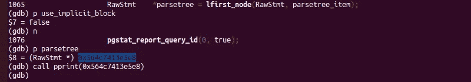

在本例中， *lfirst_node* 与之前打印的解析树相同(所以我们只有一个节点)。

*commandTag = CreateCommandTag(parse tree->stmt)*

其中 commandTag 是 CMDTAG_SELECT，它被传递给 set _ PS _ display(GetCommandTagName(commandTag))以用于状态显示。

我们最终到达 *BeginCommand(commandTag，dest)，*recall commandTag = CMDTAG _ SELECT，dest=DestRemote。因为我们没有把 parsetree 传递到这里，所以这里必须做一些其他的事情。

> BeginCommand —在命令开始时初始化目标

```
void
BeginCommand(CommandTag commandTag, CommandDest dest)
{
 /* Nothing to do at present */
}
```

BeginCommand 是在 src/backend/tcop/dest.c 中定义的，除非我遗漏了什么，否则它并没有做什么令人印象深刻的事情。继续前进。

我们找到另一个 start_xact_command()并检查 _FOR_INTERRUPTS，这很好。Postgres 已经解析了我们的查询，但还没有创建计划或开始任何执行。

在这一点上可以看到一个非常重要的注释。

> /*
> *如果使用隐式事务块，并且我们还没有在
> *事务块中，则启动一个隐式块来强制将该语句
> *与任何后续语句组合在一起。(我们每次通过循环都必须这样做
> *；否则，
> *列表中的提交/回滚将导致后面的语句不被分组。)
> */

我们到达*query tree _ list = pg _ analyze _ and _ rewrite _ fixed params(parsetree，query_string，NULL，0，NULL)*

让我们看看这个树在分析和重写后是什么样子。

```
(
   {QUERY 
   :commandType 1 
   :querySource 0 
   :canSetTag true 
   :utilityStmt <> 
   :resultRelation 0 
   :hasAggs false 
   :hasWindowFuncs false 
   :hasTargetSRFs false 
   :hasSubLinks false 
   :hasDistinctOn false 
   :hasRecursive false 
   :hasModifyingCTE false 
   :hasForUpdate false 
   :hasRowSecurity false 
   :isReturn false 
   :cteList <> 
   :rtable (
      {RANGETBLENTRY 
      :alias <> 
      :eref 
         {ALIAS 
         :aliasname t 
         :colnames ("id")
         }
      :rtekind 0 
      :relid 16389 
      :relkind r 
      :rellockmode 1 
      :tablesample <> 
      :lateral false 
      :inh true 
      :inFromCl true 
      :requiredPerms 2 
      :checkAsUser 0 
      :selectedCols (b 8)
      :insertedCols (b)
      :updatedCols (b)
      :extraUpdatedCols (b)
      :securityQuals <>
      }
   )
   :jointree 
      {FROMEXPR 
      :fromlist (
         {RANGETBLREF 
         :rtindex 1
         }
      )
      :quals 
         {BOOLEXPR 
         :boolop and 
         :args (
            {OPEXPR 
            :opno 521 
            :opfuncid 147 
            :opresulttype 16 
            :opretset false 
            :opcollid 0 
            :inputcollid 0 
            :args (
               {VAR 
               :varno 1 
               :varattno 1 
               :vartype 23 
               :vartypmod -1 
               :varcollid 0 
               :varlevelsup 0 
               :varnosyn 1 
               :varattnosyn 1 
               :location 22
               }
               {CONST 
               :consttype 23 
               :consttypmod -1 
               :constcollid 0 
               :constlen 4 
               :constbyval true 
               :constisnull false 
               :location 27 
               :constvalue 4 [ 1 0 0 0 0 0 0 0 ]
               }
            )
            :location 25
            }
            {OPEXPR 
            :opno 97 
            :opfuncid 66 
            :opresulttype 16 
            :opretset false 
            :opcollid 0 
            :inputcollid 0 
            :args (
               {VAR 
               :varno 1 
               :varattno 1 
               :vartype 23 
               :vartypmod -1 
               :varcollid 0 
               :varlevelsup 0 
               :varnosyn 1 
               :varattnosyn 1 
               :location 33
               }
               {CONST 
               :consttype 23 
               :consttypmod -1 
               :constcollid 0 
               :constlen 4 
               :constbyval true 
               :constisnull false 
               :location 38 
               :constvalue 4 [ 10 0 0 0 0 0 0 0 ]
               }
            )
            :location 36
            }
         )
         :location 29
         }
      }
   :mergeActionList <> 
   :mergeUseOuterJoin false 
   :targetList (
      {TARGETENTRY 
      :expr 
         {VAR 
         :varno 1 
         :varattno 1 
         :vartype 23 
         :vartypmod -1 
         :varcollid 0 
         :varlevelsup 0 
         :varnosyn 1 
         :varattnosyn 1 
         :location 7
         }
      :resno 1 
      :resname id 
      :ressortgroupref 0 
      :resorigtbl 16389 
      :resorigcol 1 
      :resjunk false
      }
   )
   :override 0 
   :onConflict <> 
   :returningList <> 
   :groupClause <> 
   :groupDistinct false 
   :groupingSets <> 
   :havingQual <> 
   :windowClause <> 
   :distinctClause <> 
   :sortClause <> 
   :limitOffset <> 
   :limitCount <> 
   :limitOption 0 
   :rowMarks <> 
   :setOperations <> 
   :constraintDeps <> 
   :withCheckOptions <> 
   :stmt_location 0 
   :stmt_len 40
   }
)
```

印象深刻！注意前面的 RAWSTMT 是如何被转换成 QUERY 的。

接下来:*plantree _ list = pg _ plan _ queries(query tree _ list，query_string，
CURSOR_OPT_PARALLEL_OK，NULL)*

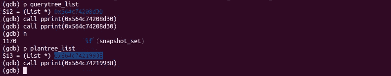

*plantree_list* 长这样:

```
(
   {PLANNEDSTMT 
   :commandType 1 
   :queryId 0 
   :hasReturning false 
   :hasModifyingCTE false 
   :canSetTag true 
   :transientPlan false 
   :dependsOnRole false 
   :parallelModeNeeded false 
   :jitFlags 0 
   :planTree 
      {SEQSCAN 
      :scan.plan.startup_cost 0 
      :scan.plan.total_cost 48.25 
      :scan.plan.plan_rows 13 
      :scan.plan.plan_width 4 
      :scan.plan.parallel_aware false 
      :scan.plan.parallel_safe true 
      :scan.plan.async_capable false 
      :scan.plan.plan_node_id 0 
      :scan.plan.targetlist (
         {TARGETENTRY 
         :expr 
            {VAR 
            :varno 1 
            :varattno 1 
            :vartype 23 
            :vartypmod -1 
            :varcollid 0 
            :varlevelsup 0 
            :varnosyn 1 
            :varattnosyn 1 
            :location 7
            }
         :resno 1 
         :resname id 
         :ressortgroupref 0 
         :resorigtbl 16389 
         :resorigcol 1 
         :resjunk false
         }
      )
      :scan.plan.qual (
         {OPEXPR 
         :opno 521 
         :opfuncid 147 
         :opresulttype 16 
         :opretset false 
         :opcollid 0 
         :inputcollid 0 
         :args (
            {VAR 
            :varno 1 
            :varattno 1 
            :vartype 23 
            :vartypmod -1 
            :varcollid 0 
            :varlevelsup 0 
            :varnosyn 1 
            :varattnosyn 1 
            :location 22
            }
            {CONST 
            :consttype 23 
            :consttypmod -1 
            :constcollid 0 
            :constlen 4 
            :constbyval true 
            :constisnull false 
            :location 27 
            :constvalue 4 [ 1 0 0 0 0 0 0 0 ]
            }
         )
         :location 25
         }
         {OPEXPR 
         :opno 97 
         :opfuncid 66 
         :opresulttype 16 
         :opretset false 
         :opcollid 0 
         :inputcollid 0 
         :args (
            {VAR 
            :varno 1 
            :varattno 1 
            :vartype 23 
            :vartypmod -1 
            :varcollid 0 
            :varlevelsup 0 
            :varnosyn 1 
            :varattnosyn 1 
            :location 33
            }
            {CONST 
            :consttype 23 
            :consttypmod -1 
            :constcollid 0 
            :constlen 4 
            :constbyval true 
            :constisnull false 
            :location 38 
            :constvalue 4 [ 10 0 0 0 0 0 0 0 ]
            }
         )
         :location 36
         }
      )
      :scan.plan.lefttree <> 
      :scan.plan.righttree <> 
      :scan.plan.initPlan <> 
      :scan.plan.extParam (b)
      :scan.plan.allParam (b)
      :scan.scanrelid 1
      }
   :rtable (
      {RANGETBLENTRY 
      :alias <> 
      :eref 
         {ALIAS 
         :aliasname t 
         :colnames ("id")
         }
      :rtekind 0 
      :relid 16389 
      :relkind r 
      :rellockmode 1 
      :tablesample <> 
      :lateral false 
      :inh false 
      :inFromCl true 
      :requiredPerms 2 
      :checkAsUser 0 
      :selectedCols (b 8)
      :insertedCols (b)
      :updatedCols (b)
      :extraUpdatedCols (b)
      :securityQuals <>
      }
   )
   :resultRelations <> 
   :appendRelations <> 
   :subplans <> 
   :rewindPlanIDs (b)
   :rowMarks <> 
   :relationOids (o 16389)
   :invalItems <> 
   :paramExecTypes <> 
   :utilityStmt <> 
   :stmt_location 0 
   :stmt_len 40
   }
)
```

通知类型 PLANNEDSTMT。这里发生了很多有趣的事情。我们可以以后再去。向前几步后，我们到达门户创建。

```
/*
 * Create unnamed portal to run the query or queries in. If there
 * already is one, silently drop it.
 */
portal = CreatePortal("", true, true);
```

接着是 *PortalStart(portal，NULL，0，InvalidSnapshot)*

> 为执行准备门户。

还在准备中！让我们检查一下这里发生了什么(按 s)。 *PortalStart* 是在 src/backend/tcop/pquery.c 中定义的，让我们继续一步步来


QueryDesc 被创建: *queryDesc = CreateQueryDesc(…)。*这在同一个文件中定义，即 src/backend/tcop/pquery.c

```
/*
 * CreateQueryDesc
 */
QueryDesc *
CreateQueryDesc(PlannedStmt *plannedstmt,
    const char *sourceText,
    Snapshot snapshot,
    Snapshot crosscheck_snapshot,
    DestReceiver *dest,
    ParamListInfo params,
    QueryEnvironment *queryEnv,
    int instrument_options)
{
 QueryDesc  *qd = (QueryDesc *) palloc(sizeof(QueryDesc));qd->operation = plannedstmt->commandType; /* operation */
 qd->plannedstmt = plannedstmt; /* plan */
 qd->sourceText = sourceText; /* query text */
 qd->snapshot = RegisterSnapshot(snapshot); /* snapshot */
 /* RI check snapshot */
 qd->crosscheck_snapshot = RegisterSnapshot(crosscheck_snapshot);
 qd->dest = dest;   /* output dest */
 qd->params = params;  /* parameter values passed into query */
 qd->queryEnv = queryEnv;
 qd->instrument_options = instrument_options; /* instrumentation wanted? *//* null these fields until set by ExecutorStart */
 qd->tupDesc = NULL;
 qd->estate = NULL;
 qd->planstate = NULL;
 qd->totaltime = NULL;/* not yet executed */
 qd->already_executed = false;return qd;
}
```

最后我们到达 *ExecutorStart(queryDesc，myeflags)。* ExecutorStart 在 src/back end/executor/execmain . c 中定义，进入 ExecutorStart，在某个点:*query desc->estate = estate*

其中房地产是房地产对象

> /*————
> * Create executorstate
> *
> *创建并初始化一个 EState 节点，它是整个执行器调用的
> *工作存储的根。
> *
> *原则上，这将创建每个查询的内存上下文，该上下文将被
> *用于保存查询结束前的所有工作数据。
> *注意，每个查询的上下文将成为调用者的
> * CurrentMemoryContext 的子上下文。
> *————
> */

经过一些步骤后，我们到达 InitPlan。InitPlan 是在 src/back end/executor/execmain . c 中定义的

> /*———————
> * init plan
> *
> *初始化查询计划:打开文件，分配存储
> *启动规则管理器
> *—————————
> */

打开文件，让我看看。步入 initPlan。通过单步调试，我们到达了 src/back end/executor/execprocnode . c 中定义的 ExecInitNode。

> /
> *
> *输入:
> *“node”是查询计划器
> *“estate”是计划树的共享执行状态
> *“e flags”是 executor.h
> *
> 中描述的标志位的按位或运算，返回给定计划节点对应的计划状态节点。
> *—————
> */

*execlintNode*将 node 作为 param，让我们看看它是什么样子的:

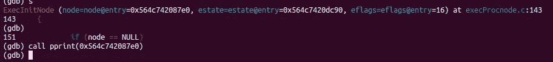

```
{SEQSCAN 
   :scan.plan.startup_cost 0 
   :scan.plan.total_cost 48.25 
   :scan.plan.plan_rows 13 
   :scan.plan.plan_width 4 
   :scan.plan.parallel_aware false 
   :scan.plan.parallel_safe true 
   :scan.plan.async_capable false 
   :scan.plan.plan_node_id 0 
   :scan.plan.targetlist (
      {TARGETENTRY 
      :expr 
         {VAR 
         :varno 1 
         :varattno 1 
         :vartype 23 
         :vartypmod -1 
         :varcollid 0 
         :varlevelsup 0 
         :varnosyn 1 
         :varattnosyn 1 
         :location 7
         }
      :resno 1 
      :resname id 
      :ressortgroupref 0 
      :resorigtbl 16389 
      :resorigcol 1 
      :resjunk false
      }
   )
   :scan.plan.qual (
      {OPEXPR 
      :opno 521 
      :opfuncid 147 
      :opresulttype 16 
      :opretset false 
      :opcollid 0 
      :inputcollid 0 
      :args (
         {VAR 
         :varno 1 
         :varattno 1 
         :vartype 23 
         :vartypmod -1 
         :varcollid 0 
         :varlevelsup 0 
         :varnosyn 1 
         :varattnosyn 1 
         :location 22
         }
         {CONST 
         :consttype 23 
         :consttypmod -1 
         :constcollid 0 
         :constlen 4 
         :constbyval true 
         :constisnull false 
         :location 27 
         :constvalue 4 [ 1 0 0 0 0 0 0 0 ]
         }
      )
      :location 25
      }
      {OPEXPR 
      :opno 97 
      :opfuncid 66 
      :opresulttype 16 
      :opretset false 
      :opcollid 0 
      :inputcollid 0 
      :args (
         {VAR 
         :varno 1 
         :varattno 1 
         :vartype 23 
         :vartypmod -1 
         :varcollid 0 
         :varlevelsup 0 
         :varnosyn 1 
         :varattnosyn 1 
         :location 33
         }
         {CONST 
         :consttype 23 
         :consttypmod -1 
         :constcollid 0 
         :constlen 4 
         :constbyval true 
         :constisnull false 
         :location 38 
         :constvalue 4 [ 10 0 0 0 0 0 0 0 ]
         }
      )
      :location 36
      }
   )
   :scan.plan.lefttree <> 
   :scan.plan.righttree <> 
   :scan.plan.initPlan <> 
   :scan.plan.extParam (b)
   :scan.plan.allParam (b)
   :scan.scanrelid 1
   }
```

这里我们可以看到节点类型是 SEQSCAN。在当前函数(*execlintnode*)中，我们可以找到计算结果的巨型开关。

```
switch (nodeTag(node))
 {
   /*
    * control nodes
    */
  case T_Result:
   result = (PlanState *) ExecInitResult((Result *) node,
              estate, eflags);
   break;
...
```

对于我们的节点 SeqScan，我们快速跳转到 *ExecInitSeqScan* 。在 *ExecInitSeqScan* 内部的步骤(在 src/back end/executor/nodeseqscan . c 中定义)。

逐句通过，直到我们到达 *ExecOpenScanRelation* (在 src/back end/executor/executils . c 中定义)，进入这个，然后进入*ExecGetRangeTableRelation*。继续前进，直到你到达

*rel = table _ open(rte->relid，NoLock)*

*table_open* 在 src/back end/access/table/table . c 中定义。

> /*———
> * table _ open—通过关系 OID
> *
> *打开一个表关系，这基本上是 relation_open 加上检查关系
> *不是索引也不是复合类型。(调用者还应该在假设它有
> *存储之前
> *检查它不是视图或外部表。)
> *———
> */

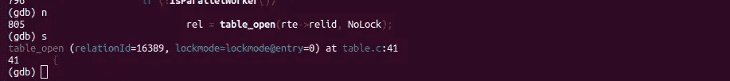

relationId 稍后会有用

这就调用了 *relation_open* ，单步执行该函数。

*relation_open* 在 src/back end/access/common/relation.c 中定义(不要和另一个在不同路径定义的 relation . c 混淆)。

*relation_open* 先取一个锁:

```
/* Get the lock before trying to open the relcache entry */
 if (lockmode != NoLock)
  LockRelationOid(relationId, lockmode);/* The relcache does all the real work... */
r = RelationIdGetRelation(relationId);
```

然后做真正的工作。让我们看看 *RelationIdGetRelation* 做什么，进入这个函数。 *RelationIdGetRelation* 在 src/back end/utils/cache/rel cache . c 中定义。

> /*
> * RelationIdGetRelation
> *
> *查找 OID 的 reldesc 如果缓存中没有，请创建一个。
> *
> *如果找不到给定 relid
> *的 pg_class 行，则返回 NULL(表示我们正在尝试访问刚删除的关系)。
> *通过 elog 报告任何其他错误。
> *
> * NB:调用者在
> * relation ID 上至少应该已经有 AccessShareLock，否则会有恶劣的竞争条件。
> *
> * NB:关系参考计数递增，如果是新条目，则设置为 1。
> *调用者最终应递减计数。(通常，
> *这是通过调用 RelationClose()实现的。)
> */

这里发生了很多事情。让我们继续前进，直到我们从 *ExecInitSeqScan* 返回，并观察事情如何展开*。*

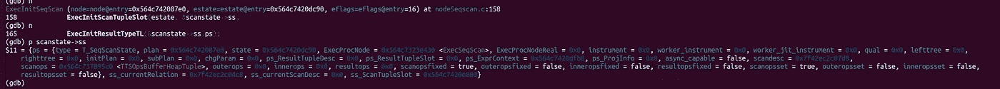

再进行一些初始化， *scanstate- > ss* 如下所示:

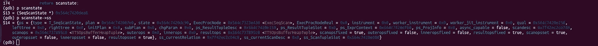

其中 *ss* 是 src/include/nodes/execnodes.h 中定义的扫描状态

> /*————
> * scan state 信息
> *
> * ScanState 为代表
> *底层关系扫描的节点类型扩展 PlanState。它还可以用于扫描底层计划节点输出的节点
> *——在这种情况下，只有
> * ScanTupleSlot 实际上是有用的，它引用从子计划中检索的元组
> *。
> *
> *正在扫描的 current relation relation relation relation(如果没有则为 NULL)
> * currents can desc 用于扫描的当前扫描描述符(如果没有则为 NULL)
> * scan tuple Slot 指向保存扫描元组的元组表中的 slot 的指针
> *—————
> */
> typedef struct scan state
> {
> plan state PS；/*它的第一个字段是 NodeTag */
> Relation ss _ current Relation；
> struct tables candescdata * ss _ currents candesc；
> TupleTableSlot * ss _ ScanTupleSlot；
> }扫描状态；

让我们继续前进，直到我们从最初的计划返回，很长的一段路，不是吗？

移出 *standard_ExecutorStart* 然后是 *PortalStart* ，我们又回到了 pquery.c 文件。所有上述情况都发生在创建查询计划上。

> /*
> *调用 ExecutorStart 准备执行计划
> */

此时快速转储所有信息:

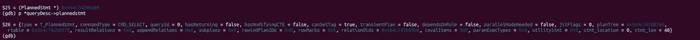

计划测试

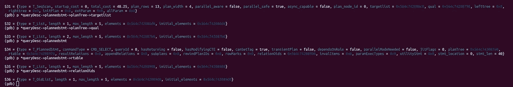

另外， *tupleDescriptor* :

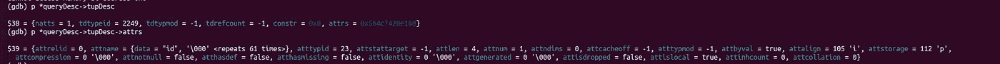

注意 *attname(char*)* 其中数据是 id(我们的列名)。

单步执行，系统准备输出流(这里是为了*去删除*，我们的 psql 客户端)。

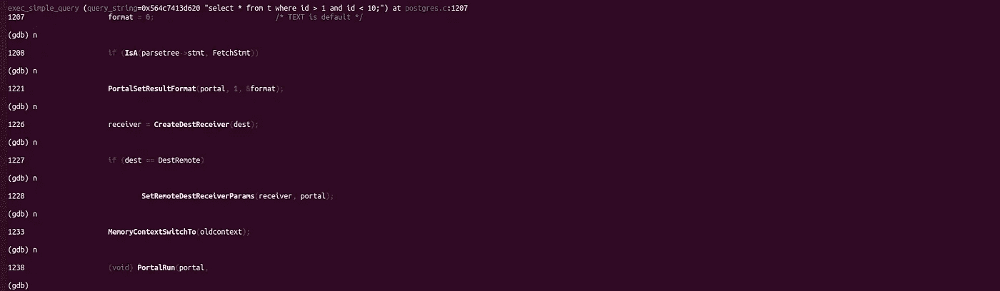

让我们步入 *PortalRun* (在 src/backend/tcop/pquery.c 中定义)。

> 运行门户的一个或多个查询。

继续步进，直到到达:*n processed = portal run select(portal，true，count，dest)*

进入 *PortalRunSelect* 然后 ExecutorRun(在 src/back end/executor/execmain . c 中定义)。

> /*——————————
> *执行器运行
> *
> *这是执行器模块的主例程。它接受来自流量 cop 的
> *查询描述符，并执行
> *查询计划。
> *
> * ExecutorStart 一定已经被调用了。
> *
> *如果方向为 NoMovementScanDirection，则不执行任何操作
> *除了启动/关闭目的地。否则，
> *我们在指定方向上检索多达“count”个元组。
> *
> *注:count = 0 解释为没有入口限制，即运行到
> *完成。还要注意，计数限制仅适用于
> *检索到的元组，而不适用于例如由可修改表计划节点插入/更新/删除的
> *。
> *
> *没有返回值，但是输出元组(如果有)发送到
> * query desc 中指定的目的接收方；并且在顶层处理的元组的数量
> *可以在
> * estate- > es_processed 中找到。
> *
> *我们提供了一个函数钩子变量，让可加载插件
> *在调用 ExecutorRun 时获得控制权。这样的插件通常会调用 standard_ExecutorRun()。
> *
> *—————
> */

好的，这是主执行器，它获取元组并输出到目标接收器。实际实现在 *standard_ExecutorRun* 中。

进入*执行计划*(在同一个文件中定义)。

> /
> *
> *如果 numberTuples 为 0
> *
> *则运行完成。注意:ctid 属性是一个“垃圾”属性，在
> *用户可以看到它之前被删除
> *——————
> */

处理元组的无限循环。

```
/*
  * Loop until we've processed the proper number of tuples from the plan.
  */
 for (;;)
 {

   * Execute the plan and obtain a tuple
   */
  slot = ExecProcNode(planstate);/*
   * if the tuple is null, then we assume there is nothing more to
   * process so we just end the loop...
   */
  if (TupIsNull(slot))
   break;<snip> 
  if (sendTuples)
  {
   /*
    * If we are not able to send the tuple, we assume the  destination
    * has closed and no more tuples can be sent. If that's the case,
    * end the loop.
    */
   if (!dest->receiveSlot(slot, dest))
    break;
  }
```

*ExecProcNode* (在 src/include/executor/executor . h 中定义)调用对应节点的 *ExecProcNode* 。

```
/* ----------------------------------------------------------------
 *  ExecProcNode
 *
 *  Execute the given node to return a(nother) tuple.
 * ----------------------------------------------------------------
 */
#ifndef FRONTEND
static inline TupleTableSlot *
ExecProcNode(PlanState *node)
{
 if (node->chgParam != NULL) /* something changed? */
  ExecReScan(node);  /* let ReScan handle this */return node->ExecProcNode(node);
}
#endif
```

在当前情况下， *ExecProcNodeFirst* (在 src/back end/executor/execprocnode . c 中定义)被调用。

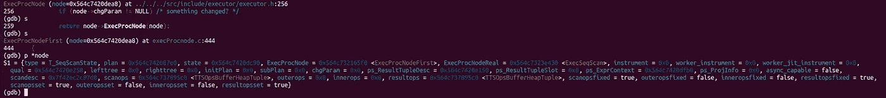

进而设置*node->ExecProcNode = node->ExecProcNodeReal。*

当前情况下，*节点- > ExecProcNode* 为 *ExecSeqScan* (在 src/back end/executor/nodeseqscan . c 中定义)。

ExecSeqScan:

> /*—————————
> * ExecSeqScan(node)
> *
> *顺序扫描关系，返回下一个符合条件的
> *元组。
> *我们调用 ExecScan()例程，并传递给它适当的
> *访问方法函数。
> *——————
> */

*ExecSeqScan* 调用 *ExecScan* (在 src/back end/executor/ExecScan . c 中定义)，别忘了插手。单步执行 ExecScanFetch(在 src/back end/executor/execscan . c 中定义，同一个文件),它拉入一个槽

```
slot = ExecScanFetch(node, accessMtd, recheckMtd);
```

保持步进，当到达 *table_beginscan* (在 src/back end/access/heap/heap am . c 中定义)时再步进。在这里， *scandesc* 被填充。单步执行并进入下一个函数 *table_scan_getnextslot* (在*src/include/access/tableam . h 中定义)，进入同一函数中的 *scan_getnextslot* 。*

**scan_getnextslot* 指向 *heap_getnextslot* (在 src/back end/access/heap/heap am . c 中定义)调用 *heapgettup_pagemode* (进入此函数)*。**

> *heapgettup_pagemode —以一次一页的模式获取下一个堆元组*

*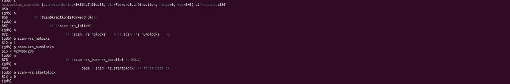*

*如你所见，我们在第一页。*

*我们进入 *heapgetpage* (在同一个文件中)，它调用 *ReadBufferExtended* (在 src/back end/storage/buffer/buf mgr . c 中定义)。*

> *readbufferedextended—返回包含所请求关系的所请求的
> 块的缓冲区。*

*它调用 *ReadBuffer_common* 并依次调用 *BufferAlloc。**

*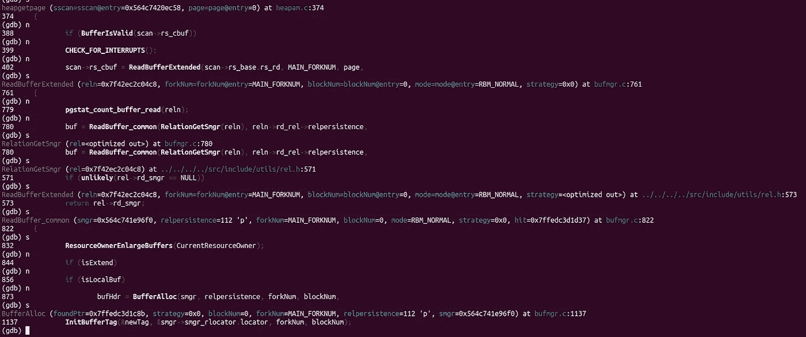*

*万一你迷路了，可以往回走*

> */*
> * buffer alloc—read buffer 子程序。处理共享
> *缓冲区的查找。如果已经不存在缓冲区，则选择一个替换的
> *牺牲页并逐出旧页，但不读入新页。
> *
> *“策略”可以是一个缓冲区替换策略对象，或者 NULL 为
> *默认策略。当
> *使用默认策略时，所选缓冲区的 usage_count 增加，否则可能不会增加(见 PinBuffer)。
> *
> *返回的缓冲区被钉住，并且已经被标记为保存
> *所需页面。如果已经有了想要的页面，*foundPtr 被
> *设置为真。否则，*foundPtr 被设置为假，并且缓冲区被标记为
> *作为 IO _ IN _ PROGRESSReadBuffer 现在需要进行 I/O 来填充它。
> *
> * *foundPtr 实际上与缓冲区的 BM_VALID 标志是冗余的，但是
> *为了简单起见，我们在 ReadBuffer 中保留了它。
> *
> *入口和出口都没有锁。
> */*

*漂亮！*

```
*/* create a tag so we can lookup the buffer */
 InitBufferTag(&newTag, &smgr->smgr_rlocator.locator, forkNum, blockNum);/* determine its hash code and partition lock ID */
 newHash = BufTableHashCode(&newTag);
 newPartitionLock = BufMappingPartitionLock(newHash);/* see if the block is in the buffer pool already */
 LWLockAcquire(newPartitionLock, LW_SHARED);
buf_id = BufTableLookup(&newTag, newHash);*
```

****首先，它试图在缓冲区中查找页面，如果没有找到，则其他页面被逐出，所需页面从磁盘加载到缓冲区。****

```
*/*
  * Didn't find it in the buffer pool.  We'll have to initialize a new
  * buffer.  Remember to unlock the mapping lock while doing the work.
  */
 LWLockRelease(newPartitionLock);/* Loop here in case we have to try another victim buffer */
 for (;;)
 {
  /*
   * Ensure, while the spinlock's not yet held, that there's a free
   * refcount entry.
   */
  ReservePrivateRefCountEntry();/*
   * Select a victim buffer.  The buffer is returned with its header
   * spinlock still held!
   */
  buf = StrategyGetBuffer(strategy, &buf_state);Assert(BUF_STATE_GET_REFCOUNT(buf_state) == 0);/* Must copy buffer flags while we still hold the spinlock */
  oldFlags = buf_state & BUF_FLAG_MASK;/* Pin the buffer and then release the buffer spinlock */
  PinBuffer_Locked(buf);
<snip>*
```

*让我们看看在我们的情况下会发生什么。*

*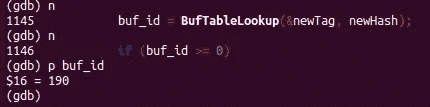*

*在缓冲区本身中找到页面*

*Buf 在 *heapgetpage* 中返回，我们到达:*DP = buffer getpage(buffer)**

*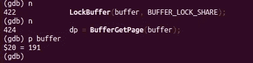*

*缓冲区是 191*

*让我们看看如何从缓冲区获取页面，进入 *BufferGetPage* (在 src/include/storage/bufmgr.h 中定义)调用 *BufferGetBlock* 。*

```
*/*
 * BufferGetBlock
 *  Returns a reference to a disk page image associated with a buffer.
 *
 * Note:
 *  Assumes buffer is valid.
 */
static inline Block
BufferGetBlock(Buffer buffer)
{
 Assert(BufferIsValid(buffer));if (BufferIsLocal(buffer))
  return LocalBufferBlockPointers[-buffer - 1];
 else
  return (Block) (BufferBlocks + ((Size) (buffer - 1)) * BLCKSZ);
}*
```

*其中 *BLCKSZ* 是块大小(在 src/include/pg_config.h 中定义)*

```
*/* Size of a disk block --- this also limits the size of a tuple. You can set it bigger if you need bigger tuples (although TOAST should reduce the need to have large tuples, since fields can be spread across multiple tuples).
BLCKSZ must be a power of 2\. The maximum possible value of BLCKSZ is currently 2^15 (32768). This is determined by the 15-bit widths of the lp_off and lp_len fields in ItemIdData (see include/storage/itemid.h). Changing BLCKSZ requires an initdb. */
#define BLCKSZ 8192*
```

*让我们继续 *getpageitem* ，单步执行后，我们到达下面给出的行，单步执行:*

```
*loctup.t_data = (HeapTupleHeader) PageGetItem((Page) dp, lpp);*
```

*其中 *PageGetItem* (在 src/include/storage/bufpage.h 中定义)看起来像:*

```
*/*
 * PageGetItem
 *  Retrieves an item on the given page.
 *
 * Note:
 *  This does not change the status of any of the resources passed.
 *  The semantics may change in the future.
 */
static inline Item
PageGetItem(Page page, ItemId itemId)
{
 Assert(page);
 Assert(ItemIdHasStorage(itemId));return (Item) (((char *) page) + ItemIdGetOffset(itemId));
}*
```

*注意 *loctup.t_data* 是 HeapTupleHeader 的类型。*

*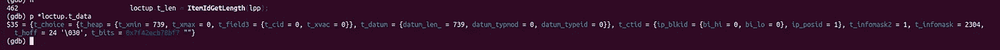*

*元组头看起来像这样*

*现在，我们回到我们的主函数 *heapgettup_pagemode。**

```
*/*
  * advance the scan until we find a qualifying tuple or run out of stuff to scan
  */
 for (;;)
 {
<snip>*
```

*你可以看穿剩下的代码或者继续退出。最后，我们看到 slot 被发送到我们的远程目的地。 *set_ps_display("idle")* 被调用，将查询状态从活动更改为空闲。现在可以在 psql 中看到结果。*

# *结论*

*我惊讶地发现，在逐步遍历 postgres(当它执行查询时)时，遍历 Postgres 代码库是多么容易，本文希望它能使这个过程变得更加容易。一旦你完成了一些查询(比如连接、递归 CTE 等等)。)，可以获得更多的见解。*

***参考/资源***

1.  *Postgres 设置:[https://www.postgresql.org/docs/9.6/install-procedure.html](https://www.postgresql.org/docs/9.6/install-procedure.html)*
2.  *广东发展银行:[https://wiki.postgresql.org/wiki/Developer_FAQ#gdb](https://wiki.postgresql.org/wiki/Developer_FAQ#gdb)*

*注意:请随时添加您的评论/建议/任何更正。*