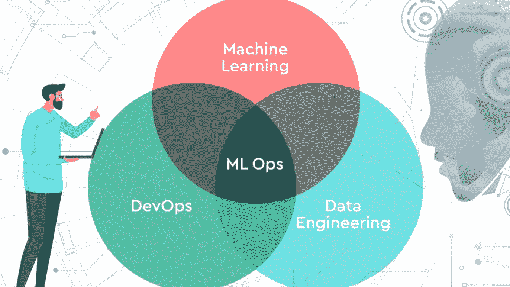

# 在您的组织中实施 MLOps 的步骤

> 原文：<https://blog.devgenius.io/steps-to-implement-mlops-in-your-organization-1401362f5588?source=collection_archive---------4----------------------->

# 什么是 MLOps？

MLOps 是数据科学家和工作专业人员之间的支持系统和沟通实践。这些系统的实现改进、简化了管理流程，并有助于将机器学习和深度学习环境集成到更大的生产环境中。很容易定制的风格和业务需求，以及所需的要求

# 为什么是 MLOps

MLOps 帮助个人和公司提供解决方案，通过创建更高效的操作系统来打开以前未开发的投资机会、节省时间和降低成本，并为决策和增强客户体验提供数据。

如果没有一个难以遵循的战略，这些目标是很难实现的。开发模型并通过[机器学习操作](https://www.iguazio.com/mlops/)移动它意味着更快的购物时间和降低成本。它使管理人员和开发人员能够对他们的计划和决策产生强大的影响。

# 如何实现 MLOps

实施 MLOps 有三种方式:

MLOps 级别 0(手动流程)

MLOps 级(ML 管道自动化)

MLOps 二级(CI/CD 管道自动化)

# MLOps 级别 0

对于刚进入[机器学习](/simplified-machine-learning-66c7a47cde18)的公司来说尤其如此。一个完整的 MLOps 及其模型就足够了，这直接依赖于数据科学家，他们可以设置它一次，以后不需要太多更新，或者如果您的模型从实现时起没有修改太多。

# 特征

*   **手动、交互、脚本编写流程:**每一步都是手动的，包括数据分析、数据准备、模型训练、支持。它需要执行每一个过程，并从一个步骤到下一个步骤翻译手册。
*   **在性能和 ML 之间陡峭:**这种方法将模型数据科学家和使用模型作为预测函数的工程师分开。数据科学家将一个训练有素的模型交给恶意工程师，让他们上传到自己的 API 软件。
*   **不定期发布:**这个想法是你的数据科学团队反复保持几个不变的模型，要么通过改变实现过程，要么通过重新利用新数据。模型。新节目一年只上映几次。
*   **没有持续集成(CI):** 由于预计会有一些变化，所以您不要考虑 CI。通常，测试代码是笔记本或执行脚本的一部分。
*   **无持续部署(CD):** 由于时间不够，在保证发布版本的情况下，不考虑 CD。部署是指预测服务(即带有 REST API 的微服务)
*   **缺乏主动监控:**该流程没有遵循或记录预测和实践

工程团队可以拥有自己的复杂 API 配置、测试和迁移配置，包括存储、回归和负载测试。

# 挑战

实际上，当应用到现实世界时，该系统经常崩溃。模型适应能力总是怀疑环境的变化或定义环境的数据的变化。《福布斯》对此有一个真实的故事:[如何克服机器学习在生产中的滞后](https://www.forbes.com/sites/forbestechcouncil/2019/04/03/why-machine-learning-models-crash-and-burn-in-production/?sh=4e32b1d02f43)。

为了克服这种手动流程的挑战，最好对 CI / CD 和 CT(持续培训)使用 MLOps 实践。通过安装 ML 培训管道，您可以启用 CT 并建立 CI / CD 系统，以快速测试、构建和交付新的 ML 管道实施。

# MLOps 一级

MLOps 级的目的是执行 ML 管道自动化模型的 CT。这样，您就可以实现模型预测服务的持续交付。

对于在不断变化的环境中运行并需要主动适应客户行为、价格促销和其他指标变化的解决方案来说，这种场景非常有用。

# 特征

**快速实验:**自动组织并执行 ML 实验步骤。

**生产模型 CT:** 基于活动的管道启动信号，使用新数据将模型自动上传至生产。

**实验-运营对称:**在开发或实验环境中使用的实现通道在预生产和生产环境中使用，这是用于 DevOps 集成的 MLOps 实践的一个重要方面。

**组件和通道的模块化代码:**要创建 ML 通道，组件必须是可重用的，组件表，并且可能与 ML 通道(即容器)共享。

**连续模型交付**:模型部署步骤是自动化的，该步骤将经过训练和验证的模型作为在线预测的预测服务。

**渠道部署:**在第 0 级，您将训练好的模型部署为生产预测服务。对于级别 1，您将部署一个完整的训练通道，该通道会自动重复启动，以将训练好的模型作为预测服务。

# 附加组件

**数据和模型验证:**管道期望新的实时数据，这将创建基于新数据训练的模型的新版本。因此，在生产管道中需要自动数据验证和模型验证步骤。

**功能库:**功能库是一个集中的存储库，您可以在其中标准化培训和服务功能的定义、存储和访问。

**元数据管理:**包含关于每个 ML 渠道实施的信息，以帮助数据和工件、再现性和比较。它还将帮助您调试错误和异常

**ML 管道触发器:**您可以自动化 ML 生产管道，根据您的应用使用新数据重新训练模型:

o 应要求

o 根据计划

o 关于新培训数据的可用性

o 模型性能损坏

o 关于数据分布的重大变化(数据概况的改进)。

# 挑战

当基于新数据而不是新的 ML 思想实现新模型时，这个设置是有用的。

然而，您需要测试新的 ML 想法，并快速部署 ML 组件的新实现。如果您管理多个 ML 生产渠道，您将需要 CI / CD 设置来自动化 ML 管道的设计、测试和部署。

# MLOps 二级(CI / CD)

您需要一个强大的自动化 CI / CD 系统来快速可靠地更新生产线。有了这个自动化的 CI / CD 系统，您的数据科学家将很快发现功能工程、建模架构和超参数的新想法。这个级别适合于技术熟练的公司，这些公司需要每天(如果不是每小时)更新他们的模型，在几分钟内更新，并一次性重新部署数千台服务器。除非 MLOps 的最后一个周期结束，否则这样的组织将永远无法生存。

# 该 MLOps 设置包括以下组件:

*   源代码控制
*   部署服务
*   测试和构建服务
*   ML 元数据存储
*   功能存储
*   模型注册表
*   ML 管道编排器

# 特征

**进展和实验:**你将不断测试新的最大似然算法和新的建模，其中的实验步骤是有组织的。这个阶段的输出是 ML 管道步骤的源代码，然后被转移到源存储库。

**持续管道集成:**您创建源代码并运行各种测试。这个阶段的输出是将在稍后阶段部署的通道组件(包、可执行文件和工件)。

**连续管道交付:**将在 CI 阶段创建的工件部署到目标环境中。这一阶段的成果是一条延伸的天然气管道，并实施了一种新的模式。

**自动启动:**根据计划或响应启动，管道在生产时自动启动。这个阶段的输出是一个新上传的模型，它被转移到模型寄存器中。

**连续交付模式:**收费模式作为预测的预测服务。此阶段的输出是分布式模型预测服务。

**监控:**您根据当前数据收集模型性能统计数据。这个阶段的输出是实现流水线或实现新的实验周期的触发器。

# 结论

在开始新的实验回归之前，数据分析步骤仍然是数据科学家的手动过程。MLOps 就像一张地图，指导个人、小团体甚至公司实现他们的目标，而不管他们的限制、有影响力的数据、小型基础设施、小额预算资金等等。你决定你的地图的大小，因为 MLOps 是一个没有大脑的。您可以尝试不同的设置，只保留适合您的设置。