# 使用 GitHub 动作完成工作的步骤

> 原文：<https://blog.devgenius.io/steps-towards-getting-things-done-with-github-actions-3900b41cee8b?source=collection_archive---------19----------------------->

[https://github.com/logos](https://github.com/logos)获准用于博客。

## CI/CD 和 CI/CD/CD 的历史

开发人员需要几项技能才能获得成功，并确保他们的客户能够直接或间接地从可靠的集成和部署实践中受益。CI/CD 技能集应该是您尽早开始改进的技能集。通常工程师会利用 Travis CI、CircleCI、AWS CodeBuild、Azure DevOps、Atlassian Bamboo 等网站，或者 Jenkins 等开源自动化服务器。现在，GitHub Actions 有了更多的选项，我们可以为测试和版本发布构建持续集成和持续部署管道。将 CI/CD 功能引入您的代码存储库，从开发人员没有实现 CI/CD 的“原因”列表中删除一个借口。

*持续集成*

在我们进一步讨论之前，先说明一下什么是 CI/CD。持续集成是一种软件实践，仅仅意味着重复或者频繁地将您的代码提交到存储库中。这很重要，因为这意味着作为开发人员，我们正在减少需要立即调试的代码量。一个很好的类比是写了一整本书，却没有自己或别人校对过。我更愿意检查较小的部分，这样我们可以快速修复错误，并以更高的质量前进。这意味着我们更加熟悉我们的代码，持续集成建立了您的开发团队与您的代码的关系，利用这种实践降低了您的代码中未知的数量。

*连续交货*

什么是持续交付？这个阶段是一个自动化的过程，将代码提交到生产阶段，以构建软件就绪或生产就绪的产品。

*连续部署*

那么什么是持续部署呢？这是当您的团队在没有人工干预的情况下，为通过 CI/CD 阶段的每个代码修改执行前面步骤中提到的代码提交的实时部署的时候。

## 为什么 CI/CD 很重要

CI/CD 很重要，因为它允许开发团队更快、更频繁地接触客户。这个过程减少了手动构建引入的风险，并且可以在 YAML 文件中自我记录，我们将在本文的教程部分介绍这些文件。下面你会发现一个好处列表，来证明为什么开发团队应该贡献周期来走向 CI/CD，而不是手工过程。

*好处*

1.  消除手动错误。
2.  较小的代码更改更简单，并且具有较少的意外后果。
3.  CI-CD 产品特征速度很快，缩短了调查和修补缺陷的时间。
4.  功能切换和蓝绿色部署支持无缝、有针对性地引入新产品功能。
5.  持续开发过程中终端用户的参与和反馈导致了可用性的提高。
6.  通过解放开发人员将更多时间用于产品开发来降低成本。

## GitHub 操作

GitHub Actions 于 2019 年秋季发布，是一个世界级的 CI/CD 框架。GitHub 动作不仅用于软件本身的集成，还有欢迎新贡献者的选项，基于文件变化的自动标签拉取请求，以及检查陈旧问题是可以用 GitHub 动作自动化的附加过程。动作确实是一种自动化开发团队软件工作流程的每一个方面的方法。

开发人员面临着一个不断发展的技术和技能领域，他们不得不学习如何继续跟上技术的发展。GitHub Actions 让开发人员尽可能容易地将 CI/CD 实践添加到他们的工作流程中。从商业角度来看，这在财务上也是有意义的，因为它用不要重复(DRY)原则取代了可重复的任务。

## 辅导的

本教程包括三个部分，有帮助的词汇，Docker 容器动作和贴标机动作。完成本教程后，你应该对 GitHub 动作有一个基本的了解，以及如何将动作集成到现有的或新的 GitHub 存储库中。

在进入教程之前，我已经列出了一些有用的词汇和术语，值得在进入教程之前熟悉。

第一部分:有用词汇*

[*动作*](https://docs.github.com/en/actions/creating-actions/about-actions#about-actions) —自定义代码，以你喜欢的任何方式与你的存储库交互，包括与 GitHub 的 API 和任何公开可用的第三方 API 集成。动作可以包括一个 [Docker](https://docs.github.com/en/actions/creating-actions/about-actions#types-of-actions) 容器或者 [JavaScript](https://docs.github.com/en/actions/creating-actions/about-actions#types-of-actions) 类型。

[*上下文*](https://docs.github.com/en/actions/reference/context-and-expression-syntax-for-github-actions#contexts) —上下文是访问工作流运行、运行环境、作业和步骤信息的一种方式。上下文使用表达式语法。

[*表达式*](https://docs.github.com/en/actions/reference/context-and-expression-syntax-for-github-actions#about-contexts-and-expressions) —表达式用于以编程方式设置工作流文件中的变量和访问上下文。表达式可以是文字值、上下文引用或函数的任意组合。您可以使用运算符组合文字、上下文引用和*函数。*

[*文字*](https://docs.github.com/en/actions/reference/context-and-expression-syntax-for-github-actions#literals) —作为表达式的一部分，您可以使用布尔、空、数字或字符串数据类型。布尔文本不区分大小写，因此可以使用 true 或 True。

GitHub Actions 还允许用户使用[操作符](https://docs.github.com/en/actions/reference/context-and-expression-syntax-for-github-actions#operators)和[功能](https://docs.github.com/en/actions/reference/context-and-expression-syntax-for-github-actions#functions)。

*同样值得一提的是*

GitHub 操作的使用有一些限制，并且会根据您使用的是 GitHub 托管还是自托管运行程序而有所不同。这些限制可能会发生变化。

*API 请求* —您可以在一小时内执行多达 1000 个 API 请求，如果超过，其他调用将失败。

*并发作业* —您帐户中可以运行的并发作业数量取决于您的 GitHub 计划，请访问 GitHub 了解当前计划费率。

*作业执行时间* —工作流中的作业可以运行长达 6 小时的执行时间。如果作业达到此限制，作业将被终止并且无法完成。此限制不适用于自宿跑步者。

*工作排队时间* —自助跑步者最多可排队 24 小时。如果自宿主运行程序没有在此限制内开始执行作业，作业将被终止并且无法完成。这个限制不适用于 GitHub 托管的跑步者。

*工作流程运行时间* —每次工作流程运行限制在 72 小时内。如果工作流运行达到此限制，工作流运行将被取消。

*使用限制来自*[*docs.github.com*](https://docs.github.com/en/actions/reference/workflow-syntax-for-github-actions#usage-limits)*有关当前限制费率，请访问。*

*   *来源:*[(“GitHub 动作文档— GitHub 文档”未注明)](https://paperpile.com/c/gAOagR/dyx6)

***第二节:Docker 容器动作***

第一步:登录 GitHub 并**创建**一个新的存储库或者点击[动作链接](https://github.com/new)。

步骤 2:用所需的描述、隐私、自述文件和许可证来完成一个新的存储库名称。

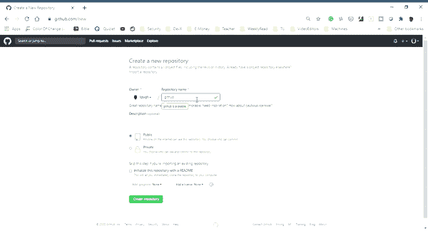

**创建你的 GitHub 回购**

步骤 3: **创建**一个新的分支

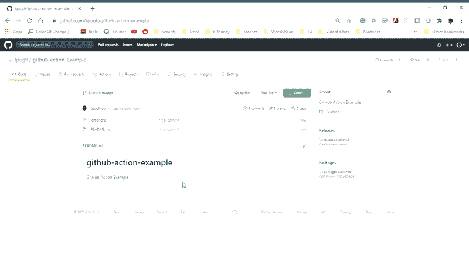

*   *分支机构应该有意命名，因此这个分支机构的好名字应该是“第三步-我的第一步行动*。
*   在新的分支上，**创建**一个目录: *action-a，*你可以通过命名文件 *action-a/Dockerfile* 来同时创建一个目录和一个文件。

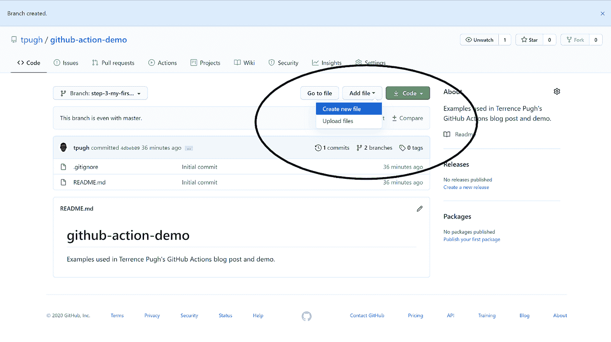

在 GitHub 中创建新文件按钮位置

*   在 action-a 目录中，**创建一个名为 *Dockerfile* 的文件**。
*   在下面插入*行动/文档*代码，并**提交**到分支

Dockerfile 文件

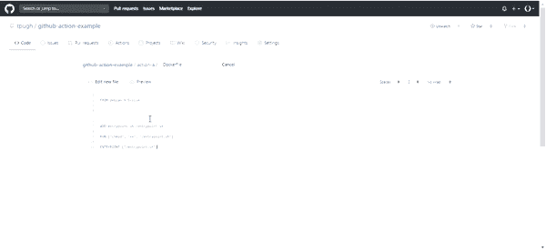

提交 Docker 文件

步骤 4:在/action-a/目录中添加一个名为 entrypoint.sh **Stage** 和 **Commit** 的入口点脚本，然后 **push。**

第五步:**在 action-a 目录下创建 *action.yml* 文件，添加**动作元数据文件，如下:

步骤 6: **通过创建开始**你的工作流文件。github/workflows/main.yml，并将以下代码添加到 main.yml 文件中:

。github/workflows/main.yml

第七步:**打开**一个*拉请求*与你的新分支对抗主

*   **点击**拉动请求选项卡，然后比较&拉动请求

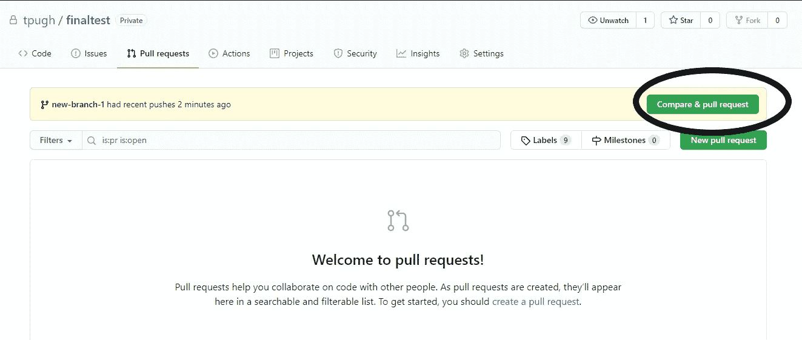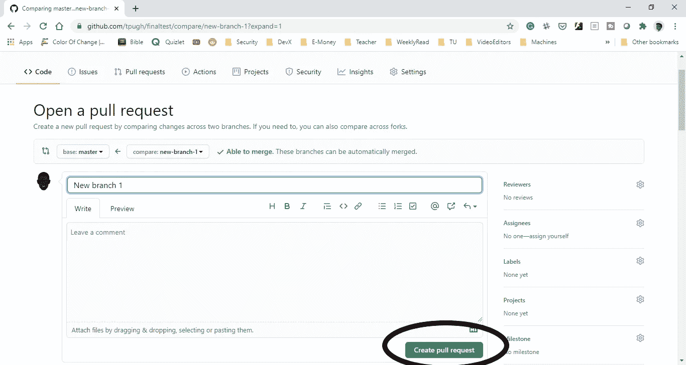

步骤 8:通过将您的工作流合并到主分支来合并工作流

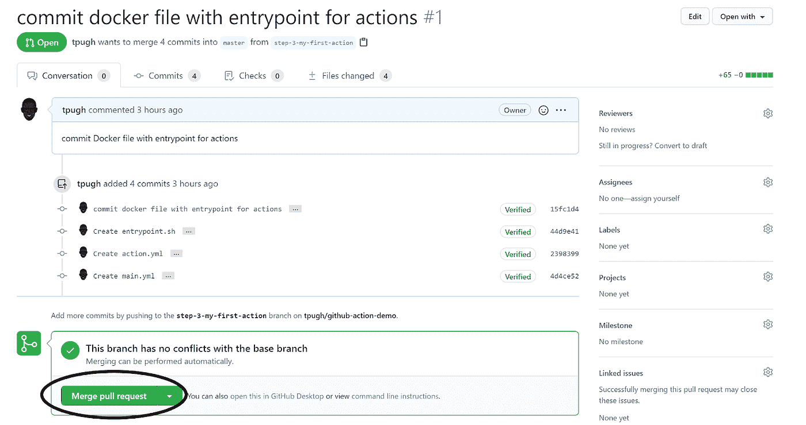

步骤 9:单击操作选项卡查看日志

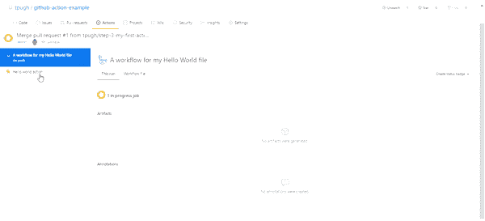

工作流日志

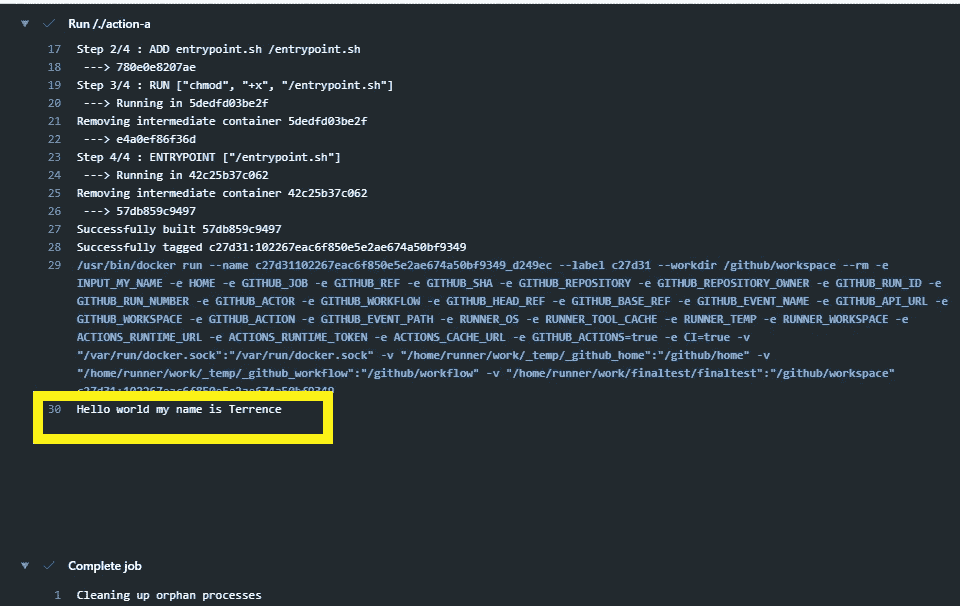

显示我们在 main.yml 文件中输入的名称的日志

第三部分:贴标机操作

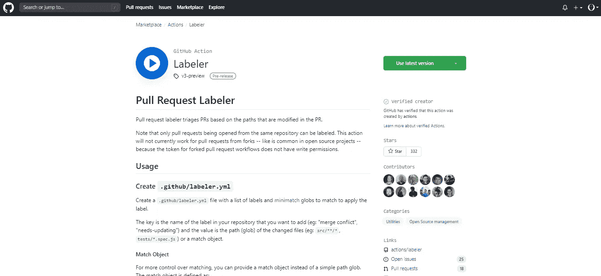

GitHub 贴标机在市场中的作用

现在我们将使用来自 GitHub [市场](https://github.com/marketplace/actions/labeler)的 GitHub 动作。通过在我们在第二节中创建的存储库中完成以下步骤。

10: **创建**新分支:如果需要，请参见第二节步骤 3。

11: **创建**。github/labeler.yml 和**提交**

12: **创建**文件。github/workflows/labeler.yml 和**提交**

13: **添加**一个名为“示例”的文件夹

*   位置:项目/示例

14: **在示例文件夹中添加** example.txt 文件，并**提交**

15: **创建**一个*拉动请求*和**合并**到主

16: **点击** *拉动请求*标签并搜索标签

你应该会看到我们在 labeler.yml 中添加的 ***标签 1*** ，就像下面的截图一样

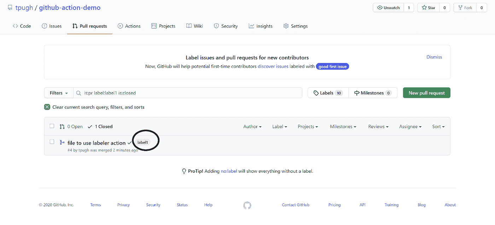

由贴标机添加的标签标记的视图

## 搞定了。

如果你想了解更多，我推荐你在 GitHub [Marketplace](https://github.com/marketplace) 中探索更多的 GitHub 动作。

教程[回购](https://github.com/tpugh/github-action-example)副本。

资源

[亚特兰蒂斯人。“持续集成、持续交付和持续部署”亚特兰蒂斯人。2020 年 7 月 4 日接入。](http://paperpile.com/b/gAOagR/eQbF)[https://www . atlassian . com/continuous-delivery/principles/continuous-integration-vs-delivery-vs-deployment](https://www.atlassian.com/continuous-delivery/principles/continuous-integration-vs-delivery-vs-deployment)[。](http://paperpile.com/b/gAOagR/eQbF)

[“持续集成的优势-持续部署(CI-CD)-pure cloud 资源中心。”n.d .纯云资源中心。2020 年 7 月 4 日接入。](http://paperpile.com/b/gAOagR/bKXJ)[https://help . mypure cloud . com/articles/benefits-continuous-integration-continuous-deployment-ci-CD/](https://help.mypurecloud.com/articles/benefits-continuous-integration-continuous-deployment-ci-cd/)[。](http://paperpile.com/b/gAOagR/bKXJ)

[艾兰戈，杰。2019.“如何实施有效的 CI/CD 渠道— DevOps.com”，DevOps.com。2019 年 10 月 1 日。](http://paperpile.com/b/gAOagR/qa78)[https://devo PS . com/how-to-implementation-an-effective-ci-CD-pipeline/](https://devops.com/how-to-implement-an-effective-ci-cd-pipeline/)[。](http://paperpile.com/b/gAOagR/qa78)

[“GitHub 操作文档— GitHub 文档”n.d .于 2020 年 7 月 4 日进入。](http://paperpile.com/b/gAOagR/dyx6)[https://help.github.com/en/actions](https://help.github.com/en/actions)[。](http://paperpile.com/b/gAOagR/dyx6)