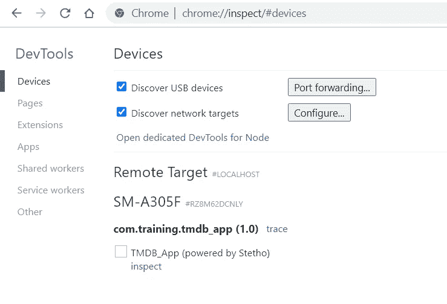
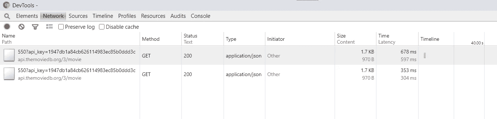
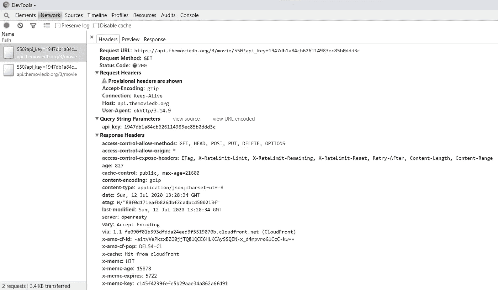

# ste tho:Android 的终极调试工具。

> 原文：<https://blog.devgenius.io/stetho-the-ultimate-debugging-tool-for-android-1e7573554d04?source=collection_archive---------19----------------------->

## Stetho 是一个易于使用的库，由脸书调试网络请求和 android 应用程序中的数据库。


凯文·Ku 在 [Unsplash](https://unsplash.com?utm_source=medium&utm_medium=referral) 上拍摄的照片

在当今世界，很难找到一款不发出任何网络请求或不使用数据库存储某些信息的应用程序。一些开发人员使用日志来调试网络请求或数据库操作，这是一项非常累人的任务。

脸书的 Stetho 是一个功能强大且易于使用的库，只需在项目中添加几行代码就可以调试应用程序资源。

## **将 Stetho 添加到您的项目中**

要将 Stetho 添加到您的项目中，请将最新版本添加到您的应用程序级别`build.gradle`文件中。

```
dependencies **{** //Stetho
    implementation 'com.facebook.stetho:stetho:1.5.1'
}
```

如果您使用翻新，您还需要为`okhttp`添加网络助手依赖项。

```
implementation ‘com.facebook.stetho:stetho-**okhttp3**:1.5.1’
```

同步项目后，必须在应用程序类中初始化 Stetho，如下所示:

MyApp.kt

在您的清单文件中注册`MyApp.kt`类。

如果您使用 reform 来执行网络请求，那么您可以向它的`okhttp`层添加一个网络拦截器，这样 Stetho 就可以检查您的网络请求。因此，创建一个`okhttp`客户端，将`StethoInterceptor`添加到客户端，然后将客户端添加到您的改造构建器。

结束了。

## **使用 Chrome 的开发者工具查看输出**

Stetho 使用 Chrome 浏览器的开发工具向您显示所有关于您的网络请求的信息，如标题、响应、状态、响应大小等。

将你的设备与桌面连接，然后打开 chrome 浏览器，在地址栏输入`chrome://inspect`。现在运行您的应用程序，您将能够看到所有与您的桌面连接的设备以及所有与`Stetho`集成的正在运行的应用程序。

*确保您在开发者设置中启用了 USB 调试选项。*



现在点击你的应用名称下面的**检查**，它会打开一个新窗口，显示你的应用的所有信息。在“网络”选项卡中，它显示了您的应用程序发出的所有请求。



通过单击任何一个请求，您可以看到该请求的详细视图以及所有信息，如请求标题和响应。



headers 部分显示了所有的请求头和响应头。您可以在发出请求时找到任何缺少的参数。

响应部分以原始格式显示响应数据，而预览部分以 JSON 树格式显示。

因此，您可以看到，调试网络请求非常容易，因为您可以在浏览器中看到所有响应、请求头以及响应头。同样，您也可以在调试窗口的资源选项卡中看到应用程序中的所有 SQLite 数据库。您还可以直接在窗口中执行 SQL 查询。

感谢阅读。这是我的第一篇文章，所以请让我知道你的建议和评论。