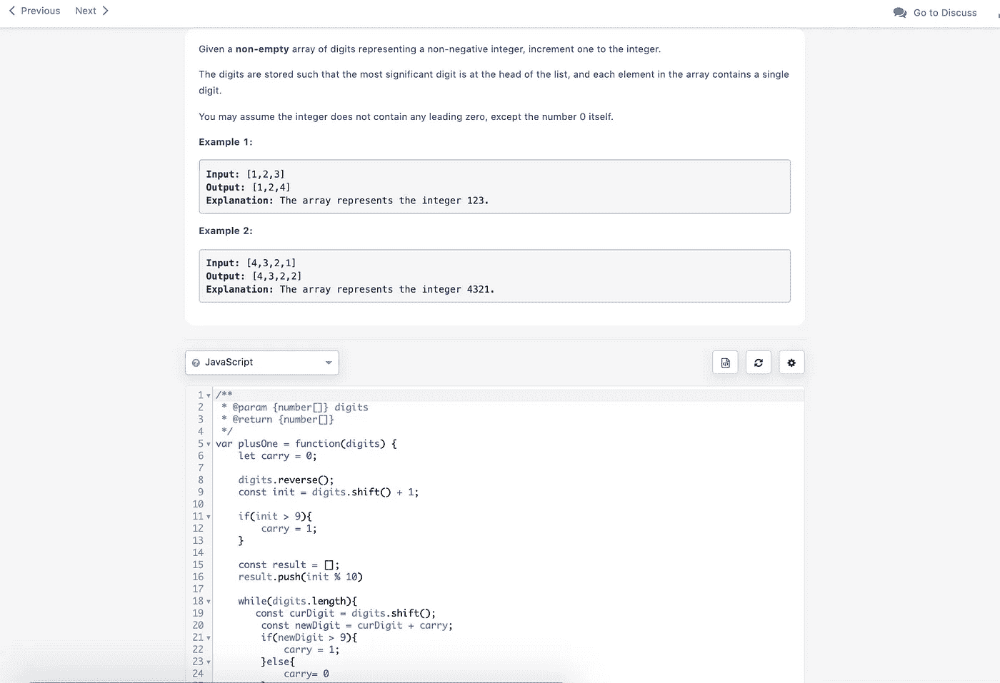

# 不要害怕 Leetcode

> 原文：<https://blog.devgenius.io/stop-being-afraid-of-leetcode-93d4883e3f88?source=collection_archive---------16----------------------->

如果你参加了编码训练营或自学，当有人提到算法、运行时复杂性或引用一些你从未听说过的众所周知的算法时，你的冒名顶替综合症就会爆发……你想知道，我应该知道这些东西吗？

训练营(有时)非常适合让毕业生通过以前端为中心的项目和课程为劳动力和典型的开发人员任务做好准备，这通常是以学习通用算法为代价的。

我永远不会忘记几年前我加入一家初创公司的时候，我们在讨论为运送货物的卡车司机优化路线的可能性。一位高级工程师开了一个关于旅行推销员问题的玩笑，每个人都笑了，包括我，尽管我不知道他们到底在说什么。

然后他说，让我们使用冒泡排序来降低运行时的复杂性…

虽然大多数软件开发人员承认，重新实现排序和搜索或可怕的图形问题的常用算法是相当罕见的，但学习它们只会加深您的技能组合，并让您对我们每天都在利用的这些算法有所欣赏。

如果你不是真的为了学习而学习，那么金钱的承诺可能会给你学习所需的灵感。如果你打算面试任何一家顶级(甚至是中级)科技公司，并获得一份令人垂涎的薪水，你希望这份薪水能填补你在特斯拉和 AllBirds 生活中的空白，那么你需要把 Leetcode 作为你的朋友。

Leetcode 最初可能会令人生畏，因为你可能会遇到你在日常工作中从未遇到过的问题，并且找到一个解决方案，即使是一个次优的解决方案也会占用你几个小时的时间。至少一开始是这样。

> 我对待 Leetcode 的方式和我对待锻炼的方式一样——一种必要的习惯，它的好处并不总是立竿见影。

擅长 Leetcode 的秘密，也是让你擅长任何事情的“秘密”:一致性。是的，也许不是你想要的性感答案，但这是事实，露丝。一旦你完成了各种各样的问题，研究答案，检查讨论，你会发现出现的模式。

以下是我解决 Leetcode 问题的清单:

1.  选择一个你目前知识范围内的问题。解决一个你完全熟悉的东西对你帮助不大。
2.  彻底理解你试图解决的问题，在写任何东西之前看看输入和输出的例子！
3.  仔细考虑一种方法，即使是非常幼稚、次优的方法，然后开始编写你理解的代码。忍住用谷歌搜索问题的冲动，而是用谷歌搜索你有困难的具体领域。在上面的例子中，我需要提醒自己如何从数组中获取第一个元素，以及从除法中获取余数的语法。
4.  一旦你有了类似的解决方案，运行那个坏男孩，看看结果是什么。
5.  好吧，这是错的，大概是第 20 次了。在某个时候，你会耗尽你的脑力。有时候，睡了一夜，醒来会想到一个在之前的尝试中没有考虑到的解决方案。有时候我不会。这是时候检查问题的讨论或阅读探索解决方案的文章了——没错，几乎每个 Leetcode 问题都有小文章。
6.  不要复制粘贴解决方案。事实上，你的目标应该是足够好地理解问题，这样你仍然可以精心设计你自己的解决方案，其中一些是你在上一步中查找到的解决方案。
7.  在对所有那些阻碍你前进的问题进行了足够的收集和研究之后，你应该开始看到一种用于解决各种问题的方法模式:深度优先搜索、广度优先搜索、二分搜索法、滑动窗口…
8.  经常重复 1-7。

虽然有些人靠 Leetcode 为生，但我仍然相信它不一定是成为更好的开发人员的最有效的工具，但它是进入顶级公司的必要条件(在很大程度上)，会让你更好地解决问题，至少会让你听到其他开发人员开的所有无聊的玩笑。