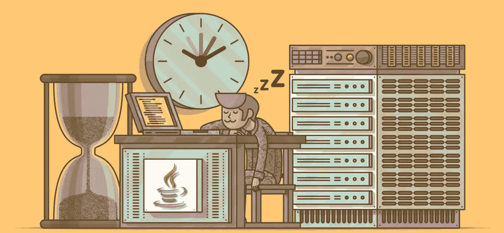
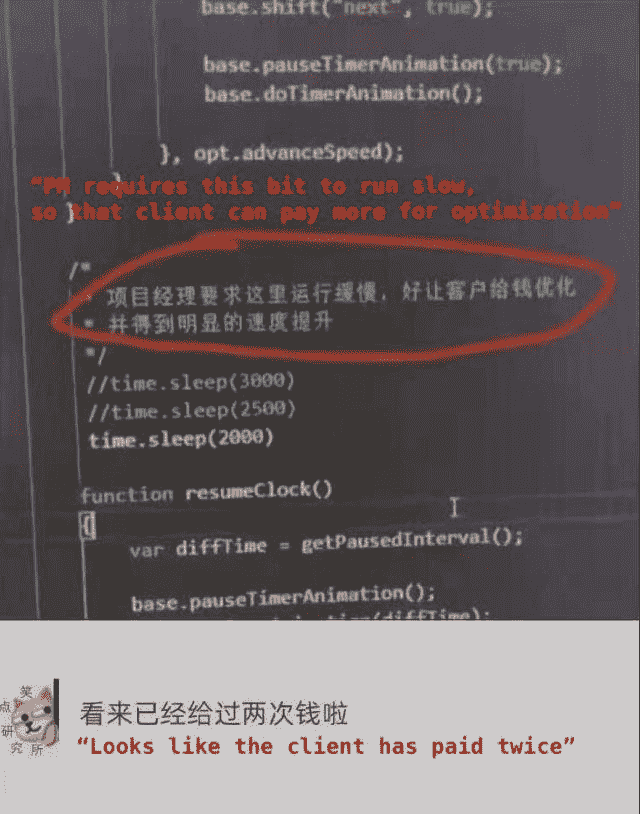

# 停止向客户端收费，以消除故意不良优化

> 原文：<https://blog.devgenius.io/stop-charging-clients-to-remove-intentionally-bad-optimiziation-bf4b53b8e595?source=collection_archive---------7----------------------->

我们能不能不要让 thread.sleep()成为剥削的工具，拜托了。



如果你经常浏览开发论坛，你可能已经看到了一个新的趋势，那就是*几乎*看起来太愚蠢而不真实。

> *一些开发人员在他们的代码中添加指令来降低执行时间，然后向客户收取额外费用来“修复”性能。*



放慢你自己的应用程序的速度，以便以后推销改进。

比如说；

```
//UnoptimizeddoThing()
thread.sleep(5000)
doAnotherThing()//OptimizeddoThing()
doAnotherThing()
```

# 但是客户对结果很满意！

对于对代码库一无所知的客户来说，代码经过“优化”后，性能确实会更快，所以从他们的角度来看，这钱花得值。犯规没有坏处？
事实是，他们花了额外的钱让应用程序运行在它应该运行的**基础级别**。

你可能会说*根据定义，*消除有意浪费时间的行为确实是一种优化形式。

你真的认为客户会满意吗？当然不是。他们可能会以更有力的论据反驳，说你没有兑现你的交易承诺，故意隐瞒产品的性能。

# **如果我不小心写了糟糕的性能代码怎么办？**

那么，故意表现糟糕和只是写缓慢的代码之间的界限在哪里呢？比方说，我正在编写一个 web 应用程序，我没有使用任何技术来减少重新渲染或计算时间，所以结果是一个非常慢的应用程序。那和加`thread.sleep()`一样吗？

> 在这种情况下有一个明显的区别——意图。

如果你已经尽力做好一个产品，结果却很慢，那就很不幸了，你的客户可能会(有理由)问为什么会这样。可能有很多合法的机会通过改进你的糟糕代码来优化应用程序。

如果你试图故意拖慢你的应用程序，以便稍后销售解决方案，那么你就是欺诈你客户的同谋。

# 请不要把诈骗常态化。

作为一名开发者，你的工作应该是遵循客户的规范，尽可能开发出最好的应用来满足他们的需求。这绝不是敲诈他们。这真的很简单，但似乎发生得越来越多。由于大多数客户无法阅读代码，这种行为可能不会有严重的后果，但请保持警惕，确保您没有参与这一骗局的任何部分。

如果你喜欢这篇文章或者觉得它有用，请随意。或者，你可以在这里的[](https://jamesmbrightman.medium.com/membership)**培养基上支持我，或者给我买一杯* [*咖啡*](https://ko-fi.com/jamesbrightman) *！非常感谢所有的支持。**