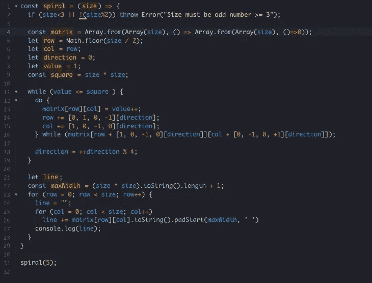
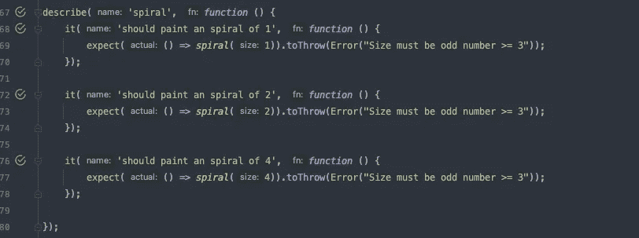
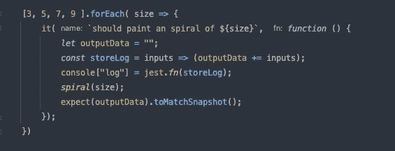
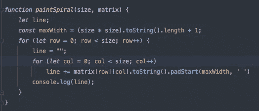
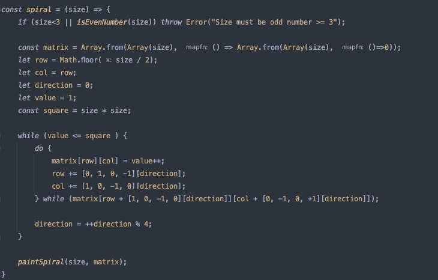
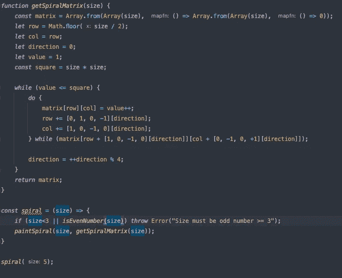
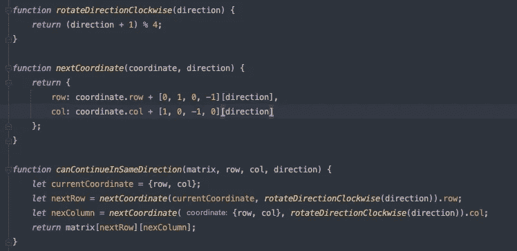
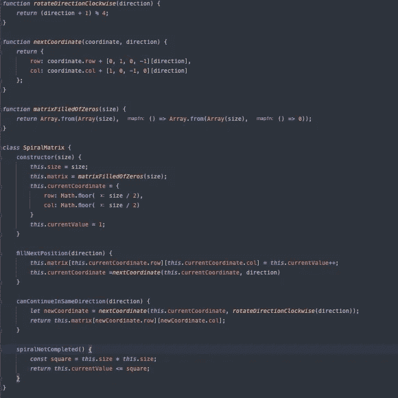
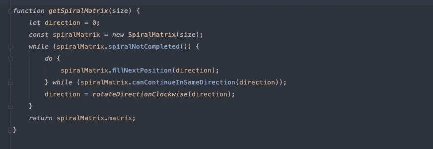

# 停止评论，开始重构

> 原文：<https://blog.devgenius.io/stop-commenting-start-refactoring-d8b2978ba241?source=collection_archive---------2----------------------->

这是软件中那些冗长的讨论之一，为什么评论我们的代码，为什么不重构它？


我想到这一点是因为我在 LinkedIn 上发现了一个有趣的帖子，要求在不包含注释的情况下使一段代码更具可读性。



[https://jsfiddle.net/SanjayVyas/tfgz1eL3/3/](https://jsfiddle.net/SanjayVyas/tfgz1eL3/3/)

所以我想尝试一下可能是个好主意，我能在不添加评论的情况下改进它吗？。
第一条线索是主要函数的名字，螺旋。除此之外，乍一看，很难理解这是如何工作的，或者是在做什么。
对我来说，这是开始使用科学方法的一个很好的例子，如果我们不明白代码在做什么，为什么不创建一些测试来发现它呢？。

螺旋函数接收到一个数字，似乎向控制台描绘了一些东西。让我们创建一些测试，试图了解基于输入的输出是什么。
为了做到这一点，我只是试着运用这个方法并取得一些成果。让我们从我在代码中看到的基本东西开始，某种验证:



在这种情况下，我们可以运行应用程序，看看结果是什么，然后写下期望。通过这些测试，在我看来，输入参数“size”需要是一个大于或等于 3 的奇数。在另一种情况下，我们将抛出一个异常。
所以我们可以用这些信息重构 if:


剩下的代码在做什么？，不知道，我现在不想想太多，但是我想有一个简单的方法来验证我的更改没有引入新的 bug。为此，我将使用金主术。这基本上是一种测试，我们将传递一组预定义的输入值，并将算法的结果保存在文件中，以便稍后检查结果是否相同。如果你想知道更好的解释，看看这里的。

因为这是 JavaScript，并且我们使用 jest，所以很容易根据 size 输入参数创建结果的快照，并将它们与之前保存的结果进行比较。



完成后，我们有一组测试，可以帮助我们查看在处理代码时是否引入了错误。我还没有学到太多关于代码的知识，但是从这一点开始，我可以做更大的假设和重构来理解代码。

我注意到的第一件事是，我的问题的最后一部分是试图将创建的矩阵绘制到控制台。那么，为什么不将这部分提取到一个单独的方法中，以减少我们在代码中看到的细节呢？。

让我们使用 IDE 的 refactor 选项来重构代码，它会告诉我们“col”和“row”变量需要作为参数传递给我们的新方法(paintSpiral)。但这是没有原因的，为什么我们要重用那些变量，因为它们只需要在矩阵的行和列上迭代。因此，让我们去掉这种耦合，使用新的变量。



运行测试，一切正常。我们处于一个更好的位置，现在我们的代码是这样的。



这一步是在给我下一步的思路，是的，我们的代码好像分为:
“检查输入数据”
“计算螺旋矩阵”
“绘制螺旋矩阵”
所以让我们重构我们的代码，创建一个新的方法来计算螺旋矩阵



现在问题似乎更容易了，我们可以更专注于我们要做的计算螺旋矩阵。


上面的行似乎创建了一个全是零的数组。所以在这一点之后，我们会有一个矩阵，每个单元都是 0。只需提取该函数并给它起个好名字，就能让我们更好地了解正在发生的事情:


这里，我们初始化了一些变量，以便在两个嵌套循环中使用它们。如果我们更深入地研究“do while ”,我们会注意到我们在每次迭代中将“value”变量递增 1，并使用该值填充 matrix [row，col]单元格。


之后，我们使用方向计算 row 和 col 的下一个值。在这个循环中，方向变量不变，所以当这个条件为真时，我们保持相同的方向:


似乎我们正在检查矩阵上某个特定单元格的值。如果该单元格包含零，我们将结束循环，如果是另一个，我们将继续。所以我测试了这个选项，修改了代码并运行了我的测试。


不，我的测试失败了，在测试了不同的选项后，我意识到我们在检查两个条件:

*   下一个单元格值不为零。
*   下一个单元格[行，列]在矩阵内部。

但是我们为什么要这样计算下一行和下一列呢，想到这里我意识到我们计算“行”的方式:

```
row + [1, 0, -1, 0][direction]
```

与我们计算方向上的下一行的方法相同，但将所有值左移一位(第一个值是这里的最后一个值，这适用于行和列):

```
row += [0, 1, 0, -1][direction];
```

这和改变方向是一样的，所以如果我们开始向东移动，我们就把它改为向南，我们检查在那个位置是否有一个零，或者这个单元格是否存在。如果我有一个零，或者矩阵中没有更多的单元，那么我就完成了循环。

如果顺时针旋转方向，我们将检查下一个单元格的值:

东，南，西，北

所以我们可以提取那部分，计算下一个位置，并在那种情况下澄清代码。



在这里，我开始意识到方向、列、行、值和矩阵是非常相关的。
所有这些值都在每次被称为 fillNextPosition 的迭代中更新。我可以做这样的事情


现在，如果我们看一下 fillNextPosition 和 canContinueInSameDirection，我们会发现大多数参数是相同的。这通常是一个信号，表明一个类需要将这个方法移动到它的内部，并将它们的参数定义为属性。
我在想，这是[原始执念](https://medium.com/the-sixt-india-blog/primitive-obsession-code-smell-that-hurt-people-the-most-5cbdd70496e9)的结果，我们的代码太依赖数组以及如何穿越它了。



我的解决方案的整个代码在这里是
我将在这里停止重构，我可以继续，但我认为我很清楚代码在做什么，我能够提高它的可读性。我通过重构的过程理解了代码，这是注释的最大好处之一。现在，这个解决方案可能会让我们思考更好的方法。当人们理解代码并看到那里的结构时，关于设计的对话才刚刚开始。如果我们只是评论代码，我们就失去了为下一个队友创造更好设计的机会。我们失去了让他从更好的位置开始重构的机会。

最后，这就是为什么我认为我们不应该评论我们的代码，只是重构它来改进。软件设计/架构的价值只是让人们更快地理解代码的复杂性，以一种更容易改变代码的方式来实现它。重构是在不改变行为的情况下改变代码内部结构的实践，我们需要测试来做这件事，但是这种实践是值得的。成对重构，如果你想管理谁和谁配对([https://pairing-matrix-thoughtworks.herokuapp.com/](https://pairing-matrix-thoughtworks.herokuapp.com/)，我的队友[亚历杭德罗·巴塔内罗](https://medium.com/u/cce9060af231?source=post_page-----d8b2978ba241--------------------------------)创造的一个伟大的工具)。一般来说，重构是比注释代码更好的工程实践。

只要记住代码不会说谎，但是注释会。