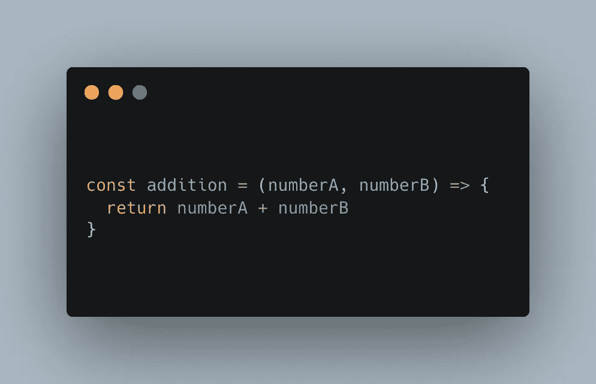
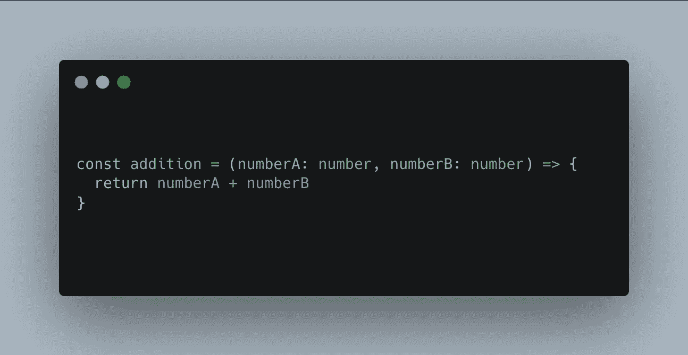
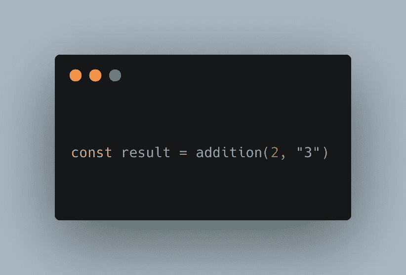
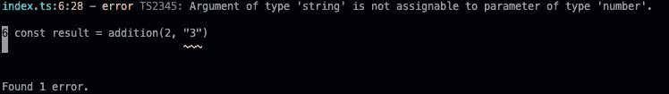
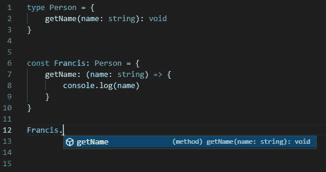
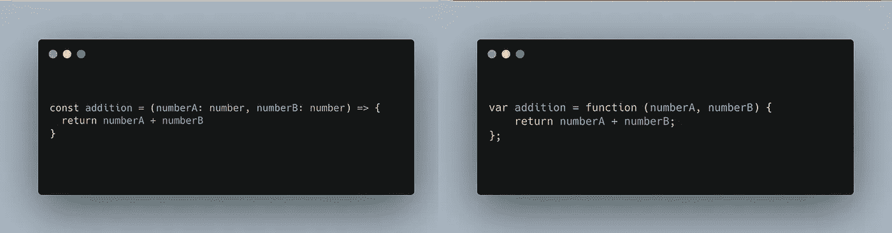
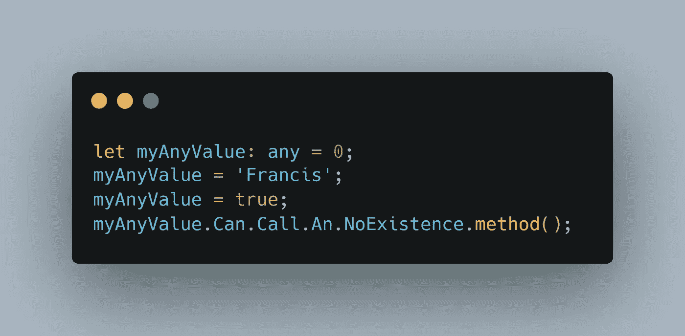
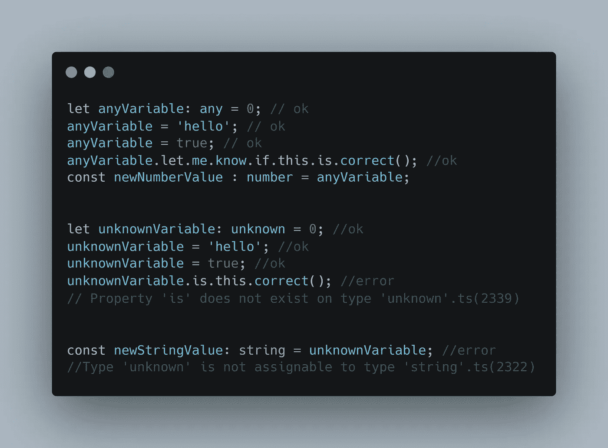
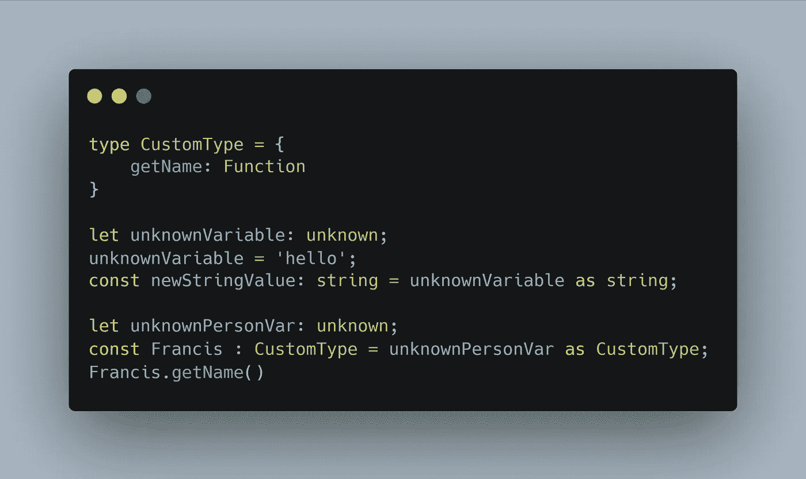

# 停止在 typescript 中使用任何

> 原文：<https://blog.devgenius.io/stop-using-any-in-typescript-24f5ead75ee0?source=collection_archive---------3----------------------->

## Typescript 最佳实践

## 自由可能是危险的

照片由[埃姆拉·卡拉](https://unsplash.com/@emrahkara?utm_source=medium&utm_medium=referral)在 [Unsplash](https://unsplash.com?utm_source=medium&utm_medium=referral) 上拍摄

Typescript 是一种强大的类型化编程语言，它允许我们构建 JavaScript。

一个*类型*将告诉编译器如何理解那段数据。换句话说，当你声明一个变量**的时候，你应该添加变量**的类型，比如 ***字符串*** 、 ***数字*** 、 ***布尔*** 等等。

typescript 的美妙之处在于，当我们写代码时，我们能够定义自己的类型,拥有自己的规则。

假设您有一个接收两个数字并返回这两个数字之和的函数。*图 1*

图 1 求和函数定义

在一个小系统中，我们可以知道我们发送给那个函数的是什么，这不是最好的做法，但我们可以处理它。但是，当我们在两三年后，甚至几天或几周后看到我们的代码时，会发生什么呢😅。

[Toa Heftiba](https://unsplash.com/@heftiba?utm_source=medium&utm_medium=referral) 在 [Unsplash](https://unsplash.com?utm_source=medium&utm_medium=referral) 上拍摄的照片

我们的系统将会变得太大，也许我们不记得我们到底做了什么，但是没关系，因为我们将会写很多行代码。

Typescript 来帮助我们解决这个常见问题。使用 typescript 有许多方法可以达到相同的效果，其中一种方法是将类型添加到参数中，以限制每个参数的有效类型。

什么？

让我们看看，下一个定义。*图 2*

图 2 类型脚本中的加法函数定义

我的函数只接受两个 ***数字*** *作为参数*，也就是说如果我要发送一个字符串，TypeScript 会在我要编译代码的时候抛出错误。

例如，*图 3* 中的代码会抛出一个错误，就像我们在*图 4* 中看到的那样。

图 3 错误呼叫

图 4“字符串”类型的参数不可分配给“数字”类型的参数

但是当我们定义正确的变量类型时，我们有更有用的用法。

例如，如果你正在使用类型，你正在记录你的代码，并从你的编辑器中的编译器那里得到帮助(图 5)，因为正如我们所看到的，如果我们传递了错误的数据，编译器会告诉我们，"🤦🏽‍♂️老兄住手……”

图 5 Visual studio 代码建议

正如你在前面的图片中注意到的，当我在 Visual Studio 代码或任何其他编辑器中开发时，编辑器会给我一个建议，告诉我哪些方法可用，哪些参数可以接受，以及我将得到什么结果。

类型是免费的，我们不会在最终的 javascript 中添加额外的行，这一点很重要，因为许多开发人员都很注意最终文件的大小。*图 6*

图 6 左侧是带有类型的 typescript 函数，右侧是 typescript 编译器的结果

如你所见，最终的结果仅仅是一个“普通的 JavaScript”。

## **任何一个**

***任何*** 都是 TypeScript 中最糟糕的类型，并不是一个可能会在我们的代码中引发大问题的解决方案，因为我们可以随心所欲地使用我们的变量。

***any*** 所做的是关闭所有类型脚本的规则，允许我们给变量*(图 7)* 赋值，这就是为什么我认为 ***any*** 类型是我们代码的银弹。

图 any 类型用法示例

如果你使用 ***任何*** ，你就是在告诉编译器， ***“我不需要你，我太酷了，我是个成年人，我知道我在做什么”***

然而， ***any*** 存在的原因只有一个，**我们可以在因为不知道那个库的结果而无法确定类型的时候，对第三方库使用类型 *any* 。**

但是在这种情况下，如果你使用 any 因为很容易，那么我推荐使用普通 JavaScript。

## 未知类型

不过哎，也不是什么都丢了，自从 Typescript 3 之后，就有了一个类型来代替 ***任何*** 也就是 ***未知*** 。

类似于 ***的任何*** 但是带有一些约束来帮助我们防止灾难。

我们来看一个 ***任意***vs***未知*** 类型的用法示例。*图 8*

图 8 任意 vs 未知的使用

正如你所看到的，我能够改变任何值并赋给我的 ***任何*** 变量，没有任何限制，甚至我们能够调用一个不存在的方法而不出错。

但是，对于一个 ***未知的*** 变量，我们也可以赋任何值，但是我们不能调用一个不存在的方法或者把它赋给一个新的变量。

有了这些规则，我们可以确保我的变量不会因为我改变了类型而表现出奇怪的行为。

要使用我们的 ***未知的*** 变量作为另一种类型，我们需要在赋值前对我们的变量进行强制转换。*图 9*

图九。铸造一个未知变量

在前面的例子中，我使用关键字 ***作为*** 来分配类型，并使用我的未知类型变量作为字符串和 ***CustomType*** 。

## 结论

我们需要尽可能地停止任何的用法，并开始使用**类型*来确保我们代码的高质量，如果我们将编译器特性关闭，也许我们没有使用正确的语言来开发我们的系统。Typescript 是关于类型的，我们需要使用它们，如果我们不确定哪种类型是有效的，那么就使用未知类型。*