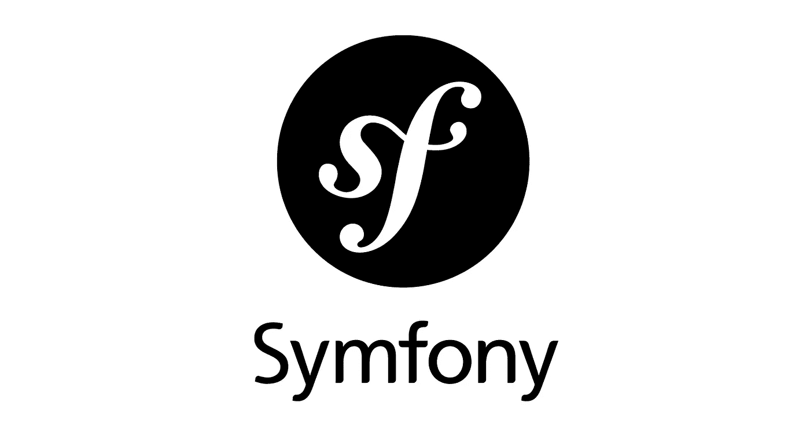

# 停止在 Symfony 表单中使用实体

> 原文：<https://blog.devgenius.io/stop-using-entities-in-symfony-forms-c42ec0f5fcf6?source=collection_archive---------0----------------------->

## 你在你的 Symfony 表单中使用域实体吗？让我们正确地传输表单中的数据。

[symfony.com](https://symfony.com/)

你用 Symfony 形式的*教条实体*吗？你应该**停止**那样做。不应该交叉的混合层永远不会有好结果。至少在较大的应用程序中是这样。

如果开发一个简单的 CRUD 应用程序，这种方法没有任何问题。随着你的模型在逻辑和复杂性上的增长，事情可能会变得混乱。

今天，我们将建立一个网络平台，人们可以张贴广告。考虑一个常见场景的典型控制器示例—在数据库中更新对象的详细信息:

为了使这种方法有效，您的实体必须包含 getters 和 setters 来访问 Advertisement 类的各个属性:

以下是我发现这个设计有缺陷的原因:

*   您最终会得到一堆属性、getters 和 setters，但是几乎没有逻辑。有些人甚至可能称这个类为“域对象”我称之为“数据传输对象”
*   一个类是**属性和行为**的集合。假设这样一个类只包含简单的 setters 和 getters，没有任何逻辑，那么您还不如删除访问器方法，并将这些属性公开！
*   数据验证神奇地发生在框架内部。如果出现任何配置错误，您可能会将对象保存为无效状态。
*   您只能在表单的上下文中验证对象的状态。

现在，我希望你们中的一些人对如何使用数据映射器和表单事件侦听器来更好地实现这一点发表一些不满的意见。

相信我所说的:*我去过那里*。多年来，我一直在用巫毒魔法研究表格和表格绘制者；不断努力使我的实体和嵌套集合与请求保持同步。我是 Symfony 表单组件的主人，而我的实体毫无价值。

我太拘泥于框架了。我依靠框架为我做事。我很懒，或者至少没有今天这么有思想。

我是领域驱动设计的忠实粉丝。我喜欢让我的实体自我包含和自我验证。

自验证是聚合根的一个要求。根据定义，聚合根需要始终有效。实体和表单绑定在一起，要么不可能实现，要么很难实现。

> 一个聚合根应该是一座城堡:周围有护城河，到处都有弩炮塔来保护对象的心脏:它的状态(和不变量。)

让我们让面向对象的代码再次变得伟大，好吗？不再有**无用的设定器**。有意义的方法，充满了逻辑来保证域的安全。

由于这个班级不再受任何框架的约束，强加规则变得**毫不费力**。假设我们希望防止作者在广告发布后更改其类别:

你怎么想呢?你喜欢吗？按照这种方式实施规则，任何时候都不可能破坏这个类的状态。

`ChangeDetailsRequest`类可以是一个简单的数据传输对象，您可以手动创建(甚至绑定到 Symfony 表单):

你可以随意塑造形体，因为它现在独立于实体。不存在任何可能导致模型损坏的错误。

是时候重写控制器了:

# 利弊

当然你要保证输入数据的正确性！但是，这种验证不属于域对象或控制器。这被称为*关注点分离。*

这种解决方案的代价是轻微的代码重复。您将不得不维护您的域实体的核心规则和 Symfony 表单中的另一组规则。

另外，只要输入不违反实体的核心规则(例如，对非付费用户、VIP 用户、管理员等的不同限制),您就可以自由制定验证规则。)

# 单元测试

fat 域方法的单元测试绝对轻而易举！它没有痛苦，不需要任何模仿或框架魔法:

这个故事对你有价值吗？请留言支持我的工作👏鼓掌表示感谢你知道你可以不止一次鼓掌吗？🥰 *谢谢你。*