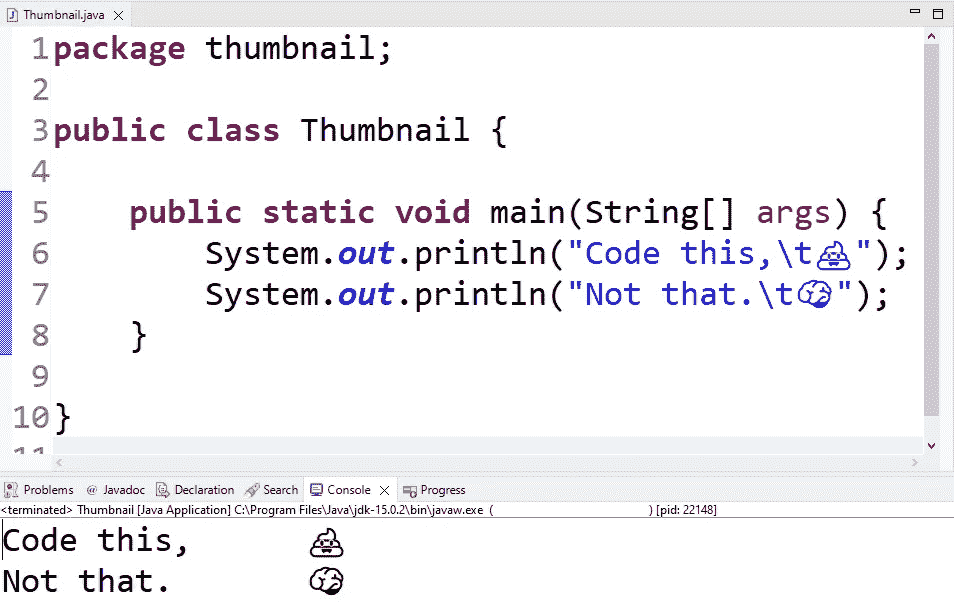

# 停止使用返回值，改用类

> 原文：<https://blog.devgenius.io/stop-using-return-values-use-classes-instead-28b82d68c913?source=collection_archive---------12----------------------->

## 如何(不)在 OOP 中接吻。



轻量级模式的 Eclipse Java IDE 才是最好的！

我经常遇到程序员同事(自称“软件工程师”，你能相信吗？)，他们没有最大程度地使用自己选择的编程语言。让我告诉你，我的意思是:

然后他们像这样调用函数:

正如所料，输出如下所示:

```
6 + 2 = 8
6 - 2 = 4
6 * 2 = 12
6 / 2 = 3
```

现在，乍一看，这似乎是实现这些功能的完美有效的方法，其性能可能与生产中编写这种代码的人的大脑一样流畅。但实际上，这是最糟糕的写作方式。所以我们开始重构吧。

## 改进 1:消除膨胀

对于这个小功能来说，上面的例子太长了。这是因为文档注释。在这种情况下，我们可以删除它们，因为代码已经非常简单明了。

之后，为了弥补文档的不足，我们可能还想简化参数列表，这样我们就不需要每次调用函数时都写`6`和`2`。我们可以通过将数字移入类变量来实现这一点，如下所示:

使用这些函数即使不简单，也一样简单:

## 改进 2:缓存结果并减少返回

还记得你计算器上的`Ans`吗？是的，那个:


这是我的钥匙

猜猜当你按下它时会发生什么。它是否重做最后一次计算来得到结果？不，它保存了上次计算的结果，并使用保存的值。在我们的例子中，我们也可以通过将结果保存到一个全局变量来做类似的事情。为了保持一致，我们也去掉函数的返回值，这样我们总是以同样简单的方式访问计算结果:

现在有了缓存的结果

如何访问结果

## 改进 3:隔离内部状态

这些优化工作得很好，但是我们已经向我们的`Arithmetic`类引入了内部状态，并且我们一次只能存储一组参数。因为我们使用 Java，一种面向对象的编程语言，我们可以改变我们的方法，不要成为`static`。当我们这样做时，我们还应该将`RESULT`变量改为 private，并通过 getter 访问它，这样我们就不会意外地从外部更改它:

嘿，看，这是一个构造函数！

使用算术的实例

## 改进 4:每个计算一个实例

但是，如果您不知道最近执行了哪个操作，那么重用结果仍然是危险的。我们可以为此使用`enum` s，并将一个操作绑定到`Algorithm`的一个实例，并重用和存储多个计算:

枚举是一个伟大的语言功能！

这么有用！

## 改进 5:继承

虽然`enum` s 非常有用，但我们不应该忘记，每次调用`calculate()`时，程序都必须检查您想要执行的操作，这可能会在现代硬件上花费一些时间(我还没有检查过，但无论如何让我们提前优化)。我们可以通过制作`Arithmetic` `abstract`并在一个独立的类中实现每个算术运算来轻松解决这个问题，继承自`Arithmetic`。这样，我们将来也可以很容易地扩展算术运算的范围。

需要更多的构造者！

如何使用它

## 改进 6:子类和子实例

我们重构后的代码看起来已经很不错了，但是我们实际上又遇到了一个老问题:我们需要为每个实例重新编写`6`和`2`。如果一组`Arithmetic`的实例可以共享这些值并将其用于不同的操作，这不是很好吗？事实上，我们可以通过从类的定义中移除`static`并让它们实现一个接口(在本例中为`Calculation` )来实现。以下是方法:

这点燃了欢乐的火花。

如此漂亮整洁！比以前好多了！

我们完事了。这是我能想到的最好的代码版本。

# 结论

优化可能是一个漫长而复杂的过程，但这是值得努力的。当其他人看到你重构和简化的代码时，他们一定会认出你是天才。

在这篇文章中，我只展示了一些秘密技术，程序员(哈哈)用这些技术来保住他们的工作，并花更多的时间呆在他们经理的办公室里。你有什么建议，如何进一步改进上面的例子或者知道更多这些技巧吗？如果你喜欢这篇文章，请在下面评论并留下你的掌声。

***愚人节快乐！***