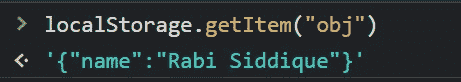

# Javascript 中的存储 API

> 原文：<https://blog.devgenius.io/storage-api-in-javascript-a18ad8d7f125?source=collection_archive---------3----------------------->

存储 API 方便了我们开发人员在客户端存储数据。以前，cookies 用于此目的，但它有自己的缺点。与 cookies 相比，Storage API 更加安全，允许我们在浏览器上本地存储大量数据。

数据存储在 String 类型的键值对中。存储 API 为我们提供了两个存储数据的选项:

1-会话存储
2-本地存储

您可以从应用程序选项卡下的开发工具中查看您的本地和会话存储，如下所示:

## 会话存储

存储在会话存储中的数据不是持久的。只要浏览器或标签打开，它就在那里，包括页面重新加载和恢复。关闭浏览器或选项卡时，会话存储中的数据将被清除。它的最大存储容量为 5MB。

代码示例:

## 局部存储器

另一方面，本地存储中的数据可以保存更长时间。它是持久的，即使浏览器关闭，它仍然存在于浏览器中。数据没有过期时间。我们可以使用 Javascript 或通过清除浏览器缓存来清除本地存储数据。与会话存储相比，本地存储具有更大的存储容量。

代码示例:

## 同源策略

存储 API 遵循同源策略。起源有三个定义:

*   使用的协议，即 HTTP，HTTPS。
*   主机或域名，即 www.google.com
*   托管 web 应用程序的端口。

因此，具有相同协议、主机和端口号(如果指定)的 URL 具有相同的来源。

出于安全原因，存储 API 遵循同源策略。在特定原点定义的数据只能在定义它的原点访问和操作。考虑一下原点`https://www.example.com`，让我们假设一些数据是在原点的本地或会话存储中定义的。

如果我要从 URL`https://www.example.com/blogs`或`https://www.example.com/users`访问这些数据，我将能够访问它，因为两个 URL 的来源是相同的。但是，对于 URL`https://www.example.com:5656`或`https://www.example2.com`，我们将无法访问本地或会话存储中的数据，因为 origin 的值已经改变。第一个 URL 具有不同的端口号`5656`，而第二个 URL 具有不同的主机值`www.example2.com`

## 在存储 API 中存储对象

如上所述，存储 API 将数据存储为 String 类型的键值对。我们试图存储在本地或会话存储中的任何值都被本地和会话存储的`setItem`方法转换成一个字符串。

让我们将一个对象存储在本地存储中，如下所示:

如你所见，我们遇到了一个问题。下面的`setItem`通过`String(obj)`将对象`obj`转换成一个字符串，该字符串返回`[object Object]`，该值存储在本地存储器中，如上图所示。这不是我们想要的。我们希望存储对象内部的实际值。

事实证明，有一种方法。使用`JSON.stringify()`，我们可以将 Javascript 对象转换成 JSON 字符串。然后，可以将该字符串存储在本地或会话存储中，如下所示:

现在，我们能够在本地或会话存储中存储对象。但是有一个问题。当我们需要访问对象的值时，本地存储的`getItem`方法会返回一个字符串。

要解决这个问题并将这个字符串转换回一个对象，我们可以如下使用`JSON.parse()`:

现在，我们正在获取存储在本地存储中的相同对象。并且解决了与从本地或会话存储中存储和检索对象相关的问题。

感谢您阅读帖子。希望你觉得有用。:)

我们来连线:
[LinkedIn](https://www.linkedin.com/in/rabi-siddique-b6b4971a0/)
[Twitter](https://twitter.com/rabisiddique234)