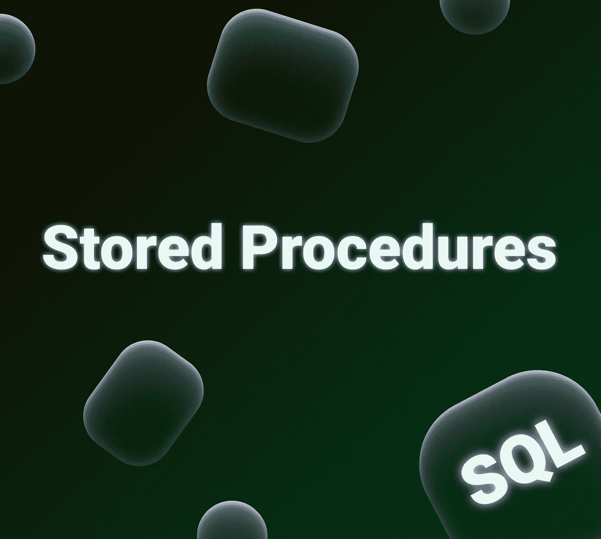
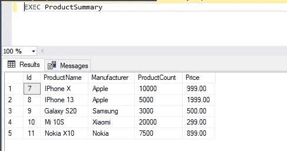
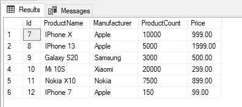
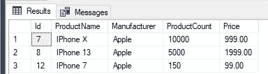
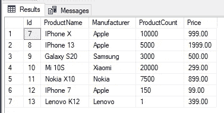
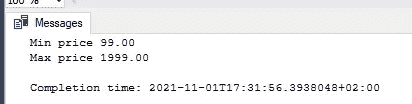

# 存储过程 SQL

> 原文：<https://blog.devgenius.io/stored-procedures-sql-34c2d146d6e7?source=collection_archive---------1----------------------->



你可以在我的网站上阅读这篇文章。

你好。你在程序上是新手吗？没关系，在这篇文章中，我将带着这个强大的工具与您见面。我们将使用 T-SQL 来编写程序。好了，我们开始吧。

**那么，程序是什么？**

存储过程表示作为一个单元执行的一组指令。因此，存储过程允许您简化复杂的操作，并将它们放入单个对象中。您可以编写一次过程，然后反复重用它。此外，您可以向过程传递参数并返回值。

存储过程还允许您限制对表中数据的访问，从而减少与这些数据相关的有意或无意的不必要操作的可能性。

而另一个重要的方面就是**性能**。存储过程通常比常规 SQL 语句快。这是因为程序代码在第一次运行时编译一次，然后以编译后的形式保存。

这是一个非常强大的东西，所以每个人至少应该知道它的存在

**如何声明和执行程序？**

我使用*SQL Server Management Studio*和*微软 SQL Server。*

首先，我们将创建一个表`Products`，我们将为其编写程序。

```
CREATE TABLE Products(Id INT IDENTITY PRIMARY KEY,ProductName NVARCHAR(30) NOT NULL,Manufacturer NVARCHAR(20) NOT NULL,ProductCount INT DEFAULT 0,Price MONEY NOT NULL);
```

并插入一些数据，例如:

```
INSERT INTO Products VALUES ('IPhone X', 'Apple', 10000, 999);INSERT INTO Products VALUES ('IPhone 13', 'Apple', 5000, 1999);INSERT INTO Products VALUES ('Galaxy S20', 'Samsung', 3000, 500);INSERT INTO Products VALUES ('Mi 10S', 'Xiaomi', 20000, 299);INSERT INTO Products VALUES ('Nokia X10', 'Nokia', 7500, 899);
```

现在，我们可以使用以下命令选择数据:

`SELECT * FROM Products`

让我们用这个做一个程序:

```
USE productdb; GO CREATE PROCEDURE ProductSummary AS SELECT * FROM Products 
```

`CREATE PROCEDURE`和`CREATE PROC`命令用于创建存储过程。

因为`CREATE PROCEDURE`命令必须在一个单独的包中调用，所以`GO`命令在安装当前数据库的`USE`命令之后使用，以定义一个新的包。

程序名后面必须跟有`AS`关键字。

为了将程序体与脚本的其余部分分开，程序代码通常放在一个`BEGIN` … `END`块中:

```
USE productdb;GOCREATE PROCEDURE ProductSummaryASBEGIN SELECT * FROM ProductsEND;
```

添加完过程后，我们可以看到在 SQL Server Management Studio 数据库节点下的可编程性->存储过程子节点:

最后，我们可以用命令`EXEC`或`EXECUTE`运行程序，并查看结果。

```
EXEC ProductSummary
```



使用以下命令删除程序:`DROP PROCEDURE ProductSummary`

**创建带参数的 SQL 存储过程**

过程可以带参数。可以输入参数——在它们的帮助下，您可以向过程传递一些值。参数也可以输出，它们允许你从过程中返回一些值。

让我们创建一个接受输入参数并向表`Products`添加新记录的过程。

```
USE productdb;GOCREATE PROCEDURE AddNewProduct @name NVARCHAR(30), @manufacturer NVARCHAR(20), @productCount INT, @price MONEYASBEGIN INSERT INTO Products(ProductName, Manufacturer, ProductCount, Price) VALUES(@name, @manufacturer, @productCount, @price)END;
```

在过程名之后，有一个输入参数列表，它们的定义方式与变量相同——名称以@符号开头，名称之后是变量的类型。

下一步是使用此过程:

```
USE productdb; DECLARE @productName NVARCHAR(30), @company NVARCHAR(20);DECLARE @productCount INT, @price MONEYSET @productName = 'IPhone 7'SET @company = 'Apple'SET @price = 99SET @productCount = 150 EXEC AddNewProduct @productName, @company, @productCount, @priceSELECT * FROM Products
```



再举一个例子，考虑这样一个过程，它采用一个输入参数按制造商过滤并输出这些记录:

```
USE productdb;GOCREATE PROCEDURE SelectProductsByManufacturer @manufacturer NVARCHAR(20)ASBEGIN SELECT * FROM Products WHERE Manufacturer = @manufacturerEND;--! Also we can pass parameters directly like below:EXEC SelectProductsByManufacturer 'Apple'--! You can also pass values to procedure parameters by name:EXEC SelectProductsByManufacturer @manufacturer = 'Apple'
```



如果我忘记传递参数会发生什么？你是对的——错误:)
要解决这个问题，你可以把参数标记为可选的，并给它一个默认值。
让我们创建一个带有可选参数的过程。

```
USE productdb;GOCREATE PROCEDURE AddNewProductWithOptionalCount @name NVARCHAR(20), @manufacturer NVARCHAR(20), @price MONEY, @count INT = 1 --! default valueASBEGIN INSERT INTO Products(ProductName, Manufacturer, Price, ProductCount) VALUES(@name, @manufacturer, @price, @count)END
```

并执行它:

```
EXEC AddNewProductWithOptionalCount 'Lenovo K12', 'Lenovo', 399SELECT * FROM Products
```



现在，对于@count 参数，您不需要向过程传递值，默认值将是 1。

最好将可选参数放在过程参数列表的末尾。

还记得参数可以输出吗？输出参数允许您从过程中返回一些结果。使用`OUTPUT`关键字指定输出参数。

示例:

```
USE productdb;GOCREATE PROCEDURE GetMinMaxProductPrice @minPrice MONEY OUTPUT, @maxPrice MONEY OUTPUTASBEGIN SELECT @minPrice = MIN(Price),  @maxPrice = MAX(Price) FROM ProductsEND;
```

当调用输出参数的过程时，变量用`OUTPUT`关键字传递:

```
USE productdb;DECLARE @minPrice MONEY, @maxPrice MONEY EXEC GetMinMaxProductPrice @minPrice OUTPUT, @maxPrice OUTPUTPRINT 'Min price ' + CONVERT(VARCHAR, @minPrice)PRINT 'Max price ' + CONVERT(VARCHAR, @maxPrice)
```



请记住，您可以在过程中组合输入和输出参数。

还有一个功能——通过`ALTER PROCEDURE`改变现有程序

让我们改变这一个程序。

```
USE productdb;GOCREATE PROCEDURE SelectProductsByManufacturer @manufacturer NVARCHAR(20)ASBEGIN SELECT * FROM Products WHERE Manufacturer = @manufacturerEND;
```

到

```
USE productdb;GOALTER PROCEDURE SelectProductsByManufacturer @manufacturer nvarchar(20)ASBEGIN SELECT * FROM Products WHERE Manufacturer LIKE @manufacturer + '%' --! Here we added LIKE operator insted of '='END;
```

仅此而已，但请记住，您可以在过程中使用 next 语句:

1.  否则
2.  在…期间
3.  继续
4.  破裂
5.  试着接住

感谢阅读这篇文章。希望之后你能更好地适应这些程序。编码快乐！

# 学到了新东西？

如果你喜欢这篇文章，可以 [**给我买杯咖啡**](https://www.buymeacoffee.com/stasoz) 我写下一篇文章的时候再喝:)

[](https://www.buymeacoffee.com/stasoz)

*更多内容尽在*[*blog . dev genius . io*](http://blog.devgenius.io)*。*