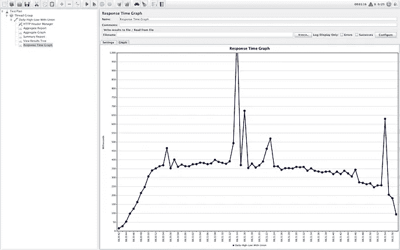
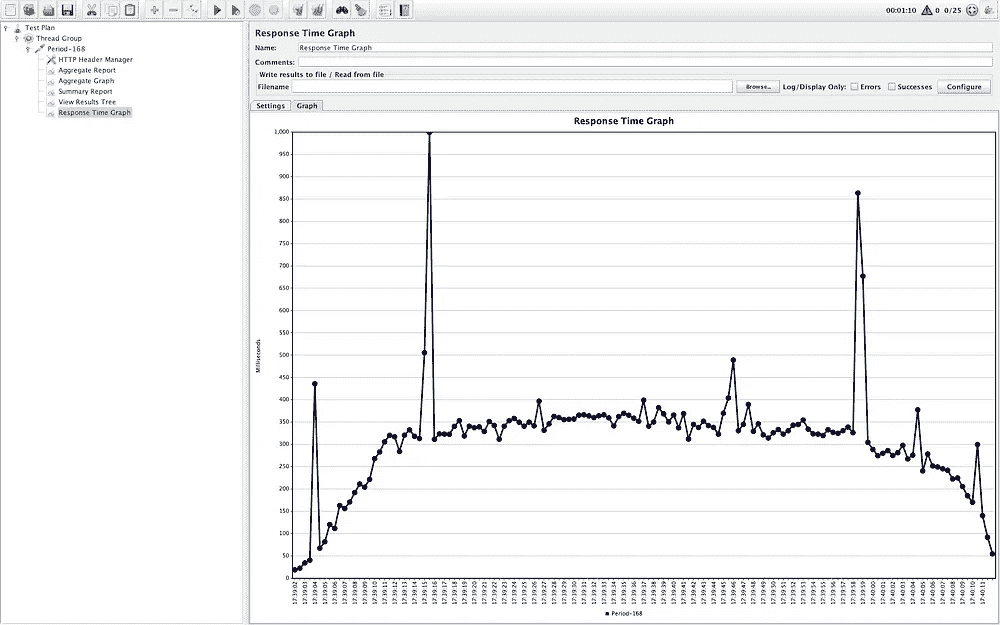

# 用 Influx DB 存储和处理实时时间序列数据

> 原文：<https://blog.devgenius.io/storing-and-processing-real-time-time-series-data-with-influx-db-5ba9bb015539?source=collection_archive---------1----------------------->

## 时间序列数据正在越来越多的应用中出现，包括物联网、DevOps、金融、零售、物流、石油和天然气、制造、汽车、航空航天、SaaS，甚至机器学习和人工智能。

当我在一家提供加密货币投标和询价平台的金融科技公司工作时，我有机会深入研究 influence DB。在那里，几乎每分钟都会从不同的来源获取 n 种产品的数据。这个数据被用来计算公司在那个时候可以提供给用户的正确价格。

**什么是潮人 DB？**

InfluxDB 于 2013 年首次发布，是 TSDB 领域的市场领导者，超越了之前的 Graphite 和 OpenTSDB。与许多 OSS 数据库公司一样，InfluxDB 获得了 MIT 单节点许可，付费计划可用于提供集群和其他生产就绪功能的 InfluxDB 云和 InfluxDB enterprise。

***InfluxDB*** 是一个用 GO 编写的快速时序数据库。这是一款非常棒的产品，可以存储带时间戳的数据，如应用指标、传感器数据和实时分析。

在 InfluxDB 2 之前。x release 2019 年，InfluxDB 平台由 TICK 栈组成:Telegraf(收集和报告指标的代理)、InfluxDB、Chronograf(从 InfluxDB 查询数据的接口)和 Kapacitor(实时流数据处理引擎)。如下图所示，InfluxDB 1。x 主要关注来自服务器和 web 应用程序的时序数据。在 Prometheus 进入这一领域之前，InfluxDB 拥有最重要的社区和集成来收集、存储和查看应用程序指标。

**数据模型(标签集模型)**

除了时间戳字段之外，每个数据元素都由各种标签(可选的索引元数据字段)、字段(键和值)和度量(标签、字段和时间戳的容器)组成。下面的例子是科学家安德森和马伦在克拉马斯和波特兰收集的蜜蜂和蚂蚁的普查数据。在这里，位置和科学家是标签，属于蜜蜂和蚂蚁的带有字段/值对的普查测量。

**数据模式(TSM & TSI)**

数据元素存储在时间结构合并树(TSM)和时间序列索引(TSI)文件中。TSM 可以被认为是一棵 LSM 树，它有一个预写日志(WAL)和只读文件，类似于经过排序和压缩的 SSTables。TSI 是磁盘上文件的索引，InfluxDB 内存映射该索引以利用操作系统最近最少使用的(LRU)内存来帮助处理高基数数据集(即集合中的大型元素)。

**Flux 脚本语言**

InfluxDB 开发了一种特定于领域的语言来帮助查询数据。Flux 还有一个 SQL 包来帮助查询 SQL 数据源。

最值得注意的是，InfluxDB 在接收数据之前并不强制执行模式。相反，模式是从输入数据自动创建的，从标记和字段推断。这种类似 NoSQL 的体验既是 InfluxDB 的优势，也是其劣势。对于基数相对较低、自然适合这种标记集模型的数据集(例如，大多数基础设施和应用程序指标、一些物联网数据、一些财务数据)，InfluxDB 非常容易上手，无需担心设计模式或索引。它在目标是创建物理资产的数字模型的用例中也大放异彩。例如，在物联网中，可能需要创建一个数字双胞胎来表示一组传感器并接收有组织的数据。

# **特性**

> 自定义查询语言没有类似 SQL 的体验。
> 
> 实时聚合的连续查询。
> 
> 无模式。
> 
> 深刻的见解和分析。

***什么时候用潮人 DB？***

这些数据库尤其用于存储和分析传感器数据或带有特定时间段时间戳的协议。例如，物联网设备或科学测量仪器以持续的数据流形式提供数百万个输入数据集。

这些数据一旦到达数据库，就必须被快速处理。因此，InfluxDB 包含一个内置的时间服务，它使用网络时间协议(NTP)来确保所有系统之间的时间同步。

***优势涌入 DB***

与普通的关系数据库相比，在存储和处理带时间戳的测量数据时，像 InfluxDB 这样的 TSDBs 提供了明显的速度优势。传统的 DBMS 在组织复杂的索引时会变慢，因为在这个应用领域中根本用不到这些索引。InfluxDB 可以在很长一段时间内保持很高的写入速度，因为它使用了非常简单的索引。

与 1.x 版本不同，InfluxDB Cloud 2.0 是一个基于云的解决方案，可以在亚马逊网络服务(AWS)、谷歌云平台(GCP)或微软 Azure 上运行。使用无服务器计算，您不需要自己的服务器基础架构。在云版本中，您不必再保留单独的服务器。相反，系统会自动调整负载，这对于工业物联网应用和机器学习来说非常重要，因为数据量可以瞬间变化。

第一个版本需要 TICK 堆栈(Telegraf、InfluxDB、Chronograf 和 Kapacitor)，而 InfluxDB 2.0 已经拥有了您需要的一切。本地和云版本都在单个程序文件中包含了整个数据库管理系统**，该文件目前可用于 64 位 Linux、用于 ARM 处理器的 Linux、macOS，并作为 docker 容器。Telegraf 等。仍然可以用于为 InfluxDB 2.0 收集数据。**

# 在本地探索流入数据库

在本地安装 influx DB 有不同的选项。他们也提供云版本，试用期为 1 个月。我们可以存储长达 1 个月的数据。我们可以存储超过 1 个月的数据。为了正确测试，我们需要更多的数据。所以我选择在 docker 容器中本地启动 influence DB。

> **让我们考虑一个用例**
> 
> 我们将每分钟以加密货币形式加载不同产品 1 年的数据。我选择了 60 种产品作为基线。
> 
> InfluxDB 配置→具有 3 个核心 CPU、5gb RAM 的 Docker。

**请从** [**这里**](https://github.com/ereshzealous/go-playground/tree/main/influxDB) 找到代码库

要启动流入数据库，请从项目目录的终端执行以下命令。

```
$ **docker-compose up -d**
```


***启动后，可以在***[http://localhost:8099](http://localhost:8099/)中找到流入数据库 UI


***点击开始，它会让你自己注册。***


***注册完自己后，仪表盘随即打开。***


***点击*** 加载您的数据


你会看到不同编程语言的 SDK。你可以看看它们。

***流入数据库的访问令牌***

在任何语言中，从编程模式访问 Influx DB 都需要这个令牌。你可以在这里找到它。


***加载本地数据***

为了填充数据，我们有一个`go file insert.go`


***值为我的配置→ org: local，bucket: local，URL:***[***http://localhost:8099，***](http://HTTP://localhost:8099,)***Token:<Your-Token>***

在那里，它为 100 种产品填充了 *1 年的数据。这个过程需要几分钟，5 到 10 分钟。数据异步插入*。请在插入成功之前等待一段时间。**

****下面的数据由型号*** 组成*

```
*type  Tick  struct  {
   TickedAt time.Time
   CreatedAt time.Time
   Product string
   Price float64  
}*
```

# *流入数据库中的连续查询*

*在向 InfluxDB 写入大量数据时，可能经常要对原始数据进行降采样，即使用`GROUP BY time()`一个 InfluxQL [**函数**](https://archive.docs.influxdata.com/influxdb/v0.13/query_language/functions/) 将高频数据变为低频数据。手动重复运行相同的查询可能会很乏味。InfluxDB 的连续查询(CQ)简化了下采样过程；CQs 自动运行，并将查询结果写入另一个测量。*

*在 Influx DB 版本 2 中，我们必须像这样在 web 控制台中创建一个任务。*

**

*该任务每 1 分钟运行一次，因此数据每 1 分钟刷新一次。同样，我们可以为周期间隔配置不同的任务，这最终有助于提高性能和负载。数据的下采样在高负载情况下很有帮助。*

# *使用 flux 符号分析流入数据库中的查询*

*我们首先对整个数据集进行分析，然后使用任务探索数据缩减和数据聚合。创建所有查询时都将 TimescaleDb 查询作为基准。*

*Jmeter 基准测试是针对具有相同负载的所有用例进行的，25 个并发用户，200 个循环。总共 5000 个请求。*

**潮人 DB 2x 使用 flux 查询语言。理解这种专有语言需要一个学习过程。**

> ***InfluxDB 配置— Docker，3 核 CPU，4 GB 内存。***

*我们有不同类型的查询。*

1.  *产品的每日高低点查询。*
2.  *自定义 7 天 1 个月的查询。*
3.  *第一期合计。*
4.  *第 24 期合计。*
5.  *第 168 期合计。*
6.  *总计 744 个周期。*
7.  *期间 8760 合计。*
8.  *年最小最大查询。*

## *每日高低点查询*

*   *首先使用整个数据集，创建查询。(**不带联管节**)。*

****

*   *创建了包含查询的整个数据集。(**带活接头**)*

****

*   *将创建一个包含查询的聚合数据集。(**带活接头**)*

****

## *自定义 7 天 1 个月*

*   *在整个数据集上—使用联合*

****

*   *在每日聚集数据集上—使用 Union*

****

## *第 24 期*

****

## *第 168 期*

****

## *每年最小最大值*

*当使用 *union* 对整个数据集执行时，Yearly Min 和 Max 的性能会非常差。在没有联合的情况下执行时，性能会更好，在有联合的聚合上使用时，性能会更好。*

*   *在没有联合的整个数据集上。*

****

*   *在聚合数据集上*

****

## *探索潮涌数据库时的挑战或学习很少*

*   *与其他数据库相比，它存储数据所需的空间更少。
    [https://medium . com/data series/analysis-of-the-storage-mechanism-in-influx db-b84d 686 f 3697](https://medium.com/dataseries/analysis-of-the-storage-mechanism-in-influxdb-b84d686f3697)
    [https://docs . influx data . com/influx db/v 1.8/concepts/storage _ engine/](https://docs.influxdata.com/influxdb/v1.8/concepts/storage_engine/)*
*   **连续查询不是自动的*
    当新数据到达时，连续查询实际上并不更新。我们必须设置一个时间段/cron 作业来获取最新的数据集。除此之外，如果每分钟都有多个任务和运行，例如每小时、每天、每周、每月聚合为连续任务和每分钟运行，我会面临一些问题。docker 实例关闭了，这是由于系统限制和我为 docker 设置的内存。对于更高配置的系统，我相信这不是问题。*

*我们可以使用 Kapacitor 作为一个连续查询引擎来解决这个问题，但需要探索这个选项。*

 *[## Kapacitor 是一个连续查询引擎

### Kapacitor 可用于完成与 InfluxDB 中的连续查询(CQ)相同的工作。今天我们将探究原因…

docs.influxdata.com](https://docs.influxdata.com/kapacitor/v1.5/guides/continuous_queries/)* 

*   **使用更多聚合时的查询性能*
    如果我们只有一两个聚合，那么即使在大型数据集上，查询的性能也相当不错。如果有更多，性能会逐渐下降。为了减轻这种情况，我们可以使用 reduce()，union()函数来解决这些问题。
    本页列出了一些关键的性能考虑因素。*

*[https://docs . influx data . com/influx db/cloud/query-data/optimize-queries/](https://docs.influxdata.com/influxdb/cloud/query-data/optimize-queries/)*

*   **自定义通量函数*
    我们可以根据自己的需求编写自定义通量函数。这有助于简化特定用例的聚合。我看过一个关于自定义流量查询的非常好的视频，在这里解释一下。我们的回购协议也有一个自定义功能，名为蜡烛。*

*   **高基数数据的性能问题。我们没有问题，因为我们没有高基数数据。**
*   **数据库迁移有些费力，没有现成的工具。虽然只有一次。应该不成问题。**
*   **潮人 DB 2 的更新版本。x 需要大量的学习，尽管有相当多的可用文档。**

## *流入液有不同的成分*

*潮人有独立版(社区版)、云和企业版。根据目前的分析和性能基准，我觉得`influx cloud version`对于当前的数据存储和预计的数据存储已经足够了。但我们需要考虑他们是否在我们的云上提供托管版本，我们必须在与涌入团队联系后接听电话，他们有 SAAS 服务 AWS、Azure 和 GCP。企业是一个有待讨论的问题。*

*参考*

*[](https://dganais.medium.com/now-that-youve-read-through-top-5-hurdles-for-flux-beginners-and-resources-for-learning-to-use-b3de4b6a9e35) [## 中级通量用户和优化通量资源的五大障碍

### 现在你已经阅读了 Flux 初学者的 5 大障碍和学习使用 Flux 的资源，你已经很好地…

dganais.medium.com](https://dganais.medium.com/now-that-youve-read-through-top-5-hurdles-for-flux-beginners-and-resources-for-learning-to-use-b3de4b6a9e35)  [## 优化流量查询

### 优化您的 Flux 查询，以减少它们的内存和计算(CPU)需求。下推是函数或函数…

docs.influxdata.com](https://docs.influxdata.com/influxdb/cloud/query-data/optimize-queries/)  [## Kapacitor 是一个连续查询引擎

### Kapacitor 可用于完成与 InfluxDB 中的连续查询(CQ)相同的工作。今天我们将探究原因…

docs.influxdata.com](https://docs.influxdata.com/kapacitor/v1.5/guides/continuous_queries/) [](https://devops.com/how-to-pivot-and-join-time-series-data-in-flux/) [## 如何透视和联接不断变化的时序数据

### 作者:耶鲁安·拉文斯使用 Flux 在 InfluxDB 中合并多个时间序列看起来是一项艰巨的任务。这个深入的…

devops.com](https://devops.com/how-to-pivot-and-join-time-series-data-in-flux/) [](/3-years-of-influxdb-with-aggregation-a-review-6d160a4281cf) [## 三年来的 InfluxDB 与聚合—回顾

### 压缩数据是获得一个可维护的、响应迅速的系统的关键——但是这值得努力吗？

blog.devgenius.io](/3-years-of-influxdb-with-aggregation-a-review-6d160a4281cf) 

[http://wiki.webperfect.ch/index.php?title=InfluxDB:](http://wiki.webperfect.ch/index.php?title=InfluxDB:)通量 - *多重 _ 聚合*(最小值，_ 最大值，_ 平均值)

[](https://www.influxdata.com/blog/tldr-influxdb-tech-tips-aggregating-across-tags-or-fields-and-ungrouping/) [## TL；DR InfluxDB 技术提示-跨标签或字段聚合和取消分组

### 因此，您对时间序列数据库感兴趣，并决定探索 InfluxDB Cloud 或 InfluxDB v2。也许你…

www.influxdata.com](https://www.influxdata.com/blog/tldr-influxdb-tech-tips-aggregating-across-tags-or-fields-and-ungrouping/)*