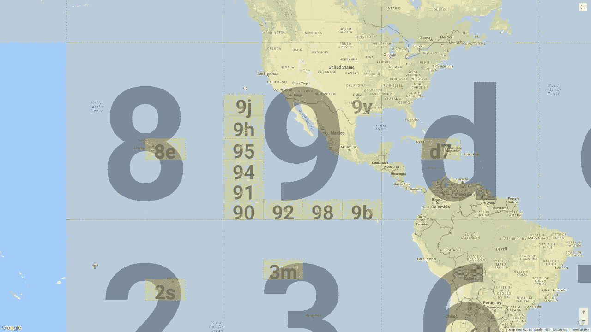

# 存储和搜索位置数据？使用地理哈希

> 原文：<https://blog.devgenius.io/storing-and-searching-location-data-use-geohashing-17a5067aeba1?source=collection_archive---------11----------------------->

在本文中，我们将探索一种(相对)新的算法，称为 GeoHash。我们将讨论地理哈希纬度和经度数据的应用程序，以便于查询，我还将提供一个简单的节点应用程序的教程，模拟地理哈希的存储和搜索。



# 什么是 GeoHash？

GeoHash 是一种用于纬度和经度数据的编码系统，它将 lat，lng 数字转换为类似“9vj8bv”的字符串。它是由古斯塔沃·尼迈耶在 2008 年发明的。该字符串代表一个在其中心包含编码的纬度 lng 位置的框(字符串的长度取决于您想要的精度，即 km 框具有较少的字母，而 cm 框具有较多的字母)。这个字符串不是随机的，事实上包含了非常有用的位置信息。在图像中，您可以看到一个大 9，所有以 9 开头的 geohashes 都在那个框中，所有以 9v 开头的 geohashes 都在 9v 框中，这样继续下去，直到我们到达 8 个字符。所以我们的 geo hash“9vj 8 bv”，是在德克萨斯州东部的某个地方。

对于那些对算法更感兴趣的人来说，这里是地理哈希的 [wiki 页面。](https://en.wikipedia.org/wiki/Geohash)

# 为什么要使用 GeoHashes？

那么我们为什么要使用 GeoHashes 呢？地理哈希对于查询位置数据非常有用。要了解原因，让我们分析一下替代方案…

## 仅使用纬度、lng 和半径进行查询

在这种情况下，我们必须迭代每个项目，计算给定项目(lat，lng)和项目(lat，lng)之间的距离，最后检查它是否在我们的半径范围内。这是精确的，将给出我们需要的精确项目，但是在每个条目上运行这种距离计算是极其昂贵的，并且不会随着我们的位置数据的扩展而扩展。

## 使用(lat，lng)查询包围半径圆的边界框

在这种情况下，我们的数据将是不准确的(我们将获得比半径圆内实际更多的条目，因此我们需要做一些额外的过滤)。这比第一个选项好，但是我们将需要使用浮点(或者更糟的双精度)比较来查询我们的数据(这比使用字符串查询慢)。

## 使用地理哈希

使用我们的 GeoHash，我们仍然有像在边界框中那样的假阳性问题，所以我们确实需要后处理过滤，但是我们使用由在数据库中工作得更好的字符串构成的边界来查询数据库。

TLDR:使用 GeoHash 比我们的替代产品速度更快，扩展性更好。

# 玩具的例子

下面是一个玩具示例，我使用 firebase 的 geofire-common 库(因此您可以轻松地将它移植到 firebase 函数中),但也可以随意用您最喜欢的 geohashing 库替换它。

## 地理数据

```
class GeoData {
    lat;
    lng;
    geoHash;
    name;

    constructor(lat, lng, geoHash, name) {
        this.lat = lat;
        this.lng = lng;
        this.geoHash = geoHash;
        this.name = name;
    }
}
```

我们需要一些结构来存储我们的数据，所以我们将位置数据存储在位置名称旁边。

## 存储数据

```
// our fake db
const locationsDB = []

// a bunch of user requests come in
const userRequests = [
    {lat: 51.5074, lng: 0.1278, name: "London"},
    {lat: 52.5200, lng: 13.4050, name: "Berlin"},
    {lat: 48.8566, lng: 2.3522, name: "Paris"},
    {lat: 40.7128, lng: -74.0060, name: "New York City"},
    {lat: 37.7749, lng: -122.4194, name: "San Francisco"},
]

// create a geohash for each and put in our table
for (const request of userRequests) {
    const geoHash = geofire.geohashForLocation([request.lat, request.lng]);
    locationsDB.push(new GeoData(request.lat, request.lng, geoHash, request.name))
}

//our ddb state
console.log("LOCATIONS DB:")
console.log(locationsDB);
```

我们创建一个 DB(一个简单的数组),然后对于每个“用户请求”,我们生成一个 geohash 并使用它来生成一个 GeoData 对象，然后将它放入我们的 DB 中。

## 使用 GeoHashes 的粗略查询

```
// now we query for all cities within 1000km of London
const center = [51.5074, 0.1278];
const radiusInM = 900 * 1000;
// London -> Berlin 932 km
// London -> Paris 340 km

const bounds = geofire.geohashQueryBounds(center, radiusInM);
console.log("BOUNDS:")
console.log(bounds);
const roughMatchedLocations = []
for (const location of locationsDB) {
    for (const bound of bounds) {
        if (location.geoHash >= bound[0] && location.geoHash <= bound[1]) {
            // our location is in our course target radius
            roughMatchedLocations.push(location);
            // we don't need to check the other bounds, since we verified the location is in one
            break;
        }
    }
}
console.log("ROUGH MATCHES:")
console.log(roughMatchedLocations);
```

我们将查询数据库中距离伦敦不到 900 公里的所有城市(我选择伦敦是因为柏林距离伦敦 932 公里，所以它足够近，可以在我们的粗略比赛中被抓住)。

geofire 接受一个中心和一个半径，并生成 4 个(特殊情况下多达 9 个)边界，这些边界是一个开始和结束的 2 元素数组，如下所示

[ [ 'u0 '，' u8' ]，[ 'g8 '，' gh' ]，[ 'sh '，' ss' ]，[ 'es '，' e~' ] ]

**注意:**我们的边界只有 2 个字符，但是如果我们把半径变小，边界字符串会增长以允许更高的精度

我们使用这些边界来获得落入其中任何一个的位置，并将它们添加到我们的粗略匹配中。

你应该去伦敦、巴黎和柏林。然而，柏林是 932 公里，所以我们应该在下一步过滤掉这些边缘情况。

## 精密过滤器

```
// get more fine grained distances of our rough matches
const preciseMatches = []
for (const location of roughMatchedLocations) {
    const distanceInM = geofire.distanceBetween([location.lat, location.lng], center) * 1000;
    if (distanceInM <= radiusInM) {
        preciseMatches.push(location);
    }
}
console.log("PRECISE MATCHES:")
console.log(preciseMatches)
```

我们的最后一步是将柏林踢出我们的比赛，我们对这些边缘情况进行昂贵的计算，以检查他们(lat，lng)是否落入我们的半径内，如果是，我们将它添加到我们的最终列表中。

我们现在应该只看伦敦和巴黎。

## 完整代码

```
import * as geofire from "geofire-common";

// class to store our objects in
class GeoData {
    lat;
    lng;
    geoHash;
    name;

    constructor(lat, lng, geoHash, name) {
        this.lat = lat;
        this.lng = lng;
        this.geoHash = geoHash;
        this.name = name;
    }
}

// our fake db
const locationsDB = []

// a bunch of user requests come in
const userRequests = [
    {lat: 51.5074, lng: 0.1278, name: "London"},
    {lat: 52.5200, lng: 13.4050, name: "Berlin"},
    {lat: 48.8566, lng: 2.3522, name: "Paris"},
    {lat: 40.7128, lng: -74.0060, name: "New York City"},
    {lat: 37.7749, lng: -122.4194, name: "San Francisco"},
]

// create a geohash for each and put in our table
for (const request of userRequests) {
    const geoHash = geofire.geohashForLocation([request.lat, request.lng]);
    locationsDB.push(new GeoData(request.lat, request.lng, geoHash, request.name))
}

//our ddb state
console.log("LOCATIONS DB:")
console.log(locationsDB);

// now we query for all cities within 1000km of London
const center = [51.5074, 0.1278];
const radiusInM = 900 * 1000;
// London -> Berlin 932 km
// London -> Paris 340 km

const bounds = geofire.geohashQueryBounds(center, radiusInM);
console.log("BOUNDS:")
console.log(bounds);
const roughMatchedLocations = []
for (const location of locationsDB) {
    for (const bound of bounds) {
        if (location.geoHash >= bound[0] && location.geoHash <= bound[1]) {
            // our location is in our course target radius
            roughMatchedLocations.push(location);
            // we don't need to check the other bounds, since we verified the location is in one
            break;
        }
    }
}
console.log("ROUGH MATCHES:")
console.log(roughMatchedLocations);

// get more fine grained distances of our rough matches
const preciseMatches = []
for (const location of roughMatchedLocations) {
    const distanceInM = geofire.distanceBetween([location.lat, location.lng], center) * 1000;
    if (distanceInM <= radiusInM) {
        preciseMatches.push(location);
    }
}
console.log("PRECISE MATCHES:")
console.log(preciseMatches)
```