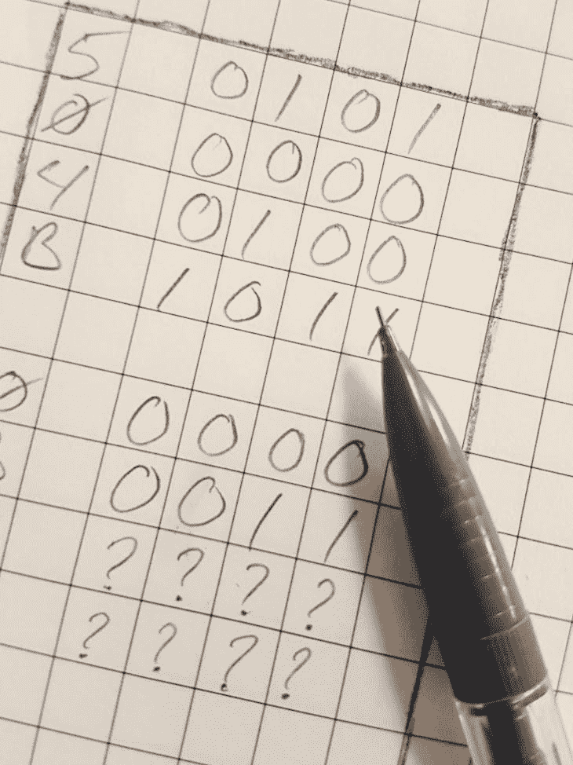
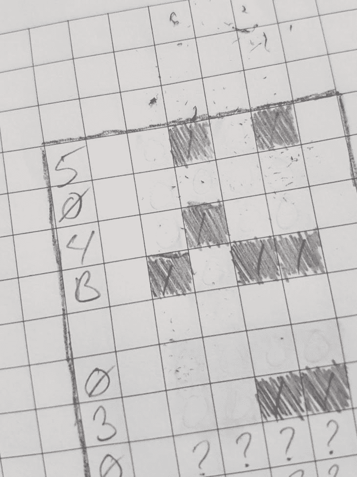
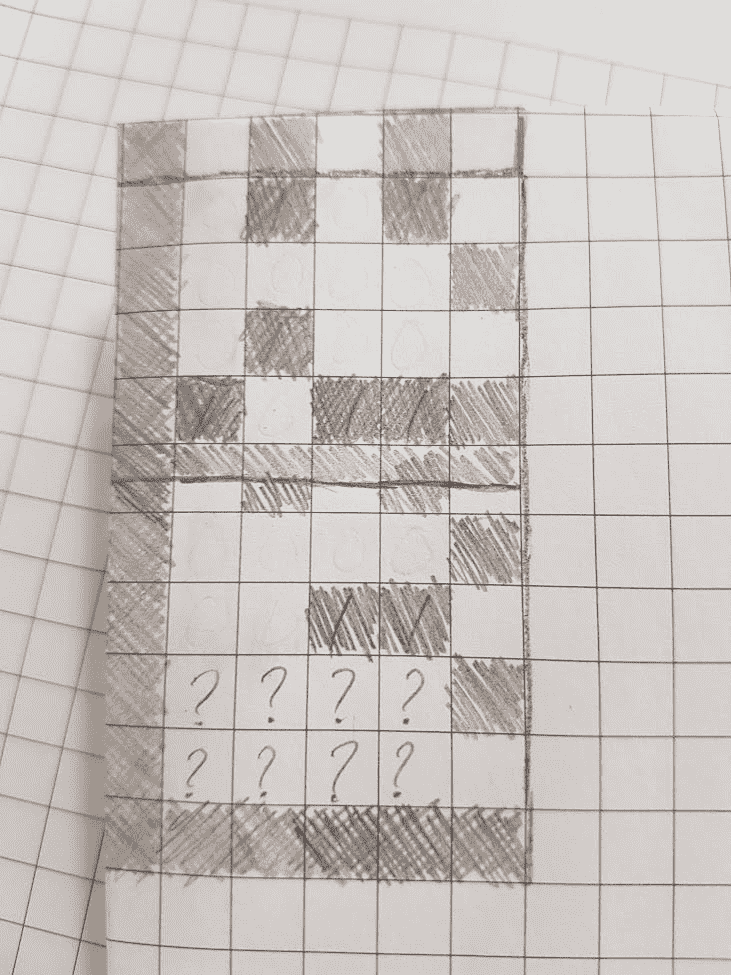
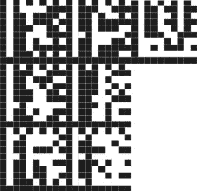

# 在 QR 码中存储数据

> 原文：<https://blog.devgenius.io/storing-data-in-qr-codes-2aeb9b04cef?source=collection_archive---------6----------------------->

## 为虚拟程序员在物理介质上编码数据



在“[Paper as a Digital Storage Medium](https://medium.com/p/4096c5062da)”一文中，我描述了在物理介质上存储数据的好处，包括长期存储容量、出版商匿名和分发隐私。没有得到回答的问题是，你是如何做到的？

> *电脑就是电脑，使用磁盘和文件……你怎么能把数字信息储存在纸上呢！？*

这是我自 2017 年以来一直在思考的一个想法，当时我在当地的社区大学教授入门编程。我希望它能被用作一种方法来识别对非常特殊类型的计算感兴趣的学生。这也被视为激发学生对社会公正和社会变革的兴趣的一种方式。我会在学校四处张贴海报，邀请学生加入数据分析俱乐部，但要用只有感兴趣的学生才能发现的方式进行编码。

试图在不引起管理员恐慌的情况下保密的想法听起来不太可行。相反，它变成了一个课程计划，因此，一个示范，动手操作的教程被创建。

简单的演示可能是最容易的……当然也是最有趣的。我鼓励你合作。

# 你如何将数字存储为图像？

还记得你上小学的时候，你的老师把你和你的朋友分开，这样你们就不能互相交谈了吗？很自然的，你和你的朋友创造了一个暗号，开始传递纸条。

我们将创建一个秘密消息传递给一个朋友。

## 先决条件

*   一个[样本文件](https://www.gutenberg.org/ebooks/35)
*   [一个十六进制编辑器](https://download.cnet.com/HxD-Hex-Editor/3000-2352_4-10891068.html)
*   [一些格子纸](https://duckduckgo.com/?q=grid+paper+png&atb=v118-1&ia=web)
*   一支[铅笔](https://en.wikipedia.org/wiki/Pencil)、[橡皮擦](https://en.wikipedia.org/wiki/Eraser)和[剪刀](https://en.wikipedia.org/wiki/Scissors)

或者，和朋友一起做这个练习也会很有趣。这就像小学时在班上传递秘密信息一样。

## 步骤 1:检查文件

用十六进制编辑器打开您的示例文件。您应该会看到类似这样的内容…

```
|50 4B 03 04 14 00 00 08 00 00 25 30 8B 51|PK........%0.Q│
|6F 61 AB 2C 14 00 00 00 14 00 00 00 08 00│oa.,..........│
|00 00 6D 69 6D 65 74 79 70 65 61 70 70 6C│..mimetypeappl│
│69 63 61 74 69 6F 6E 2F 65 70 75 62 2B 7A│ication/epub+z│
│69 70 50 4B 03 04 14 00 00 08 08 00 25 30│ipPK........%0│
│8B 51 00 00 00 00 02 00 00 00 00 00 00 00│.Q............│
│09 00 00 00 4D 45 54 41 2D 49 4E 46 2F 03│....META-INF/.│
│00 50 4B 03 04 14 00 00 08 08 00 25 30 8B│.PK........%0.│
│51 90 9F 06 74 9A 00 00 00 F4 00 00 00 16│Q...t.........|
```

大多数人懒得检查文件的实际内容(提示:这就是为什么人们更喜欢以文本形式传输数据)，但是你可以通过绕过设计来使用它们的计算机程序来获得许多有趣的信息。

例如，只要有一点专业知识，我们就可以立即判断出关于我们打开的文件的两件事:

1.  大概是一个`zip`文件
    我们可以看到文件的前两个字节是值`50`和`4B`(十六进制表示)。有趣的是，这些值对应于`ASCII`角色`PK`。很多年前，在应用程序文件的开头签名已经成为一种习惯，这样你就可以将你的文件与其他格式区分开来。`PK`代表 PKware 公司的 PKZip，这是创建该文件格式的原始公司。
2.  它是一个`epub`文件
    其次，我可以看出`mimetype`是`application/epub+zip`。所以是 ePUBfile(并且确认为 zip)。

二进制层面有很多信息。

## 连载

目标是将文件转换成可读的格式。最简单的方法是一次转换一个字节。

这有按顺序做的好处。顺序很重要，所以按顺序从头到尾读一遍，我们就能确保我们发送信息的人以正确的顺序收到信息。

那么我们来读第一个字节，它是十六进制值`50`。

把它写在你的网格纸上(也许还有接下来的几个值)


从数据的十六进制表示开始，并为一些二进制数据留出空间

## 转换成二进制

我们寻找的是一个比特序列，每个十六进制数字代表 4 个比特(半个字节或“半字节”)。所以我们需要将每个数字转换成二进制形式。

拿第一个来说:

*   5₁₆
*   5₁₀
*   0111₂

不要害怕使用计算机的计算器。


每个 4 位集转换为二进制

现在，因为这是一个秘密笔记，我们需要删除我们原来的工作号码。拿起你的剪刀，剪下纸上的第一列。

(我将我的符号切换到 ASCII 艺术…对于那些想在文本编辑器中一起玩的人)

```
______
_0101_
_0000_
_0100_
_1011_
______
______
_0000_
_0011_
_????_
_????_
______
```

## 转换为图像

条形码只是一种可以被解释为数字的图像。对我们来说，关键是我们不必使用符号`0`和`1`，**任何两个容易区分的符号都可以。**

这类似于莫尔斯电码的工作原理，其中二进制字符序列由不同长度的音调表示。用什么并不重要，只要这两样东西是可以区分的。

一个真正好的符号是`light`和`dark`，它很容易被带摄像头的计算机识别。这很方便，因为颜色可以很容易地印在纸上。我们可以用“没有色素”(光)来代表`0`，用“有色素”来代表`1`。

记得我说过要用`pencil`吗？

1.  拿起你的橡皮擦，擦掉每一个`0`
2.  拿起你的铅笔，每隔`1`涂上颜色

```
______
_ █ █_
_    _
_ █  _
_█ ██_
______
_    _
_  ██_
_????_
_????_
______
```



无论你是 8 岁还是 80 岁，涂色仍然很有趣

# 我的眼睛有问题

事情进展得很顺利。我们现在有了一系列编码成彩色条纹的二进制数字。这也被称为“条形码”。

还有一个问题。

我老了。

我的眼睛已经不是以前的样子了。

对我来说很难理解这些线的起点和终点。

这在没有任何内容的行上尤其成问题。数字零(第 2 行)没有表示它是零。为了帮助需要解码我们秘密信息的朋友，让我们制定一些指导方针。这将有助于他们看到线的起点和终点，或者根本就没有线。解码器还需要某种方法来知道方块有多大，以帮助区分数字的开始和结束位置。

你会注意到我在注释中留下了一些占位符，让我们来填充它们:

1.  给左边所有的方块涂上颜色
2.  在顶部每隔一个方块涂上颜色

```
█ █ █ 
█ █ ██
█     
█ █  █
██ ██
██████
█ █ █ 
█    █
█  ██
█????█
█???? 
██████
```

有了这些向导，我们可以知道方块从哪里开始，以及纸上的每个`bit`方块有多大。

嗯……那看起来很像二维条形码。



好吧…所以它基本上是正确的

# 家庭作业

考虑到一个 ANSI 字符表，并考虑到字节以 8 位集合的形式出现，在`8x8`网格中编写块可能更容易一些:



*——苏珊·布莱克摩尔*

## 额外:平行交付

你会注意到，有了这些指导方针，我们可以将每个`8x8`网格视为一个单独的解码块。这让我们在心理上更轻松，也提供了另一种方式让我们的信息更容易被接收者解码:

1.  在每块的背面，写下它的序号。
2.  切割出每个块

现在，当你的接收者得到所有的块时，他们可以和一些助手分担工作。每个人都可以对他们的小积木进行编码，然后这些积木可以被拼接起来。

[](https://www.buymeacoffee.com/jeffereycave) [## 觉得这个有用？考虑留小费！

### 我写一些关于软件和开发的东西。如果你发现我做的任何有用的事情，请告诉我

www.buymeacoffee.com](https://www.buymeacoffee.com/jeffereycave) 

# 进一步阅读

是时候指出这是一个*简化的*例子了。这证明了这样的事情是可能的。

当从无到有，第一步是理解这是可能的。既然你明白这是可能的，那么是时候继续用疯狂的方法让它变得更好了:

1.  [Unicode 奇迹](https://www.youtube.com/watch?v=MijmeoH9LT4)上述条形码问题解决方案的一个大问题是浪费的位数。如果你想知道一个比特能容纳多少信息，看看 Unicode 吧。
2.  [维基百科:Datamatrix](https://en.wikipedia.org/wiki/Data_Matrix) 一旦你理解了这一点，考虑一下 Datamatrix 以及它如何在相同的空间里存储更多的数据。(然后才知道有实际规格符合 [GS1 Datamatrix 规格](https://www.gs1.org/barcodes/2d))
3.  [1D、2D 和 3D 条形码](http://www.mobiliodevelopment.com/1d-2d-3d-barcodes/)现在 3D 条形码让你神魂颠倒。(郑重声明，作为一个原则问题，我拒绝 4D 条形码)

如果你对一个实际应用感兴趣，这正好吊起了你的胃口，我鼓励你去看看 Barcode Epub，这是一个 barcode-to-epub 转换器，适用于匿名传输和存档从数字营销海报到你论文中使用的出版数据的所有内容。

也许你甚至可以把它钉在留言板上。

[](https://gitlab.com/dpub/barcode-epub) [## dpub /条形码 EPub GitLab

### 使用条形码作为存储介质的实验。目的是创建一个 EPUB 阅读器，将它的数据存储在…

gitlab.com](https://gitlab.com/dpub/barcode-epub) 

如果您喜欢，请留下评论或提出问题，并记得[点击关注](https://jefferey-cave.medium.com/)以鼓励未来的文章。