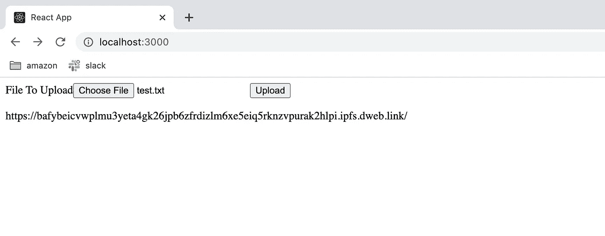
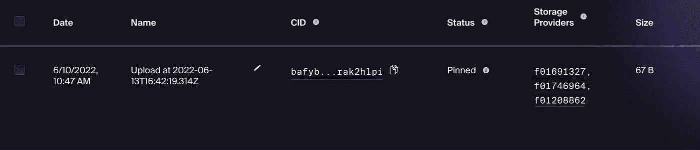

# 在 IPFS 上存储文件:对等文件系统网络

> 原文：<https://blog.devgenius.io/storing-files-on-ipfs-a-peer-to-peer-file-system-network-d8e13f3ef4b5?source=collection_archive---------2----------------------->

今天，我们将创建一个演示应用程序，在 IPFS 上存储一个简单的文本文件。IPFS(星际文件系统)是 Web3 中的一个新协议，用于以分布式方式存储文件。你可以把它想象成 S3，除了节点不在 AWS 中，而是分布在你的同伴的计算机上。

要了解更多关于 IPFS 的工作方式，请访问他们的网站[这里](https://ipfs.io/#how)。IPFS 背后的想法让我想起了 HBO 热播剧《硅谷》中的许多魔笛手。理查德在系列文章中提出的“新互联网”声称可以在多个节点上存储文件的片段，这样就不会有人拥有整个文件，但它可以很容易地重建(听起来很像 IPFS 的 CID 指纹)。

实际代码非常简单，但首先我们需要创建一个 Web3Storage 帐户来与 IPFS 交互(免费帐户可以免费获得 1TB 的空间)。【https://web3.storage/account/ 号

代码本身非常简单。

*   当组件挂载时，我们使用令牌创建 Web3Storage 客户机
*   我们允许用户上传文件并点击提交
*   当用户点击按钮时，我们从 IPFS 获得 CID，然后显示 url 以访问和查看文件

您现在可以运行这段代码，并得到类似下图的结果。

当您在浏览器中粘贴该链接时，您将能够打开并下载您的原始文件，该文件现在存储在 IPFS 系统的节点上。

如果您返回到您的 web 3 存储帐户，您的文件将被固定，这意味着它存储在网络上。

你可以去看看存储提供商，看看你的文件在多少个节点上，块号和存储费用等信息。

IPFS 的主要存储提供商是 FileCoin。IPFS 支付节点来固定你的文件(使你的文件可用)。你的文件在越多的节点上，它就越容易被访问，因为我的文件只在 3 个节点上，它可能不太可用。你可以支付更多 FIL (FileCoin)来使你的文件更容易获得(有点像 CDN)。

这是对 IPFS 工作方式的简单介绍，我相信这是朝着创建 web3 赖以生存的新协议的正确方向迈出的一步。