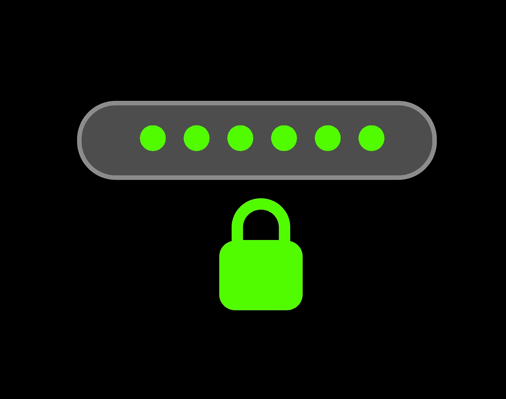

# 在数据库中存储密码

> 原文：<https://blog.devgenius.io/storing-password-in-databases-a902583c6b6e?source=collection_archive---------5----------------------->



如果您曾经使用过 web 应用程序，您可能不得不使用用户认证，那么一个大问题来了，我们真的希望将密码以纯文本的形式存储在我们的数据库中吗？当然，我们可以继续这样做，没有人会阻止你，但是如果有机会黑客得到了你的数据库，他们不仅可以很容易地访问你的 web 应用程序，还可以访问信任你的产品的客户的私人数据。当然，我们可以得出结论，在我们的数据库中存储纯文本密码不是一个好主意。那我们能做什么？让我们来看看一些方法。

# 加密密码

疯狂的想法！如果我们不存储纯文本密码，而是对密码进行加密并存储。备份一点，加密是一种使用密钥将文本从一种形式转换为另一种形式的方法。加密是一个双向过程，其中密钥用于加密数据，它可以再次用于解密加密的数据。我们仍然必须确保将密钥安全地存储在应用程序级别或数据库中的某个地方，这又让我们回到起点，保护数据。如果黑客在某个地方得到了密钥，他们用不了多久就能解密我们的加密数据。所以，很可能加密对我们来说不是一个合适的选择。还有什么？我们继续吧。

# 散列密码

哈希是使用哈希函数将一个给定值转换为另一个值的过程，哈希函数由数学算法组成。散列函数在输入数据后运行算法，并返回一个散列值。重要的是，哈希函数是单向函数，即哈希不能像加密那样转换回相同的值。
等等！但是，如果我们不能从哈希值中获得原始值，我们如何在身份验证时验证用户值。很棒的问题！。虽然我们无法从哈希值中获得原始值，但是哈希值(比如“Archita ”)每次都会生成相同的哈希值，因此在身份验证时，我们可以再次使用哈希函数来生成哈希值，并检查它是否与我们数据库中的哈希值相匹配。

在选择哈希算法之前，我们必须明白，随着计算机计算能力的不断增强，即使是哈希算法也不能保证不受黑客攻击。一旦黑客掌握了你的哈希算法，他们总是可以使用暴力破解的方式来猜测输入数据。这方面的一个例子是 MD5 哈希算法，这是一种快速哈希算法，黑客只需几天时间就可以使用暴力方法猜出输入数据。另一个缺点是，有时网上积累了大量的散列算法字典。继续以 MD5 算法为例，它有一个庞大的在线字典，如果黑客能够访问哈希值，通常只需搜索普通密码即可。我们举个例子。

```
import hashlibm = hashlib.md5(b’password’)
print(m.hexdigest())
5f4dcc3b5aa765d61d8327deb882cf99
```

继续并尝试在这里搜索散列值[https://md5decrypt.net](https://md5decrypt.net)。瞧啊。输入值以毫秒为单位。
您一定在想，我们选择了一个简单的输入方式，“密码”是最常见的数据。好吧，让我们试试更难的输入。

```
m = hashlib.md5(b’Archita14')
print(m.hexdigest())
045e60aa8f454065977264f9a549f290
```

你能试试这个吗？再次获得正确的输入值！？

当然，并不是所有的哈希算法都是这样，我们可能会使用比 MD5 算法更安全的哈希算法，如 SHA-1、SHA-256。但是，关于哈希算法，需要了解的另一件事是，它们的输出哈希值具有有限的字符串长度，例如，对于 SHA-256，它是 64 个字符。哈希算法的主要目标是确保输入值不能从哈希值中检索，并且由于输出哈希值的长度有限制，因此当输入到哈希函数时，两个不同的输入值可能会产生相同的哈希值。使用 MD5 这样的算法，很有可能会发生冲突，比如 https://www.mscs.dal.ca/~selinger/md5collision/的，而 SHA-256 很少发生冲突，但是如果两个用户有相同的密码，那么哈希值肯定是相同的。黑客可以创建彩虹表来获得与哈希值相对应的值。彩虹表只不过是哈希值和输入值之间的映射，通过为公共输入值生成哈希值-输入值映射，黑客就能够获得数据库中的输入值。那么，如果单独的哈希也不安全，我们可以在哈希中添加一些额外的元素来确保它的安全性吗？是的，我们可以。

# 使用盐和胡椒

哇，盐在这里做什么？在密码学中，salt 是一种在 hash 函数的输入中加入随机数据的方法，这可以确保没有两个输入有相同的 hash 值。不需要被所有的新术语弄得不知所措。Salt 只是我们添加到输入数据中的一个随机字符串，然后将新字符串提供给我们的哈希函数。我们为每个输入数据生成不同的 salt。

```
import random
import stringdef getHashValue(inputData):
  salt = ‘’.join(random.choices(string.ascii_lowercase, k=20))
  print(salt)
  inputData = salt+inputData
  print(inputData)
  return hashlib.sha256(first).hexdigest()getHashValue(‘password’)
zmtubtokqmqihxpyybrf
zmtubtokqmqihxpyybrfpassword
'461f8e48831679069a3a413875f01e561010490ca865494a87985ee7fdf225ea'
```

我们可以将散列密码和 salt 存储在数据库中，因为如果黑客得到了您的数据库，他们就无法检索您的原始输入数据。
另一个你能从标题中看到的术语是胡椒？这是什么？pepper 类似于 salt，即添加到哈希函数的输入值中的随机字符串，但它不是存储在数据库中，而是保密的，要么存储在其他介质中，要么根本不存储。虽然对 salt 的长度没有限制，但是建议将 pepper 的长度保持在至少 112 位，以防止暴力破解。可以有不同类型的辣椒。可以是所有输入数据通用的，或者每一个输入数据都可以有唯一的更好。Pepper 本身带来了某些复杂性，例如安全地存储 pepper，但它绝对确保您的哈希值不会被黑客攻击，直到 pepper 是秘密的。

希望这篇文章对你有用。如果你做到了，别忘了鼓掌，这会让我开心一天。:D