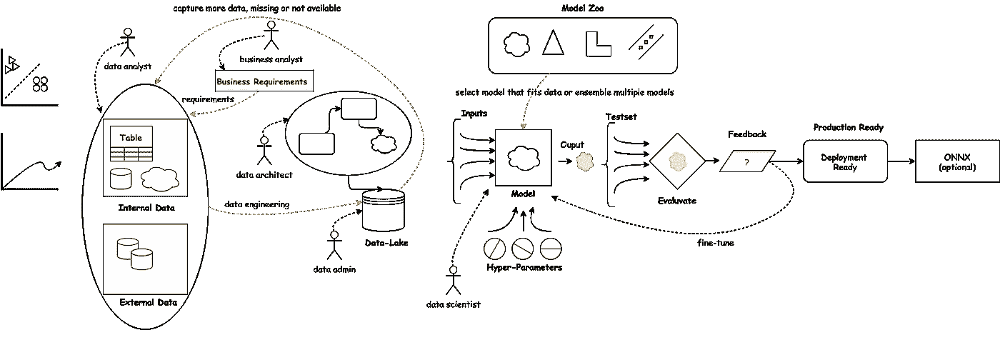
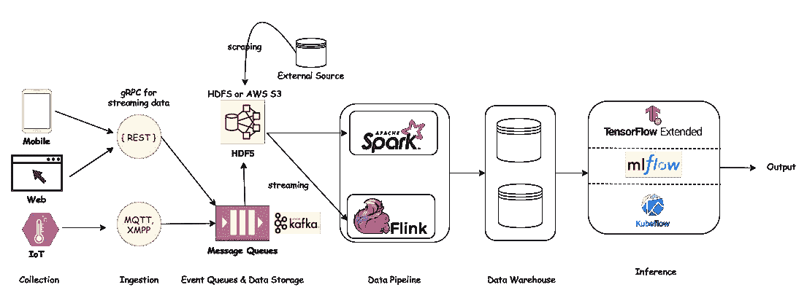

# 数据的故事—从数据源到生产

> 原文：<https://blog.devgenius.io/story-of-data-source-to-production-7899321b4947?source=collection_archive---------2----------------------->

业务分析师了解业务需求，并将需求传递给数据分析师。

数据分析师了解数据需求，并确定需要哪些数据来解决业务问题。数据分析师然后从内部来源收集正确的数据或管理数据(*例如:搜集*)，或者从外部来源(*例如:开放数据集、Kaggle、研究项目*)。在机器学习团队可以使用原始数据之前，需要对其进行处理。这是关键的一步，因此“**与数据**成为一体。

通常，数据分为两类(在较高层次上):

1.**结构化数据** : CSV、表格形式数据、柱状等。

2.**非结构化数据**:图像、音频、视频、文本等。

根据业务需求，数据分析师收集适当的培训、验证和测试数据集。数据必须与真实世界的数据相似，否则结果会有很大的差异。Rachel Thoma 博客[清晰地描述了如何(以及为什么)创建一个好的验证集。](https://www.fast.ai/2017/11/13/validation-sets/)

数据来自多个来源，我们需要通过数据管道收集数据，并可能将其聚合到数据库/数据湖中。

1.**数据工程**:

*   收集/存储，
*   摄入，
*   准备/转换(清理、成形、增强、转换、特征提取、符合)。

2.**机器学习**:计算

3.**输出**:推理，呈现

花时间了解数据分布并找出异常值是至关重要的，人脑在这方面非常出色，因此数据分析师必须首先手动检查数据。首先，在清理过程中，我们试图找到缺失的标签、不正确的标签、重复的标签、不完整的数据、缺失的字段等。

从我的个人经验来看，数据降维是非常重要的一步，它不仅可以提供更好的数据洞察力，还可以减少模型大小，这意味着低计算能力、低内存需求、快速训练时间和更好的结果。分析师的工作是发现有多少细节真正重要，从而确定需要捕捉多少特征。

必须用适当的随机种子初始化模型，并且必须对数据进行归一化和标准化以用于训练，在推断期间也必须使用相同的归一化和标准化参数。数据增强是对图像的修饰性改变，有时会给出更好的结果，但不应该太过分。

数据设计人员通常担心如何存储数据，这意味着他/她试图理解传入数据字段之间的关系，并设计结构以便可以存储数据。这些数据必须通过安全访问进行适当的管理，只有经过授权的人才能访问，并且必须进行备份。这是数据管理员必须考虑 [GDPR 和 CCPA 合规](https://mdeore.medium.com/dataset-assessment-framework-2ab1499d054a)的时候，这意味着删除客户的个人信息链接并分配人工 ID，这一过程称为假名化。

机器学习研究人员创建各种机器/深度学习模型，或探索可用于商业目的的现有模型的变体。数据科学家对这种模型进行实验，并调整模型参数以找到最佳拟合。这些被称为超参数:优化器、正则化、退出、批量、学习率是一些重要的超参数，需要调整以使模型收敛到最适合特定数据集的状态。Andrej Karpathy 的博客给出了更多的见解'[训练神经网络的秘方](http://karpathy.github.io/2019/04/25/recipe/)。

在训练期间，监控一系列评估指标，以减少损失并让模型收敛。这是一个迭代过程，直到数据以尽可能低的损失最佳拟合。一旦模型收敛，就用测试集进行验证，理想情况下，用真实世界的数据集进行验证，这称为推理。

对于部署，可以使用 ONNX 将模型从一个框架转换到另一个框架。对于移动部署，它可以转换为`.tflite`格式，利用平面缓冲区而不是协议缓冲区，以便在移动设备上快速加载。在这个阶段，我们还可以对从`float`到`int8`的冻结模型进行量化。量化技术以轻微的退化误差为代价减小了模型大小，这也是基于业务需求，需要多少量化与精度折衷。

最后，采用端到端的业务流程和技术来部署模型，使业务最终服务于其客户。

**可以在|**[**LinkedIn**](https://www.linkedin.com/in/mdeore/)**|**[**网站**](https://tomdeore.wixsite.com/epoch)**|**[**Github**](https://github.com/milinddeore)**|**