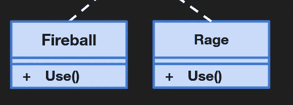

# 统一战略模式

> 原文：<https://blog.devgenius.io/strategy-pattern-in-unity-b82065aaa969?source=collection_archive---------0----------------------->

## 能力系统

比方说，我有一个技能系统，目前由一个枚举组成，包括火球术、狂怒、治疗和近战。我有一个使用当前选定能力的方法。在更新方法中，当空格键被按下时，它使用当前能力。

能力赛跑者

现在的问题是，一个技能越复杂，我需要添加到这个脚本中的代码就越多。真的没有办法把这些分离出来。另一个问题是，如果我想增加更多的能力，装备多个能力，或者根据按键的不同而拥有不同的能力。这可能会很快失控。

## 更好的方法。

有能力跑者还有一个当前的能力场。

能力赛跑者

这个能力指向一个有使用方法的接口。

能力界面

这样我就可以从能力接口中获得能力

能力

现在，如果我在这里更改名称，我刚才实现的是策略模式。

能力系统是战略模式

# 策略模式到底是什么

战略模式

策略模式就是将行为或算法封装或包装在自己的类中。它的额外好处是允许在运行时分配行为或算法！如果您有一堆 If 语句或 switch 语句试图控制或调整行为，那么策略模式可能正是您清理代码所需要的。根据策略模式，类的行为不应该被继承。相反，它们应该使用接口封装。这与开放但封闭的实体原则是一致的，该原则提出类应该对扩展开放，但对修改封闭。这是一个很好的模式来创造能力系统，人工智能行为，或者武器系统。尽管我更喜欢用 Unity 的动画系统来创造我的人工智能行为。

## 定义

*   **策略** —声明一个所有支持的算法通用的接口。上下文使用这个接口来调用由具体策略定义的算法。
*   **具体策略** —使用策略接口实现算法。
*   **上下文** —配置有具体的策略对象。维护对策略对象的引用。可以定义一个接口，让策略访问它的数据。

# 履行

## 可靠性

能力界面

第一步是创建能力界面

能力接口代码

转换能力跑步者使用新的界面

## 能力

下一步是创建每种能力，让它们实现责任接口。

火球能力

愤怒能力

治愈能力

近战能力

## 使用能力

目前能力跑者不使用我新创造的任何能力。我需要一种方法来改变能力跑步者的当前能力，我目前不能用检查器这样做，因为 Unity 不序列化接口(内置)，这意味着我不能在检查器中分配这个字段。

能力赛跑者游戏对象

有许多不同的方法来实现这一点，我打算用最快的方法。我将添加一个当前能力属性，并创建一个单独的 Monobehavior 来改变能力。

添加当前能力属性

现在我可以很容易地改变能力。

能力改变者

行动能力

# 结论

策略模式是工具箱中的一个有用工具。我可以用它来清理我能力系统中的代码，使它更加可靠。现在我的代码对扩展开放，但对修改关闭。这也使得我的每个代码都有一个单独的职责。我可以很容易地在我的系统中添加新的能力来做不同的事情。如果我想改变一个能力的工作方式，我需要做的就是改变一个能力，我不需要在 switch 语句中找到它。，也很容易改变能力的使用方式。事实上，它们是一个接口，允许我把任何东西都变成一种能力。例如，我可以把火球变成一个单体行为，然后把它变成一个预置，或者我可以把治疗能力变成一个可脚本化的物体。我可以把近战能力变成一种武器。只要他们坚持接口，这并不重要。

当然，它也遵循了利斯科夫的替换法——“*派生类或子类必须可以替换它们的基类或父类*”、接口分离——“*不要强迫任何客户端实现与它们无关的接口*”、以及依赖倒置——*“高级模块不应该依赖于低级模块，而应该依赖于抽象。抽象不应该依赖于细节；更确切地说，细节应该取决于抽象。”，*但这是设计好的。策略模式本身实际上只解决了前两个基本原则，其余的都是在设计代码时遵循的。

代码可以在我的 Git Hub 页面上找到

 [## GitHub-JamesLaFritz/Design-Patterns-For-Unity 发布时-StrategyPattern

### 报告 Bug 请求特性展示了 Unity 中不同的编程设计模式。有许多不同的…

github.com](https://github.com/JamesLaFritz/Design-Patterns-For-Unity/tree/release-StrategyPattern)