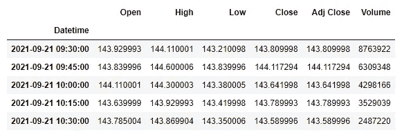
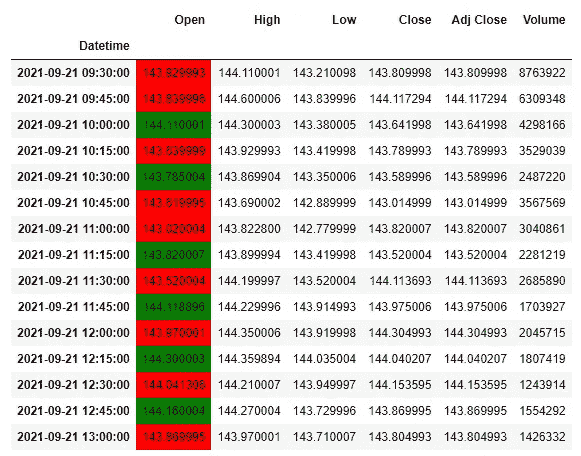
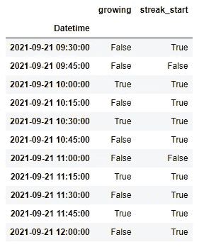
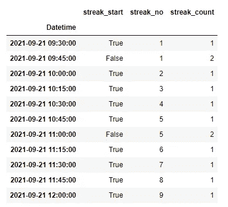
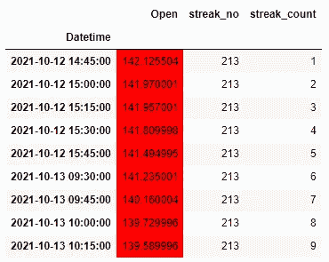
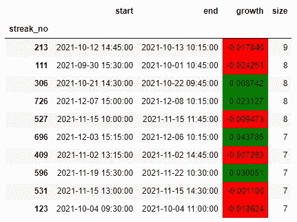

# 熊猫时间序列中的条纹

> 原文：<https://blog.devgenius.io/streaks-in-pandas-time-series-c63fe62aa771?source=collection_archive---------4----------------------->

## 了解如何在时间序列数据中寻找增长条纹

我们将在金融时间序列数据中寻找增长或下降的痕迹。我们的数据集将是雅虎财经上的苹果股票价格。我们将使用**熊猫**和**金融**图书馆。

```
import pandas as pd
import yfinance as yfdf = yf.download("AAPL", period="60D", interval="15m")
```



来自雅虎财经熊猫数据框架的数据

数据框是一个时间序列，如果你想了解更多关于如何在熊猫身上处理它们，你可以阅读[我的文章](https://medium.com/p/abc84d957650)。

## 在雅虎财经时间序列中寻找条纹

我们将寻找股票价格增长的迹象。我们将比较时间序列中 15 分钟间隔的开盘价。

```
df["growing"] = df[“Open”].gt(df[“Open”].shift())
```

我们将当前行与前一行进行比较。澄清一下， **shift()** 函数将值向前推一个周期。



时间序列中的增长和衰退条纹

## **为条纹分配 id**

要对上涨或下跌的条纹进行分组，我们必须首先确定每条条纹的起点。

```
df["streak_start"] = (df["growing"]
                     .ne(df["growing"].shift()))
```

当前行和前一行之间的不相等表示新一轮的开始。也就是说，前一行中的下降和当前行中的增长(反之亦然)指示了连胜的开始。



增长或衰退的开始

然后，我们使用 streak_start 列上的 **cumsum()** 为单独的条纹分配增量 id。我们还使用 **cumcount()** 递增计数条纹的长度。

```
df[“streak_no”] = df[“streak_start”].cumsum()
df[“streak_count”] = df.groupby(“streak_no”).cumcount().add(1)
```



时间序列中的条纹现在已经编号

## 寻找时间序列中最长的条纹

我们想找到时间序列中最长的一串。我们使用 **idxmax()** 函数来查找属性“streak_count”中最大值的索引。为了获得所有的例子，我们需要选择最大值索引以上的行。我们使用 **tail()** 函数将它们限制到最大条纹的长度。

```
idx_max = df[“streak_count”].idxmax()
max_streak_length = df.loc[idx_max, “streak_count”]
df.loc[:idx_max, :].tail(max_streak_length)
```



最长的连胜纪录

在我们的数据集中，最长的条纹是一个连续 9 个负区间的下降条纹。

## 总结条纹

假设我们想要所有条纹的摘要。我们根据“streak_no”列对数据帧进行分组，然后运行聚合函数，这将为我们提供连续数据的起点和终点。此外，我们还将使用一个自定义函数来计算股票的增长，我们根据条纹的大小对其进行排序。

```
df.reset_index().loc[:, [“Datetime”, “Open”,”streak_no”]]\
  .groupby(“streak_no”)\
  .agg(
    start = pd.NamedAgg(column=”Datetime”, aggfunc=”first”),
    end = pd.NamedAgg(column=”Datetime”, aggfunc=”last”),
    growth = pd.NamedAgg(
             column=”Open”, 
             aggfunc=(lambda x: (x.iloc[-1]-x.iloc[0])/x.iloc[0])),
    size = pd.NamedAgg(column=”Open”, aggfunc=”size”),
).sort_values(by=”size”, ascending=False)
```



条纹摘要，按长度排序

## 熊猫时间序列条纹综述

计算条纹在时间序列数据中非常有用。在未来，我将写一篇关于如何使用这些类型的属性作为技术指标的教程。我的 GitHub 账户上有一个笔记本，里面有全部代码。

感谢您的阅读！