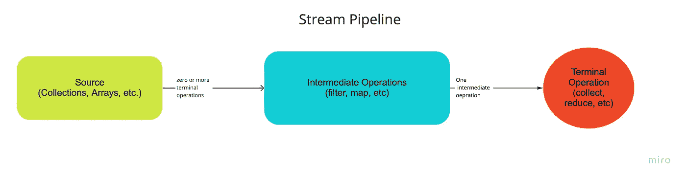

# Java 中的流 API(带示例)

> 原文：<https://blog.devgenius.io/stream-apis-in-java-with-examples-97e7e709fb43?source=collection_archive---------10----------------------->

Java 8 很久以前就引入了 Streams。这是 Java 8 的主要和强大的特性之一。流是支持顺序和并行聚合操作的元素序列。

简单地说，stream 是我们在 Java 8 之前所做事情的抽象，比如创建循环、编写条件等等。它主要关注所有而不是部分。

> **具体>抽象>具体阶段**

它允许我们从命令式编程转向函数式编程。函数式编程使用函数来创建干净的、可维护的和更可读的代码。

流管道由流操作组成。流管道由一个源、一个或零个中间操作和一个终端操作组成。



**源** —可以是数组、集合、列表、集合、文件等。

**中间操作** —将一个流转换成另一个流。流管道中允许零个或多个中间操作。一些中间操作是不同的，过滤、映射、排序、平面映射、限制等。

**终端操作** —将流转换成具体类型。只允许一个终端操作。一些终端操作是收集、计数、归约、汇总统计等。

## 流的惰性赋值

流是惰性的，这意味着只有在调用终端操作时才会对源数据执行中间操作。

所有中间操作都很懒。它们直到实际需要计算结果时才被执行。它带来了另一点，即流在某种意义上是非常强大的，因为它们在应用程序中是优化的和安全的。

## **创建 Java 流**

在 java 中有许多创建流的方法，下面将讨论其中的一些。

1.  **Java 提供了两种方法来创建顺序流和并行流**

*   使用 stream()函数创建一个顺序流

```
private static List<String> list = Array.asList(“Hello”, “world”);Stream<String> stream = list.stream();
```

*   使用 parallel stream()函数创建一个并行流

```
Stream<String> stream = list.parallelStream();
```

**2。从单个值创建一个流**

```
Stream<String> stream = Stream.of(“Hello”, “World”);
```

**3。使用数组创建流**

```
Int[] arr = {1,2,3,4};**// create a sequential stream from the specified array**Stream<Integer> stream = Arrays.stream(arr);**// create a sequential stream from the specified subarray [start, end]**Stream<Integer> stream = Arrays.stream(arr, start, end);
```

**4。使用构建器创建流**

```
Stream<String> streamBuilder = Stream.<String>builder().add("Hello").add("World").build();
```

**5。使用**创建一个无限流

*   **iterate()方法** — Iterate 方法用于创建接受两个参数的无限流:**种子** —流中的初始元素，**函数** —应用于流的前一个元素，以产生流的下一个元素。

```
**// print even numbers up to 20 using stream**IntStream.iterate(0, x->x+1)
.limit(20)
.filter(x -> x%2 == 0)
.forEach(System.out::println);
```

** limit 用于限制流中的元素数量

*   **生成方法** —生成方法也用于创建无限流

```
**//generate creates an infinite stream, here we are limited it to 10 elements**
Stream<Double> randomDoubleStream = Stream.generate(Math::random).limit(10);
```

## **Java 流操作**

让我们看看在 stream api 的帮助下可以执行的一些常见操作。

## 中间操作—

1.  **distinct()**

distinct()从流中移除重复的元素，返回一个不同的流。它使用 equals 方法来决定两个元素是否相等。distinct()不接受任何参数。

```
List<Integer> list = List.of(11,22,3,3,4,5,5);list.stream()
.distinct()
.forEach(System.out::println);
```

2.**滤镜()**

filter()方法返回一个流，该流包含通过特定条件的原始流的元素。filter()方法将谓词作为参数，谓词只是一个表达式。

```
**//Filter all persons who are living in London**Predicate<Person> predicate = person -> person.getAddress().contains("London");List<Person> personList = getPersonList()
.stream()
.filter(predicate)
.collect(Collectors.toList());
```

3.**地图()**

map()用于将一种流类型转换为另一种类型。在给定的函数应用到原始流的元素后，它产生一个新的流。

```
**//Transform person to employee stream**List<Employee> employees =  personList
.stream()
.map(Employee::map)
.collect(Collectors.toList());employees.forEach(person -> System.out.println(person));
```

4.**已排序()**

sorted()用于返回一个流，由按排序顺序排列的原始流的元素组成。

```
**// sort an array in natural order**Integer[] arr = {20, 90, 0, 2, 3};Arrays.stream(arr)
.sorted()
.forEach(x -> System.out.println(x));**//sort list of persons based on age**personList.sort(Comparator.comparingInt(Person::getAge));
```

5. **skip()**

skip()在丢弃流的前 n 个元素后返回一个流。如果元素比 skip 函数中指定的少，那么将返回一个空流。

```
**//print number 0 to 20 and skip first 8 elements**IntStream
.range(0, 20)
.skip(8)
.forEach(num -> System.out.println(num));
```

## 终端操作—

1.  **forEach()**

它是最简单也是最常见的流操作之一。它遍历 stream 元素，并对每个元素执行一个操作。

forEach()是一个终端操作，这意味着一旦执行了该操作，流管道就被认为是关闭的，不能再使用了。

```
**// print number 0 to 20 inclusive 20**IntStream
.rangeClosed(0, 20)
.forEach(num -> System.out.println(num));
```

2.**收集()**

collect()通过收集器接口对 stream 的元素执行可变归约操作。

```
**//remove duplicates using collector method**list
.stream()
.collect(Collectors.toSet())
.forEach(System.out::println);
```

在上面的代码中，我们使用 toSet()收集器将所有流元素收集到一个集合中。

3.**减少()**

reduce()允许通过使用提供的标识和一个[关联](https://docs.oracle.com/javase/8/docs/api/java/util/stream/package-summary.html#Associativity)累加函数从一系列元素中产生一个元素，并返回一个缩减的可选值。

```
**//reduce stream of integer array into total of all elements of the array**int total = IntStream.of(7,12,13,4,5,6).reduce(0, (int x, int y) -> x+y);
```

**短路端子操作**

1.  **anyMatch()**

anyMatch()检查是否有任何流匹配给定的谓词值。任何匹配的返回类型都是布尔型的，它接受谓词作为参数。如果流为空，则返回 false。

```
**// find if array contains even number or not**boolean isEven = IntStream.of(7,12,13,4,5,6).anyMatch(x -> x%2 == 0);
```

2. **findFirst()**

它返回流的第一个元素。如果 stream 为空，则返回空的可选值。findFirst()返回可选的数据类型。

```
Predicate<Integer> predicate = n -> n < 10 && n > 5;**//Find first element that satisfies given predicate**Integer[] numbers = {1,2,3,4,5,6,7,8,9,10,11,12,13,14,15};Optional<Integer> first = Arrays.stream(numbers)
.filter(predicate)
.findFirst();
```

3. **findAny()**

它返回满足给定谓词的流中的任何元素。如果 stream 为空，则返回空的可选值。

```
**//Find any element that satisfies given predicate**Optional<Integer> any = Arrays.stream(numbers)
.filter(predicate)
.findAny()
```

findFirst()和 findAny()的核心区别在于，findAny()是非确定性的，而 findFirst()是确定性的。非确定性意味着当你多次运行它时，你可能会得到不同的结果，但是使用确定性，你将总是得到相同的结果。如果需要稳定的结果，请改用 findFirst()。

## 文件操作—

我们也可以在文件操作中使用流。

```
**//Append Test string to each row of file and print the result**Stream<String> file =  Files.lines(Paths.get("Test.txt"));file.map(row-> String.format("%s %s", row, "Test"))
.forEach(System.out::println);
file.close();**//Stream rows from file, filter data based on some condition and print the result**Stream<String> file1 = Files.lines(Paths.get("TestData.csv"));file1.skip(1)
.map(row -> row.split(","))
.filter(row -> row.length > 2)
.filter(row -> !row[2].contains("5"))
.forEach(x -> System.out.println(x[0] + " " + x[1] + " " + x[2]));
```

** Files.lines()以流的形式返回文件中的行。

在本文中，我们将了解 stream 的内部工作方式、stream 支持的各种操作、执行顺序以及 stream 提供的性能优势。

您可以在下面找到该库中使用的示例的链接

[](https://github.com/shwetatyagi22/java-stream-api) [## GitHub-shwetatyagi 22/Java-stream-API

### Stream 是支持顺序和并行聚合操作的元素序列。或者我们可以简单地说流…

github.com](https://github.com/shwetatyagi22/java-stream-api) 

如果你喜欢这篇文章，请花一分钟给我鼓掌👏。