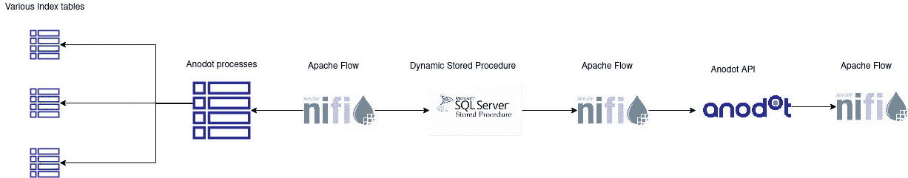

# 使用 Apache NiFi 将数据从 MSSQL 传输到 Anodot

> 原文：<https://blog.devgenius.io/stream-data-from-mssql-to-anodot-using-apache-nifi-3365b8e27ecc?source=collection_archive---------15----------------------->

如今，许多公司都希望获得更多关于其数据中心和业务的可见性以及更好、更准确的知识。
向标准监控工具发送数据不再有用。
创建静态警报曾经是每个开发运维/IT 部门的标准。
它给我们一种感觉，我们“知道”这个系统，晚上可以毫无顾虑地睡觉:“如果有事发生，我们会收到警报”

**今天我们知道这并不完全正确。**

假设你有一个接受客户付款的电子商务网站。
假设一切正常，你平均每小时购买 20 件商品。
您设置了一个带有酷炫可视化的监控工具，并设置了每小时 10 次购买的阈值。
警报将每小时运行一次，并检查您是否从平均每小时 10 次下降。但是——如果下降到平均 12 会怎么样？？？警告不会被发现，但是仍然有一些问题，或者网站的低流量，以及我们能想到的数以百万计的其他原因。

# 输入 Anodot

> Anodot 是商业监控领域的行业领导者，这是一种人工智能驱动的方法，使企业能够保护其收入和成本、数字合作伙伴以及受众旅程、体验和参与。

Anodot 不仅仅是另一个监控工具。作为一家企业，它可以让你真正了解你数据。它迫使你在不知不觉中更好地了解你自己的业务，并承担起警戒的责任。

他们的技术可用于基础设施和业务监控，通过非常先进的异常检测来识别数据中的问题。

回到上面的例子，你(或者你的 NOC/SRE/DevOps)将会收到一个警报，提示系统学习到的数据下降，这是正常的，你需要检查一下。
它还可以对可能表明问题(或自然增长)的异常采购高峰发出警报。

[Anodot](https://www.anodot.com/) 有多种[集成](https://www.anodot.com/integrations/)接收数据。
来自数据库(MSSQL、雪花、谷歌大查询、亚马逊时间流等..)到云提供商到其他监控工具等等。他们还提供了 python SDK 和 REST API

在本文中，我将重点介绍 MYSQL 和使用 Apache Nifi 传输数据

# 阿帕奇尼菲

Apache NiFi 支持强大且可伸缩的数据路由、转换和系统中介逻辑的有向图。Apache NiFi 的一些高级功能和目标包括:

*   基于网络的用户界面
    设计、控制、反馈和监控之间的无缝体验
*   高度可配置
    容错与保证交付
    低延迟与高吞吐量
    动态优先级
    流量可在运行时修改
    背压
*   数据来源
    从头到尾跟踪数据流
*   专为扩展而设计
    构建您自己的处理器和更多
    支持快速开发和有效测试
*   安全
    SSL、SSH、HTTPS、加密内容等...
    多租户授权和内部授权/策略管理

# 建筑激励

当我们第一次开始在我们的系统中集成 Anodot 时，我们选择了编写脚本(使用 Python 提供的 SDK)。
我们很快发现这并不是我们想要走的路。

需要走一条不同的道路。

要求是什么？很少干预的自动化系统。
2。从数据库中读取数据(MSSQL)。
3。保存流状态的能力。

该设计必须包括(来自数据库):
*保存已发送数据的状态
*选择“及时返回”来一次又一次地重新发送数据，以便在 Anodot 系统中进行优化。
*易于添加新指标。

# 让我们看看流程…..

让我们把聚光灯对准几个关键点:
1。Anodot_processes
该表保存每个指标的元数据，是整个流程的“入口点”(删除了排序和约束) :

如您所见，此表中仅显示了此特定指标的元数据。数据，如上次成功运行的时间(更新日期)和这个过程是什么“分钟间隔”,以计算下次运行的时间。

2.另一个需要注意的重要事情是动态存储过程。
在此栏中，您将填写提取相关指标数据的服务点的名称。
Apache NiFi 将调用一个统一的[动态存储过程](https://www.sqlservertutorial.net/sql-server-stored-procedures/sql-server-dynamic-sql/)来运行上述 SP。这样做是为了让我们不必在每个 SP 中实现日志记录和错误处理。

 [## GitHub - mormor83/Anodot-Nifi

### 此时您不能执行该操作。您已使用另一个标签页或窗口登录。您已在另一个选项卡中注销，或者…

github.com](https://github.com/mormor83/Anodot-Nifi) 

上面是一个 git 存储库，其中包含 NiFi 模板和一个 SQL 文件，其中包含一些帮助您入门的表格。

# 摘要

Anodot 是一个很好的工具，可以扩展您的可见性，并将最先进的监控应用到您的组织中。它有更多的功能，如检查季节性，预测等。如果实施得当，您可以轻松停止使用静态警报，转而使用适合您的异常检测。