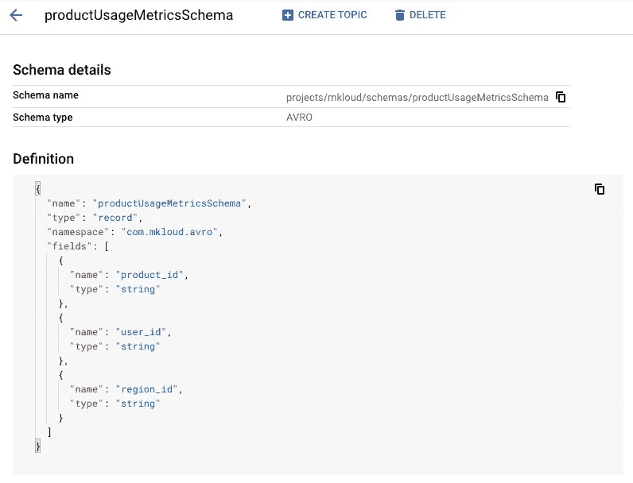
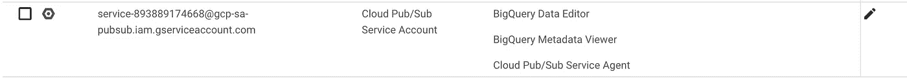

# 从 GCP 发布订阅到 BigQuery 的流数据

> 原文：<https://blog.devgenius.io/streaming-data-from-gcp-pubsub-to-bigquery-2dd914ed1e2c?source=collection_archive---------2----------------------->

谷歌最近推出了一种新的订阅类型 ***BigQuery 订阅*** ，使用它 PubSub 可以直接与 BigQuery 集成。这在以前是通过编写一个数据流作为中间件应用程序来实现的。

在我们详细讨论如何做到这一点之前。让我给你快速浏览一下这些服务是什么。

## 谷歌发布订阅

顾名思义，它是 Google 基于发布订阅设计模式提供的托管服务。它广泛用于应用程序之间的异步通信。谷歌内部在 Gmail 等产品中使用这项服务，每秒发送数百万封邮件。

## **BigQuery**

这是一个由 Google 提供的无服务器且高度可扩展的数据仓库服务。它可以轻松处理数 Pb 的数据，在几秒钟内获得分析和业务关键信息。

## 数据流

Google cloud dataflow 是一个完全托管的数据处理服务，用于使用 Apache Beam 编写的批处理和实时数据流管道。由于其并行处理数据的设计，可以在几秒钟内处理大量数据。

为了了解更多关于这些服务的信息，你可以参考 google 文档。

2022 年 7 月 25 日*谷歌宣布了一项新功能，PubSub 可以使用 ***BigQuery 订阅直接将消息写入 BigQuery 表。****

*这在以下场景中很方便*

*   *将数据写入 BigQuery 以生成分析指标(例如，在电子商务网站上发送使用数据)*
*   *将日志异步导出到 BigQuery。*

*以下是完成设置的步骤。*

1.  *创建一个包含/不包含表示 pubSub 消息元数据的字段的 BigQuery 表。*
2.  *创建一个与第一步中创建的 BigQuery 表的模式相同的 PubSub 模式。*
3.  *使用步骤 2 中创建的模式创建一个 PubSub 主题。*
4.  *更新 pubSub 服务帐户。*
5.  *创建发布订阅订阅。*

*为了深入理解这一点，让我们考虑一个例子。想象一下，一个电子商务网站想要了解哪种产品在其用户中受欢迎。对于这个用例，每当用户点击一个特定的产品时，它就向主题发布一个事件。然后，它可以分析 BigQuery 中的数据，或者创建一个仪表板来了解其产品的统计数据。*

## *步骤 1:创建一个大查询表*

*Google 利用 PubSub 模式定义和 BigQuery 表定义来映射这两个服务之间的数据。BigQuery 表需要定义为每一列都具有与 PubSub 模式字段相同的名称和兼容的数据类型。*

*在我们的示例中，我们创建了一个具有以下属性的表。*

1.  *user_id:这是点击产品页面的客户。*
2.  *product_id:标识电子商务网站上的产品*
3.  *region_id:客户所属的位置。*

*除了上述三个属性，我们还可以将消息元数据保存在 BigQuery 表中创建的附加列中。*

**

*BigQuery 表架构*

*在快照中，我们可以看到除了上面提到的三列之外还有其他列。这些列表示消息的元数据。捕获元数据有它自己的好处。例如，由于 PubSub 的*至少一次交付*属性，它可能会发送重复的消息，这将在 BigQuery 中创建重复的记录，可以使用 **message_id** 列来标识这些记录。*

*还要注意，所有附加列都应该具有可空模式。此外，当您启用将元数据从邮件写入这些列的选项时，您不能拥有部分列。BigQuery 表中需要有全部 5 列。*

## *步骤 2:创建发布订阅模式*

*PubSub 模式是以 Apache Avro 或协议缓冲区格式定义的。该架构不应包含任何表示 PubSub 消息元数据的字段。您希望与 BigQuery 集成的字段必须具有相同的名称，并且其数据类型应该兼容。*

**

*主题图式*

*在我们的例子中，模式非常简单，只有我们为 BigQuery 表定义的 3 个字段。如果模式中存在表中没有的其他字段，可以使用 BigQuery 订阅属性 **Drop unknown fields** 删除这些字段。*

## *步骤 3:创建发布订阅主题*

**

*话题创作*

*在这一步中，我们使用选项**使用模式**创建一个主题。我们选择在步骤 2 中创建的模式。*

> *注意:不要勾选**添加默认订阅**。我们将在步骤 5 中创建订阅。*

## *步骤 4:更新 PubSub 服务帐户*

*PubSub 为每个项目创建并管理一个服务帐户。PubSub 服务帐户需要访问 BigQuery 表和读取表元数据。*

*需要将以下角色添加到服务帐户中。*

1.  *BigQuery 数据编辑器(roles/bigquery.dataEditor)*
2.  *BigQuery 元数据查看器(roles/bigquery.metadataViewer)*

**

*发布订阅服务帐户权限*

## *步骤 5:创建发布订阅订阅*

*在这最后一步，我们需要确保连接所有的点。只有准确创建了 BigQuery 表和 PubSub 架构，才能成功创建 PubSub 订阅。此外，如果服务帐户没有写权限，订阅将在创建时引发异常。*

*创建订阅时，我们需要了解三个重要的属性。*

*   *使用主题模式:启用该选项时，PubSub 将 PubSub 模式字段映射到 BigQuery 列。如果未启用此选项，PubSub 会将整个消息写入数据类型为**字节或字符串的 BigQuery 列**数据**。***
*   *写入元数据:这个选项使 PubSub 能够将元数据写入我们在步骤 1 中看到的附加字段。*
*   *删除未知字段:此选项与使用主题模式选项一起使用。如果启用，让 PubSub 删除出现在主题模式中但不在 BigQuery 表中的任何字段。如果没有此选项，带有额外字段的消息将不会写入表中，而是保留在预订积压中。*

**

*发布订阅订阅*

*上面的快照显示了在 BigQuery 订阅的情况下我们需要设置的要点。其他所有设置都可以根据自己的选择来设置。*

> *注意:当 PubSub 消息无法写入 BigQuery 时，它将保持未确认状态，可以通过配置死信主题来处理。*

*现在我们已经万事俱备了。因此，如果您尝试在 PubSub 上发布一条消息，您应该立即看到一条新记录被添加到您的 BigQuery 表中。*

**

*发布消息*

**

*在 BigQuery 中预览数据*

*这使得应用程序出于分析目的在 BigQuery 中转储数据变得非常容易。*

*我们还可以使用 DataStudio 在这些数据的基础上进一步创建仪表板，以获得整体视图。*

**

*DataStudio 仪表板*

> *我希望这有助于理解如何利用这种设计。一定要让我知道你认为这适合的用例。你可以在 https://cloud.google.com/pubsub/docs/bigquery 找到更多相关信息*