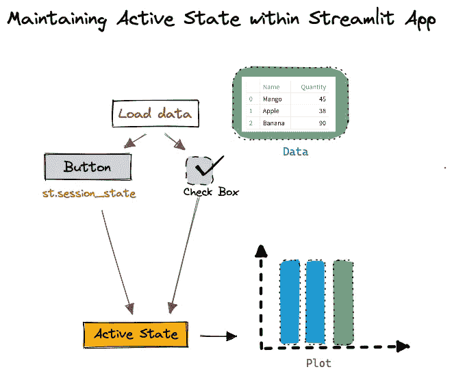
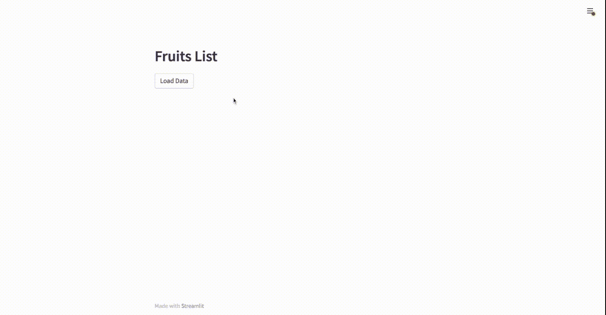
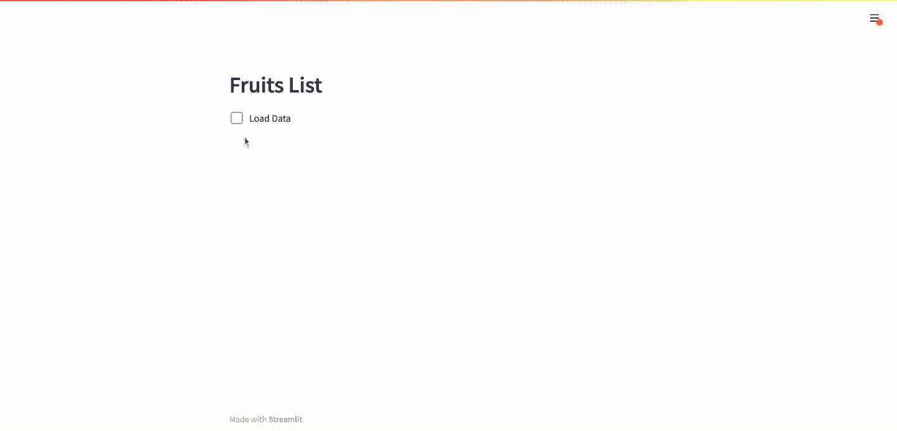
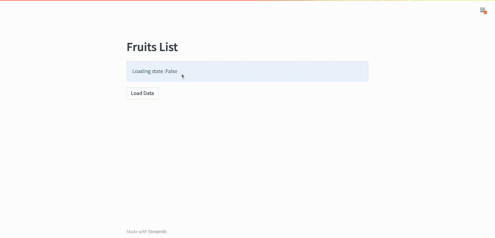
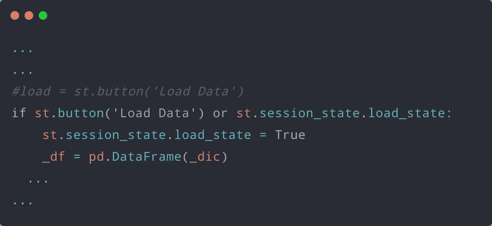
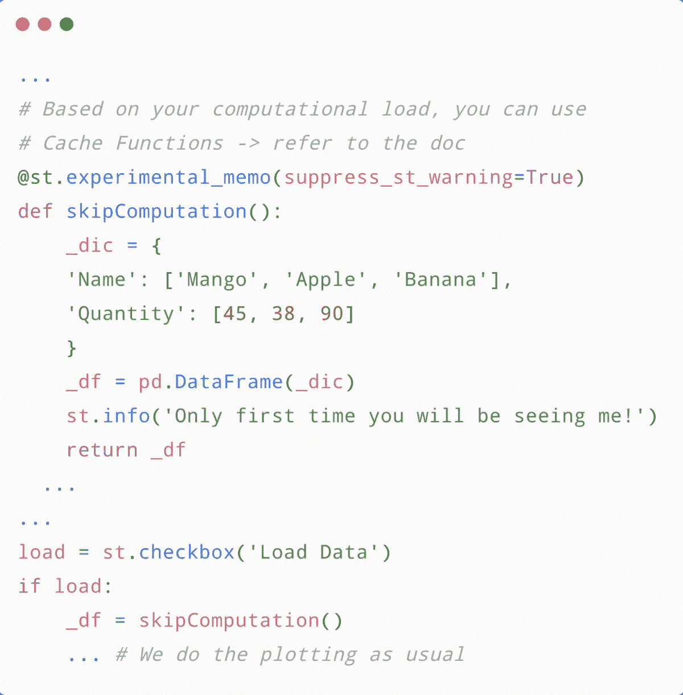
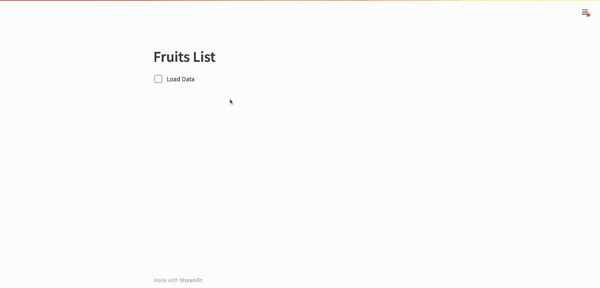

# 简化技巧——每次点击小工具时应用程序都会重新运行？下面是要做的事情

> 原文：<https://blog.devgenius.io/streamlit-python-tips-how-to-avoid-your-app-from-rerunning-on-every-widget-click-cae99c5189eb?source=collection_archive---------0----------------------->

## 如果您一直在使用 Streamlit 构建您的数据科学或机器学习 web 应用程序，您可能已经意识到，每当通过应用程序的小部件调用任何交互式更改时，Streamlit web 应用程序都会从 python 脚本的顶部到底部重新运行。



在本文中，我将尝试通过代码片段和用例来强调那些可能的解决方法，这肯定会有助于克服 Streamlit web 应用程序的这种内在行为。

👨🏾‍💻GitHub ⭐️|🐦推特📹[YouTube](https://www.youtube.com/@Avra_b)|☕️[buymeacoffee](https://www.buymeacoffee.com/AvraCodes)|[ko-fi💜](https://ko-fi.com/avrabyt)

## 任何 Streamlit Web 应用程序的默认行为(线性流)

让我们编写一个非常简单的 Streamlit 应用程序，绘制您的水果列表🍌 🍎🥭和演示了一个默认的线性流程⏬任何 Streamlit Web 应用程序的行为。

```
# ---- Modules ------- 
import streamlit as st
import pandas as pd
import plotly.express as pxst.header("Fruits List")# ---- Creating Dictionary ----
_dic = { 'Name': ['Mango', 'Apple', 'Banana'],
         'Quantity': [45, 38, 90]}load = st.button('Load Data')if load:
   _df = pd.DataFrame(_dic)
    st.write(_df)

   # ---- Plot types -------
   opt = st.radio('Plot type :',['Bar', 'Pie']) if opt == 'Bar':
      fig = px.bar(_df, x= 'Name',
                   y = 'Quantity',title ='Bar Chart')
      st.plotly_chart(fig)

   else:     
      fig = px.pie(_df,names = 'Name',
                   values = 'Quantity',title ='Pie Chart')
      st.plotly_chart(fig)
```



这个简短的 GIF 显示了 Web 应用程序的非活动状态。按钮部件不允许应用程序进一步运行。

如果我们观察上述 web 应用程序的行为，一旦其中一个单选按钮被触发，即这里的`"Pie"`单选按钮，我们就看不到预期的结果，即我们的饼状图。这是因为当脚本重新运行时，`"Load Data"`按钮处于**非活动状态** **状态**🔄由于单选按钮触发器。

如何解决这个问题，可能的解决方法是什么？

## **使用 Streamlit 复选框小工具☑️**

一个简单的快速修复(*从用户界面的角度来看并不理想！*)将会是，使用`st.checkbox`语法把你的`"Load Data"`按钮部件换成一个复选框部件。这启用了应用程序的后续脚本的**激活状态**。这是什么意思？让我来演示一下。



这个简短的 GIF 显示了 Web 应用程序的活动状态。该复选框在每次重新运行时保持活动状态。

## 使用 SessionState 控制 Streamlit 按钮⏹部件

另一个解决方法是将 button 小部件与 SessionState 结合起来，`st.session_state`。为了控制按钮`"Load Data"`的状态，我们将使用 SessionState，`st.session_state`。这将保持按钮的**活动状态**，尽管单选按钮选项的变化会触发。



这个简短的 GIF 显示了 Web 应用程序的活动状态。这次的按钮部件允许应用程序进一步运行。怎么会？(*代码如下！*)

对代码的变化很好奇？让我们调查一下，



我们的代码与最初的非常相似，除了`st.session_state`的使用

此外，我们不要忘记初始化，`st.session_state`。

```
# --- Initialising SessionState ---
if "load_state" not in st.session_state:
     st.session_state.load_state = False
...
...
```

## **在函数中包装你的代码**

有时，您不希望计算部分在每次小部件更改时都重新运行，对吗？将代码中的计算部分封装在一个函数中，同时使用`st.experimental_memo`或`st.cache`语法，就可以达到这个目的。也请参考官方[文件](https://docs.streamlit.io)。

让我们操作代码，并将其封装在一个函数中。



第一次运行应用程序时，计算部分将被执行(因此，我们会看到 info 消息！).然而，随着进一步的重新运行，计算部分将被跳过，从而加速应用程序的运行。

因此，上述几个变通办法，肯定会有助于调整 Streamlit 的线性工作流程，并有助于根据需要维护 web 应用程序的期望状态。

这是我与这篇文章相关的视频-

*嘿！我是 Avra，我喜欢编写代码并与大家分享。我做了几个与 Streamlit 相关的* [*视频*](https://youtube.com/playlist?list=PLqQrRCH56DH8JSoGC3hsciV-dQhgFGS1K) *，可能你也会感兴趣。请检查它们，并随时分享您的反馈！*

[*也考虑成为我的 Patreon 会员？—您可以提前获得独家内容、代码或视频，一对一的 web 应用开发/相关讨论，与我就特定视频进行实时聊天，以及其他额外待遇。(仅供参考:基本级比 ChatGPT/月便宜 50%,这是人工智能无法提供的好处😉)*](https://patreon.com/user?u=82100262&utm_medium=clipboard_copy&utm_source=copyLink&utm_campaign=creatorshare_creator&utm_content=join_link)

👨🏾‍💻GitHub ⭐️|🐦[推特](https://twitter.com/avra_b) |📹[YouTube](https://www.youtube.com/@Avra_b)|☕️[buymeacoffee](https://www.buymeacoffee.com/AvraCodes)|[ko-fi💜](https://ko-fi.com/avrabyt)

*这是我制作的另一个 Streamlit-Python 技巧视频，*